# Lab Report: Converting Data into a Universal Format**

## Objectives

In this lab, I aim to understand where log files are located and how to
manipulate and view log files. Also, I will use command line tools to
manually normalize log entries. In Part 2, the timestamp field will be
normalized. In Part 3, the IPv6 field will be normalized.

## Background

Log entries are generated by network devices, operating systems,
applications, and various types of programmable devices. A file
containing a time-sequenced stream of log entries is called a log file.

By nature, log files record events that are relevant to the source. The
syntax and format of data within log messages are often defined by the
application developer. Therefore, the terminology used in the log
entries often varies from source to source. For example, depending on
the source, the terms login, logon, authentication event, and user
connection, may all appear in log entries to describe a successful user
authentication to a server. It is often desirable to have a consistent
and uniform terminology in logs generated by different sources. This is
especially true when all log files are being collected by a centralized
point. The term **normalization** refers to the process of converting
parts of a message, in this case a log entry, to a common format.

## Tools Used

- CyberOps Workstation virtual machine
- Security Onion virtual machine
- AWK

## Methodology

### Part 1:Normalizing Timestamps in a Log File

Timestamps are used in log entries to specify when the recorded event
took place. While it is best practice to record timestamps in UTC, the
format of the timestamp varies from log source to log source. There are
two common timestamp formats, known as Unix Epoch and Human Readable.

Unix Epoch timestamps record time by measuring the number of seconds
that have passed since January 1,,1970. Human Readable timestamps record
time by representing separate values for year, month, day, hour, minute,
and second.

First of, I launched the CyberOps Workstation VM and then launched a
terminal window where I used the **cd** command to change to the
**/home/analyst/lab.support.files/** directory.

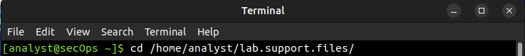

I then listed the files contained in that directory in order to locate
the log file **applicationX_in_epoch.log** and **cat** the contents of
the file.

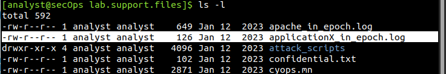

As a log analyst, I need to convert the timestamp from the log fil into
to a human-readable format using the steps below. I will use AWK to
easily perform the manual conversion.

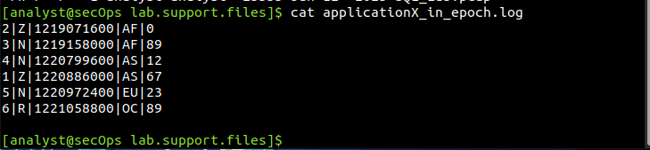

Now, I entered the AWK command below to convert and print the result on
the terminal

`awk 'BEGIN {FS=OFS="|"} {$3=strftime("%c",$3)} {print}' applicationX_in_epoch.log`

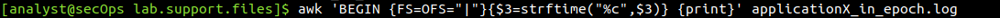

After making a few observations, I used nano text editor to remove the
extra line that was originally included in the log file. I then recorded
my observations.

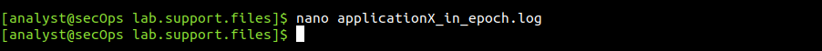

I run the AWK script again but this time, saving the output to the file
**applicationX_in_human.log**

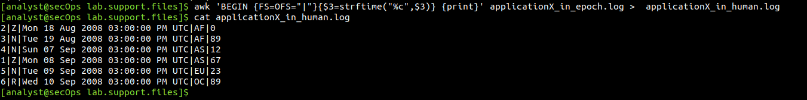

### Part 2:Normalize Timestamps in an Apache Log File

Similar to what was done with the **applicationX_in_epoch.log** file,
Apache web server log files can also be normalized. With the steps
below, I converted Unix Epoch to Human Readable timestamps. Considering
the Apache log file, **apache_in_epoch.log** which I **cat** to view its
contents.

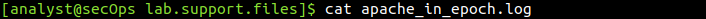

Before constructing the script to convert from Epoch to Human Readable
timestamps, I made a few observations. I then used an **awk** script to
convert the timestamp field to a human readable format.

`awk 'BEGIN {FS=OFS=" "}{$4=strftime("%c",$4)} {print}' apache_in_epoch.log`

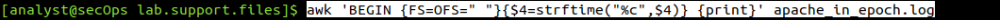

I later tweaked the script to properly convert the data. I used the
script below with two actions added.

`awk 'BEGIN {FS=OFS=" "} {gsub(/\[|\]/,"",$4)}{print}{$4=strftime("%c",$4)}{print}' apache_in_epoch.log`

- **gsub()** - This is an internal AWK function used to locate and
substitute strings. In the script above, gsub() received three
comma-separated parameters, described below.

- **/\[|\]/** – This is a regular expression passed to gsub() as the first parameter. The regular expression should be read as ‘find “[“ OR “]”’. Below is the breakdown of the expression:

  - The first and last “/” character marks the beginning and end of the search block. Anything between the first “/” and the second “/” are related to the search. The “\” character is used to escape the following “[“. Escaping is necessary because “[“ can also be used by an operator in regular expressions. By escaping the “[“ with a leading “\”, we tell the interpreter that the “]” is part of the content and not an operator. The “|” character is the OR operator. Notice that the “|” is not escaped and will therefore, be seen as an operator. Lastly, the regular expression escapes the closing square bracket with “\]”, as done before.

- **""** - This represents no characters, or an empty string. This parameter tells gsub() what to replace the “[“ and “]” with, when found. By replacing the “[“ and “]” with “”, gsub() effectively removes the “[“ and “]” characters.

- **$4** - This tells **gsub()** to work only on the fourth column of the
current line, the timestamp column.

Because I run on a limited ram space, I had to shut down the CyberOps
Lab VM and starting the SecurityOnion VM to proceed with Part 3.

### Part 3:Log File Preparation in Security Onion Virtual Machine

I launched the SecurityOnion VM, updated and upgraded packages and was
ready to work my way to completing this lab.

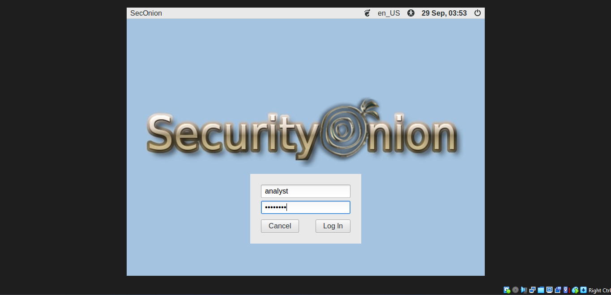

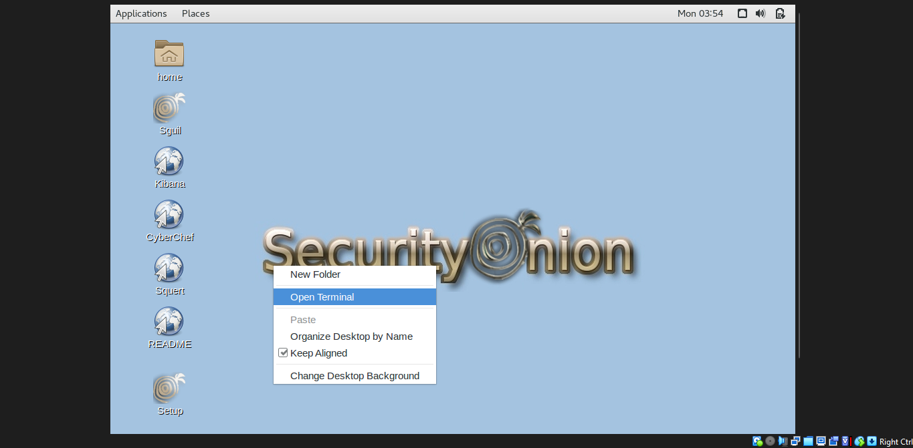
From the terminal window, I changed directories to **/nsm/bro/logs/**

As usual with Linux systems, log files are rotated based on the date,
renamed and stored on the disk. The current log files were be under the
current directory. So I changed directories and checked the log files
generated by zeek using the ls -l command.

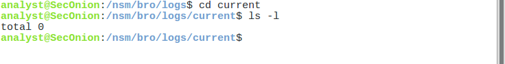

Snort logs were found at /nsm/sensor_data/ when I changeed directory and
used the ls -l command to see all the log files generated by Snort as
follows.

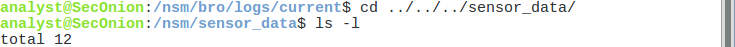

I noticed that Security Onion separated files based on the interface.
Because the Security Onion VM image has two interfaces configured as
sensors and a special folder for imported data, three directories are
kept. I used the **ls --l seconion-eth0** command to see the files
generated by the eth0 interface.

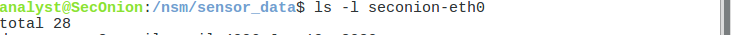

I changed directory to **/var/log/nsm/**. for more spec ific log files.

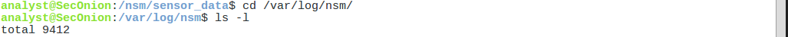

ELK logs can be found in the /var/log directory hence I changed
directory and used the ls command to list the files and directories.

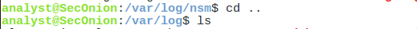

I then looked up secodary tools such as OSSEC and Squert. It's function,
importance, and placement in a security analyst's workflow.

## Results

AWK is a programming language designed to manipulate text files. It is
very powerful and especially useful when handling text files where the
lines contain multiple fields, separated by a delimiter character. Log
files contain one entry per line and are formatted as
delimiter-separated fields, making AWK a great tool for normalizing.

The log file was generated by what we will call application X. The
relevant aspects of the file are: The columns are separated, or
delimited, by the \| character. Therefore, the data has five columns.
The third column contains timestamps in Unix Epoch and the file has an
extra line at the end.

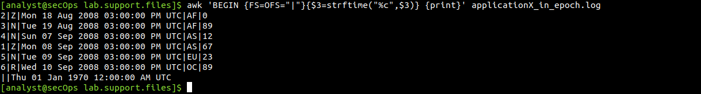

The results of the AWK script is shown in the screenshot above. It may
seem complicated but he main structure of the AWK script above is as
follows:

- **awk** - This invokes the AWK interpreter.

- **'BEGIN** - This defines the beginning of the script.

- **{}** - This defines actions to be taken in each line of the input text
file. An AWK script can have several actions.

- **FS = OFS = "|"** - This defines the field separator as the bar (|)
symbol. Different text files may use different delimiting characters to
separate fields. This operator allows me to define what character is
used as the field separator in the current text file.

- **$3** - This refers to the value in the third column of the current
line. In the applicationX_in_epoch.log, the third column contains the
timestamp in epoch to be converted.

- **strftime** - This is an AWK internal function designed to work with
time. The **%c** and **$3** in between parenthesis are the parameters passed to
strftime.

- **applicationX_in_epoch.log** - This is the input text file to be loaded
and used. Because I am already in the lab.support.files directory, I do
not need to add path information, **/home/analyst/lab.support.files/applicationX_in_epoch.log**

The first script action that defined in the first set of curly brackets
is to define the field separator character as the "\|". Then, in the
second set of curly brackets, it rewrites the third column of each line
with the result of the execution of the strftime() function. strftime()
is an internal AWK function created to handle time conversion. The
script tells the function to use the contents of the third column of
each line before the change (\$3) and to format the output (%c).

One observation I made was that, the script did convert the log from
Epoch to Human readable format without messing with the contents in the
rest of the fields

I then compared the contents of the file and the printed output. There
was the line **||Thu 01 Jan 1970 12:00:00 AM UTC**. The reason for the
extra line is because as the file had that empty line at the end, the
script interpreted it as 0 and converted converted 0 Unix Epoch to Human
Readable. 0 Unix Epoch translates to 0 seconds after midnight of Jan
1st, 1970. The script should have displayed "Wed 31 Dec 1969 07:00:00 PM
EST" because it automatically adjusts for the timezone but I realized
the CyberOps Workstation was configured for UTC (EST+5), the script
displayed Wed 31 Dec 1969 07:00:00 PM EST.

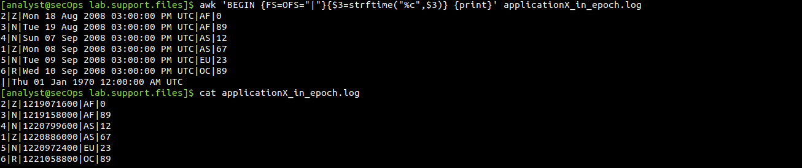

After I had removed the extra line in the log file, beow shows what I
observed. The extra line was now removed and the timestamps for the log
entries had been converted to human readable format.

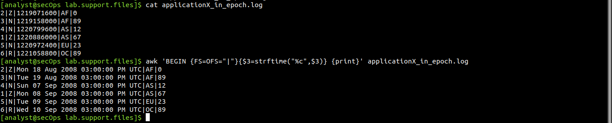

The Apache Log file contained six entries which record events related to
the Apache web server. Each entry had seven fields and those fields are
delimited by a space.

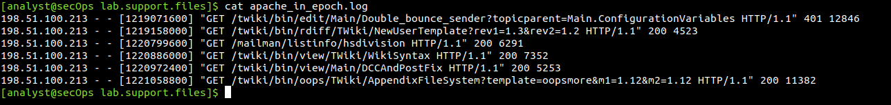

The first column contains the IPv4 address, **198.51.100.213**, of the web
client placing the request.

The second and third columns are not used and a "-" character is used to
represent no value.

The fourth column contains the timestamp in Unix Epoch time, for example [1219071600].

The fifth column contains text with details about the event, including
URLs and web request parameters. All six entries are HTTP GET messages.
Because these messages include spaces, the entire field is enclosed with
quotes.

The sixth column contains the HTTP status code, for example 401.

The seventh column contains the size of the response to the client (in
bytes), for example 12846.

In the context of timestamp conversion, I believe the space character
would work as a good delimiter character for the Apache log file above.
Also, the Apache log file contained 7 columns. In the Apache log file
above, Column 4 contaieds the Unix Epoch Timestamp. Results for the
conversion is shown below

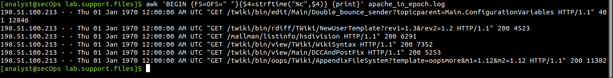

From the above image, I realized that the script was not able to
correctly convert the timestamps as all timestamps were all Thu 01 Jan
1970 12:00:00 AM UTC.

Checking the differences between the two log files, I came to the
conclusion that, the square brackets were what caused trouble with the
conversion. After fixing the script to replace the square brackets with
space, I had the results below. The script was able to properly convert
the timestamps this time. The output now displayed two lines for each
log entry. The first line displays the timestamp in Unix Epoch format
and the second line is the same log entry with the timestamp displayed
using Human Readable format.

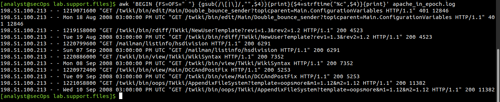

In the SecurityOnion VM, when I tried viewing the logs generated by
Zeek, I realized there was none yet but for Snort, I recorded as follows

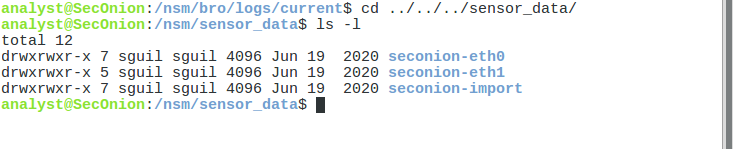

Below shows the log files generated by snort on the eth-0 interface.

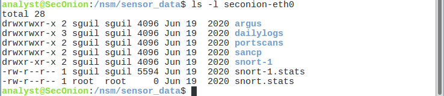

In the **/var/log/nsm** folder, below shows the log files I came across. The
directory shown below also contains logs used by secondary tools such as
OSSEC and Squert.

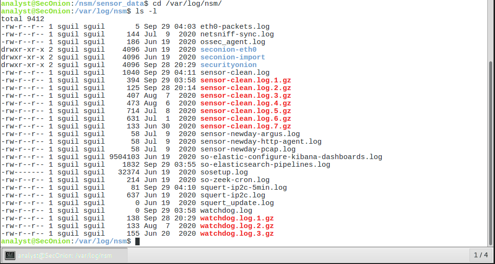

In trying to identify ELK logs, below shows what I found where
elasticsearch, logstash and kibana are all available.

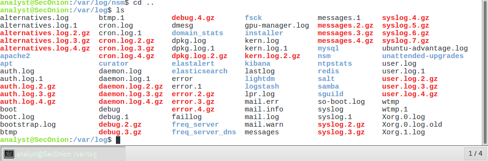

Because log file normalization is important, log analysis tools often
include log normalization features. Tools that do not include such
features often rely on plugins for log normalization and preparation.
The goal of these plugins is to allow log analysis tools to normalize
and prepare the received log files for tool consumption.

The Security Onion appliance relies on a number of tools to provide log
analysis services. **ELK**, **Zeek**, **Snort** and **SGUIL** are
arguably the most used tools.

**ELK** (Elasticsearch, Logstash, and Kibana) is a solution to achieve
the following:

-   Normalize, store, and index logs at unlimited volumes and rates.

-   Provide a simple and clean search interface and API.

-   Provide an infrastructure for alerting, reporting and sharing logs.

-   Plugin system for taking actions with logs.

-   Exist as a completely free and open-source project.

**Zeek** (formerly called Bro) is a framework designed to analyze
network traffic passively and generate event logs based on it. Upon
network traffic analysis, Zeek creates logs describing events such as
the following:

-   TCP/UDP/ICMP network connections

-   DNS activity

-   FTP activity

-   HTTPS requests and replies

-   SSL/TLS handshakes

**Snort and SGUIL**

Snort is an IDS that relies on pre-defined rules to flag potentially
harmful traffic. Snort looks into all portions of network packets
(headers and payload), looking for patterns defined in its rules. When
found, Snort takes the action defined in the same rule.

SGUIL provides a graphical interface for Snort logs and alerts, allowing
a security analyst to pivot from SGUIL into other tools for more
information. For example, if a potentially malicious packet is sent to
the organization web server and Snort raised an alert about it, SGUIL
will list that alert. The analyst can then right-click that alert to
search the ELSA or Bro databases for a better understanding of the
event.

In a security analyst workflow, **OSSEC** functions as a **host-based**
intrusion detection system (HIDS) that monitors systems for **suspicious
activity**, important for **detecting internal threats** and
**ensuring** **file integrity**. It is placed on endpoints or servers to
collect data, which is then sent to a central server for analysis.
**Squert** acts as a **web-based visualization tool** that consumes
event data, such as IDS alerts, making it easier for analysts to
understand and investigate security events. It is placed to provide a
user-friendly interface over raw alert data, aiding in faster triage and
contextualization during incident response.

## Reflection

As a security analyst, log normalization is important but also depends
on the deployed environment. Popular tools include their own
normalization features, but log normalization can also be done manually.
When manually normalizing and preparing log files, I have come to
understand the AWK script workflow and also the need to double-check
scripts to ensure the desired result is achieved. A poorly written
normalization script may modify the data, directly impacting the
analyst's work just as it happened in part 2 of the methodology.
