# Lab Report: Extracting a Malicious Executable from a PCAP

## Objectives

In this lab, I will analyze the traffic in a previously captured pcap
file and extract the executable from the file. Check [here](https://github.com/codelassey/cybersecurity-labs/blob/main/Analyzing_Network_Security_Data/Lab_Snort_and_Firewall_Rules.md) to see the lab
on Snort and Firewall rules.

## Background

Looking at logs is very important, but it is also important to
understand how network transactions happen at the packet level. Captured
in a previous lab, **nimda.download.pcap** contains the packets related
to the download of the Nimda malware.

## Tools Used
- CyberOps Workstation virtual machine
- Wireshark

## Methodology

### Part 1:Analyzing Pre-Captured Logs and Traffic Captures

In the **home/analyst/** folder, I got a listing of files using the ls -l
command. I then located the **nimda.download.pcap** which I captured during
the lab yesterday. SEE LAB [HERE](https://github.com/codelassey/cybersecurity-labs/blob/main/Analyzing_Network_Security_Data/Lab_Snort_and_Firewall_Rules.md)

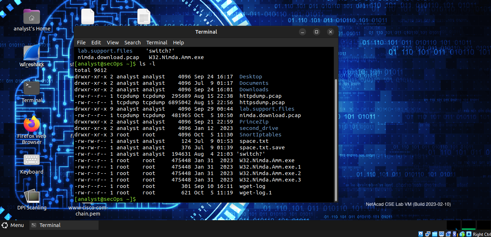

I opened the captured traffic in Wireshark for analysis.

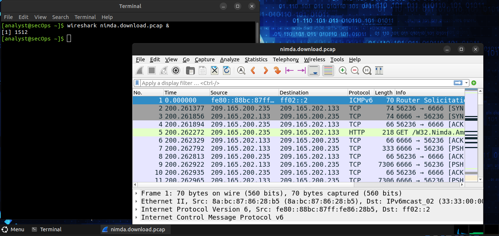

The request for the malware was done over http and sent as a GET request
for which reason, I will highlight the fifth packet in the capture and
expand the Hypertext Transfer Protocol. Packets 2 to 4 show the TCP
handshake.

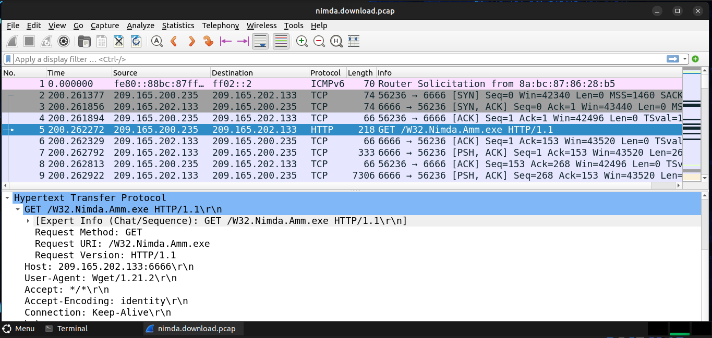

Because HTTP runs over TCP, I used **Wireshark**'s **Follow TCP Stream**
feature to rebuild the TCP transaction. I did this by selecting the
first TCP packet in the capture, thus the SYN packet, right-clicked it
and chose **Follow \> TCP Stream**.

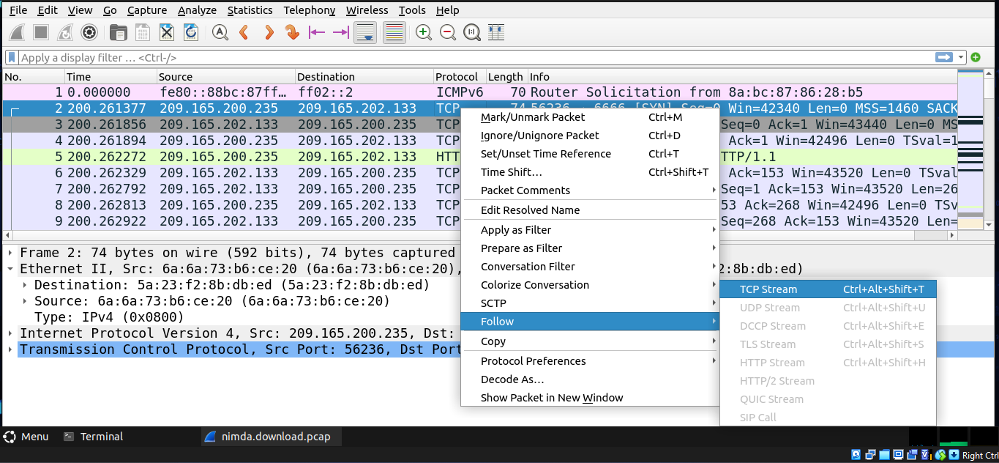

I closed the Follow TCP Stream window and returned to the Wireshark
nimda.download.pcap file.

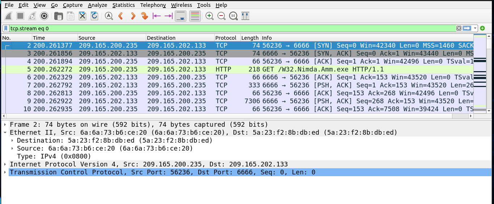

### Part 2:Extracting Downloaded Files from PCAP

With the GET request packet selected, thus the fifth packet in the
**nimda.download.pcap** file, I navigated to File \> Export Objects \>
HTTP, from Wireshark's menu.

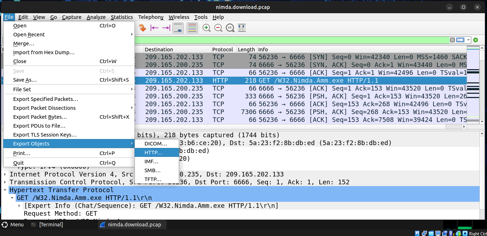

In the HTTP object list window, I selected the W32.Nimda.Amm.exe file
and clicked Save at the bottom of the screen. I further specified the
Desktop as the storage location for the saved file.

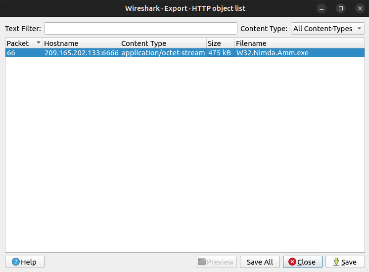

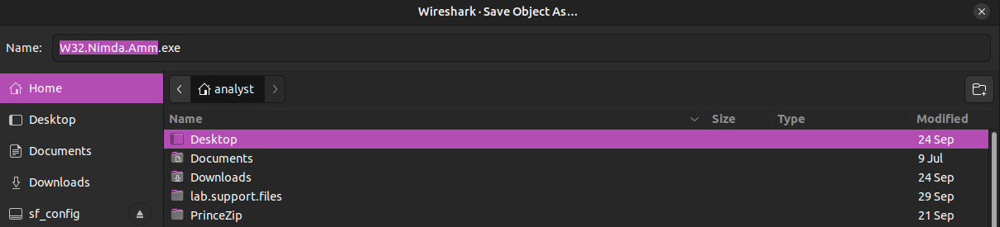

I then returned to my terminal interface to make sure the file was
saved.

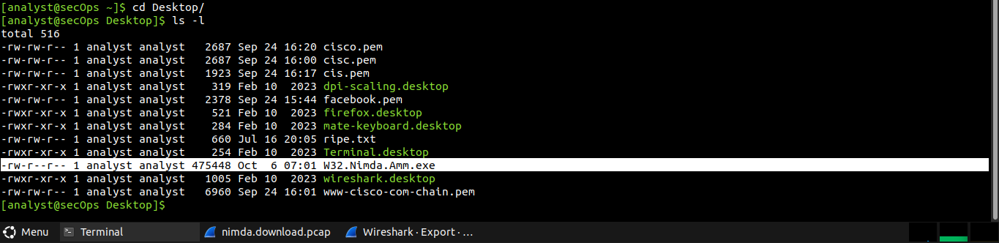

Using the file command, I digged for a bit more information about the
file.

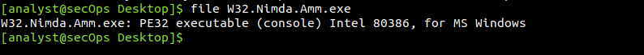

## Results

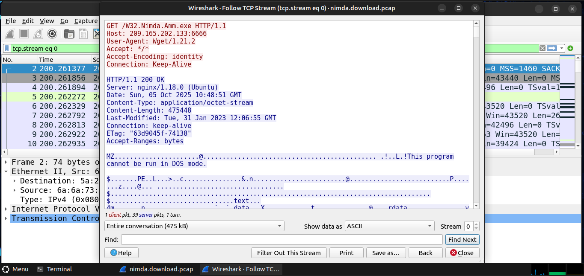

Looking at the content in the **Follow TCP Stream** window, it may not
be visually sound for human consumption.. like seeing all those symbols
but each and every one counts as part of the contents of the downloaded
file. Since it's binary data, I guess that's how best Wireshark could
put it. There are a few readable words spread among the symbols.
Ususally, those are what the user sees on screen when the program runs.

Because capture files contain all packets related to traffic, the PCAP
of the download was used to retrieve the previously downloaded file.
After exporting the objectts as seen in the methodology, Wireshark
displayed all HTTP objects present in the TCP flow that contained the
GET request. In this case, only the W32.Nimda.Amm.exe file waspresent in
the capture.

After extracting the maware file and using the file command, I confirmed
W32.Nimda.Amm.exe was indeed a Windows executable file.

## Reflection

In the malware analysis process, I have been able to capture a malicious
download and blocked access to the malware serving host. However after
extracting the executable from the PCAP, the probable next step would
would be to execute the malicious file in a controlled environment to
observe its behaviour or as well upload it to online malware analysis
platforms like Virustotal for a report on the analyzed file.
