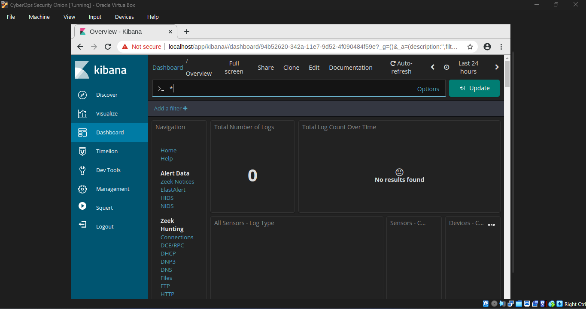
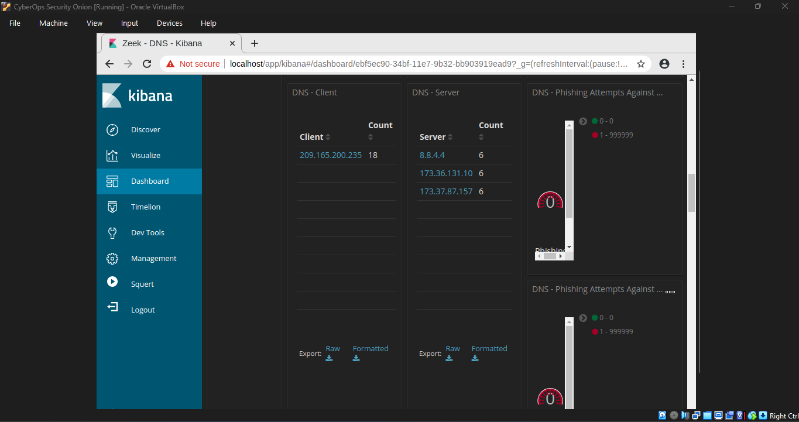

# Lab Report: Investigating SQL Injection and DNS data exfiltration by Interpreting HTTP and DNS Data to Isolate Threat Actor

## Objectives

In this lab, I will use Kibana to review logs and investigate the
exploits to determine the data that was exfiltrated using HTTP and DNS
during the attack listed in the Background extract below.

## Background

MySQL is a popular database used by numerous web applications.
Unfortunately, SQL injection is a common web hacking technique. It is a
code injection technique where an attacker executes malicious SQL
statements to control a web application's database server.

Domain name servers (DNS) are directories of domain names, and they
translate the domain names into IP addresses. This service can be used
to exfiltrate data. Cybersecurity personnel have determined that an
exploit has occurred, and data containing PII may have been exposed to
threat actors.

## Tools Used
- Security Onion virtual machine
- Kibana for visualization
- Zeek IDS

## Methodology

### Part 1:Investigating an SQL Injection Attack

I started and logged-in to the Security Onion VM.

I then entered the **sudo so-status** command to check the status of
services but I realized Kibana failed to start so I restarted the
services using sudo so-start.

It has been determined that the exploit happened at some time during the
month of June 2020. Kibana defaults to displaying data for the last 24
hours and therefore I will need to change the time settings to see the
data for the month of June 2020.

I opened Kibana using the Desktop shortcut.

After Kibana had loaded, in the upper-right corner of the window, I
clicked **Last 24 hours** to change the sample Time Range size. I then
expanded the time range to include the interesting alerts. An SQL
injection attack took place in June 2020 so that is what I am trying to
target. I selected **Absolute** under Time Range and edited the **From**
and **To** times to include the entire month of June in 2020.

From the zeek hunting dashbard, I clicked on HTTP for the dashboard that
focuses on HTTP events. I did this because SQL injection focuses on
attacking a website backend running an SQLdatabase.

I then scrolled through the HTTP dashboard to make a few observations.

I scrolled down to the HTTP logs and expanded the details of the first
result by clicking the arrow that was next to the log entry timestamp.

Some of the information for the log entries is hyperlinked to other
tools. I therefore clicked the value in the **alert_id** field of the
log entry to get a different view on the event.

Using Ctrl+F to open a search box, I searched for the keyword username
in the transcript. I then scrolled through the occurrences that were
found.

I then closed CapME and returned to the Kibana interface.

### Part 2:Analyzing DNS exfiltration

A network administrator had noticed abnormally long DNS queries with
strange looking subdomains. Here, I will investigate the anomaly.

From the top of the Kibana Dashboard, I cleared all filters and search
terms and clicked **Home** under the Navigation section of the
Dashboard.

From the Zeek Hunting dashboard, I selected DNS to view the DNS
Dashboard.

Scrolling further down the window, I saw a listing of the top DNS
queries by domain name. Some of the queries had unusually long
subdomains attached to **ns.example.com**. For this reason, the domain
example.com was investigated further.

I exported the raw file and opened it in Gedit.

Since I suspect potential exfiltration of data by quering the DNS
server, edit the raw file to exclude other texts other than the
subdomain part which contains a mix of numbers and letters, specifically
hexadecimal characters that might need to be decoded.

I used the xxd command below via the terminal to decode the text in the
CSV file and saved it to a file named secret.txt. I then used **cat** to
output the contents of secret.txt to the console.

The manual page of xxd had explanations to the options used after the
xxd command.

## Results

After adjusting the time for June 2020, I noticed the total number of
logs for the entire month of June 2020 was 136. Events count over time
was also shown and I checked to confirm it was 22 events recorded on
11^th^ June 00:00, 28 events recorded on 12^th^ June 00:00 and 58 events
for 12^th^ June 12:00.

After selecting HTTP from the Zeek hunting dashboard, the observations I
made were as follows; 22 HTTP logs. The country associated was United
States of America and on port 80. It was an HTTP GET request with the
status code 200 OK which happened 22 times. The source IP address was
209.165.200.227 and the destination server IP address was
209.165.200.235. I came across the MIME types.. thus the different
resources on the website. Scrolling all the way down, I got to the HTTP
logs, viewing the first 10.

After expanding the first log, I identified the timestamp to be 12^th^
June 2020 at 21:30:09 and the event type being bro_http.

In the message field was details about the HTTP GET request that was
made by the client to the server. The HTTP GET request showed that the
attacker accessed a php page (Multilidae). There, I realized the credit
card number, ccv and expiration fields from the database was pulled with
the injection commades starting from UNION+SELECT and so on. See the
screenshot below.

Clicking the alert ID field opens in a new web browser tab with
information from capME!. capME! tab is a web interface that allows me to
view the pcap transcript. The blue text contains HTTP requests that are
sent from the source (SRC) and the red text is the responses from the
destination web server (DST).

In the Log entry section, which is at the beginning of the transcript, I
noticed that the portion
**username=\'+union+select+ccid,ccnumber,ccv,expiration,null+from+credit\_cards+\--+&password=**
indicated that someone may have tried to attack the web browser using
SQL injection to bypass authentication. The keywords, **union** and
**select**, are commands that are used in searching for information in a
SQL database. If the input boxes on a web page are not properly
protected from illegal input, threat actors can inject SQL search
strings or other code that can access data contained in databases that
are linked to the web page.

After searching for the keyword username, I looked further down to find
something unusual. Under username was credit card number of a user and
under password was the 3-digit pin and under signature was the credit
card expiry date. This confirms that the attacker successfully exploited
vunerabilities in the web application and successfully uncovered SPII.

From the DNS dashboard, I identified 22 DNS log events.

I also saw the top DNS query types; address records (A record) and a
pointer records for resolving the hostnames (PTR).

By Scrolling further down, I could see a list of the top DNS clients and
DNS Servers based on their request and response counts. There was also a
metric for number of DNS Phishing attempts, which are also known as DNS
pharming, spoofing, or poisoning.

After decoding the subdomain portion of the DNS query, I came to the
conclusion that, the subdomains weren't legitimate subdomains but rather
an encoded version of confidential data part of one larger message in a
text file which was being exfiltrated in bits as DNS queries and could
be reassembled later into meaningful information when the attacker has
access to the malicious DNS server.

## Reflection

From this lab, it was clear how attackers use the DNS protocol to
exfiltrate cnfidential information from a network but bypassing security
implementations set in place. In the target network, perhaps the
attacker deployed malware which skimmed through files on the host and
encoding their content as hexadecimal strings and creating DNS queries
for exfiltration. Since DNS is required for resolving hostnames to IP
addresses, it is of much importance to be used everywhere but the
problem is that, DNS queries may not be monitored since requests are
commonly sent out of the network to the internet. This lab stressed my
thoughts fr fr but was clearly an application of the theory I learnt and
I'm glad I completed it. Going to look for some chilled coke hahaha.
