# Lab Report: Exploring Snort and Firewall Rules 

## Topology

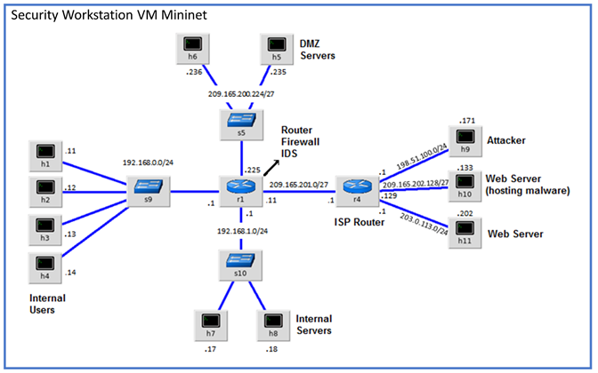

## Objectives
In this lab, the Security Workstation VM is a container for holding the Mininet environment shown in the Topology. In part 1, I will prepare the Virtual Environment and dive into Firewall and IDS logs in part 2. Finally in part 3, I will terminate and clear the mininet process.

## Background

In a secure production network, network alerts are generated by various
types of devices such as security appliances, firewalls, IPS devices,
routers, switches, servers, and more. The problem is that not all alerts
are created equally. For example, alerts generated by a server and
alerts generated by a firewall will be different and vary in content and
format.

## Tools Used
- Security Workstation virtual machine
- Snort
- Iptables

## Methodology

### Part 1: Preparing the Virtual Environment

I launched VirtualBox and under network settings for the Security
Workstation, I changed it to bridged mode to facilitate this lab.

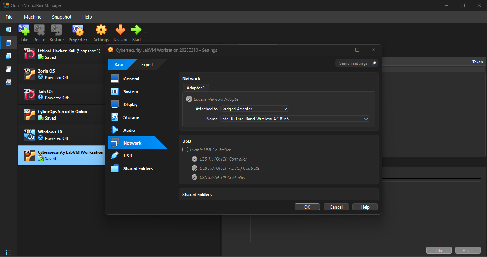

I then launched the Security Workstation VM, opened a terminal and
configured its network by executing the configure_as_dhcp.sh script.

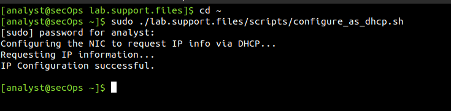

I used the ifconfig command to verify Security Workstation VM now has
an IP address on my local network.

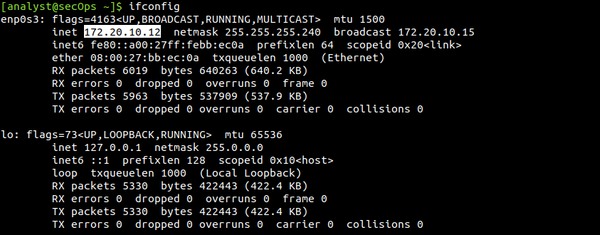

### Part 2: Real-Time IDS Log Monitoring

From the Security Workstation VM, I run the script to start mininet.

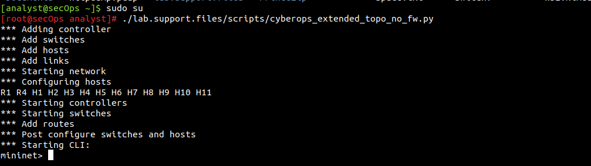

From the mininet prompt, I opened a shell on R1 using the command xterm
R1 and observed that I was logged in as a root user.

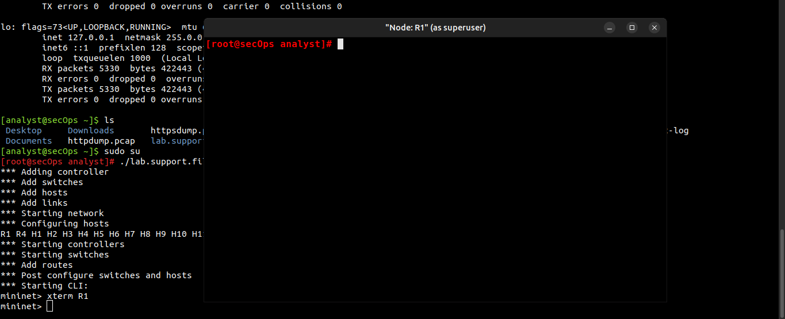

From R1's shell, I started the Linux-based IDS, Snort.

**[root\@secOps analyst\]#** `./lab.support.files/scripts/start_snort.sh`

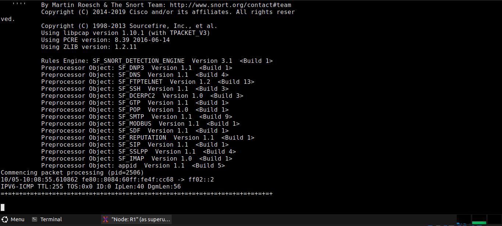

From the Security Workstation VM mininet prompt, I opened shells for
hosts H5 and H10. H10 will simulate a server on the Internet that is
hosting malware.

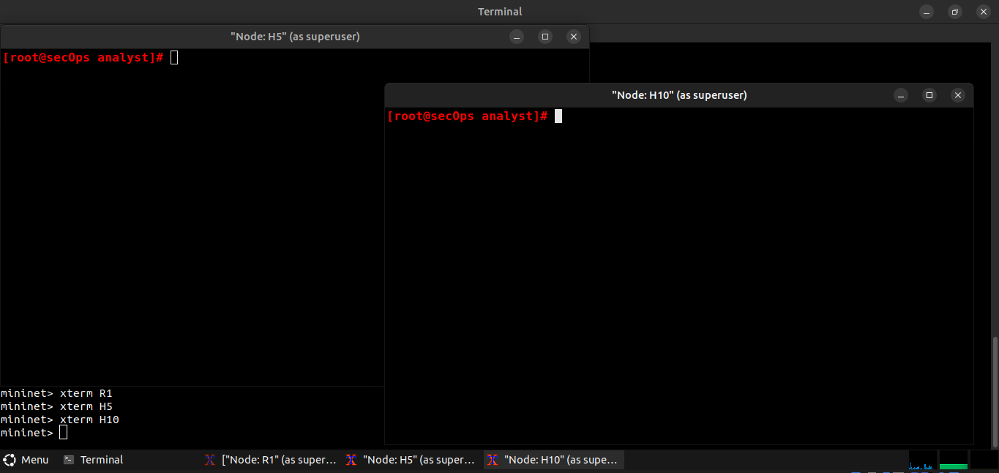

On H10, I run the mal_server_start.sh script to start the server.
After, I used netstat with the -tunpa option to verify that the web
server was running. When used as shown below, netstat lists all ports
currently assigned to services:

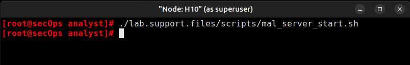

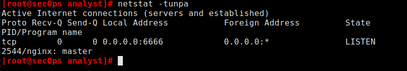

Since an instance is already running for R1, I open another one by using
the command xterm R1 on the terminal I executed the mininet process
with. In the new R1 terminal tab, I run the tail command with the -f
option to monitor the **/var/log/snort/alert** file in real-time. This
file is where snort is configured to record alerts.

From **H5**, I used the **wget** command to download a file named
**W32.Nimda.Amm.exe from the malicious server.** To execute the
download, I cheched the IP address of H10.

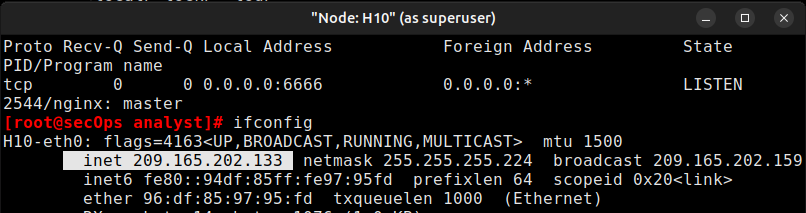

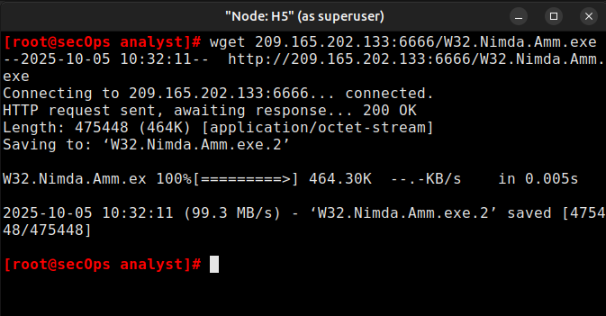

On H5, I used the tcpdump command to capture the event and downloaded
the malware file again so that I could capture the transaction.

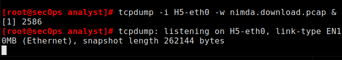

The command above tells tcpdump to capture packets on interface H5-eth0
and save the capture to a file named nimda.download.pcap. The & symbol
at the end tells the shell to execute tcpdump in the background with its
process ID (PID) being 2586.

Now, I'd press Enter to regain control of the H5 shell. Then, I'll
download the malware again.

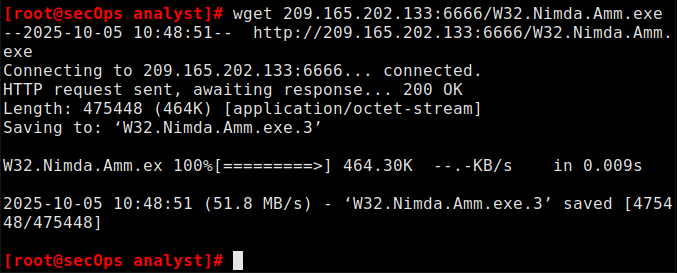

I then stopped the packet capture using CTRL+C but before that, I
entered the command fg to bring the tcpdump process to the foreground.

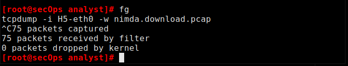

I had to verify that the pcap had been saved to my drive.

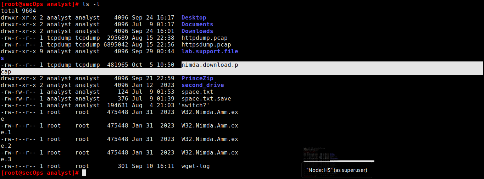

To keep other users from reaching the malicious server, it is recommended
I block it in the edge firewall. In the mininet topology, R1 runs a very
popular Linux-based firewall called **iptables** which I'll leverage on
in tuning rules based on the alerts Snort generated. In the Security
Workstation VM, I started a third R1 terminal window. In the new R1
terminal window, I used the iptables command below to list the chains
and their rules currently in use. As seen, the INPUT, OUTPUT and FORWARD
chains are currently being used by iptables.

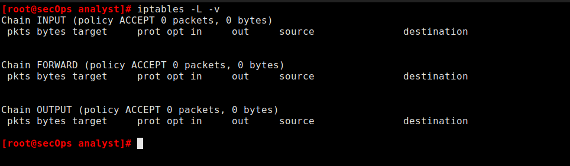

Connections to the malicious server generate packets that must
transverse the **iptables** firewall on **R1**. Packets traversing the
firewall are handled by the FORWARD rule and therefore, that is the
chain that will receive the blocking rule. To keep user computers from
connecting to the malicious server identified in Step 1, add the
following rule to the FORWARD chain on **R1.**

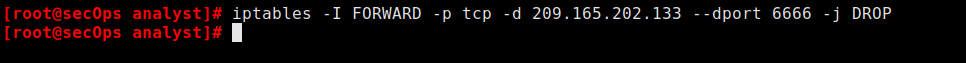

Where:

o    -I FORWARD: inserts a new rule in the FORWARD chain.

o    -p tcp: specifies the TCP protocol.

o    -d 209.165.202.133: specifies the packet's destination

o    \--dport 6666: specifies the destination port

o    -j DROP: set the action to drop.

After adding the rule, I checked to make sure the rule was successfully
added.

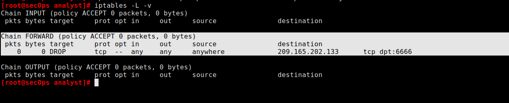

On H5, I tried to download the malicious file again.

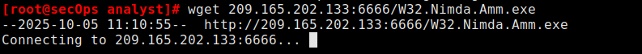

### Part 3: Terminating and Clearing Mininet Process*

I navigated to the terminal used to start Mininet and terminated the
Mininet by entering quit in the main Security Workstation VM terminal
window. After quitting Mininet, I cleaned up the processes started by
Mininet.

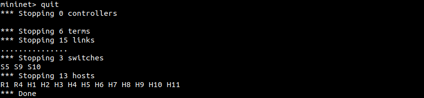

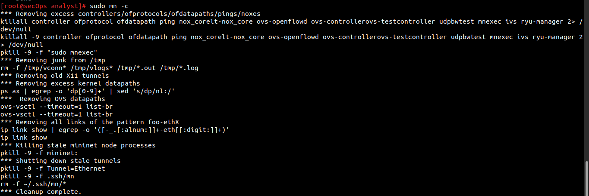

## Results

In the second R1 terminal, thus after running the command tail -f
**/var/log/snort/alert,** I saw old entries of alerts since I had run
this lab before but just that I did not document at the time.

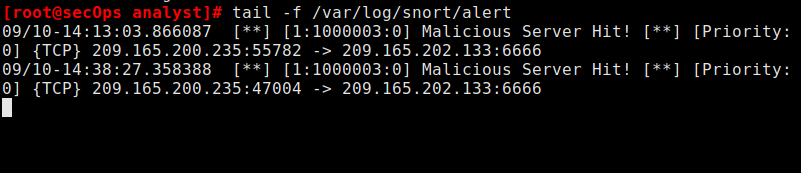

As the malicious file was transiting **R1**, the IDS, Snort, was able to
inspect its payload. The payload matched at least one of the signatures
configured in Snort and triggered an alert on the second **R1** terminal
window.

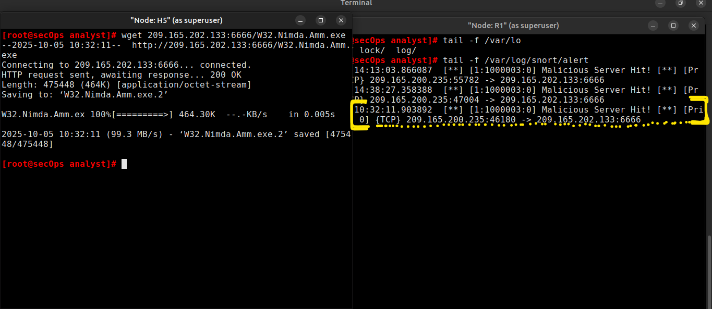

Based on the alert shown above, the source and destination IPv4
addresses used in the transaction were 209.165.200.235 and
209.165.202.133 respectively. The source and destination ports used in
the transaction were 46188 and 6666. Based on the alert shown above, the
message recorded by the IDS signature was "Malicious Server Hit!"

PCAP is very useful to re-retrace network events such as communication
to malicious end points. The analysis of the packet capture I made with
tcpdump concerning the malicious file download will be done in another
lab. I will update with a hyperlink here.

The firewall iptables uses the concepts of chains and rules to filter
traffic.

-   Traffic entering the firewall and destined to the firewall device
    itself is handled by the INPUT chain. Examples of this traffic are
    ping packets coming from any other device on any networks and sent
    to any one of the firewall's interfaces.

-   Traffic originated in the firewall device itself and destined to
    somewhere else, is handled by the OUTPUT chain. Examples of this
    traffic are ping responses generated by the firewall device itself.

-   Traffic originated somewhere else and passing through the firewall
    device is handled by the FORWARD chain. Examples of this traffic are
    packets being routed by the firewall.

After implimenting the firewall rule, the download of the malware from
H5 was unsuccessful just because the firewall prevented connections to
the malware hosting server.

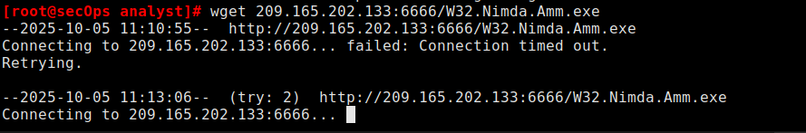

A more aggressive but also valid approach when blocking the offending
server would be a rule to completely block the malicous server IP
address. This will completely cut access to that server from the
internal network.

Below shows the snort rule created to trigger the alert.

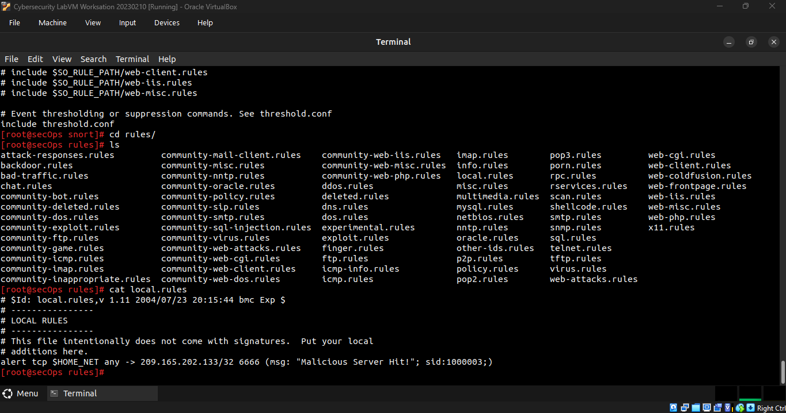

## Reflection

By completing this lab, I understand that, firewalls and Intrusion
Detection Systems are often deployed to partially automate the traffic
monitoring task. Both firewalls and IDSs match incoming traffic against
administrative rules but firewalls usually compare the packet header
against a rule set while IDSs often use the packet payload for rule set
comparison. IDS and firewall rules have different structures though.
