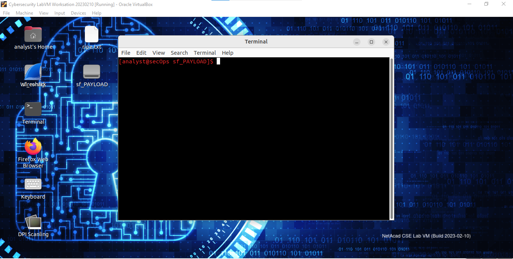
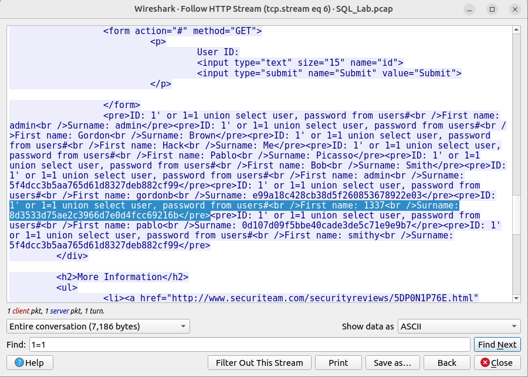

# Lab - Attacking a mySQL Database

## Objectives
---

In this lab, I will view a PCAP file from a previous attack against a
SQL database.

- Part 1: Open Wireshark and load the PCAP file.

- Part 2: View the SQL Injection Attack.

- Part 3: The SQL Injection Attack continues...

- Part 4: The SQL Injection Attack provides system information.

- Part 5: The SQL Injection Attack and Table Information

- Part 6: The SQL Injection Attack Concludes.

## Background
---

SQL injection attacks allow malicious hackers to type SQL statements in
a web site and receive a response from the database. This allows
attackers to tamper with current data in the database, spoof identities,
and miscellaneous mischief.

A PCAP file has been created for me to view a previous attack against a
SQL database. In this lab, I will view the SQL database attacks and
answer the questions that I'm asked.

Resource used was **Cisco Cyberops Workstation VM**

---

## Part 1: Open Wireshark and load the PCAP file.
--------------------------------------

I opened Wireshark and in the application, I clicked Open in the middle
of the application under Files.

I browsed through the /home/analyst/ directory and searched for
lab.support.files. In the lab.support.files directory, I opened the
SQL_Lab.pcap file.

The PCAP file opens within Wireshark and displays the captured network
traffic. This capture file extends over an 8-minute (441 second) period,
the duration of this SQL injection attack.

From above, the two IP addresses associated with the SQL Injection were
10.0.2.4 and 10.0.2.15.

---

## Part 2: View the SQL Injection Attack.
------------------------------

In this step, I will be viewing the beginning of the attack. Within the
Wireshark capture, I right-clicked line 13 and selected Follow \> HTTP
Stream. Line 13 was chosen because it is a GET HTTP request. This will
be very helpful in following the data stream as the application layers
sees it and leads up to the query testing for the SQL injection.

The source traffic is shown in red below. The source has sent a GET
request to host 10.0.2.15. In blue, the destination device is responding
back to the source. In the Find field, I entered 1=1 and clicked **Find
Next**.

The attacker entered a query (1=1) into a UserID search box on the
target 10.0.2.15 to see if the application was vulnerable to SQL
injection. Instead of the application responding with a login failure
message, it responded with a record from a database. The attacker has
verified they can input an SQL command and the database will respond.
The search string 1=1 creates an SQL statement that will be always true.
Meaning, It does not matter what is entered into the field, it will
always be true. I closed the Follow HTTP Stream window.

Next, I clicked **Clear display filter** to display the entire Wireshark
conversation.

---

## Part 3: The SQL Injection Attack continues...
--------------------------------------

In this step, I will be viewing the continuation of the attack. Within
the Wireshark capture, I right-clicked line 19, and clicked Follow >
HTTP Stream. In the Find field, I entered 1=1. I clicked **Find Next**.
The attacker entered a query (1' or 1=1 union select database(),
user()#) into a UserID search box on the target 10.0.2.15. Instead of
the application responding with a login failure message, it responded
with the information you see in the screenshot below.

{

The database name is **dvwa** and the database user is
**root@localhost**. There are also multiple user accounts being
displayed. I closed the Follow HTTP Stream window and cleared display
filter to display the entire Wireshark conversation.

---

## Part 4: The SQL Injection Attack provides system information.
-----------------------------------------------------

The attacker continues and starts targeting more specific information.
Within the Wireshark capture, I right-clicked line 22 and selected
Follow > HTTP Stream. In red, the source traffic is shown and is
sending the GET request to host 10.0.2.15. In blue, the destination
device is responding back to the source.

In the Find field, I entered 1=1. I then clicked Find Next. The attacker
entered a query (1' or 1=1 union select null, version ()#) into a
UserID search box on the target 10.0.2.15 to locate the version
identifier. I noticed how the version identifier was at the end of the
output right before the </pre> 
 closing HTML code. See
screenshot below

The verison was MySQL 5.7.12. Again, I closed the Follow HTTP Stream
window and cleared the display filter to display the entire Wireshark
conversation.

---

## Part 5: The SQL Injection Attack and Table Information.
-----------------------------------------------

The attacker knows that there is a large number of SQL tables that are
full of information. The attacker attempts to find them. Within the
Wireshark capture, I right-clicked on line 25 and selected Follow \>
HTTP Stream. The source is shown in red. It has sent a GET request to
host 10.0.2.15. In blue, the destination device is responding back to
the source. In the Find field, I entered users. I clicked **Find Next**.

The attacker has entered a query (1'or 1=1 union select null,
table_name from information_schema.tables#) into a UserID search box
on the target 10.0.2.15 to view all the tables in the database. This
provides a huge output of many tables, as the attacker specified "null"
without any further specifications.

The modified command of (**1' OR 1=1 UNION SELECT null, column_name
FROM INFORMATION_SCHEMA.columns WHERE table_name='users'**) make the
database respond with a much shorter output filtered by the occurrence
of the word "users" for the attacker.

---

## Part 6: The SQL Injection Attack Concludes.
-----------------------------------

The attack ends with the best prize of all; password hashes. Within the
Wireshark capture, I right-clicked line 28 and selected Follow \> HTTP
Stream. I clicked Find and typed in 1=1. to search for that entry. When
the text was located, I clicked Cancel in the Find text search box.

The attacker had entered a query (1'or 1=1 union select user, password
from users#) into a UserID search box on the target 10.0.2.15 to pull
usernames and password hashes. In Ghana, we'll say... Cool chop! Haha

User **1337** had the password hash value of
**8d3533d75ae2c3966d7e0d4fcc69216b**. Using <https://crackstation.net/>, let me crack the hash for a
plain text password.

And the password was **charley**. That's a very weak password.

---

# Reflection

The risk of having platforms use the SQL langauge is that, the chance of
an SQL injection attack is high for the attacker. Methods that can be
taken to prevent SQL injection attacks include monitoring application
and database inputs and communications to detect and block malicious
SQLi attempts. Also, restrict database access to prevent unauthorized
data access, exfiltration, or deletion through access control
restrictions.
