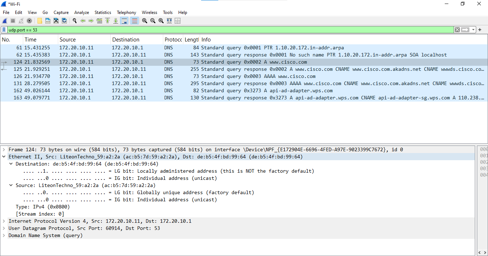

# Lab - Exploring DNS Traffic

## Objectives
---

- Part 1: Capture DNS Traffic

- Part 2: Explore DNS Query Traffic

- Part 3: Explore DNS Response Traffic

## Background / Scenario
---

Wireshark is an open source packet capture and analysis tool. Wireshark
gives a detailed breakdown of the network protocol stack. Wireshark
allows you to filter traffic for network troubleshooting, investigate
security issues, and analyze network protocols. Because Wireshark allows
you to view the packet details, it can be used as a reconnaissance tool
for an attacker. In this lab, I will install Wireshark and use Wireshark
to filter for DNS packets and view the details of both DNS query and
response packets.

Capture DNS Traffic
----

I used my Windows 10 which already had Wireshark installed but you can
download the latest stable version of Wireshark from www.wireshark.org.
Choose the software version you need based on your PC's architecture and
operating system.

I started Wireshark and selected an active interface with traffic for
packet capture.

But before anything, I had to clear the DNS cache. For the majority of
Linux distributions, one of the following utilities is used for DNS
caching: Systemd -Resolved, DNSMasq, and NSCD. If perhaps a Linux
distribution does not use one of the listed utilities, one is advised to
please perform an internet search for the DNS caching utility for one's
Linux distribution.

In identifying the utility used in a Linux distribution, one can check
the status:

- Systemd-Resolved: `systemctl status systemd-resolved.service`
- DNSMasq: `systemctl status dnsmasq.service`
- NSCD: `systemctl status nscd.service`

Since I was using Windows, I entered ipconfig /flushdns in Command
Prompt.

But if you are using system-resolved, enter **systemd-resolve
--flush-caches** to flush the cache for **Systemd-Resolved** before
restarting the service. The following commands restart the associated
service using elevated privileges:

- Systemd-Resolved: `sudo systemctl restart systemd-resolved.service`
- DNSMasq: `sudo systemctl restart dnsmasq.service`
- NSCD: `sudo systemctl restart nscd.service`

For the macOS, enter **sudo killall -HUP mDNSResponder** to clear the
DNS cache in the Terminal. Perform an internet search for the commands
to clear the DNS cache for an older OS.

At the command prompt, I typed nslookup to enter the interactive mode
and I entered the domain name <http://www.cisco.com.> I exited afterwards.

I then stopped the Wireshark capture.

## Explore DNS Query Traffic
---

I observeed the traffic captured in the Wireshark Packet List pane. I
entered **udp.port == 53** in the filter box to display only DNS
packets.

I selected the DNS packet that contained Standard query and A
www.cisco.com in the Info column. In the Packet Details pane, I noticed
the packet had Ethernet II, Internet Protocol Version 4, User Datagram
Protocol and Domain Name System (query). I expanded Ethernet II to view
the details and observed the source and destination fields.

- Source MAC Address : ac:b5:7d:59:a2:2a
- Destination MAC Address : de:b5:4f:bd:99:64

The source MAC address id associated with the NIC of the device and the
destination MAC address is associated with the local DNS server.

I then expanded Internet Protocol Version 4 to observe the source and
destination IPv4 addresses.

From the screenshot I took above, you could see that the source IP
Address was **172.20.10.11** and destination IP Address was **172.20.10.1**. The
source IP address is associated with the NIC of my laptop and the
destination IP address is associated with the default gateway.

We move! I expanded the User Datagram Protocol to observe the source and
destination ports.

The source port was 60914 and destination port 53 and that serves as the
default DNS port number.

To determine the IP and MAC address of my PC, I switched to the CMD tab
and entered **arp --a** and **ipconfig /all** to record the MAC and IP
addresses of the PC.

I observed that both addresses were the same with both Wireshark and the
ipconfig/all command in Command Prompt.

For Linux and macOS PC, you could enter **ifconfig** or **ip address**
in a terminal.

I moved on to expanding the Domain Name System (query) in the Packet
Details pane. Then I expanded the Flags and Queries for observation. The
flag is set to do the query recursively to query for the IP address to
<http://www.cisco.com>

## Explore DNS Response Traffic
---

I selected the corresponding response DNS packet that had Standard query
response and A www.cisco.com in the Info column.

- Source MAC Address : de:b5:4f:bd:99:64
- Destination MAC Address : ac:b5:7d:59:a2:2a
- Source IP Address : 172.20.10.1
- Destination IP Address : 172.20.10.11
- Source Port : 53
- Destination Port : 60914

The source IP, MAC address, and port number in the query packet were now
destination addresses. The destination IP, MAC address, and port number
in the query packet were now source addresses.

I expanded the Domain Name System (response). Then further expanded the
Flags, Queries, and Answers. I then observed the results below... (The
DNS Server could do recursive queries)

In the Answers detail, I observed the CNAME and A records. In comparing
it to the nslookup results, I realized they were the same.

# Reflection
---

From the Wireshark results, more about the network can be learnt when
the filter is removed. Without the filters, the results display other
packets, such as DHCP and ARP. An attacker on the same LAN can use
Wireshark to observe the network traffic and can get sensitive
information in the packet details if the traffic is not encrypted.
