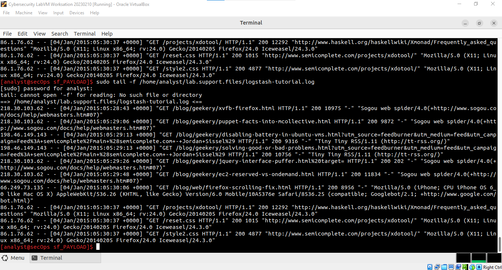

# Lab - Reading Server Logs

## Objectives
---

- Part 1: Reading Log Files with Cat, More, Less, and Tail

- Part 2: Log Files and Syslog

- Part 3: Log Files and Journalctl

## Background
---

Log files are an important tool for troubleshooting and monitoring.
Different application generates different log files, each one containing
its own set of fields and information. While the field structure may
change between log files, the tools used to read them are mostly the
same. In this lab, I will learn about common tools used to read log file
and practice using them.

Resources - CyberOps Workstation virtual machine

## Part 1: Reading Log Files with Cat, More, Less, and Tail
------------------------------------------------

Log files are files used to record specific events triggered by
applications, services or the operating system itself. Usually stored as
plain-text, log files are an indispensable resource for troubleshooting.

Log files commonly contain plain-text information which can be viewed by
practically any program able to handle text (text editors). However,
because of convenience, usability, and speed, a few tools are more
commonly used than others. This section focuses on four
command-line-based programs: cat, more, less, and tail.

cat, derived from the word 'concatenate', is a UNIX, command-line-based
tool used to read and display the contents of a file on the screen.
Because of its simplicity and it can open a text file and display it in
a text-only terminal, cat is widely used to this day.

As usual, I started my CyberOps workstation :) b.From the terminal
window, I issued the command below to display the contents of the
**logstash-tutorial.log** file, located in the
**/home/analyst/lab.support.files/** folder: cat /home/analyst/lab.support.files/logstash-tutorial.log*

A drawback associated with using cat with large text files is that, the
beginning of the file may get lost as cat doesn't support page breaking.
The screenshot you see above, I scrolled up and that's why you see it
from the start.

Another popular tool for visualizing log files is **more**. Similar to
**cat**, **more** is also a UNIX command-line-based tool that can open a
text-based file and display the file contents on the screen. The main
difference between **cat** and **more** is that **more** supports page
breaks, allowing the user to view the contents of a file, one page at a
time. This can be done using the space bar to display the next page.

From the same terminal window, I used the command below to display the
contents of the logstash-tutorial.log file again. This time using
**more**: *more /home/analyst/lab.support.files/logstash-tutorial.log*

The contents of the file scrolls through the terminal window and stops
when one page is displayed. I hit the space bar to advance to the next
page.

The drawback of using more is that, you would need to interact with the
program to show more lines of text. It may not be easy to display again
pages that were already displayed.

Building on the functionality of **cat** and **more**, the **less** tool
allows the contents of a file to be displayed page by page, while also
allowing the user the choice of viewing previously displayed pages. From
the same terminal window, I used less to display the contents the
logstash-tutorial.log file again: *less /home/analyst/lab.support.files/logstash-tutorial.log*

The contents of the file scrolls through the terminal window and stops
when one page is displayed. Upon pressing the space bar, it advances to
the next page. When I hit enter, it displays the next line of text. The
up and down arrow keys moves back and forth through the text file. The
"q" key on the keyboard, when pressed, exits the less tool.

The **tail** command displays the end of a text file. By default, tail
displays the last ten lines of the file. As shown below..

**Acitvely Following Logs**

In some situations, it is desirable to monitor log files as log entries
are written to the log files. For those cases, the **tail -f** command
is very helpful. I used **tail -f** to actively monitor the contents of
the **/var/log/syslog** file: *sudo tail -f
/home/analyst/lab.support.files/logstash-tutorial.log*

After the tail -f command is issued, the terminal appears locked and
does not accept commands anymore. This happens because tail is still
running, watching the log file and will print any changes written to it
on the screen.

To watch tail -f in action, I opened a second terminal window and
arranged my display so I could see both terminal windows. The terminal
window on the top is running tail -f to monitor the
/home/analyst/lab.support.files/logstash-tutorial.log file. I then used
the terminal window on the bottom to add information to the monitored
file.

To make it easier to visualize, I selected the top terminal window (the
one running tail -f) and pressed enter a few times to add a few lines
between the current contents of the file and the new information to be
added.

I then selected the bottom terminal window and entered the following
command: echo \"this is a new entry to the monitored log file\" \>\>
lab.support.files/logstash-tutorial.log

The command above appends the \"this is a new entry to the monitored log
file\" message to the /home/analyst/lab.support.files/logstash-tutorial.log file. Because tail
--f is monitoring the file at the moment a line is added to the file.
The top window displayed the new line in real-time.

I pressed CTRL + C to stop the execution of **tail -f** and return to
the shell prompt which I then closed one of the two terminal windows.

## Part 2: Log Files and Syslog
--------------------

Because of their importance, it is common practice to concentrate log
files in one monitoring computer. Syslog is a system designed to allow
devices to send their log files to a centralized server, known as syslog
server. Clients communicate to a syslog server using the syslog
protocol. Syslog is commonly deployed and supports practically all
computer platforms. The CyberOps Workstation VM generates operating
system level log files and hands them over to syslog. I used the cat
command as root to list the contents of the **/var/log/syslog.1** file.
This file holds the log entries that are generated by the CyberOps
Workstation VM operating system and sent to the syslog service.

In the CyberOps Workstation VM, the /var/log/syslog belongs to root and
can only be read by root and that's why the cat command had to be
initiated with sudo.

I noticed that the **/var/log/syslog** file only stores the most recent
log entries. To keep the syslog file small, the operating system
periodically rotates the log files, renaming older log files as
syslog.1, syslog.2, and so on. I used the **cat** command to list older
syslog files. Older ones were zipped.

One reason why it is so important to keep the time and date of computers
correctly synchronized is that, log systems use log files to record and
store events and the date/time they took place. If the system clock is
incorrect or not synchronized, it will make the troubleshooting process
more difficult.

## Part 3: Log Files and Journalctl
------------------------

Another popular log management system is known as journal. Managed by
the journald daemon, the system is designed to centralize the management
of logs regardless of where the messages are originating. In the context
of this lab, the most evident feature of the journal system daemon is
the use of append-only binary files serving as its log files.

To look at the **journald** logs, I used the **journalctl** command. The
**journalctl** tool interprets and displays the log entries previously
stored in the journal binary log files.

To display all timestamps in UTC time, I used the command **journalctl
\--utc**

To display log entries recorded during the last boot, I used the command
**journal -b**

I used **journalctl** to specify the service and timeframe for log
entries. The command below shows all nginx service logs recorded today.

I used the **-k** switch to display only messages generated by the
kernel as shown below

Similar to **tail -f** described in part 1, I used the **-f** switch to
actively follow the logs as they were being written

# Reflection
---

Comparing Syslog and Journald. Syslog is a standard solution for
logging. It uses plaintext files but has a lack of structure. The
information is not centralized, and it may be necessary to search
through lots of unrelated information to find relevant information.
Syslog does not provide a way to separate messages by the related
applications. Furthermore, the plaintext files may require rotation to
keep them from become too large. Journald replaced plaintext log files
with special file format for log messages. This makes it easier to find
relevant log messages.
