# Phishing Analysis - Blue Team Labs Online (Write-up)
 
## Scenario
A user has received a phishing email and forwarded it to the SOC. Can
you investigate the email and attachment to collect useful artifacts?

## Tools
- VS Code
- Mozilla Thunderbird
- host
- URL2PNG

## Methodology
I started by opening the `.eml` file via VS code

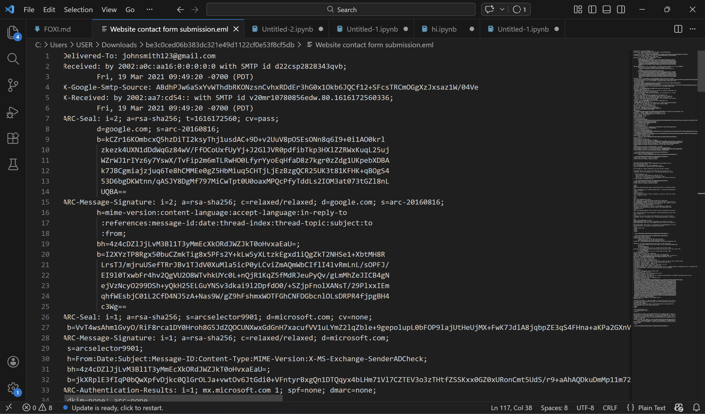

**Who is the primary recipient of this email?**

At was easy to think the primary recipient was johnsmith123 but I identified a bounce error coming from line 116. This showed the primary 
email the message was intended to be delivered to.

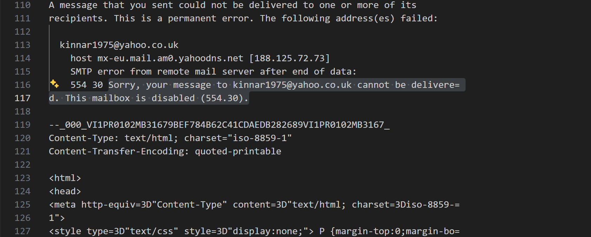

**What is the subject of this email?**

Here, I simply searched for the word subject using the key combination **ctrl+f** which returned the subject of the email.

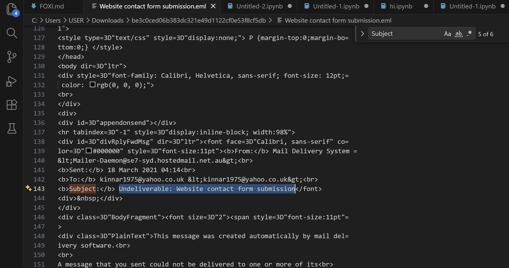

**What is the date and time the email was sent?**

So from identifying the subject of the email, the **Sent:** tag showed the exact date and time the eail was sent.

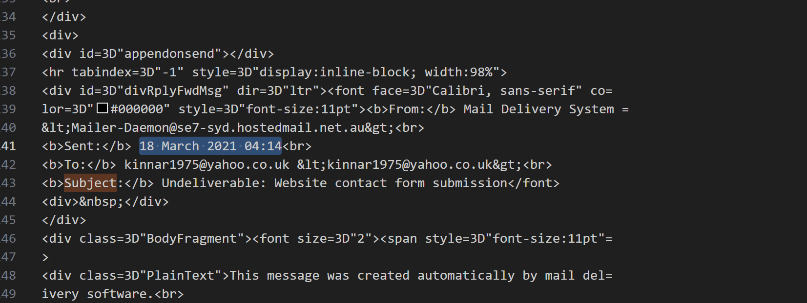

**What is the Originating IP?**

I searched for the **X-Originating-IP** header which is a non-standard email header used to identify the original client IP address of the sender. And there it was..

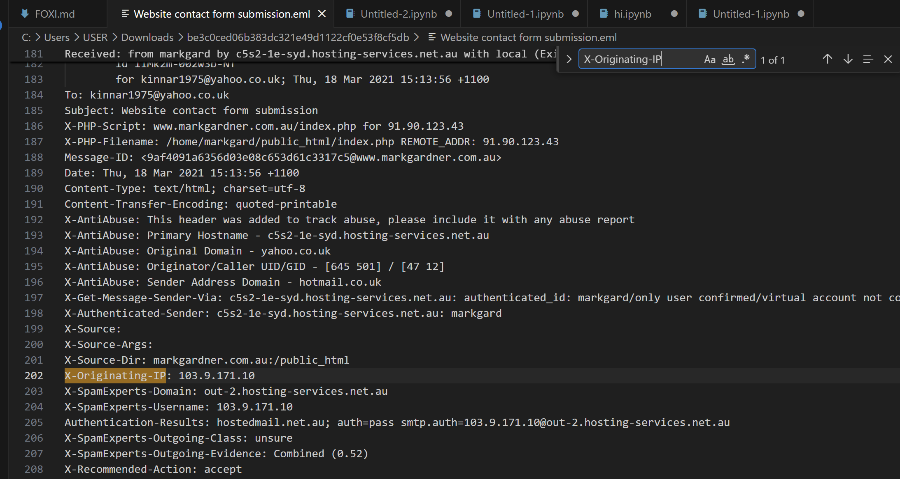

**Perform reverse DNS on this IP address, what is the resolved host?**

Now I needed to leave VS Code and go to whois.domaintools.com for OSINT. I waited for a couple of minutes, even tried using my phone but seems likethe website was down.

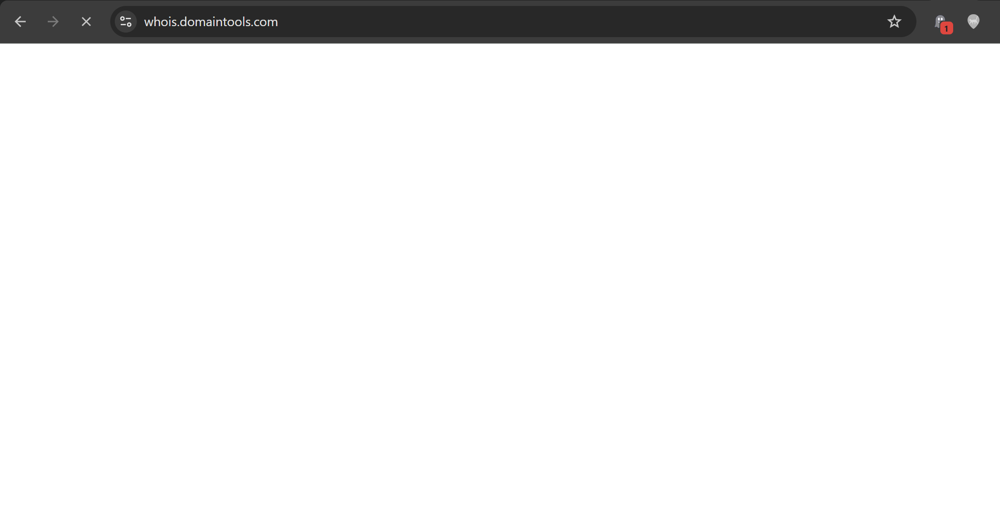

So I decided to fall back on linux! And there it was..

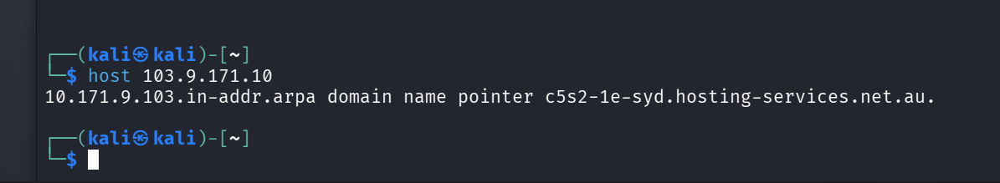

But then why not go back to VS code, the host might have just been there and I just have to search. And there it was again.. the
X-Authenticated-Sender header huh!

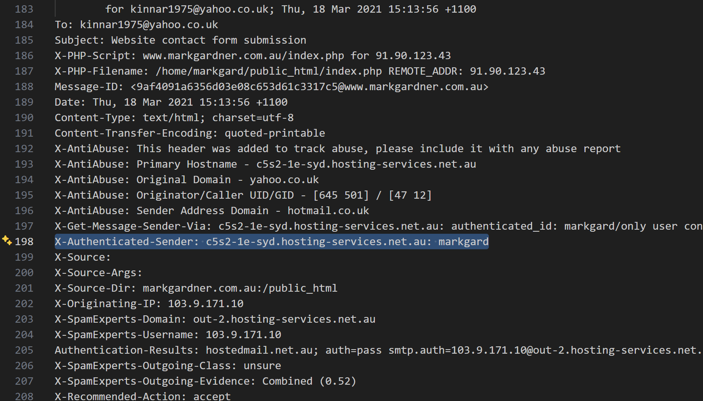

**What is the name of the attached file?**

The attachment filename was not visible by inspecting the eml file in VS code hence to get the filename, I had to drop the eml file intothunderbird. Hence I downloaded it

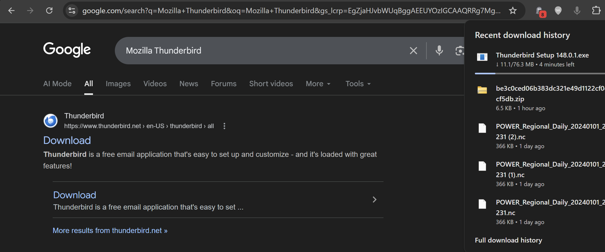
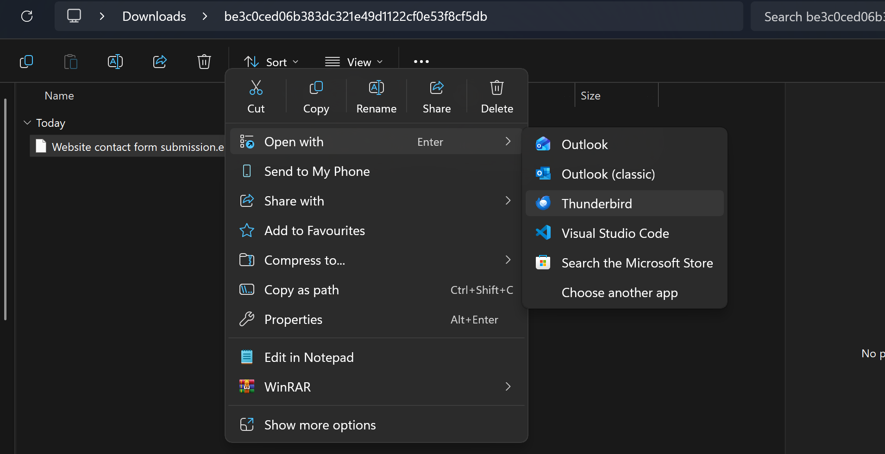

So after opening the eml in Thunderbird, I located the filename and
definitely, its extension is .eml.

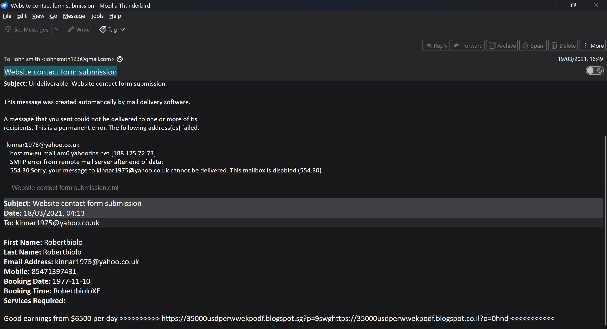

**What is the URL found inside the attachment?**

Looking at the latter part of the file within Thunderbird was the URL.

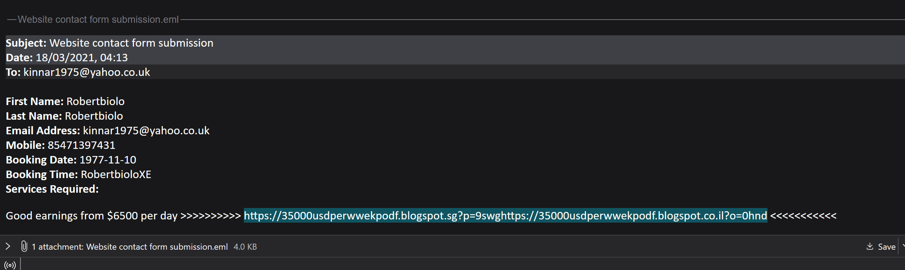

**What service is this webpage hosted on?**

From the URL found inside the attachment, the hostname is blogspot and I know very well that, that's provided by blogger! Lol I used to share blogs there. The webpage is hosted on blogger.

**Using URL2PNG, what is the heading text on this page? (Doesn't matter if the page has been taken down!)**

Here, I copy the URL and paste it into URL2PNG which returned, "Blog has
been removed". Lol the answer was hidden in plain sight.

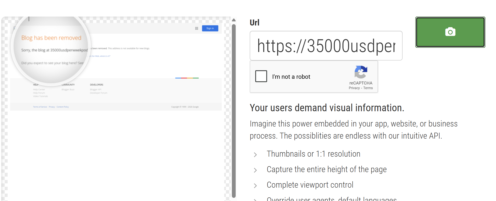
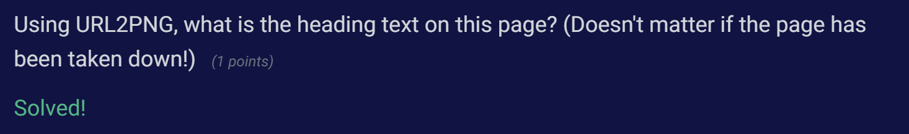

## Results

## Reflection
This was an awesome investigation ofemail, as a vector phishing vector. I got to understand other header fields useful in conducting email phishing analysis.
