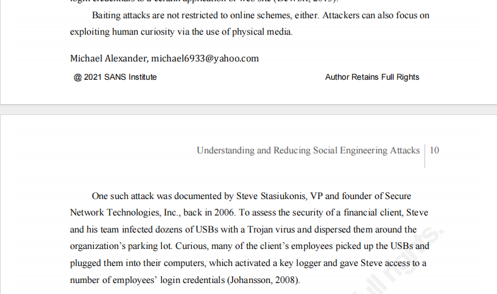

# Lab - Social Engineering

## Objectives
---
Research and identify social engineering attacks

## Scenario
---

Social engineering is an attack with the goal of getting a victim to
enter personal or sensitive information, this type of attack can be
performed by an attacker utilizing a keylogger, phishing email, or an
in-person method. This lab requires the research of social engineering
and the identification of ways to recognize and prevent it.

## Instructions
---

So this lab was more of a research work where using a web browser, I
needed to find the article **"Methods for Understanding and Reducing
Social Engineering Attacks"** on the **SANS Institute website**.

The SANS Institute is a cooperative research and education organization
that offers information security training and security certification.
The SANS Reading Room has many articles that are relevant to the
practice of cybersecurity analysis.

I had to read the article on social engineering, and answer the
following questions below but first of all, I'll share screenshots of
accessing the site.

Link to the document: `https://sansorg.egnyte.com/dl/ThcCIPylGH`

## Questions:

a.  What are the three methods used in social engineering to gain access to information?

The three methods are: Electronic access, Physical access and Social
Media

b. What are three examples of social engineering attacks from the first
two methods in step 2a?

From Electronic Access (Phishing): The attack on security company RSA,
where a phishing email with the subject "2011 Recruitment Plan"
contained a malicious Excel file exploit.

From Electronic Access (Spear Phishing): The attempt on KnowBe4, where
an attacker spoofed an email from the company\'s CTO to the Controller
requesting a wire transfer.

From Physical Access (Baiting): Infected USB drives were left in a
company\'s parking lot, and employees plugged them into their computers,
activating a keylogger.

c. Why is social networking a social engineering threat?

Social networking is a threat because people tend to overshare
information that seems harmless (like pet names, hometowns, birth dates,
schools) but can be used to answer security questions or guess
passwords. Furthermore, attackers can create fake, legitimate-looking
profiles to garner connections and trust.

d. How can an organization defend itself from social engineering
attacks?

The primary defense proposed in the document is to create a
sophisticated, in-house, custom-built security awareness and training
program. This program should not be a generic \"check the box\" exercise
but should be tailored based on employees\' access levels, roles, and
crucially, their scientifically assessed personality types and
behavioral tendencies (using models like OCEAN) to address their
specific vulnerabilities.

e. What is the SANS Institute, which authored this article?

Based on the document, it is the publisher of this research paper.
Through research, the SANS Institute is a renowned private American
company that specializes in cybersecurity training, certifications, and
research. It is considered one of the most trusted and leading sources
for information security knowledge and skills development globally.
