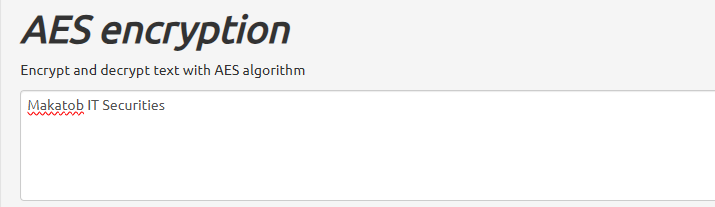
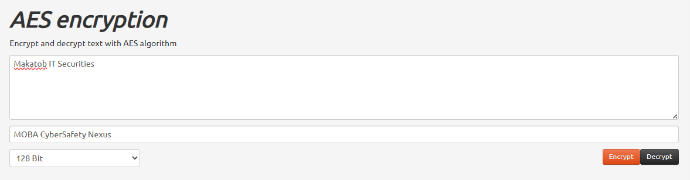
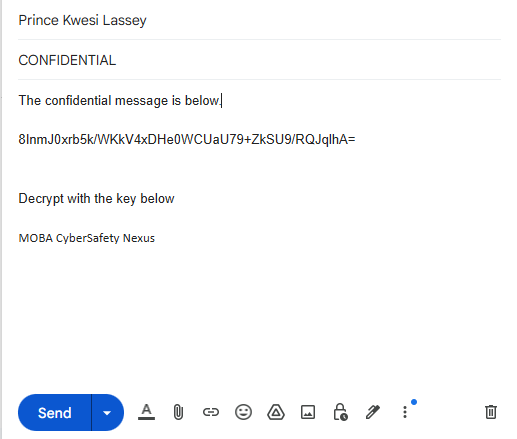
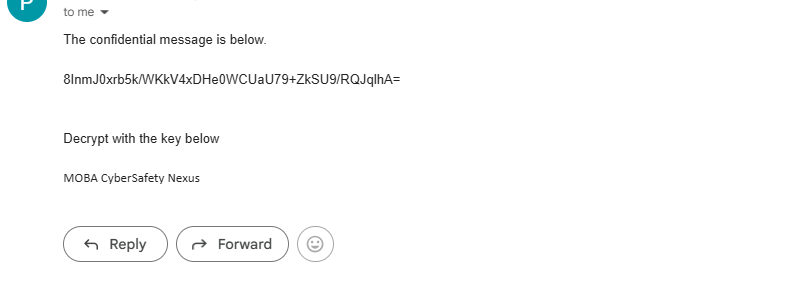
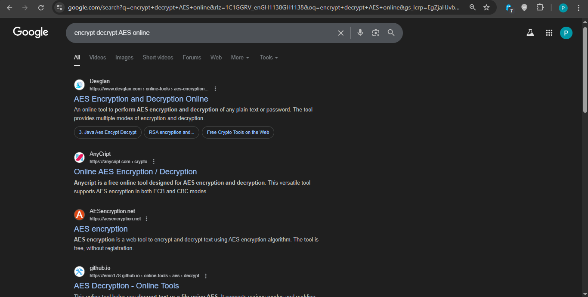
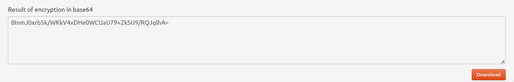
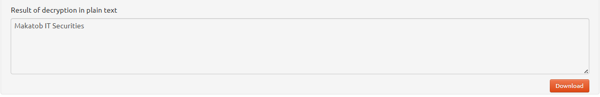

# Class Activity: Creating Codes

## Objectives

In this lab, I will create and encrypt messages using online tools.
- Part 1: Search for an online encoding and decoding tool.
- Part 2: Encrypt a message and email it.
- Part 3: Decrypt the ciphertext.

## Scenario

Secret codes have been used for thousands of years. Ancient Greeks and
Spartans used a **scytale** (rhymes with Italy) to encode messages.
Romans used a **Caesar cipher** to encrypt messages. A few hundred years
ago, the French used the **Vigenère cipher** to encode messages. Today,
there are many ways that messages can be encoded. There are several
encryption algorithms that can be used to encrypt and decrypt messages.
VPNs are commonly used to automate the encryption and decryption
process.

## Tools Used

My Laptop with internet access.

## Methodology

### Part 1: Searching for an online encoding and decoding tool.

Using Chrome, I searched for "encrypt decrypt AES online". I then
selected <http://aesencryption.net/> to explore its features.

### Part 2: Encrypting a message and emailing it to my lab partner.

I entered the plaintext message "Makatob IT Securities" in the text box
and made sure my friend did not see it. (I mean me 😅)

I then entered the security key "MOBA CyberSafety Nexus" and proceeded
to encrypting the message.

Downloaded and emailed the encrypted message to another mail which I own
(representing my lab partner)

### Part 3: Decrypting the ciphertext.

I opened the mail and copied the cipher text as well as the secret key
for decryption.

I pasted it into the tool's text box and decrypted the message.

## Results

There are many different types of encryption algorithms used in modern
networks. One of the most secure is the Advanced Encryption Standard
(AES) symmetric encryption algorithm which I used for this lab.

After the search, I came across a number of tools listed in the search
results. I selected <http://aesencryption.net/> to explore its features.

The secret key is required most at times and is used along with the
encryption algorithm to encrypt the message. Below shows the results of
ecrypted (I mean encoded in base64 in this instance) message.

AES is a symmetric encryption algorithm and means that the two parties
exchanging encrypted messages must share the secret key in advance.
Below shows the results of the decryption.

## Reflection

When a wrong secret key is entered to decrypt the message, it just does
not work since it is wrong. Only the right secret key can be used to
decrypt the message.
