# STEGANOGRAPHY - Exploring OpenStego

To keep confidential data secure enough, it may become appropriate or necessary to
hide information in plain sight. Well, this was not new to me since I've worked on steganography using steghide and also cracking password protected files to
retrieve hidden info. But well, I had to try out OpenStego while prepping for Security+... :)

First of all, I navigated to the gitthub page where the project files
were hosted for download.

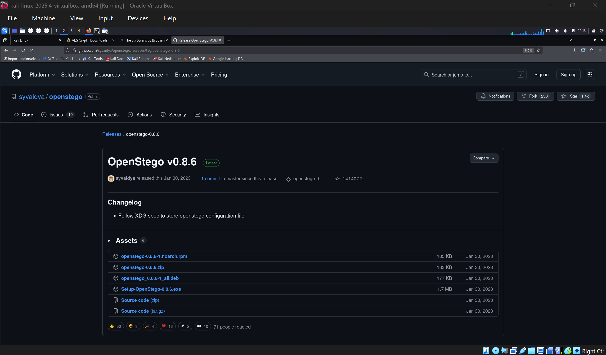

I downloaded and installed the .deb on my linux machine.

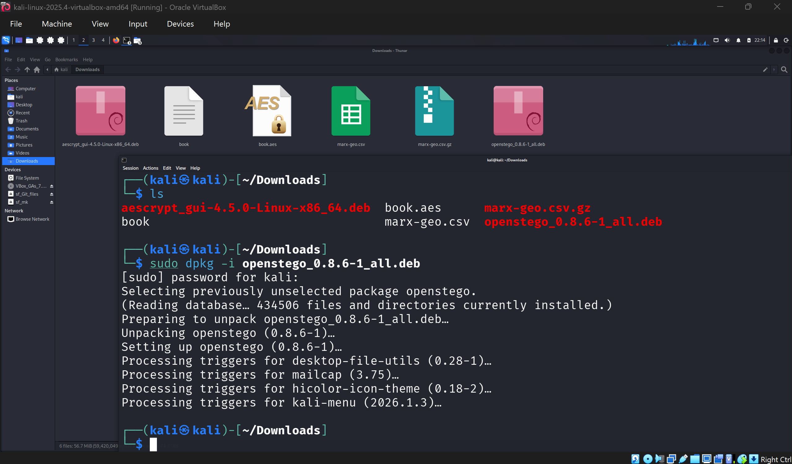

I then opened OpenStego GUI to perform some data hiding. From my
previous work where I explored symmetric cryptogaphy, I created the
book.txt file. So, I'm gonna be hiding that text file within an image.

I realized I had no image to hide the text file in, so I downloaded one.

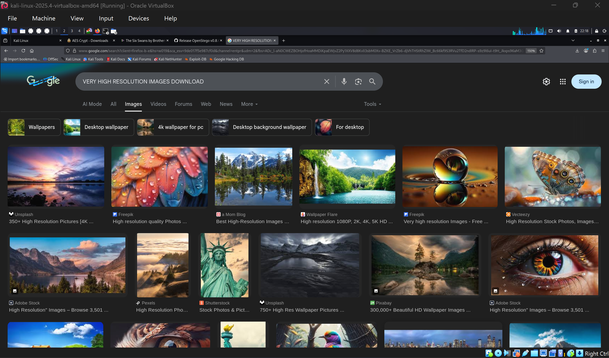
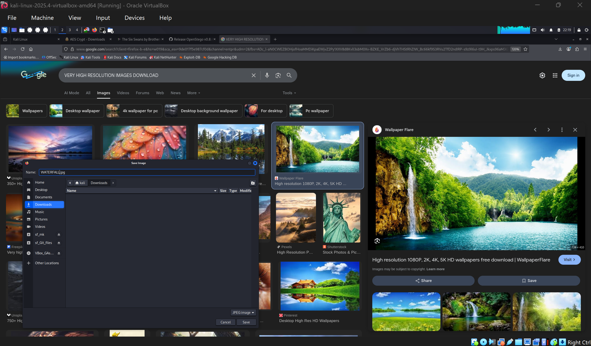

After downloading the image, I continued with the hiding process as seen
in the images below.

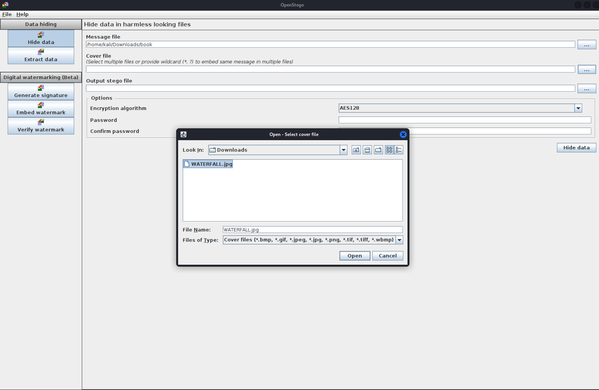
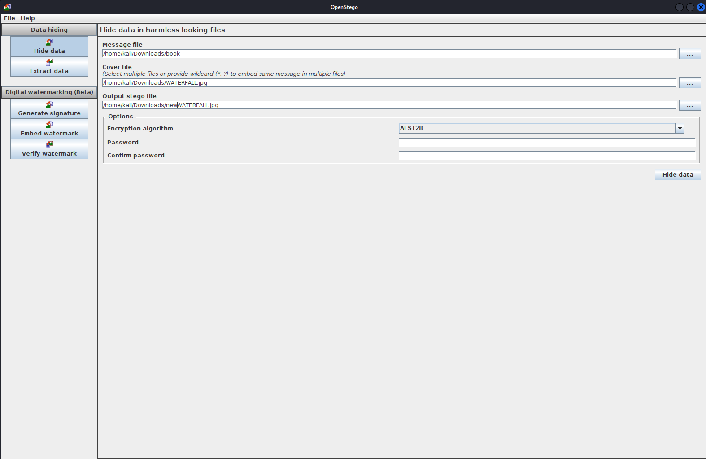

Succesfully hidden 1 fiile. I saved the resulting image as
**newWATERFALL.jpg**

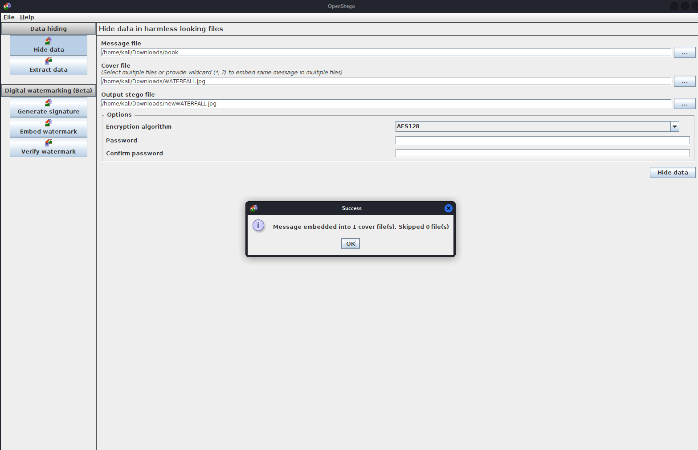

I opened both images. I noticed the two images looked thee same but had
different bytes. (That should tell you something)

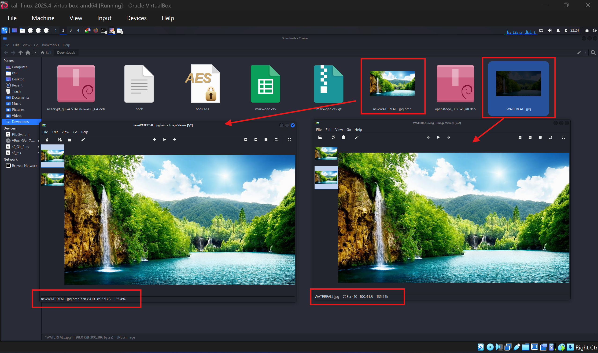

I then deleted the book.txt file so I can clearly see when I extract it
back from the image.

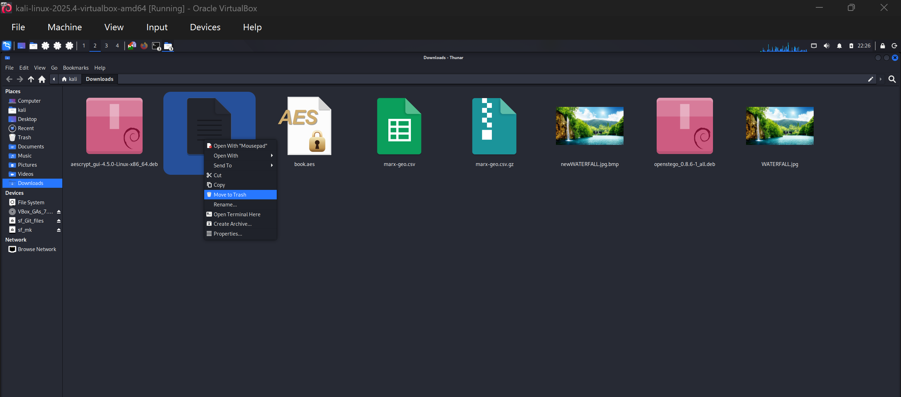
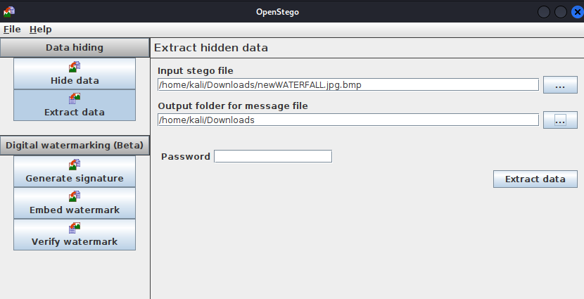

That's the extracted text file right there.

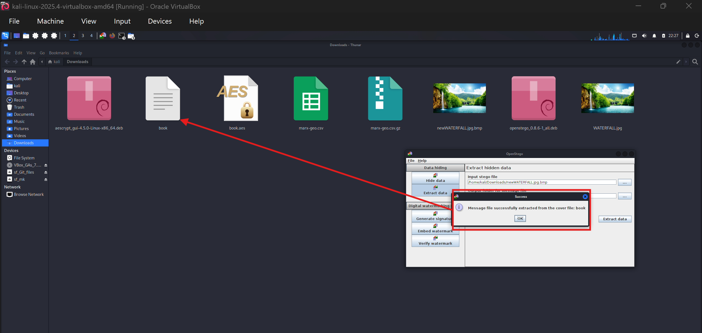
