# Lab Report: Encrypting and Decrypting Data using a Hacker Tool

## Objectives

In this lab, I will create and encrypt sample text files then decrypt
the encrypted zip file. This lab is only for learning purposes. The
methods presented here should NOT be used to secure truly sensitive
data.

## Scenario

In this scenario, the Chief Financial Officer (CFO) is out-of-town on
business and has contacted me in a panic with an emergency request for
help. While out-of-town on business, he attempted to unzip important
documents from an encrypted zip file on a USB drive. However, the
password provided to open the zip file is invalid. The CFO contacted me
to see if there was anything I could to do.

There may be some tools available to recover lost passwords. This is
especially true in situations such as this where the cybersecurity
analyst could acquire pertinent information from the CFO. The pertinent
information could be the length of the password and an idea of what it
could be. Knowing pertinent information dramatically helps when
attempting to recover passwords.

Examples of password recovery utilities and programs include hashcat,
John the Ripper, Lophtcrack, and others. In this scenario, I will use
fcrackzip which is a simple Linux utility to recover the passwords of
encrypted zip files.

## Tools Used

- CyberOps Workstation virtual machine
- Fcrackzip
- zip

## Methodology

### Part 1: Creating and Encrypting Files

Here, I aim to create a few text files which will help me create the
encrypted zip in the next part.

I started the CyberOps Workstation and created a new folder called
**PrinceZip** in the analyst home directory.

I then moved into the PrinceZip directory and created three sample files
with the commands as seen below:

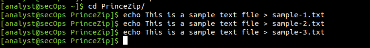

Using the long listing format, ls -l, I verified that the files had been
created.

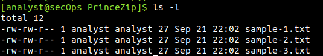

Next, I will create several encrypted zipped files using varying
password lengths. To do so, all three text files will be encrypted using
the **zip** utility. Using the command below, I created an encrypted zip
file called **file-1.zip** containing the three text files. When
prompted for password, I used **Prince Lassey**

I repeated the procedure to create the following 4 other files

- file-2.zip using a 2-character password **R2**.
- file-3.zip using a 3-character password **oba**.
- file-4.zip using a 4-character password **gino**.
- file-5.zip using a 5-character password **gamer**.

I verifed that all zipped files had been created using the **ls -l**
command

I then attempted to open one of the encrypted zip files with a wrong
password

### Part 2:Recovering Encrypted Zip File Passwords

In this part, I will use the fcrackzip utility to recover lost passwords
from encrypted zipped files. Fcrackzip searches each zip file given for
encrypted files and tries to guess the password using brute-force
methods. The reason icreated zip files with varying password lengths was
to see if password length influences the time it takes to discover a
password.

From the terminal window, I entered the **fcrackzip --h** command to see
the associated command options.Here, I will be using the -v, -u, and -l
command options. The -l option will be listed last because it specifies
the possible password length.

Now, I attempted to recover the password of the file-1.zip file. Recall,
that my name was used to encrypt the file. Therefore, I use the
following fcrackzip command which specifies verbose mode, use unzip to
zeed out wrong passwords and check password with length from minimum to
maximum.

I repeated the procedure to crack the passwords for the other four zip
files.

To verify how long it takes for fcrackzip to discover a 6-charcater
password, I created a new zip with the password **JarJar**

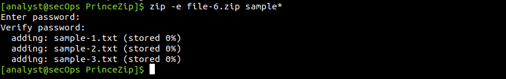

Afterwards, I tried to crack the password with fcrackzip specifying a
min lenth of 4 and max of 7

## Results

Encrypting all three files as a zip file:

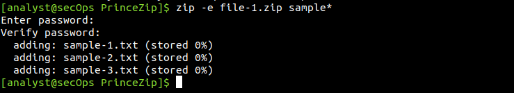

Below shows the encryption for the four other files using different
passwords.

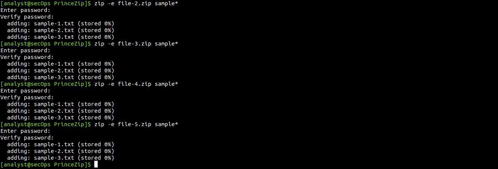

Below shows that, all five zipped files were successfully created.

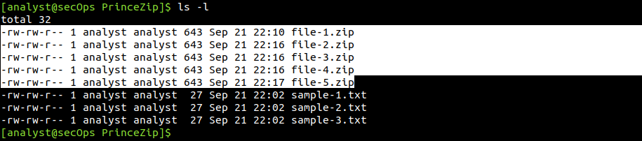

Opening the encryted zip file with the wrong password showed it was
incorrect and hence file was not extracted.

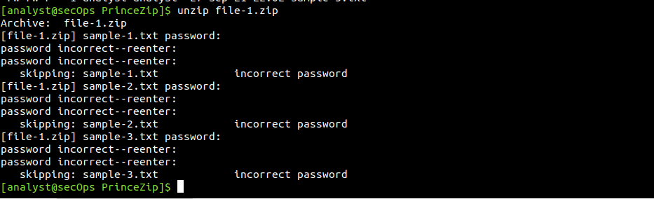

Help section of the fcrackzip utlity

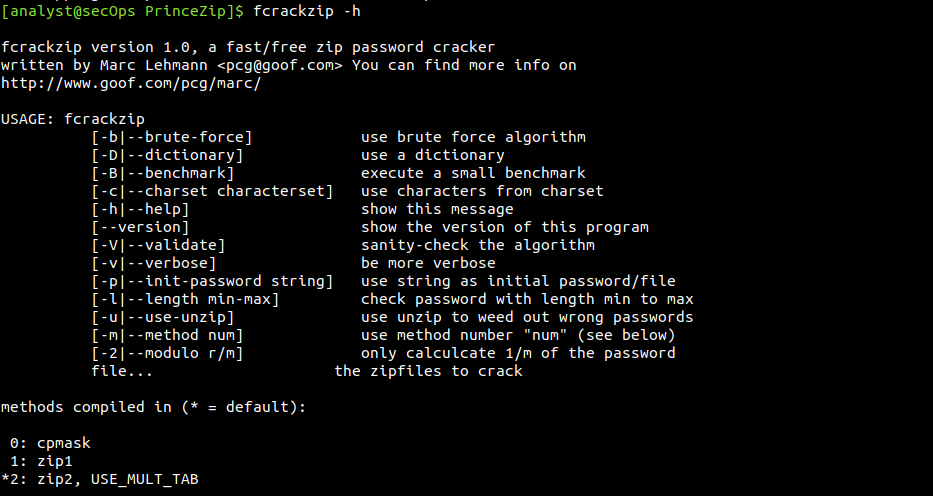

The password recovery for file-1.zip whose password was my name is shown
below. Well, at some point, I had to stop the recovery since I
personally knew it would take quite some time.

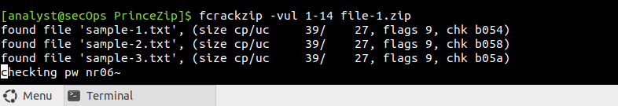

Password for file-2.zip was recovered instantly after I pressed enter.

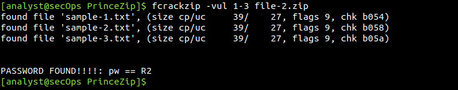

Password for file-3.zip was recovered just after I pressed enter.

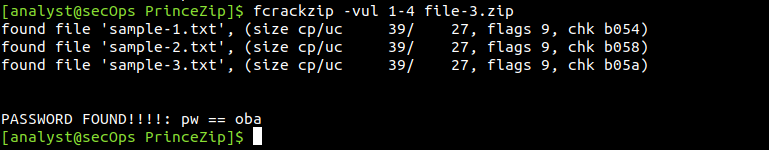

Password for file-4.zip was recovered 2 seconds after I pressed enter.

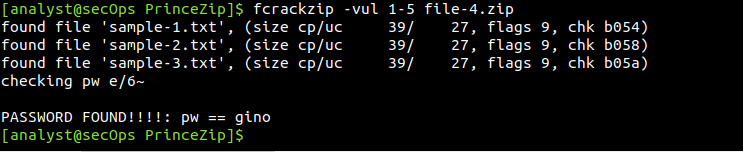

Password for file-5.zip was recovered 71 seconds after I pressed enter.

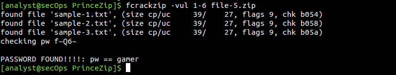

Even 30 minutes into cracking the file with the 6-character password and
the password hadn't yet been discovered. That tells, it could take hours
to discover that password.

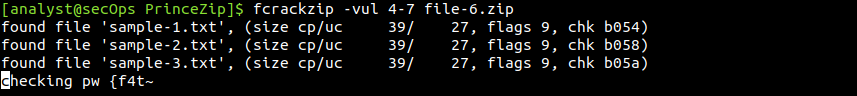

## Reflection

In simple truth, it could take a huge amount of time to crack the file
whose password was my name since it was about 13 characters. Longer
passwords therefore are more secure since it will take a long time to
crack it.
