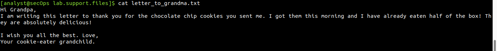
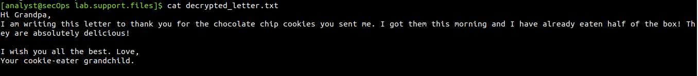

# Lab Report: Encrypting and Decrypting Data Using OpenSSL

## Objectives

Simply put, in this lab, I will use OpenSSL to encrypt and decrypt text
messages.

## Background

OpenSSL is an open source project that provides a robust,
commercial-grade, and full-featured toolkit for the Transport Layer
Security (TLS) and Secure Sockets Layer (SSL) protocols. It is also a
general-purpose cryptography library. While OpenSSL is the de facto
cryptography library today, the use presented in this lab is NOT
recommended for robust protection. Below are two security problems with
this lab:

1. The method described in this lab uses a weak key derivation function.
The ONLY security is introduced by a very strong password.

2. The method described in this lab does not guarantee the integrity of
the text file.

This lab is used for learning purposes only. The methods presented here
should NOT be used to secure truly sensitive data.

## Tools Used

- CyberOps Workstation virtual machine
- Openssl

## Methodology

### Part 1:Encrypting Messages with OpenSSL

To use AES to encrypt a text file directly from the command line using
OpenSSL, I went by the steps below:

I logged into the CyberOPS Workstation VM and changed directory to the
/home/analyst/lab.support.files/ directory since it contained the file
to be encrypted.

I then cat the file to be encryted to inspect its data

Using AES-256, I encrypted the text file and saved the encrypted version
as **message.enc** with the password **makatob** as seen below:

After, I inspected the content of message.enc

To make the encrypted file more readable, I encoded it with Base64. The
-a option in the command below, did the magic.

### Part 2:Decrypting Messages with OpenSSL

Here, my main goal was to decrypt the same file which I encrypted
earlier. I used the command below where:

-a = base64 decoding
-d = decrypt mode
-in = input file
-out = output file

I then cat the decrypted\_letter.txt to verify the message was as seen
as earlier.

## Results

OpenSSL can be used as a standalone tool for encryption. While many
encryption algorithms can be used, this lab focused on AES.

File to be encrypted:

After encryption, below was observed as the content of message.enc with
just symbols displayed.

Encoding with Base64 resulted in the content of message.enc to be as
seen below and now reading friendly. While message.enc is encrypted, it
is now correctly displayed because it has been converted from binary to
text and encoded with Base64.

After entering **makatob** as the decryption password, I inspected the
decryted_letter.txt as seen below. When OpenSSL finishes decrypting the
**message.enc** file, it saves the decrypted message in a text file
called **decrypted_letter.txt**.

## Reflection

Since message.enc was Base64 encoded after the encryption process took
place, message.enc must be Base64 decoded before OpenSSL can decrypt it.
More secure algorithms can be used for encryption and decryption of
files. The openssl --help command shows various algorithms both
symmetric and asymmetric to use.

