# Lab Report: Examining Telnet and SSH in Wireshark

## Objectives

In this lab, I will examine a Telnet and an SSH Session with Wireshark

## Background

I will configure a router to accept SSH connectivity and use Wireshark
to capture and view Telnet and SSH sessions. This will demonstrate the
importance of encryption with SSH.

## Tools Used

- CyberOps Workstation virtual machine

- Wireshark

## Methodology

### Part 1:Examining a Telnet Session with Wireshark

I started and logged in to the CyberOps Workstation VM. I then opened a
terminal window and started Wireshark.

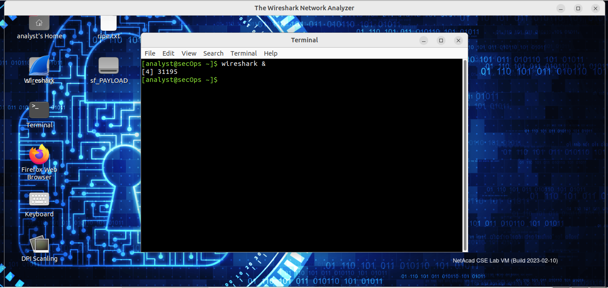

Then I started the capture on the Loopback interface

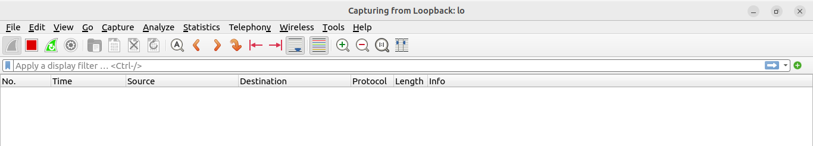

In a new terminal window, I started a telnet session to the localhost

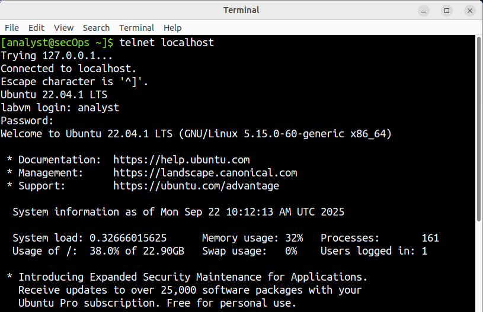

After providing the credentials for the telnet connection, I stopped the
Wireshark capture.

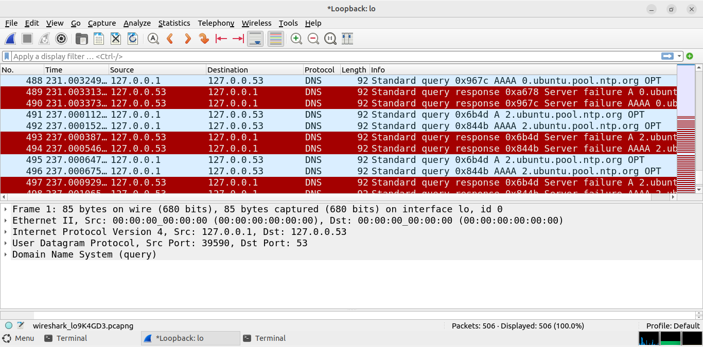

I then entered **telnet** in the filter field and clicked **Apply** to
display only telnet-related traffic.

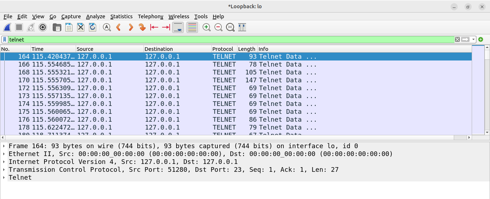

I right-clicked one of the Telnet lines in the Packet list section of
Wireshark, and from the drop-down list, I selected Follow \> TCP Stream.

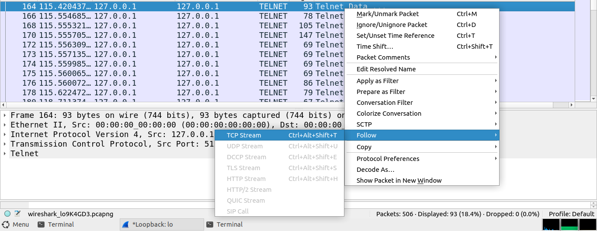

After I had finished reviewing the Telnet session in the Follow TCP
Stream window, I clicked Close and exited the Telnet session by typing
exit in the terminal.

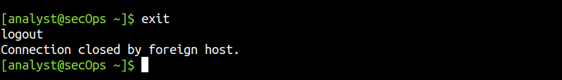

### Part 2:Examining an SSH Session with Wireshark

I started another Wireshark capture using the Loopback: lo interface
then I established an SSH session with the localhost.

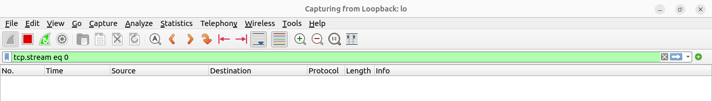

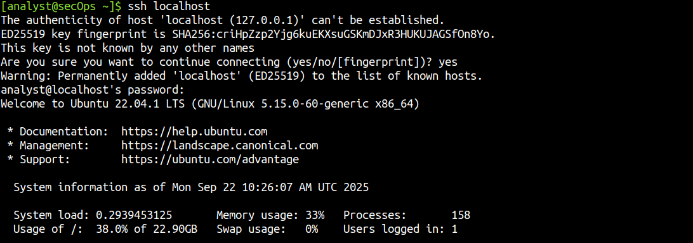

I applied an SSH filter on the Wireshark capture data by entering ssh in
the filter field and clicking Apply.

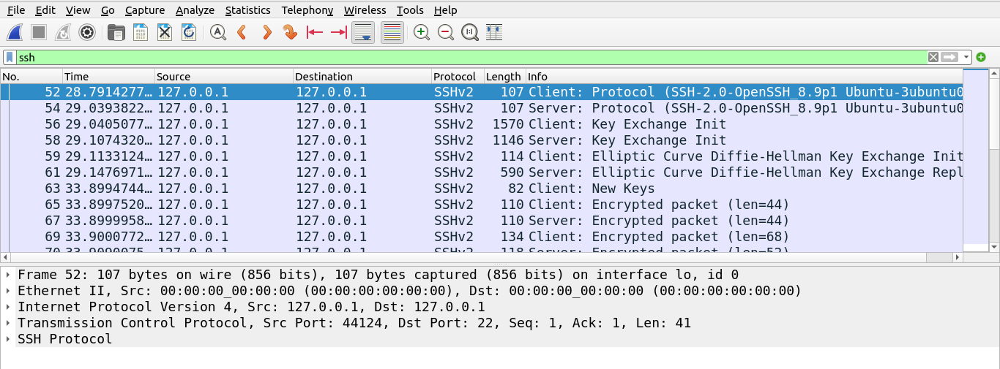

I right-clicked one of the SSHv2 lines in the Packet list section of
Wireshark, and in the drop-down list, I selected the Follow \> TCP
Stream.

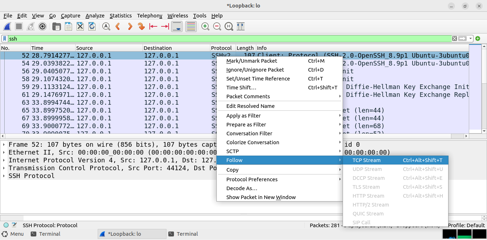

After examining the SSH session, I closed Wireshark. At this point, I
went to get some chilled malt haha cos three labs done in a row was
solid.

## Results

The Follow TCP Stream window displays the data for the Telnet session
with the CyberOps Workstation VM. The entire session is displayed in
plaintext, including my password. I noticed that the username that I
entered was displayed with duplicate characters. This is caused by the
echo setting in Telnet to allow me to view the characters that I typed
on the screen.

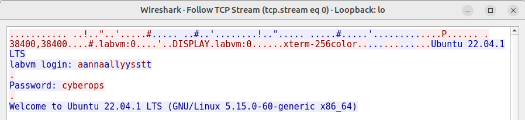

Examining the Follow TCP Stream window of the SSH session, I noticed
that the data had been encrypted and was unreadable.

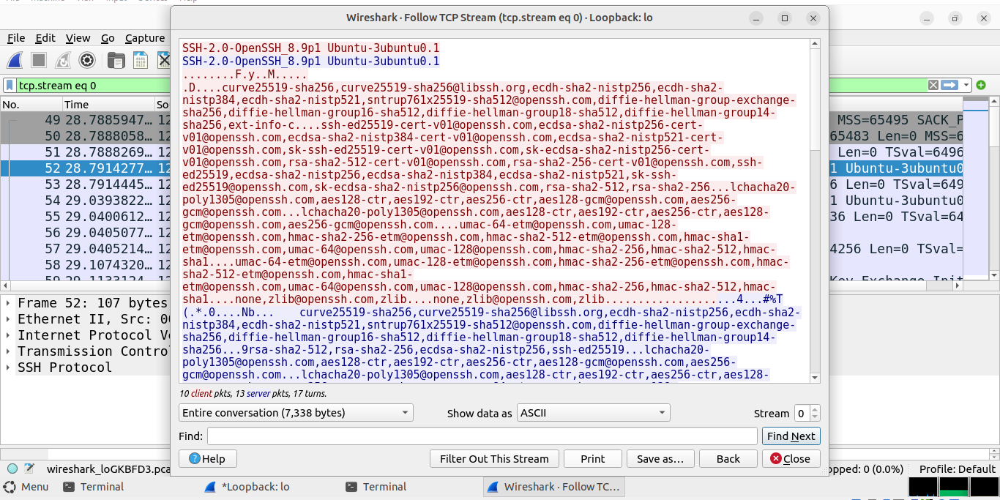

## Reflection

The Secure Shell Protocol (I mean SSH) allows users to communicate with
remote systems securely by encrypting the communications. This prevents
any sensitive information, such as usernames and passwords, from being
captured during the transmission.
