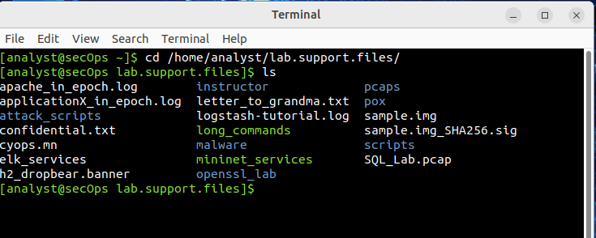
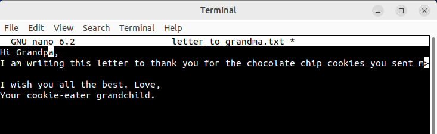
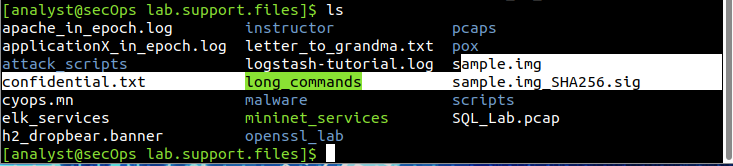
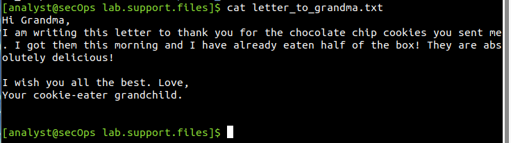
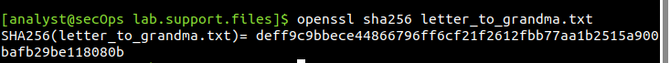
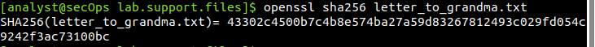
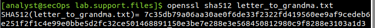
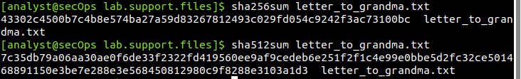
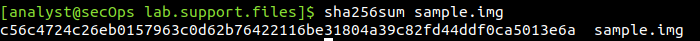
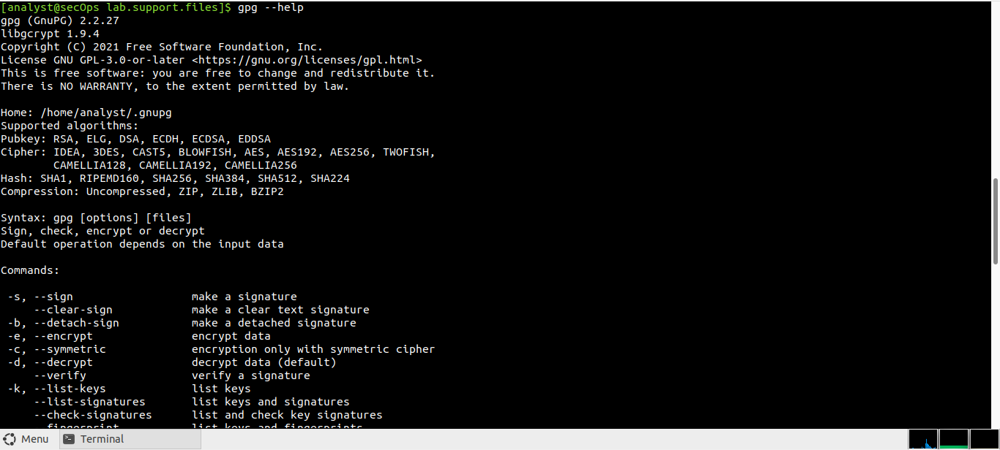

# Lab Report: Hashing Things Out to Verify Integrity of Data

## Objectives

For this lab, I had just two goals to meet as listed below.

-   Part 1: Hashing a Text File with OpenSSL

-   Part 2: Verifying Hashes

While OpenSSL can be used to generate and compare hashes, other tools
are available. Some of these tools are also included in this lab.

## Scenario

Hash functions are mathematical algorithms designed to take data as
input and generate a fixed-size, unique string of characters, also known
as the hash. Designed to be fast, hash functions are very hard to
reverse; it is very hard to recover the data that created any given
hash, based on the hash alone. Another important property of hash
function is that even the smallest change done to the input data yields
a completely different hash.

## Tools Used

- CyberOps Workstation virtual machine
- OpenSSL
- sha256sum
- sha512sum

## Methodology

### Part 1:Hashing a Text File with OpenSSL

To create the hash of a text file, I first logged in to my workstation.

Because the text file to hash is in the
**/home/analyst/lab.support.files/** directory, I change to that
directory

I then used the cat command to list the contents of
letter_to_grandma.txt

Moving on, I use the command below which uses SHA-2-256 as the hashing
algorithm to generate a hash of the text file.

Using nano text editor, I changed the first sentence from 'Hi Grandma'
to 'Hi Grandpa'. After the change had been made, I pressed the
\<CONTROL+X\> keys to save the modified file. Finally pressed 'Y' to
confirm the name and saved the file. I then pressed the \<Enter\> key to
exit nano.

Now that the file has been modified and saved, I run the command below
again to generate the hash of the file using the SHA-256 algorithm.

Moving to hashing algorithms with longer bit-length, I generated a
SHA-2-512 hash of the letter_to_grandma.txt file using the command
below:

Trying out different tools, I used the **sha256sum** and **sha512sum**
to generate SHA-2-256 and SHA-2-512 hash of the letter_to_grandma.txt
file.

### Part 2:Verifying Hashes

Back to the lab.support.files directory, I will demonstrate using
SHA-2-256 hashes to verify the integrity of sample.img, a file
downloaded from the Internet.

Along with sample.img, **sample.img\_SHA256.sig** was also downloaded.
**sample.img_SHA256.sig** is a file containing the SHA-2-256 hash that
was computed by the website.

First I, used the cat command to display the contents of the
sample.img_SHA256.sig file:

Then using SHA256sum, I calculated the SHA-2-256 hash of the sample.img
file:

## Results

Content of letter_to_grandma.txt

The hash of letter\_to\_grandma.txt displayed on the screen after
OpenSSL had computed it. I noticed the format of the output. OpenSSL
displays the hashing algorithm used, SHA-256, followed by the name of
file used as input data. The SHA-256 hash itself is displayed after the
equal ('=') sign.

Below shows the hash of the modified file.

Comparing the values of both SHA-2-256 hashes, I identified that they
varied. This confirms that the file had been tampered with even with
just a change in one letter.

|  Original File Hash                                                | Modified File Hash|
| ---------------------------------------------------------------------|-------------------|
|  deff9c9bbece44866796ff6cf21f2612fbb77aa1b2515a900bafb29be118080b |  43302c4500b7c4b8e574ba27a59d83267812493c029fd054c9242f3ac73100bc |

Below shows the hash of the modified file using the SHA-2-512 hashing
algorithm

The generated hashes when I used sha256sum and sha512sum is showed
below. By obervation, while different tools are used, the hashes are the
same since the input data and hashing algorithm were the same.

Contents of the sample.img_SHA256.sig file:

Calculating the hash of sample.img, I had the value below

## Reflection

From the resulting hash of the sample.img and the original hash from the
website which it was downloaded, I can confidently say yes.. sample.img
was downloaded without errors. Both hashes match,thus the hash
calculated before download and the one calculated after. I got to
understand that, tools such as **gpg**, provide a much better method for
ensuring the downloaded file has not been modified by third parties and
is in fact the file the publisher meant to publish. Also, I personally use the  Get-FileHash cmdlet in Powershell to compute the hash value for any file using a specified cryptographic hash algorithm.
Example is:
`
Get-FileHash -Path "E:\PAYLOAD\Hashing_Things_Out.docx" -Algorithm SHA256
`

