# ASYMMETRIC ENCRYPTION ALGORITHMS - Exploring GnuPG, an implementation of PGP

In this exploration, I aim to use the command line interface of GnuPG,
an open source package under **Pretty Good Privacy (PGP)** for
asymmetric encryption. I will have two characters (computers) by
creating a folder of different names and working on them side by side.

First of all, I run the command **gpg -h** to learn about how the tool
operates.

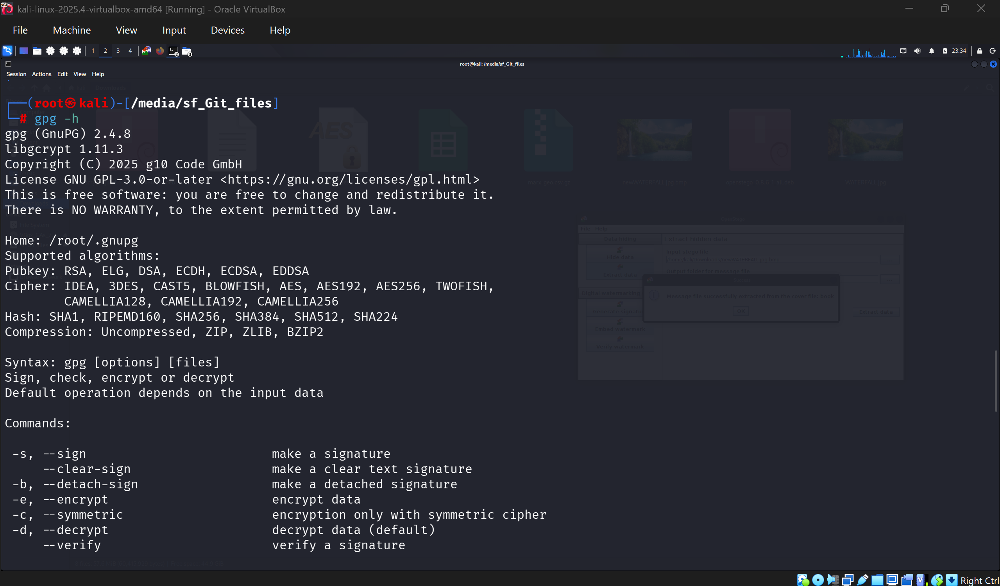
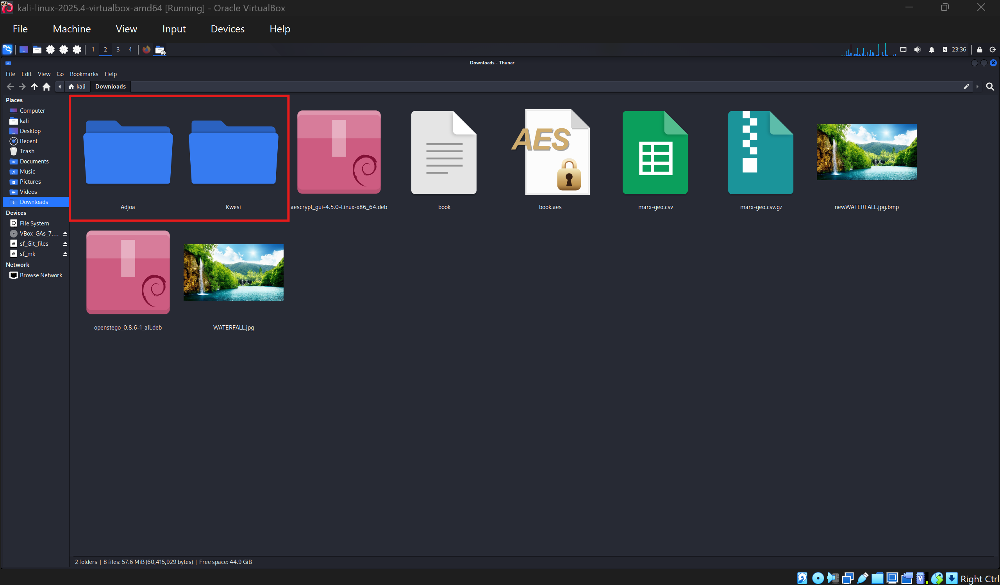
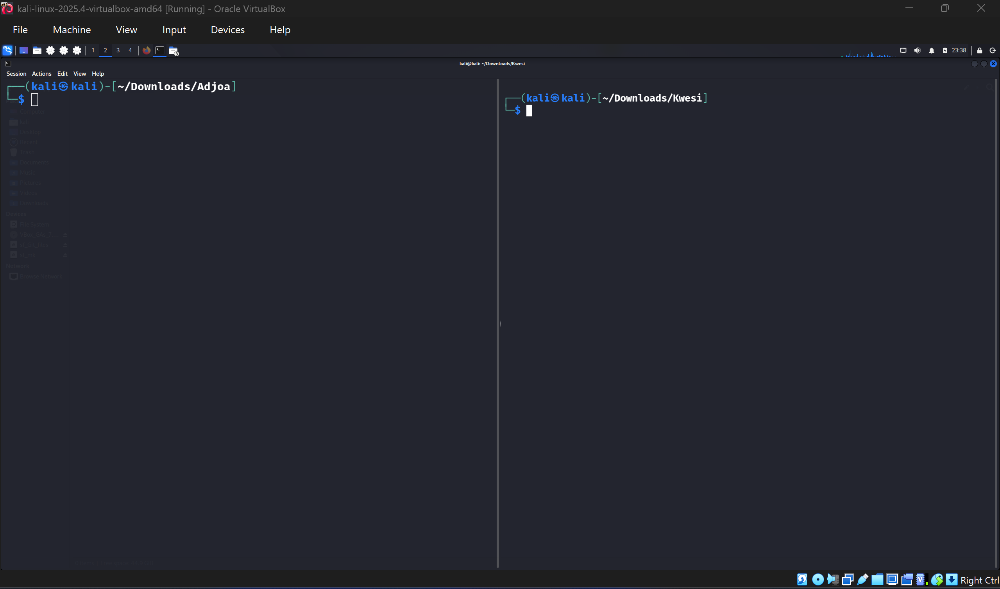

First, I will create a pair of encryption keys for Adjoa who wants to
send a message to Bob. I do this using gpg as seen below. I am then
asked for name, email and passphrase of which I used **Adjoa**,
**adjoa@email.com** and **asymmetric** respectively. I was promted that the
passphrase was weak but I continued regaredless since this is only for
practice purposes. Finally, I had an encryption key available for Adjoa.

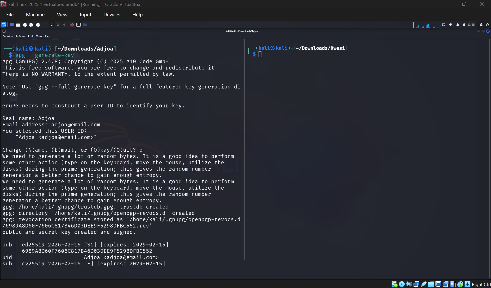

I then had to repeat the process for Kwesi as well for his encryption
key pair. This time with the name Kwesi, email **kwesi@email.com** and
same passphrase as that of Adjoa.

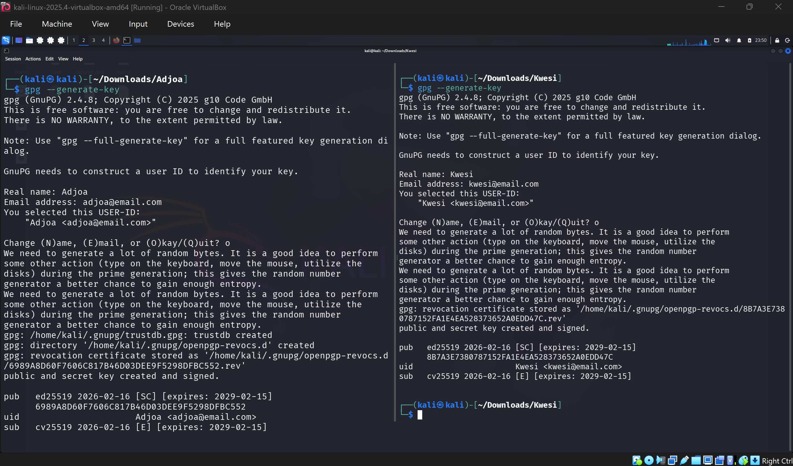

Next, since Adjoa needs to send Kwesi a message, she would need Kwesi's
public key to be able to send that message. Hence I'll take a look as
what Kwesi's public key looks like using the command below. **--armor** 
makes the text readable in ASCII format and I'll redirect the output to
Kwesi.pub
*(made a typo with the --armor)*
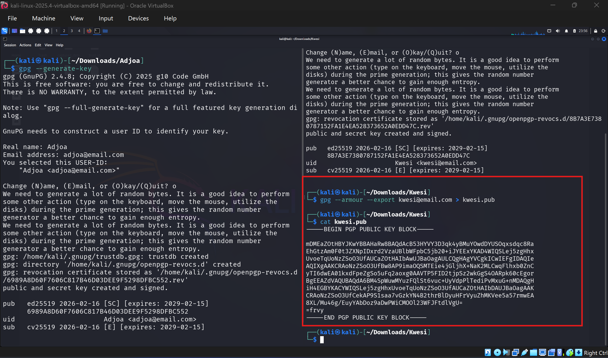

To get Kwesi's public key to Adjoa, I'll copy the content of kwesi.pub
into a new file Kwesi.pub but in Adjoa's folder.

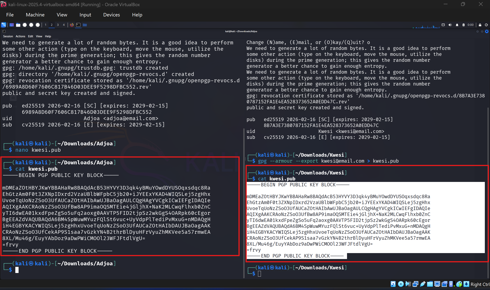

For Adjoa to have a copy of Kwesi's public key, I'll import
**kwesi.pub** into **gpg** from Adjoa's folder. (The folders are serving
as two separate computers in this case)

Moving on, I'll create a message which Adjoa intends sending to Kwesi.

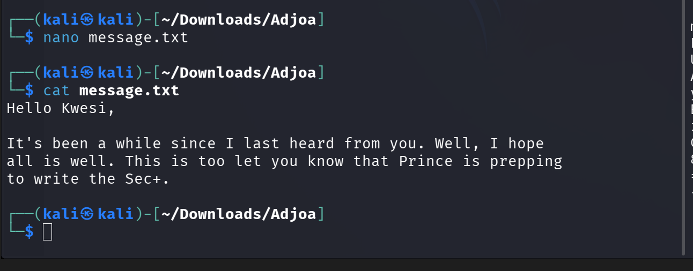

I will then use gpg to encrypt the message. Below shows the PGP
encrypted message. The only person who can decrypt that message is
anyone with Kwesi's private key.

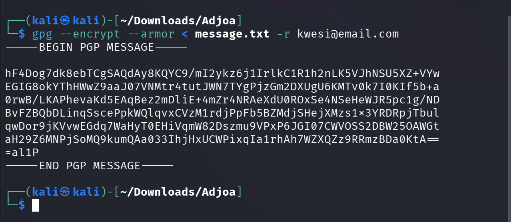

I then highlighted the encrypted message, copied it, created message.txt
file in Kwesi's directory (to simulate he has received the messasge)
awaiting decryption.

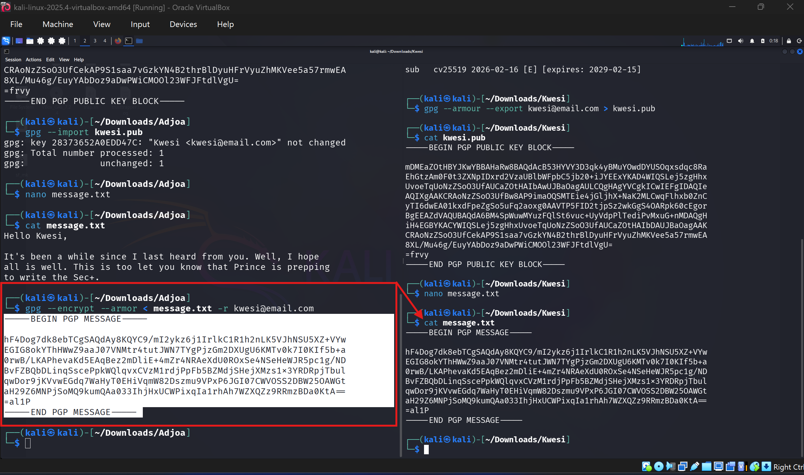

Using gpg, I was asked to provide the initial passphrase associated with
Kwesi's private key used when creating the key pairs.

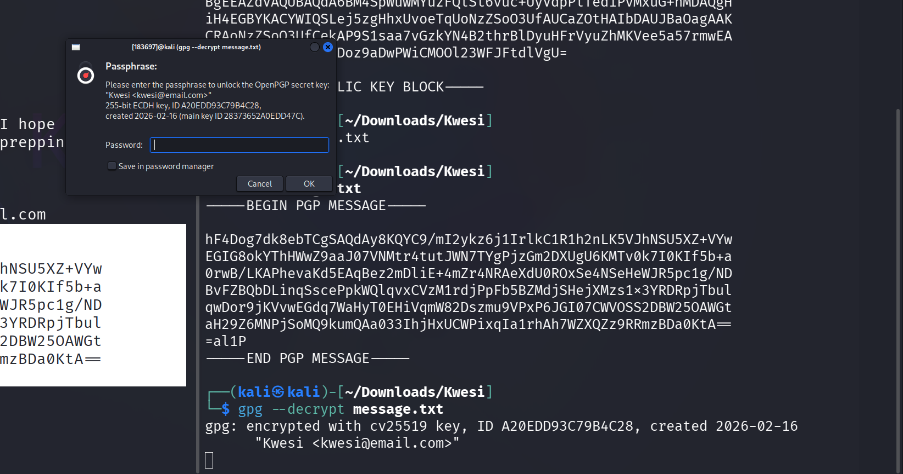

I entered a wrong passphrase at first and yeah, the message was not
decrypted. I then entered the correct passphrase and there you go... the
message was decrypted successfully. That's how two users can exchange
secure messages using the **gpg package.**

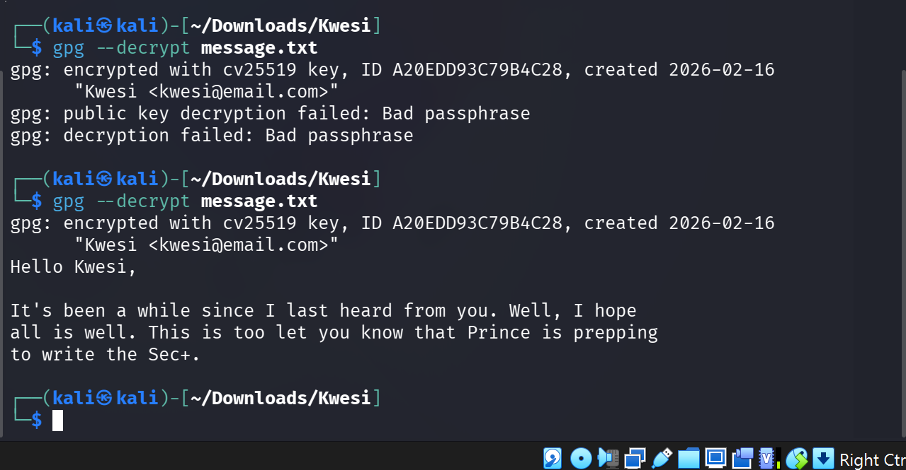
