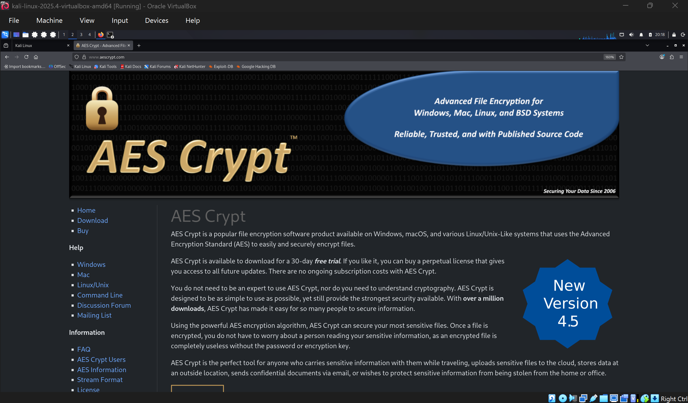
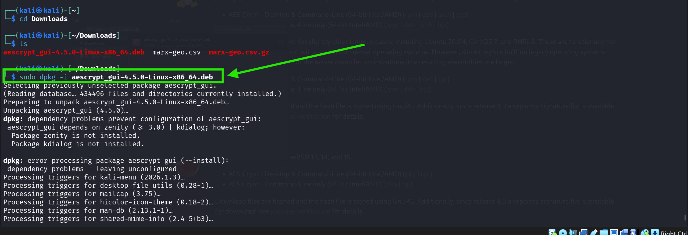
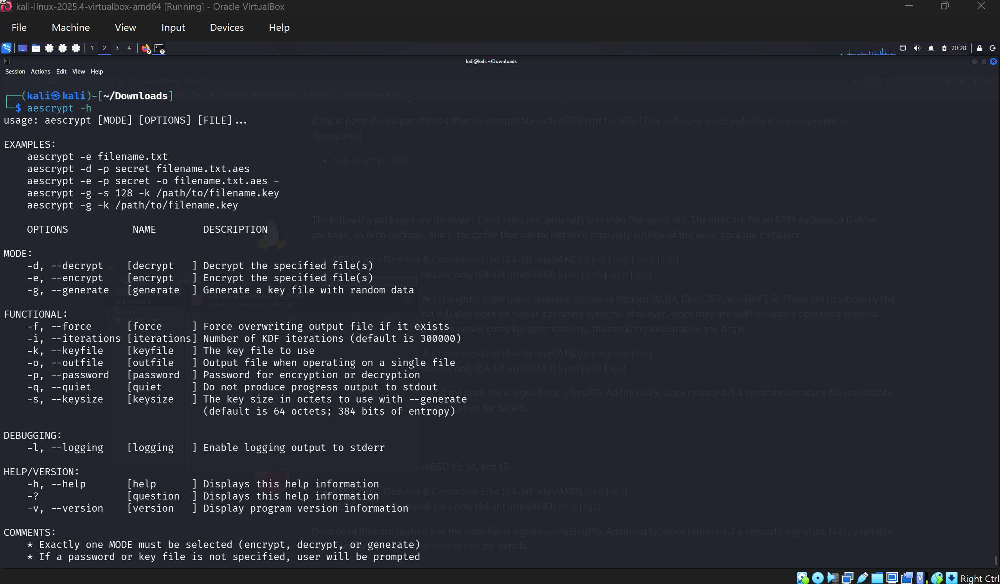
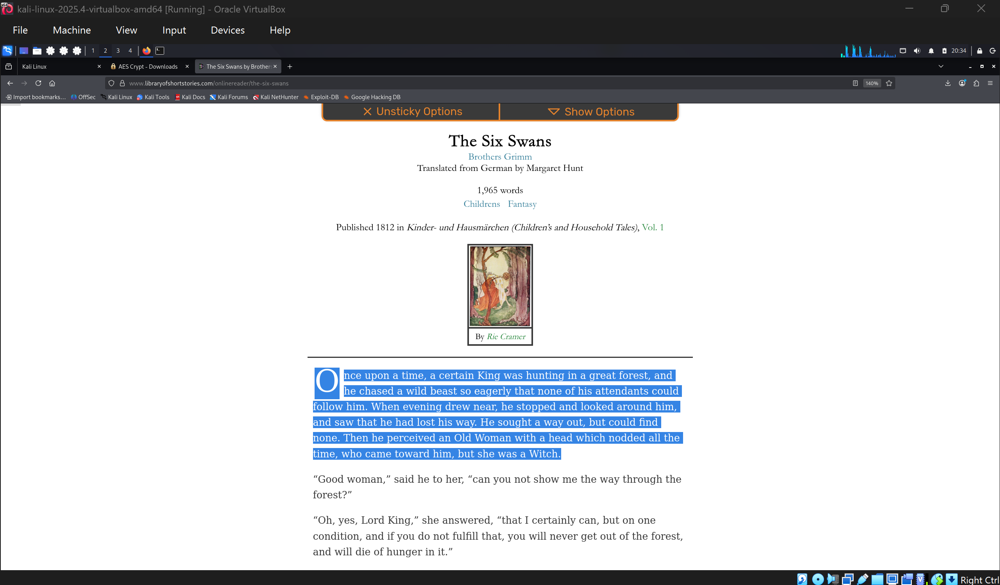
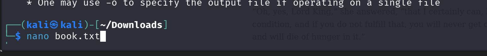
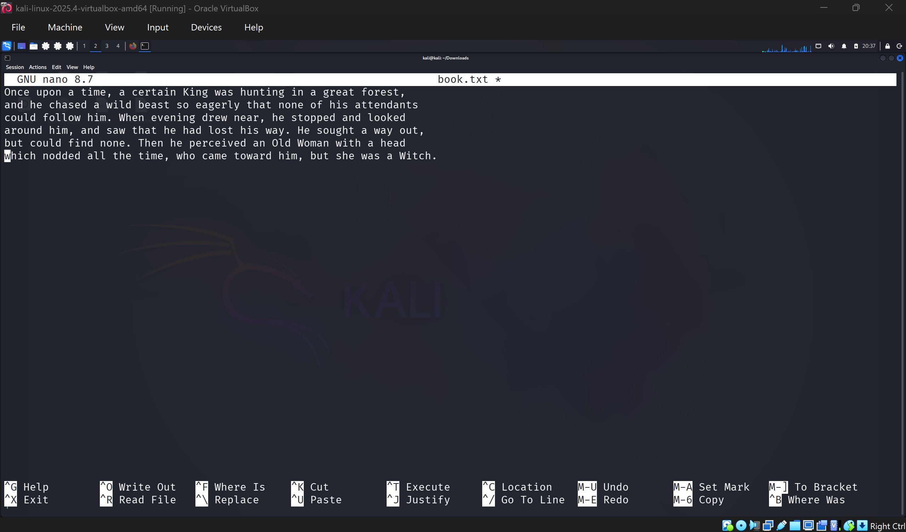
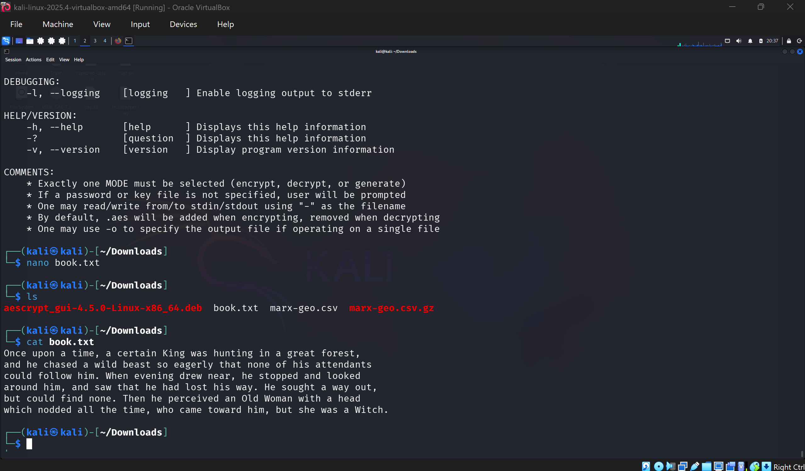
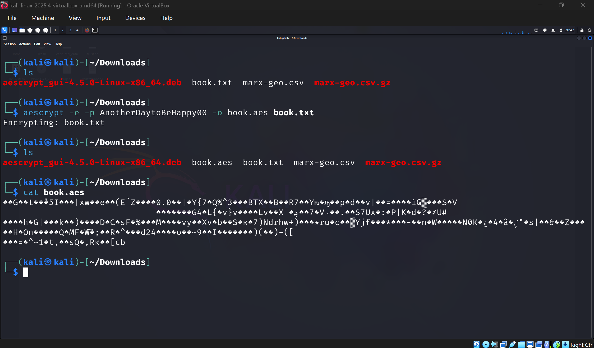
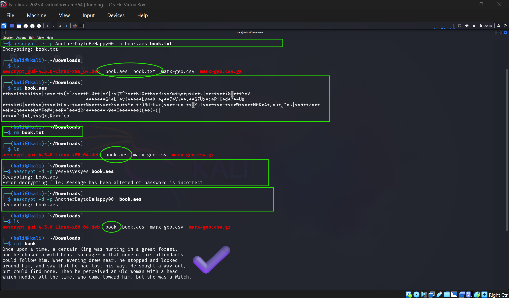

# EXPLORING MODERN SYMMETRIC ENCRYPTION ALGORITHMS
## THE ADVANCED ENCRYPTION ALGORITHM (AES), BLOWFISH AND TWOFISH

Due to the insecure nature of DES and 3DES, modern symmetric algorithms
tend to be more secure as compared to the weak algorithms. But, let's
explore. AES is an open source package available for all operating
systems.

I logged into my linux virtual machine and visited **aescrypt.com** to get
the AES Crypt package installed.

Since I used Kali Linux, I opted to download the .deb package.(The
desktop and command line package)

After downloading, I installed it with the command **sudo dpkg -i
xxxx.deb** as seen below

I used the **-h** option to read a little about how the tool works.

In order to perform some encrypton tasks, I needed to create a text file
with some content hence I visited **libraryofshortstories.com** and
copied the first paragraph of The Six Swans (only for educational
purposes)

I then created a text file (book.txt) and pasted the first paragraph
into it.

Now, I used aescrypt to encrypt the text file with the password
AnotherDaytoBeHappy00 and set book.aes as the output file after
encryption. I cat the encrypted file to confirm its content was
gibberish.

After successful encryption, it was time to decrypt. Asseen in the
screenshot below, I tried decrypting with a wrong password and it
returned an error. It was only successful when I used the correct
password (same encryption key)

## Key Facts About AES

-   Symmetric Encryption Algorithm

-   Block cypher operating on 128-bit blocks

-   Key length of 128, 192 or 256 bits

-   Considered secure.

-   Uses substitution and transposition (SPN)

## Key Facts About Blowfish

-   Symmetric encryption algorithm

-   Block cypher operating on 64-bit blocks

-   Key length within 32 to 448 bits

-   Public domain algorithm

-   Designed as a replacement for DES

-   Uses a feistel network

-   NOT SECURE

## Key Facts About Twofish

-   Public domain algorithm

-   Relies on a feistel network for secrecy

-   Symmetric encryption algorithm

-   Works on blocks of 128-bits

-   Key length of 128, 192 or 256 bits

-   Secure for use today
