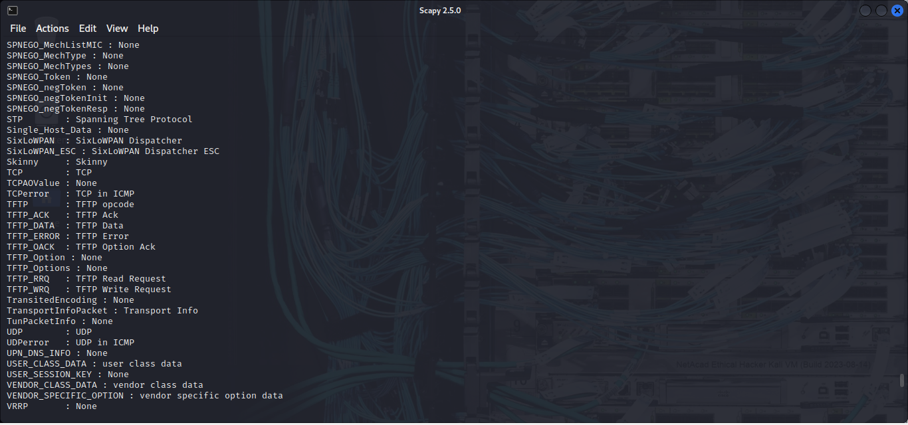

# Lab Report: Exploring Network Security Through Packet Crafting and Analysis with Scapy 

## Objectives
---

I will use Scapy, a Python-based packet manipulation tool, to craft
custom packets. These custom packets will be used to perform
reconnaissance on a target system.

- Part 1: Investigate the Scapy Tool.

- Part 2: Use Scapy to Sniff Network Traffic.

- Part 3: Create and Send an ICMP Packet.

- Part 4: Create and Send TCP SYN Packets.

## Background
---

Penetration testers and ethical hackers often use specially-crafted
packets to discover and/or exploit vulnerabilities in clients'
infrastructure and systems. I have used Nmap to scan and analyze
vulnerabilities but in this lab, I will perform further reconnaissance
using custom ICMP and TCP packets.

## Resources
---

-   Kali VM customized for Cisco Ethical Hacker course

-   Internet Access via Firefox Browser

-   Tools used: Scapy

## Methodology
---

### Part 1: Investigating the Scapy Tool
----------------------------

-   I started the Kali VM

-   Via firefox browser, I accessed
    <https://scapy.readthedocs.io/en/latest/introduction.html> to read the
    introduction page written by the Scapy creator, **Philippe Biondi**.

-   After, I opened the manual page for Scapy to read about its usage.

-   To use Scapy in interactive command mode, I entered the **scapy**
    command in a terminal window to load the Python interpreter.

-   At the \>\>\> prompt within the Scapy shell, I entered the **ls()**
    function to list all of the available default formats and protocols
    included with the tool. I scrolled to view the available TFTP packet
    formats.

-   The syntax to use a function in Scapy is
    ***function\_name(arguments).*** I then used the ls() function to
    list the available fields in an IP packet header.

-   I compared the fields in the IP detail on Scapy with the packet header shown below.

### Part 2: Using Scapy to Sniff Network Traffic
------------------------------------

-   Using the sniff() function, I collected traffic using the default
    eth0 interface of my VM. Note, I experienced some errors since I
    wasn't using super user privilages so I quickly exited scapy and
    switched to root user using sudo su before proceeding.

-   I opened a second terminal window and **pinged** <https://www.cisco.com>

-   I returned to the terminal window that was running the Scapy tool to
    stop the capture using CTRL + C

-   I then assigned the output of the sniff() function to the variable
    "a" and viewed the captured traffic using the **summary()**
    function.

-   I opened a new terminal window and used the **ifconfig** command to
    determine the name of the interface that is assigned the IP address
    **10.6.6.1**.

-   I returned to the terminal window that was running the Scapy tool. I
    used the syntax sniff(iface=\"interface name\") to begin the capture
    on the br-internal virtual interface.

-   I opened Firefox and navigated to the URL **http://10.6.6.23/**.
    When the Gravemind home page opened, I returned to the terminal
    window running the Scapy tool to stop the cature using CTRL + C.

-   As I did ealier, I assigned the output to the variable "a" and
    viewed the capture.

-   In limiting the collected packets, I used interface ID associated
    with 10.6.6.1 (br-internal) to capture ten ICMP packets sent and
    received on the internal virtual network. The syntax is
    **sniff(iface=\"***interface name***\", filter = "***protocol***\",
    count =** *integer***)**.

-   I opened a second terminal window and pinged the host at 10.6.6.23.

-   I then viewed the captured traffic with line numbers as seen in the
    command below

-   To view details about a specific packet in the series, I refered to
    the blue line number of the packet without including the leading
    zeros.

-   From the output, I examined the source (src) and destination (dst)
    addresses as well as the raw data (load=) portion of the collected
    packet.

-   Using the syntax **wrpcap("***filename*.*pcap*\", *variable
    name***),** I saved the capture to a pcap file which can be opened
    in wireshark.

-   I used a different terminal window to verify the location of the
    **capture1.pcap** file using the Linux **ls** command.

-   I then opened the capture in wireshark to view the file contents,

### Part 3: Creating and Sending an ICMP Packet.
------------------------------------

-   To see a list of the message types that can be sent and received
    using ICMP, I navigated to <https://www.iana.org/assignments/icmp-parameters/icmp-parameters.xhtml>

-   In a new Scapy terminal window, I entered the command to sniff
    traffic from the interface connected to the 10.6.6.0/24 network.

-   I opened another terminal window, entered **sudo su** to perform
    packet crafting as root. Started a second instance of Scapy and
    entered the **send()** function to send a packet to 10.6.6.23 with a
    modified ICMP payload.

-   I then returned to the first terminal window to stop the capture
    using CTRL + C.

-   I entered the summary command to display the summary with packet
    numbers.

-   In continuation, I used the packet numbers to view the individual
    ICMP Echo-request and Echo-reply packets in comparison with those
    packets examined earlier.

### Part 4: Creating and Sending a TCP SYN Packet.
--------------------------------------

-   I started a new packet capture with Scapy to the same internal
    interface.

-   I navigated to the second terminal window, created and sent a TCP
    SYN packet using the command shown below. After, I stopped the
    capture on the first terminal using CTRL + C

-   I viewed the captured TCP packets using the **nsummary()** function.

-   For the details of the packet returened from the target, I used the
    command below specifying the line number

## Results
---

Scapy is a multi-purpose tool originally written by Philippe Biondi. In
this part, I will load the Scapy tool and explore some of its
capabilities. Tools like Scapy should only be used to scan or
communicate with machines that personally owned or have written
permission to access.

-   On the Scapy website, the author described the capabilities of Scapy
    in the first paragraph of the page as "**Scapy is a Python program
    that enables the user to send, sniff, dissect and forge network
    packets. This capability allows construction of tools that can
    probe, scan or attack networks.**"

-   The manual page for Scapy showed some useful commands as shown
    below..

-   By using Scapy command, the interpreter runs pre-loaded with the
    Scapy classes and objects. The interactive Python interpreter loaded
    and presented a screen shown below

-   The **ls()** command showed a list of supported protocol layers.
    This includes what is seen in the screenshot below. TFTP is a
    protocol used to send and receive files on a LAN segment. It is
    commonly used to back up configuration files on networking
    devices.There were 9 TFTP packet formats available.

-   The ls(IP) function returned fields shown below

-   In comparing the IP detail on above with the packet header seen in
    the methodology,I observed some differences. The **DiffServ (DS)**
    field is identified as **TOS (Type of Service)** and there is an
    **Options** field added.

-   **The source IPv4 address (src)** field would change to create a
    packet that would generate a reply to a target machine, rather than
    the machine that actually sent the packet.

-   Scapy can be used to capture and display network traffic, similar to
    a tcpdump or tshark packet collection.

-   While sniffing and pinging, I took screenshot as shown below

-   After stopping the capture, the output below was shown

-   The underscore ( \_ ) in Python is used to temporarily hold the
    output of the last function executed for which reason it was
    assigned to the variable "a" as shown in the methodology. The output
    of the summary is shown below. Note that not all is shown.

-   **10.6.6.1** is the default gateway address for one of the virtual
    networks running inside my Kali. I noted the name of interface as
    br-internal.

-   When the gravemind page opened, I stopped the cature as shown below

-   I then viewed the capture as I did earlier.

-   After filtering the packets to be sniffed, the screenshot below
    shows the pings sent to 10.6.6.23 and the cature stopping by itself
    since the count of 10 was specified.

-   The summary, as seen below, contained only 10 lines because it was
    specified in the capture count which was set to 10. A series of five
    ICMP echo requests and five ICMP echo replies.

-   The detail output shows the layers of information about the protocol
    data units (PDUs) that make up the packet. The protocol layer names
    appear in red in the output. The output of a\[5\] in attempting to
    view the packet on line number 5 is shown below

-   The first set of source and destination fields are the hexadecimal
    data link layer MAC addresses of source and Ethernet adapters. The
    second set are the network layer IP source and destination addresses
    of the packet.

-   The **wrpcap()** function saves the captured data to a pcap file
    which will be written to the default user directory. In my case,
    since I saved it as capture1.pcap, there you go below..

-   In wireshark, the capture appears as seen below. Very comprehensive!

-   ICMP is a protocol designed to send control messages between network
    devices for various purposes. There are many types of ICMP packets,
    with echo-request and echo-reply the most familiar to IT
    technicians.

-   Via the IANA site, I observed other types of icmp messages which
    could be sent and received.

-   After crafting and sending an ICMP packet to 10.6.6.23, below
    represents the two opened terminals. I sniffed the traffic on the
    left side and sent the packet on the right side.

-   The output of the capture showed Echo-request, Echo-reply, ARP, and
    ARP reply messages.

-   After using the packet number 2 to view the individiual packet, I
    observed that the raw data portion had changed to \"This is Lassey's
    test\" as shown below

-   I moved on to using Scapy to determine if port 445, a Microsoft
    Windows drive share port, was open on the target system at
    10.6.6.23.

This command shown in the methodology section sent an IP packet to the
host with IP address 10.6.6.23. The packet was addressed to TCP port 445
and has the S (SYN) flag set.

-   The detail of the TCP packet that was returned from the target
    computer at 10.6.6.23 is shown below

-   The SA flag stands for SYN-ACK. It means that the port 445 is open
    on the target computer, because it acknowledged the SYN packet.

## Mitigation 
---

1.  Ingress and Egress Filtering. Block "impossible" source IPs
    (private, loopback, broadcast or reserved ranges) at the network's
    edge. Also prevent your internal devices from being a launchpad for
    spoofing, thus sending traffic with source IPs out to the internet.
    This stops attackers from injecting spoofed traffic into or out of
    your network.

2.  Enable Reverse Path Forwarding (uRPF) on routers. It checks if the
    source IP of a packet matches a valid return path; if not, the
    packet is dropped.

3.  Strict Firewall rules. Apply ACLs to only allow trusted IP ranges.
    This reduces the chance of spoofed packets passing through.

4.  Rate Limiting. Configure routers, firewalls and servers to limit the
    number of connection requests allowed per second. This prevents a
    single attacker from overwhelming a system.

5.  Redundancy and Load balancing. Spred traffic across multiple servers
    or network paths so that if one system is hit with a DOS, others can
    keep services available.

6.  Implement network segmentation to limit rennaissance attempts.
    Separate sensitive systems from the public-facing network using
    VLANS or firewalls. Even if an attacker scans one segment, they
    can't see everything.

## Reflection 
---

In terms of passive reconnaissance on a target, Sending SYN packets and
receiving a SYN-ACK in response indicates that the service is
operational, and the port is in listening mode. Crafting packets for
different TCP ports will indicate which ports are active. In fact,
creating an ICMP echo-request packet with a spoofed source address can
create a denial of service attack on a target host. Sending thousands of
packets to different hosts with same spoofed source address will cause
all of the echo-reply packets from the different hosts to be sent to the
target host. This will result in a distributed denial of service attack.
So in practical terms, that's what happens when there's a DDOS attack on
a server. In researching for the mitigation steps to take, I came across
BCP 38 (Best Current Practice 38) and read further to understand the key
tactic employed to guard against DDOS.
