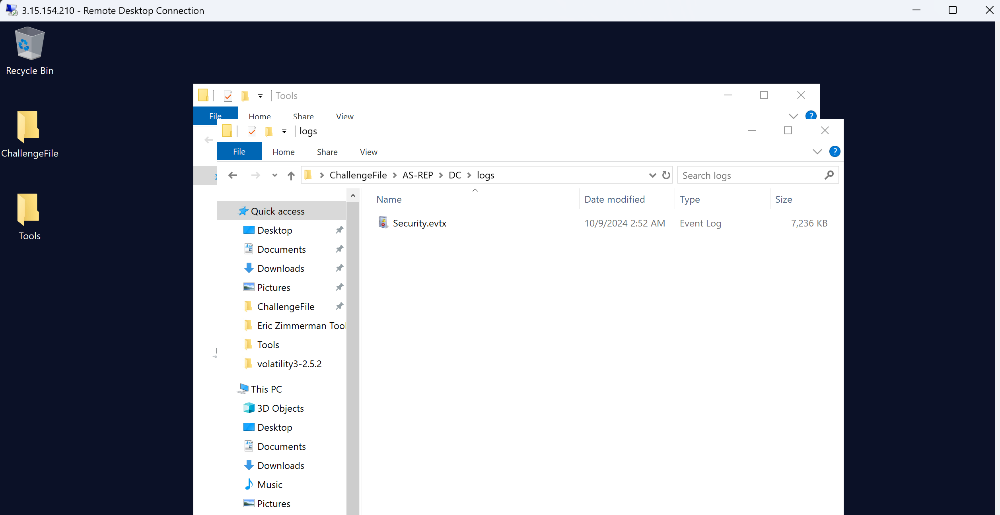
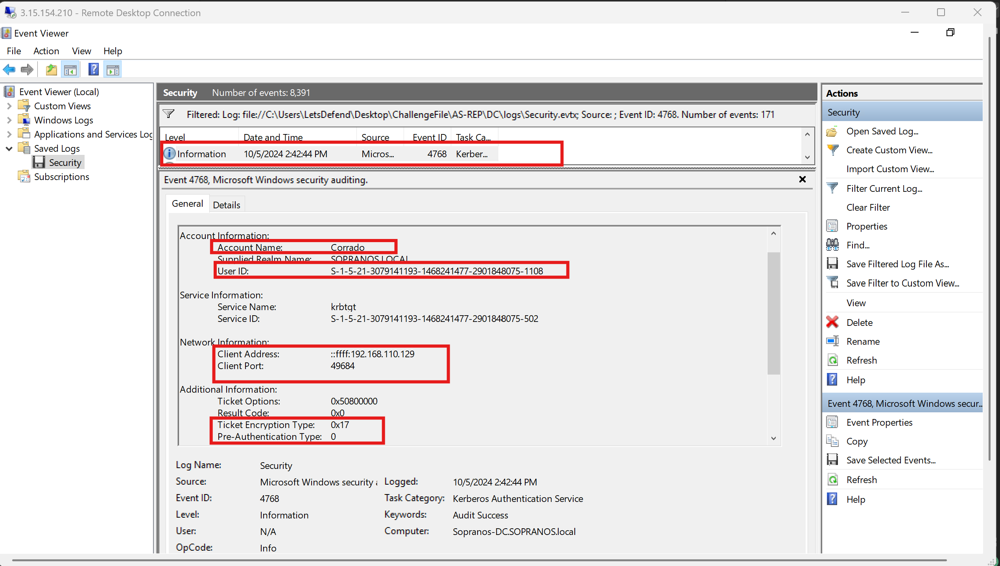
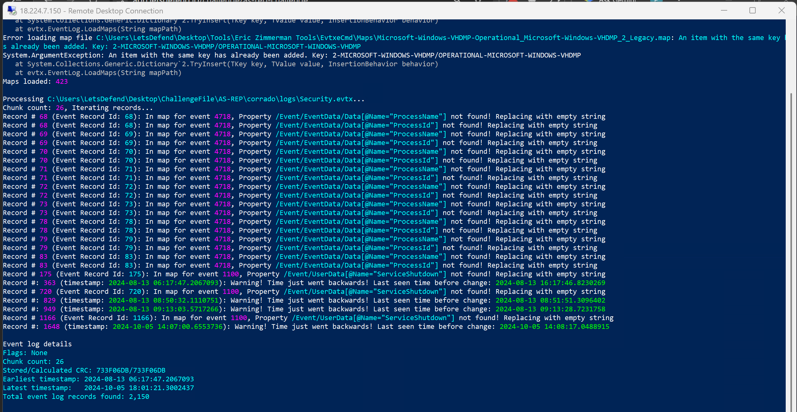
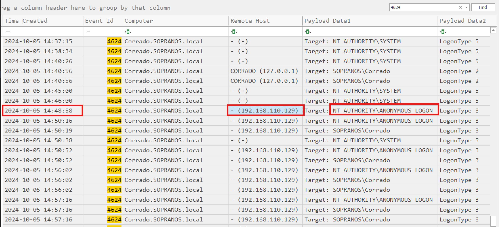
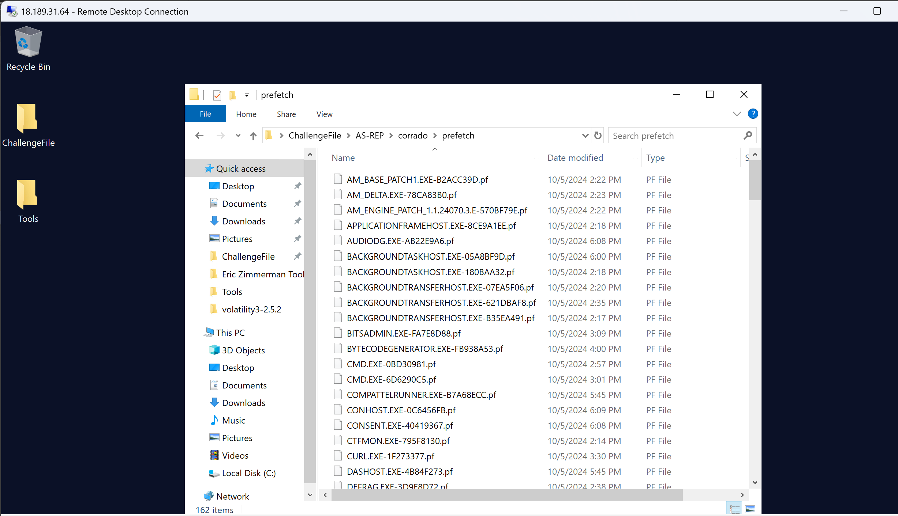
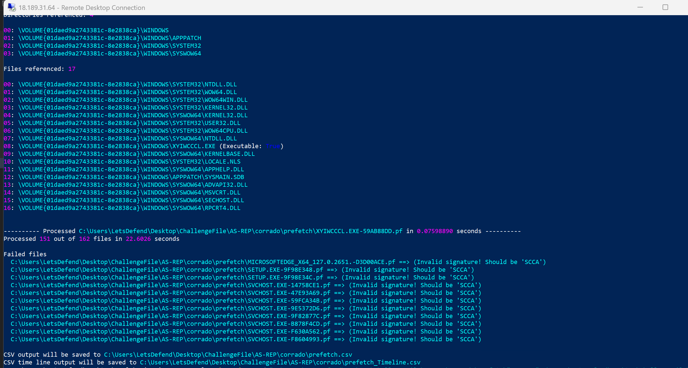
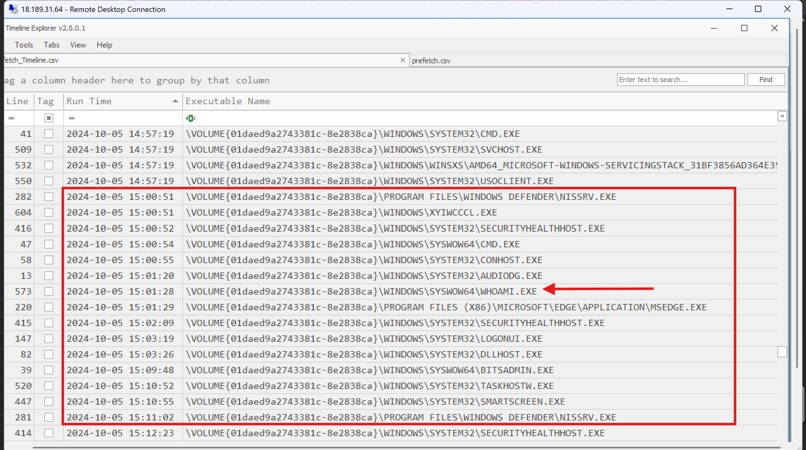
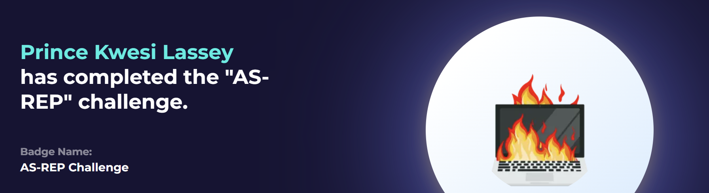

# LetsDefend AS-REP Challenge 


## Scenario
A network security team received alerts from a Domain Controller (DC) indicating that a user was 
making unusual requests for Kerberos tickets, which is not typical for their role. Given that this 
behavior aligns with potential reconnaissance or lateral movement within the network, the security 
team escalated the issue to a senior investigator. The investigator has been tasked with analyzing the 
provided DC and workstation logs to trace the attacker's movements, I am to determine the source of the 
anomaly, and understand how the attacker gained access and what actions they might have taken inside 
the network.

I start this challenge by RDPing into the instance so I can work faster and then also extracted the security 
log file for this challenge.



---

## Questions

### While reviewing the logs, Janice identified suspicious Kerberos ticket requests, potentially indicating an AS-REP attack. What is the exact time this attack occurred?

T detect an AS-REP attack, what I will look out for is the event id 4768 for 
TGT request then the encryption type and the pre-auth type together.

Legitimately, the encryption type and the pre-auth type must be 0x12 and not 0 respectively.

If the pre-auth type is 0, then it means pre-authentication was not performed hence giving way for 
the attack to accur.



I found a Kerberos authentication ticket (TGT) was requested for the account name Corrado on 10/5/2024 2:42:44 PM 
with Ticket Encryption Type: 0x17, Pre-Authentication Type:	0 .. a strong indicator of AS-REP attack.

Now, looking at the answer format, I had to restructure the time as reqired and eventually change the time
to 24hr format.. 2pm becoming 14

Ans: 2024-10-05 14:42:44

---

### What user account did the attacker target during this Kerberos attack?

For this, it's the same account name I found earlier on

Ans: Corrado

---

### What is the SID associated with the targeted user account?

Same way.. this information is derived from the event identified in the previous question. But note that
the answer needed is the value in the User ID field of the event and not the Service ID.

Ans: S-1-5-21-3079141193-1468241477-2901848075-1108

---

### What encryption algorithm was used in this Kerberos ticket request?

rc4 because an AS-REP roasted request shows `0x17` (RC4) which is legacy as compared to the AES-256 algorithm
used in modern servers as default.

Ans: rc4

---

### What is the IP and port number that was used to request the ticket?

This was also observed in the event log found from the first question.

Ans: 192.168.110.129:49684

---

### The attacker managed to crack the hash and used it to log into the compromised machine. When was their first logon attempt?

At this point, it felt like I was stuck.. I was still analyzing the DC logs. So if the attacker managed to
log into the compromised machine which is 192.168.110.129, then proobably.. I should
check the security log file for corrado. 

But it felt like using the event viewer was a bit stressful when there was a couple of tools available
to make my work easier. I chose to use EvtxECmd to parse the Security log so I can 
use timeline explorer to open the resulting csv file.. just as I did during the memory analysis course

```powershell
.\EvtxECmd.exe -f C:\Users\LetsDefend\Desktop\ChallengeFile\AS-REP\corrado\logs\Security.evtx  --csv C:\Users\LetsDefend\Desktop\ChallengeFile\AS-REP\corrado\logs --csvf corrado.csv
```


I then filtered for the event id 4624 and scrolled to the timestamp around 2024-10-05 14:42:44 when the
suspicious kerberos ticket was requested. So basically, if there was to be a login event, it should be after 
14:42 on that same day.

I submitted a couple of timestamps around that period but was not the right answer. However, I noticed
one event with the remote host `192.168.110.129` and a logon typ 3. This event was an anonymous login eevent
tho so I wondered if the attacker managed to crack the hash and log into the compromised machine with it,
why login anonymously? Ah well.. if you are solving this challenge as well, you can leave your thoughts in the comments
if you are reading this writeup from my `medium`



Ans: 2024-10-05 14:48:58

---

### Once inside, the attacker began exploring the system. What was the first command they executed?

The hint said: Prefetch files should reveal the executed commands.

Now, to parse Windows Prefetch files which will help us investigate execution artifacts like 
the command executed, we need specialized forensic tools.. which LetsDefend have them lines up in a 
single directory lol. 

Because Windows Prefetch files (.pf located in C:\Windows\Prefetch) are stored in a proprietary 
compressed format (MAM compression), standard text viewers or logs will display them as 
unreadable binary data.



For this reason, I will be using one of Eric's tools.. PECmd. PECmd (Prefetch Explorer Command Line) 
is the industry standard for command-line parsing of prefetch artifacts. It can carve out 
the exact execution timestamps, run counts, and associated file handles.

Lets go terminal-wise now.. since the prefetch files are located in a folder, I'll parse the folder using the
command:

```powershell
.\PECmd.exe -d "C:\Users\LetsDefend\Desktop\ChallengeFile\AS-REP\corrado\prefetch" --csv "C:\Users\LetsDefend\Desktop\ChallengeFile\AS-REP\corrado\" --csvf prefetch.csv
```
The command above produces a two csv files which I will then open in Timeline Explorer.



Note that the csv file of importance is the one with timeline within the filename. In timeline explorer,
I scrolled down to the timerange around 2:48pm. I mean after that time would be what wwe are interested in.

Looking at the executable name column, whoami.exe felt like the odd one out around a couple of executables.
We know what whoami does right?? Uhuh, so the attacker's first command executed.



Ans: whoami

---

### When did the attacker execute this command exactly?

Looking at the screenshot in the previuous question around the commad the attacker executed, we can
also see the exact timestamp of that event.

Ans: 2024-10-05 15:01:28

