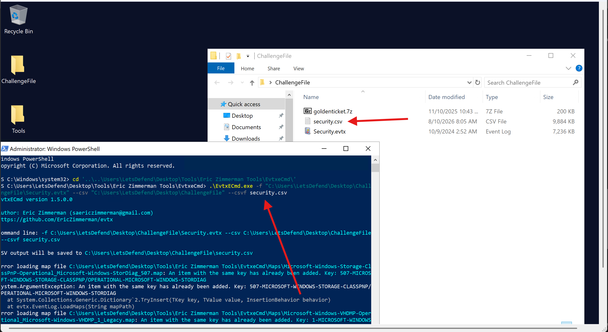
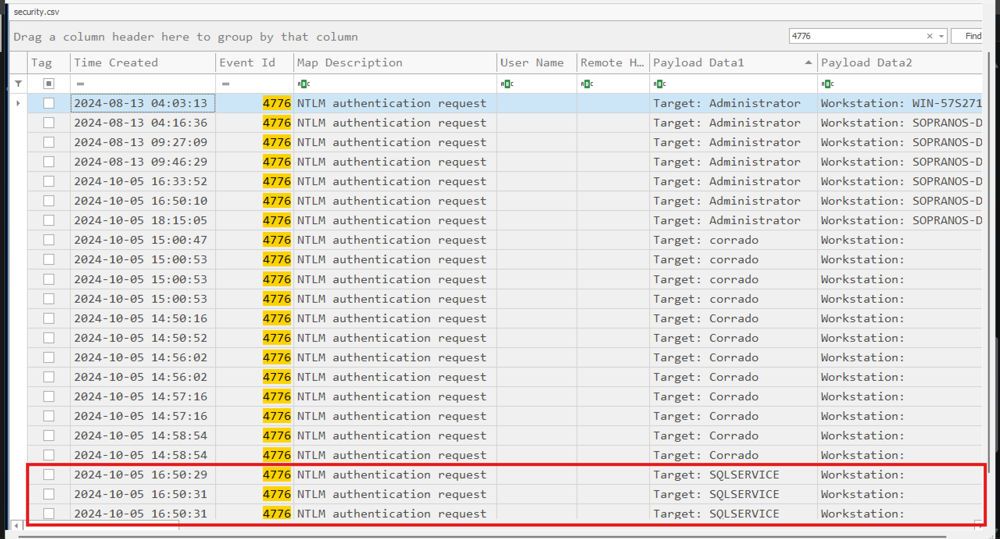
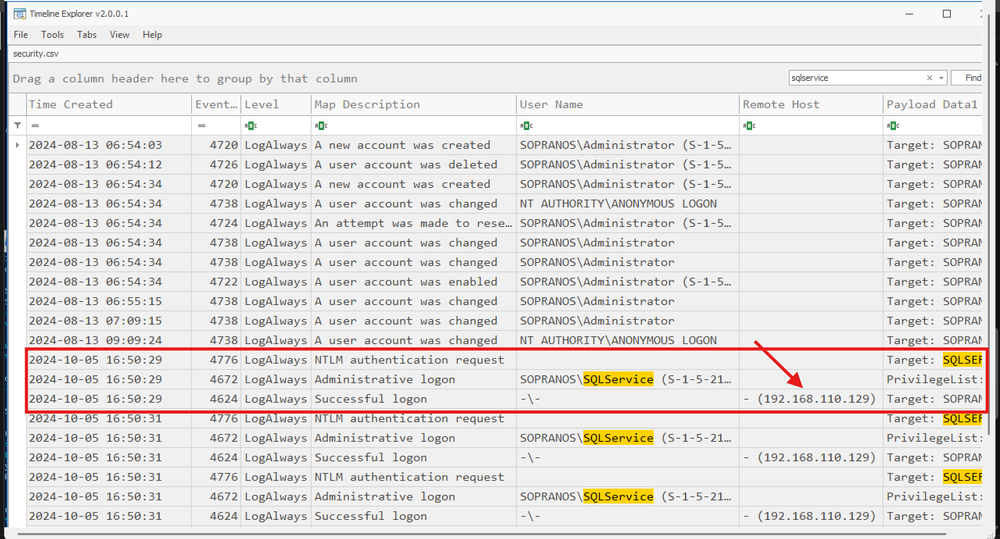
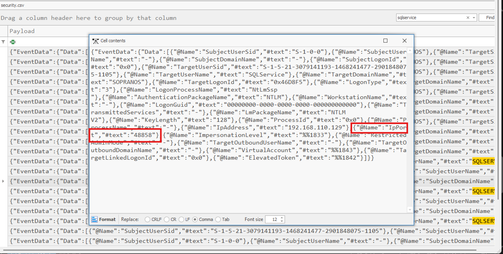
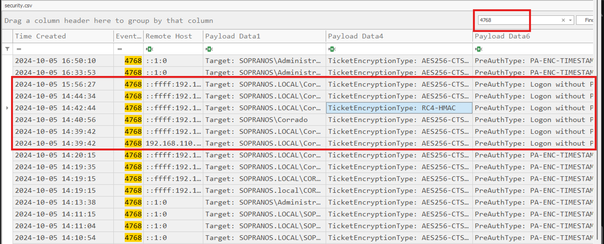
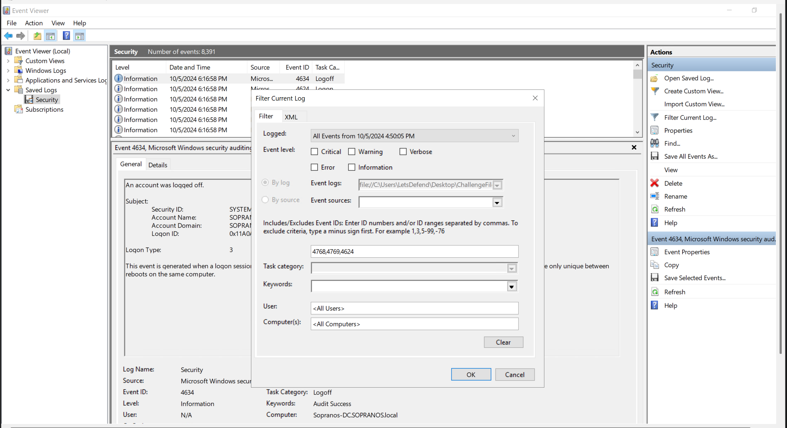
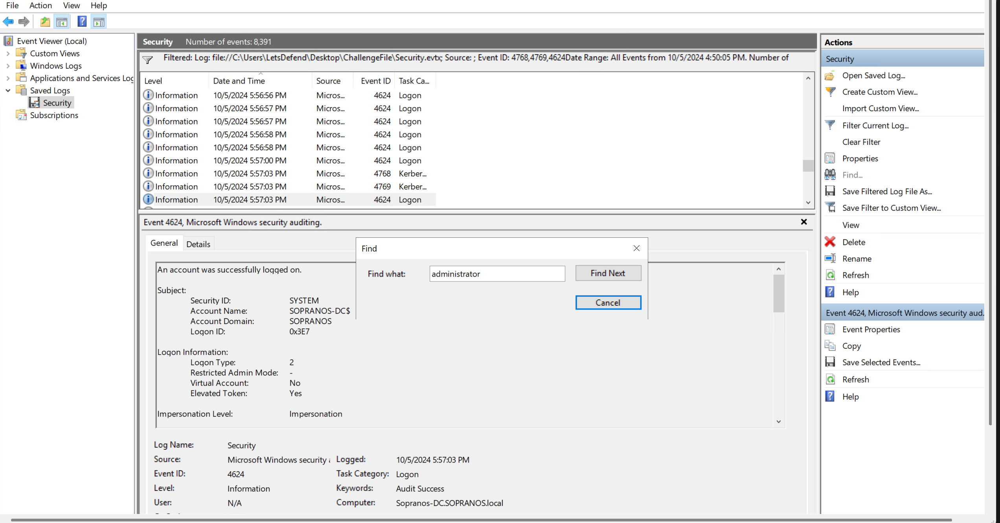
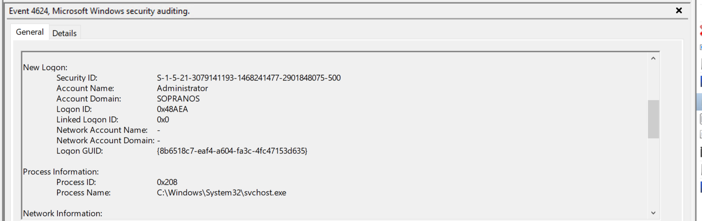

# LetsDefend Challenge: Golden Ticket

## Scenario
An alert has been triggered within a network, indicating a possible attack on the Domain Controller (DC). The security team has detected suspicious activity suggesting lateral movement attempts from a compromised workstation to the DC. The attacker, identified as having infiltrated the network, appears to be targeting sensitive systems. 

So basically.. I am tasked with analyzing network traffic, reviewing event logs, and identifying how the attacker is navigating through the environment. The goal is to trace the attacker's steps, determine their access point, and prevent further escalation to the Domain Controller.

## Methodology

Let's begin with our investigation..

**When did the attacker first access the service account within the Domain Controller environment?**

First of all, I am going to parse the Windows Security logs given to us with one of Eric's tools so we can easily and effectively analyze this incident.

After parsing the logs, I removed columns not needed so we can focus on only the ones needed.

I then filtered for event id 4776 which will be very much useful in our investigation since that tells us when the DC tries to validate credentials for a specific account.

As seen above, the first service account that the DC tried to validate credentials for was the `SQLService` at around `2024-10-05 16:50:29`

Next is to find successful login events (Event ID 4624) to the service account around the tme of NTLM authentication request. I filtred for `SQLservice`

As you can see from the results above, the Event IDs followed each other.. making complete sense: after the NTLM authentication request seen earlier at `2024-10-05 16:50:29` with Event ID 4776, this was followed by an Administrative logon event at the same time with Event ID 4672 and then a successful login event of event code 4624 at `2024-10-05 16:50:29` thus the same time.. with logon type 3 and the remote ip: `192.168.110.129`

So basically, that even answers the second and third questions of this challenge:

- The compromised service account
- The IP address and port

But since the port was not seen in the earlier screenshot, I will scroll to the payload column to inspect the port used.

**Before that the same attacker tried to perform an AS-REP attack. What user account did the attacker target during this Kerberos attack?**

Now since we shift our focus to AS-REP, thus the attack that lives on exploiting accounts that do not have preauth set.

To detect an AS-REP attack, what I will look out for is the event id **4768** for 
TGT request then the encryption type and the pre-auth type together.

Legitimately, the encryption type and the pre-auth type must be 0x12 and not 0 respectively.

If the pre-auth type is 0, then it means pre-authentication was not performed hence giving way for 
the attack to accur.

I think using Event viewer for this would have been way more easier but still, having parsed the logs.. I can filter it in Timeline explorer in two ways:
- Event ID 4768 then scroll by looking for the remote IP of the attacker
- Filter for the encryption type **0x17** which has pre-auth type **0**

As you can see above, it's clear that the attacker targeted the user **Corrado**

**When did the attacker request that TGT ticket to perform the AS-REP attack?**

The time of TGT request is the entry with TicketEncryptionType: RC4 as seen in the previous screenshot.

**After gaining access to the Domain Controller, the attacker attempted to generate a Golden Ticket to impersonate a DC user. What was the target account?**

**At what time did the attacker try to log in using the Golden Ticket?**

Yeah the reason why you are seeing the last two questions together is because, I put tthen together. Lol, let's be for real.. finding the actual account the attacker tried to access with the forged golden ticket will definately lead us to the time at which the attacker logged into the account.

Now, what have we found so far?
- The attacker compromised the SQLservice and now has access to the DC
- Also compromised the account of Corrado via AS-REP attack
- These events occured between `2024-10-05 16:50:29` to `2024-10-05 14:42:44` respectively meaning the attacker compromised the account of Corrado via AS-REP before moving on to compromising the service account.

This means the attacker has some leverage now and will definately go in for the king of the jungle: the administrator DC account.

I will therefore focus on login events after **4:50pm** following event ID 4769.

When an attacker creates a Golden Ticket, they forge the identity packet offline.

They skip the Domain Controller's initial check (No Event 4768).

They present the forged ticket to the DC to access a machine (Generates Event 4769).

They connect to the target machine (Generates Event 4624 on that machine).By checking 4624 after a suspicious 4769, we can map out exactly what machine the attacker pivoted to and what level of privileges they actually dropped into on that local OS.

With that in mind.. let's continue our hunt :)

So as you can see above, I filtered for event ids 4768,4769,4624.

I realized many TGT service requests from the administrator account. This confirmed the fact that, that was the attacker's target.

Having realised that, I further used the `Find` action to find for thhe word administrator in the logs.

That was how come I got to the successful login event occuring at 10/5/2024 5:57:03 PM

Looking into that event, I realised the account name was Administrator

And yeah.. we solved the challenge! Do well to follow me fore more if this was informative.

Peace.

## Challenges
The only challenge I had was finding the exact time the attacker logged in using the Golden Ticket. This is why I went back to the manual analysis using Event Viewer and not the parsed logs in Timeline Explorer.

