# LetsDefend Challenge: Kerberoasting 

## Table of Contents

1. [Scenario](#scenario)
2. [Methodology](#methodology)
3. [Timeline of the Incident](#timeline-of-the-incident)
4. [MITRE ATT&CK Mapping](#mitre-attck-mapping)
5. [Reflection](#reflection)

---

## Scenario

During a routine network monitoring session, Sarah, a senior security analyst at Sopranos Enterprises, identified unusual traffic between 
several workstations and the domain controller. Closer inspection revealed a potential NTLM relay attack, which is used to move laterally 
through a network. After gaining domain administrator privileges via Kerberoasting, the attacker left traces that Sarah and her team must now 
analyze. They must determine the extent of the compromise, identify backdoors, and confirm that no additional privileged accounts were affected.


---

## Methodology

So before starting off with the challenge, with my knowledge of how Kerbroasting works, I note these down:
- Kerberoasting allows an attacker to request a service ticket for any service with a registered SPN then use that ticket to crack the service password. If the service has a registered SPN then, it may be Kerberoastable if its password is not strong, if it is trackable as well as the privileges of the cracked service account.
- Will need to look out for Event ID 4768 with encryption type "0x17". (Kerberos Auth)
- Then lookout for the event 4768 immediately followed by Event ID 4769 also with encryption type "0x17". (Kerberos Service Ticket Request)
- The account name requesting the service ticket is a domain user account and not a service account or computer account (starting with $).
- Then I will filter for Audit success keywords in event 4769 (Meaning the attacker got the hash).
- Will also look at the possibility of repeated attempts since in some cases, many requests for service tickets in a short period of time.

Let's begin by looking at the questions we're presented with:

**Kerberoasting activity occurred within a specific timeframe. What is the exact date and time of the attack?**

To make my work a lot more easier, I parsed the DC logs contained in:
`C:\Users\LetsDefend\Desktop\ChallengeFile\C\Windows\System32\winevt\Logs\Security.evtx` .. note that it is not the logs in `C:\Users\LetsDefend\Desktop\ChallengeFile\TonyLogs` as those are the logs
from the supposed affected host.

I used the command:
```powershell
.\EvtxECmd.exe -f C:\Users\LetsDefend\Desktop\ChallengeFile\C\Windows\System32\winevt\Logs\Security.evtx --csv C:\Users\LetsDefend\Desktop\ChallengeFile\ --csvf security_1.csv
```

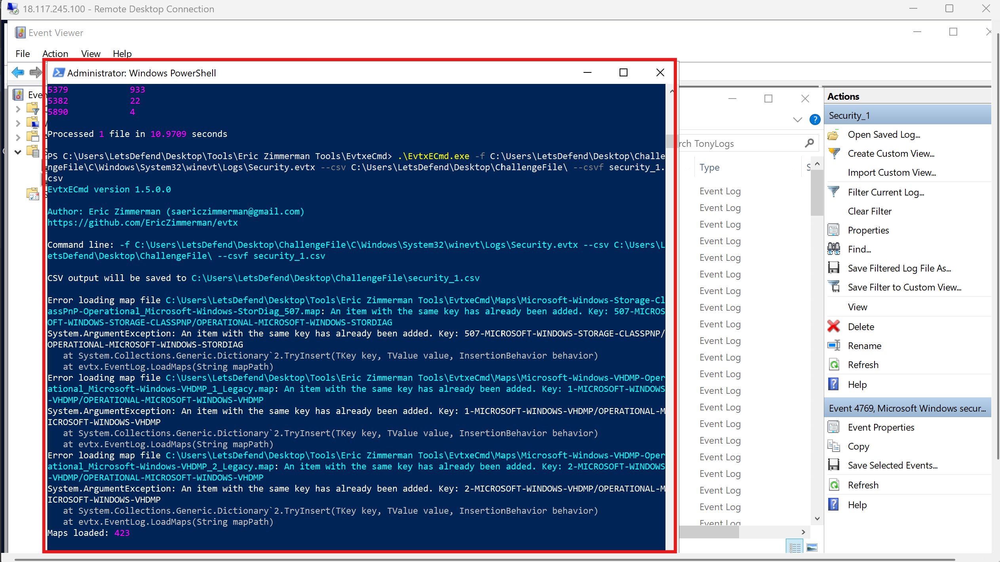

After parsing, I opened the csv file in timeline explorer and filtered for 0x17.. lol smart move since I know that the RC4 encryption type is
one thing to look out for in huning AS-rep and kerbroasting attacks.

I then checked the event ids: 4768 followed by 4769 with their map descriptions: Kerberos Authentication Ticket Request and Kerberos Service Ticket
Request.

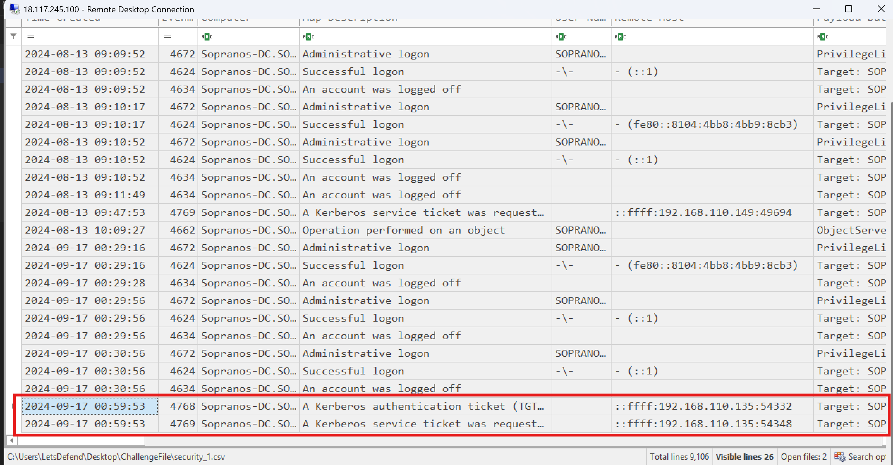

Basically, the screenshot above shows the kerbroasting activity we're looking for.. a good starting point for the time being. And also.. that's the
timeframe for the kerbroasting activity.

However, to confirm that was really what we were looking for, I dragged the horizontal scroll wheel to observe the payload data which 
showed the ticket encryption type to be RC4.. as seen in the screenshot below..

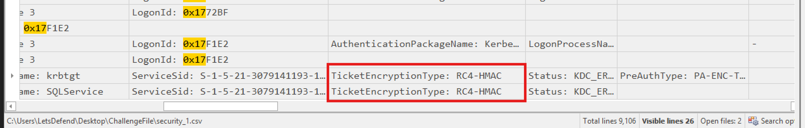

**What service name did the attacker target during the Kerberoasting attempt?**

So within Timeline Explorer, I just dragged the horizontal scroll wheel back since I saw the service name.. like literally lol when I initially saw the
two events.

Within the Payload Data 2 column were both service names for the TGT and the Service Ticket. You could see from the screenshot below that.. the attacker
requested for or .. let me put it this way: targeted the **SQLService** for this attack.

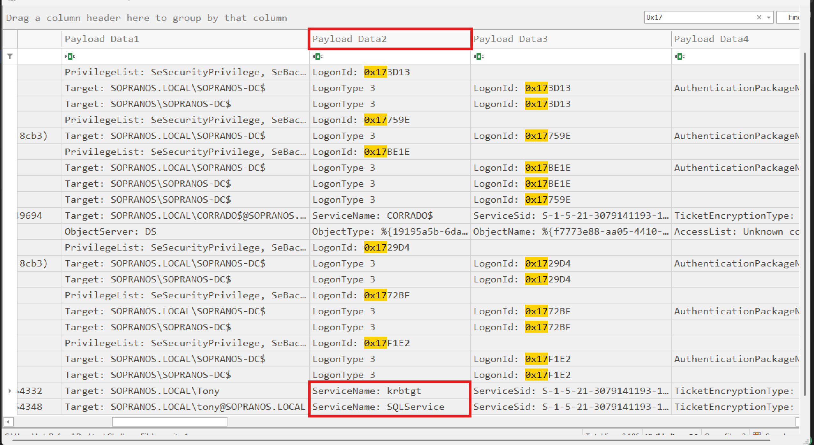

**Sarah notices that the attacker requested a Kerberos service ticket. Which account was used to make this request?**

From the payload data 1 column, we see the target account to be tony of SOPRANOS.local

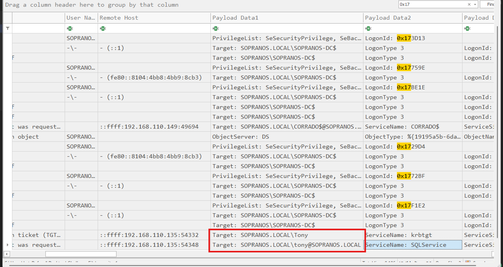

**While investigating further, Sarah identifies the IP address and port of the login session during the attack. What are the source IP address and port for this login?**

That meant looking at the remote host column.. as easy as ABC lol. Just know that the answer of interest is the IP:port for the service ticket request and not the TGT.

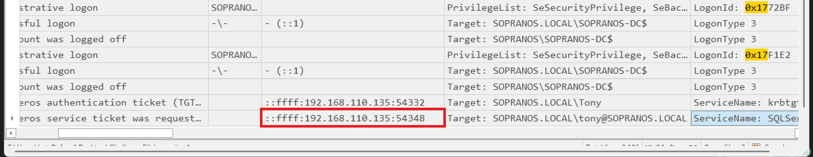

**As Sarah discovered that the attacker created a new user account for persistence. Can you determine the name of this newly created account?**

Since we know the time at which the attack occured, we can filter for for event ID 4720 still within timeline explorer. After doing that, I hid columns
that didn't matter so I can get the relevant fields to appear within the screenshots I will take. So basically, the filter presented to me several account
creation events but like I said.. we are intersted in events after **2024-09-17 00:59:53** which was the service ticket request.

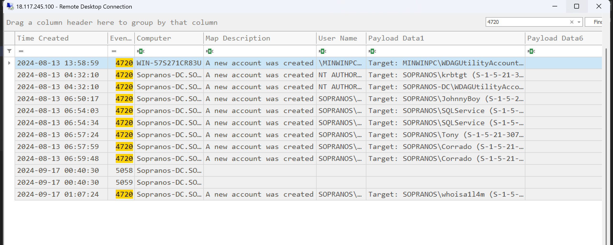

Why after? So this is because as per how kerbroasting occurs, the attacks needs to have compromised a user account.. which in this case is
tony. Then he requested for the SQLService ticket which is encrypted with the service's password of which the attacker could now crack them offline
moments after the service ticket request at 2024-09-17 00:59:53.

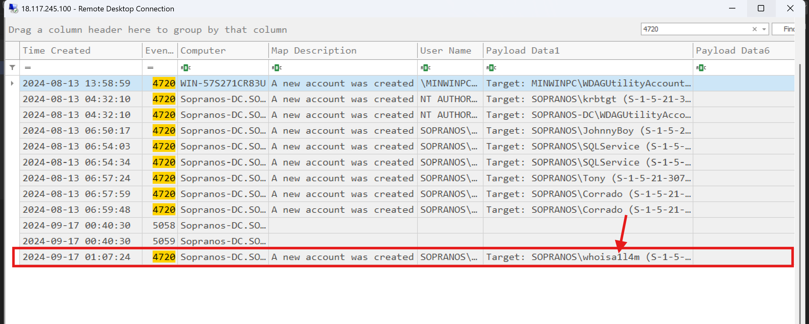

Looking at the events timeline, the only account creation event was at 1:07am .. thus approximately 7 minutes after the service ticket was requested for.. as seen in the screenshot above.
The name of the account created is seen within the Payload Data 1 field.

**The attacker then created a scheduled task to ensure persistence. What is the exact timestamp when the task was created?**

Did event id 4698 come to your mind as well? Well I guess it did. Let's filter for scheduled task creation events.. specifically looking at a timeframe
around 1:7am that same day. But guess what, the filter returned 3 events of which 4698 **was not part of.** I think auditing may not have been enabled.

So, let's look at the TaskScheduler Operational Log at `C:\Users\LetsDefend\Desktop\ChallengeFile\C\Windows\System32\winevt\Logs\Microsoft-Windows-TaskScheduler%4Operational.evtx`
this time with event viewer. Then I filtered for event id 106 for task creation events.. then focused on evvents after 1:7am where the first task creation
event after that said time was logged at 1:9am. Thus, 2 minutes after the new user aaccount was created. View the taskname and the timestamp in the screenshot below.. and remember
to keep the timestamp in the format letsdefend wants.

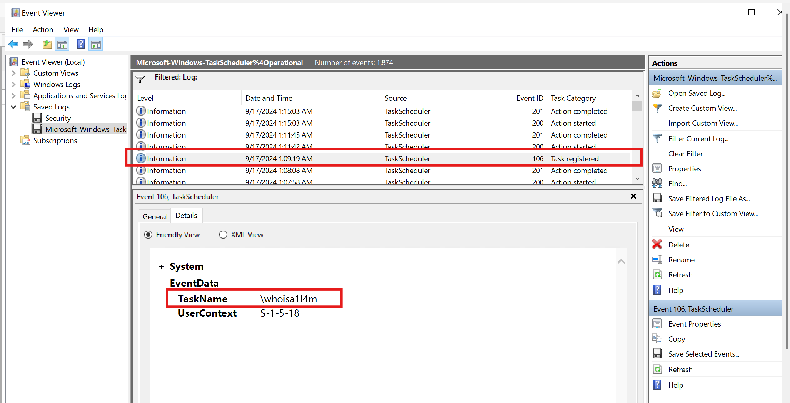

But what was the main purpose of the task? I think checking it's configurations would or might inform as a bit. In order to read the config of the actual
scheduled task we just identified, we look into `C:\Users\LetsDefend\Desktop\ChallengeFile\C\Windows\System32\Tasks`.

After, we open the scheduled task name we saw earlier and specifically look for the arguments to understand what this task was designed to do. That was
when I realised it was another persistence mechanism. That task adds the newly created user to the domain admins group.

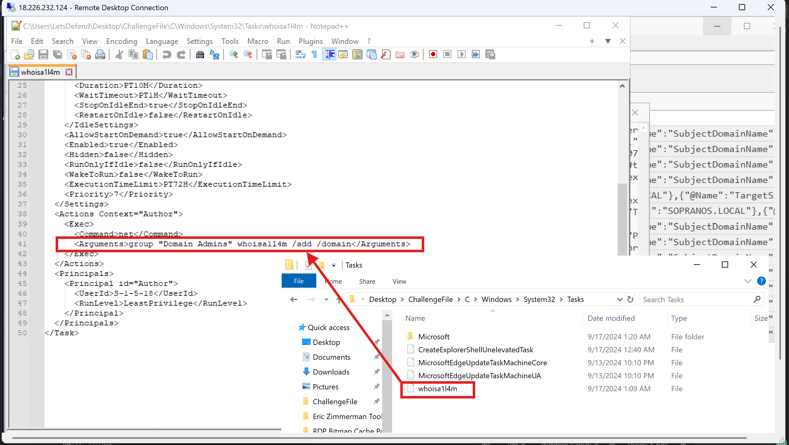

**Afterwards, the attacker logged in successfully using the newly created account. What source port was used for this login?**

Lets go back to our security event logs in timeline explorer. Now, since I know the attacker's IP and the timeline of the attack, I will filter for event id
4624 for successful login events after 1:9am.

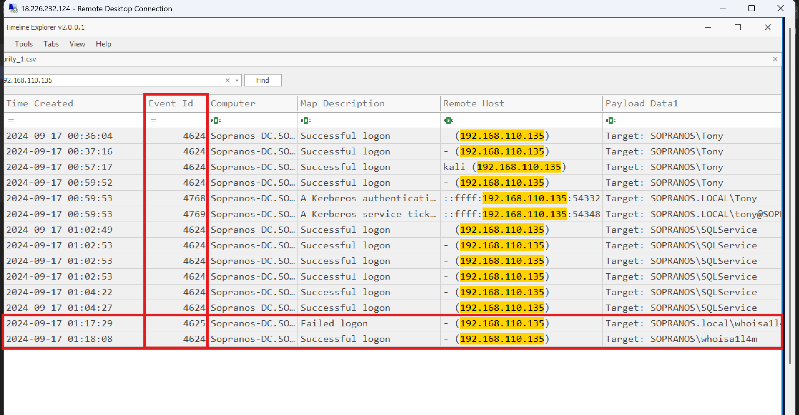

Fortunately, we can even see the attack timeline starting from when the service ticket ws requested, then the attacker ogged in to the SQLService at 1:2am - 1:4am then there was a failed
login to the newly created account at 1:17am which was followed by a successful login event at 1:18 am.

Since we are more interested in the port number used for the login, I used the horizontal scroll bar, scrolled to the payload column where I expanded it
to view the raw event where the port number was logged at. Like you can see in the screenshot below..

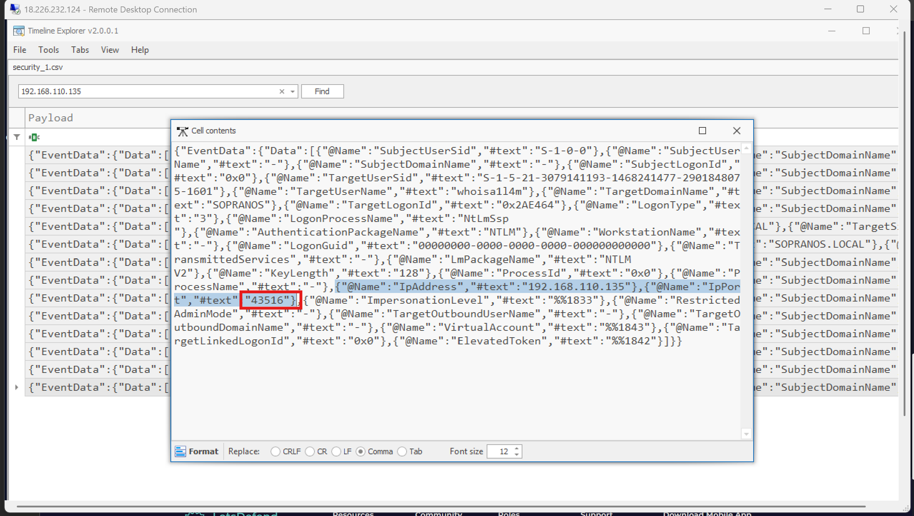

> You may want to consider following me via Medium and Github to get updated whenever I post on insightful walkthroughs like this.

Well, that was just btw.. lets continue.

**Sarah traced the attacker's steps back to the first interaction with a compromised machine. When did the attacker first interact with this machine?**

One thing to note from the question.. "to a compromised machine". Who's machine was compromised? Was Toney right? So we look at the logs
on Tony's system which is very likely to be contained within the Tonylogs folder.

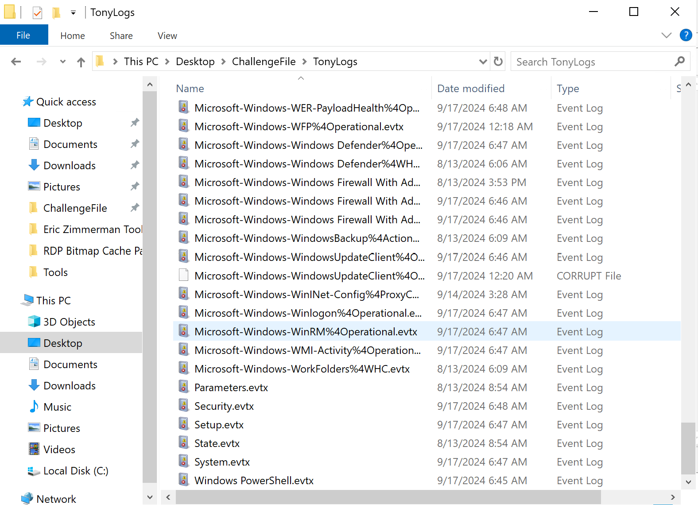

So I opened the security logs in event viewer.. but I realised it would become much more difficult so it was better off parsing the logs as we did
before. So I used the command:

```powershell
.\EvtxECmd.exe -f C:\Users\LetsDefend\Desktop\ChallengeFile\TonyLogs\Security.evtx --csv C:\Users\LetsDefend\Desktop\ChallengeFile\ --csvf security_1_tony.csv
```
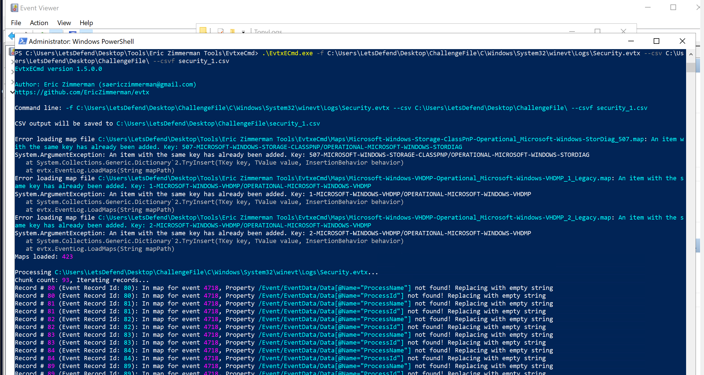

Then, I opened the new `security_1_tony.csv` within timeline explorer. After, I filtered for the attacker's IP: `192.168.110.135` which returned
a couple of events where I hid some columns that are not of importance to us so we can at least giving a solid overall timeline of the attacker on that particular system.


As we can see from the screenshot above, the first event is actually the first time of interaction, which was a failed login attempt to the 
account: Corrado. This was followed by a couple more failed login attempts to Corrado again and to SOPRANOS-DC$ (a computer account), until 
eventually there were successful logins to the built-in administrator account and a local account, Anthony. These events took place starting at 
5:08 AM and ran through to 12:26 AM on 2024-09-14.

**After pivoting through the compromised machine, Sarah identifies the account name used for the initial successful login. What account name was used by the attacker?**

So aside the screenshot I shared above, I also mentioned the name of the account.

---

## Timeline of the Incident

| Timestamp | Event |
|---|---|
| 2024-09-14, 05:08 AM | First interaction with the compromised machine (Tony's system) - failed login attempt against the `Corrado` account |
| 2024-09-14 | Repeated failed login attempts against `Corrado` and the computer account `SOPRANOS-DC$` |
| 2024-09-14, up to 12:26 AM | Successful logins to the built-in Administrator account and the local account `Anthony` - this is the account used for the attacker's initial successful foothold |
| 2024-09-17, 00:59:53 | Kerberoasting: TGT request (Event ID 4768) immediately followed by a Service Ticket request (Event ID 4769) for the `SQLService` account, both with RC4 encryption (`0x17`), requested using the `tony` domain account |
| 2024-09-17, ~01:02–01:04 AM | Attacker logs in using the cracked `SQLService` credentials |
| 2024-09-17, ~01:07 AM | New user account created for persistence (Event ID 4720) - approximately 7 minutes after the service ticket request |
| 2024-09-17, ~01:09 AM | Scheduled task created (Event ID 106, TaskScheduler Operational log) - approximately 2 minutes after the new account was created. Task configuration shows it adds the newly created user to the Domain Admins group |
| 2024-09-17, 01:17 AM | Failed login attempt using the newly created account |
| 2024-09-17, 01:18 AM | Successful login using the newly created account (Event ID 4624) |

---

## MITRE ATT&CK Mapping

| Tactic | Technique ID | Technique Name | Where Observed |
|---|---|---|---|
| Credential Access | T1110 | Brute Force | Repeated failed login attempts against `Corrado` and `SOPRANOS-DC$` on Tony's machine |
| Initial Access / Valid Accounts | T1078 | Valid Accounts | Successful initial logon using the `Anthony` account and later the built-in Administrator account |
| Credential Access | T1558.003 | Steal or Forge Kerberos Tickets: Kerberoasting | TGT (4768) immediately followed by Service Ticket request (4769) for `SQLService`, both with RC4 (`0x17`) encryption, requested via the `tony` account |
| Persistence | T1136.002 | Create Account: Domain Account | New domain user account created (Event ID 4720) approximately 7 minutes after the service ticket request |
| Persistence | T1053.005 | Scheduled Task/Job: Scheduled Task | Scheduled task created (Event ID 106) approximately 2 minutes after the new account, used to trigger the group membership change |
| Privilege Escalation | T1098 | Account Manipulation | Scheduled task adds the newly created account to the Domain Admins group |
| Lateral Movement | T1021 | Remote Services | Attacker logon activity across Tony's machine, the `SQLService` account, and the domain controller using the harvested/cracked credentials |
| Defense Evasion | T1078.002 | Valid Accounts: Domain Accounts | Continued use of legitimate domain credentials (`tony`, newly created account) throughout the attack chain to blend in with normal authentication traffic |

---

## Reflection

My reflection on this challenge was that, this was way easier as compared to the `hard` category this challenge is placed under on LetsDefend. I only
say this becaause I knew what to look out for.. the basics of how the attack works and how to detect it. So if you are reading this writeup because
you were facing challenges with this 'challenge', you can infer from the points I stated before I started the challenge. I noted that so you can
also understand the procedure or how to go about detecting kerbroasting.

Once again, feel free to follow for more writeups!

Peace.

