# LetsDefend: LDAP Enumeration Challenge

## Table of Contents

1. [Scenario](#scenario)
2. [Methodology](#methodology)
3. [Timeline of the Incident](#timeline-of-the-incident)
4. [MITRE ATT&CK Mapping](#mitre-attck-mapping)

---

## Scenario

A network has been breached, and an alert was triggered indicating suspicious network enumeration activities from IP 192.168.110.129. Initial indicators suggest an attacker inside the network is actively probing systems and gathering information about critical assets. I am tasked with tracing the attacker's movements to determine the source of the anomaly, understand how the attacker gained access, and assess what actions they might have taken inside the network.


---

## Methodology

**The investigator needs to determine when the attacker first accessed the system. Based on the login records, when did the first successful login from the malicious IP occur?**

At thi point, I have become conversant with parsing the Security event logs and opening it in Timeline explorer. This is an efficient way of hunting for malicious activity through the logs.

So, I did just that using the command:

```powershell
.\EvtxECmd.exe -f "C:\Users\LetsDefend\Desktop\ChallengeFile\C\Windows\System32\winevt\logs\Security.evtx" --csv "C:\Users\LetsDefend\Desktop\ChallengeFile\C\Windows\System32\winevt\logs" --csvf Output.csv
```

Then I opened `Output.csv` with Timeline Explorer. Afterwards, I hid unnecessary columns so I can focus more on what matters: Event ID, Logon Type, Remote Address and Payload Data.

I then filtered for `4624` and since we need the exact timestamp of the first login attempt, I used the remote host field as my secondary filter as I scrolled down the log.

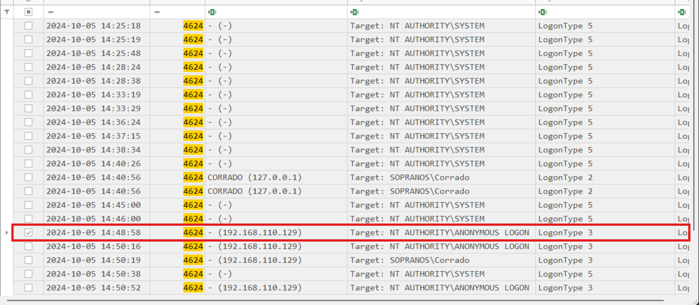

As you can see in the image above, the first event from the IP address of interest had the logon type 3.. an anonymous login via the network. What we need here is the exact time and you can see that as well. Just note: be careful of the answer format.. letsdefend require you to add UTC after stating the time.

**What is the port number used for the previous login?**

Just by scrolling to the `Payload` column for the same event found earlier, we can see the network information from the raw payload.

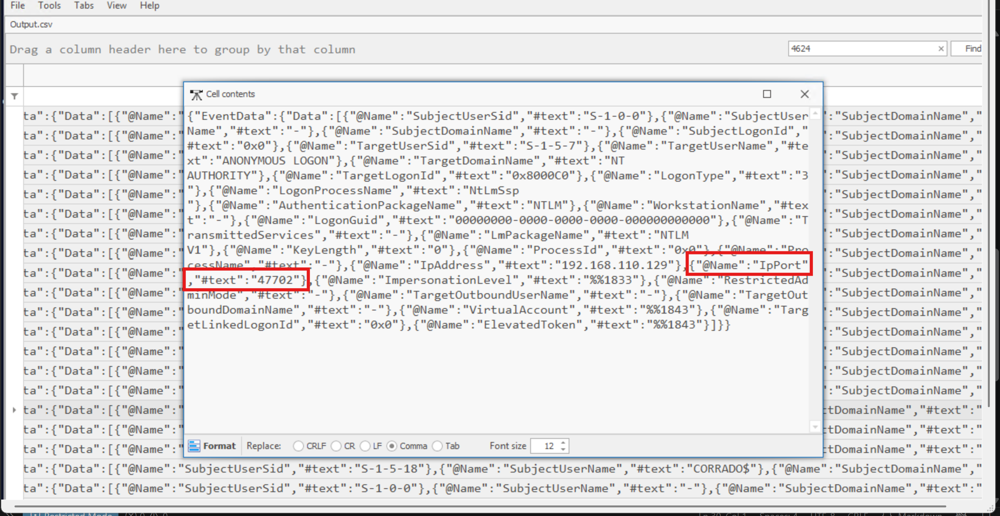

**Once inside the system, it seems the attacker immediately began gathering information. What was the first command they executed?**

The question just sounds like Prefetch in my ears lol. So basically, I'm gonna parse the prefetch files using `PECmd.exe` from Eric's tools.

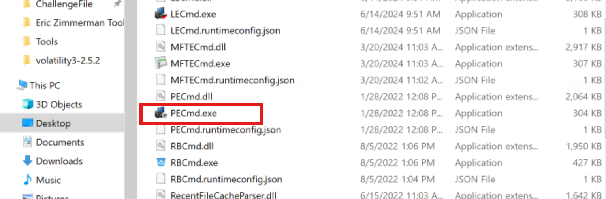

Prefetch files are Windows artifacts that provide evidence of program execution, including the executable involved and execution timestamps. They are useful in DFIR for building execution timelines and identifying suspicious programs that were run.

I parsed the prefetch files and saved the output as prefetch.csv on the Desktop using the command:

```powershell
 .\PECmd.exe -d "C:\Users\LetsDefend\Desktop\ChallengeFile\C\Windows\prefetch" --csv "C:\Users\LetsDefend\Desktop" --csvf prefetch.csv
```
The command above presents us with not just prefetch.csv but also prefetch_Timeline.csv which is what we will actually load into Timeline Explorer to start digging things up.

Now, to get the first command the attacker executed, at least we have some leverage which is the timestamp of their first login: `2024-10-05 14:48:58 UTC`

So I will just scrow through the prefetch timeline for events after that specific time.

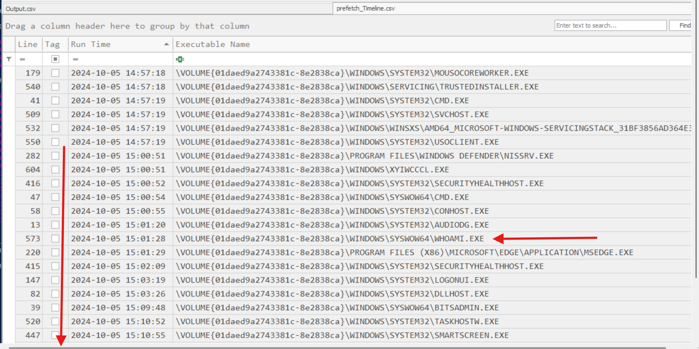

As you can see in the screenshot above, I identified `WHOAMI.EXE` at `15:01:28 UTC` as an important early command, since whoami is commonly used to determine the current user and privilege context of the compromised system. This helped establish the attacker's likely first-stage activity after gaining access.

**During the attack, the attacker downloaded a malicious file. What is the exact URL of the file?**

BITS is where I'd look now because BITS can be used to transfer files in the background, and its telemetry can contain download information.

Since this is also an EVTX file, I can use Eric Zimmerman's EvtxECmd to parse those Event Logs and export them to CSV using the command below:

```powershell
.\EvtxECmd.exe -f "C:\Users\LetsDefend\Desktop\ChallengeFile\C\Windows\System32\winevt\logs\Microsoft-Windows-Bits-Client%4Operational" --csv "C:\Users\LetsDefend\Desktop" --csvf Bits.csv
```

I saved that to the desktop as `Bits.csv` and opened it in Timeline Explorer.

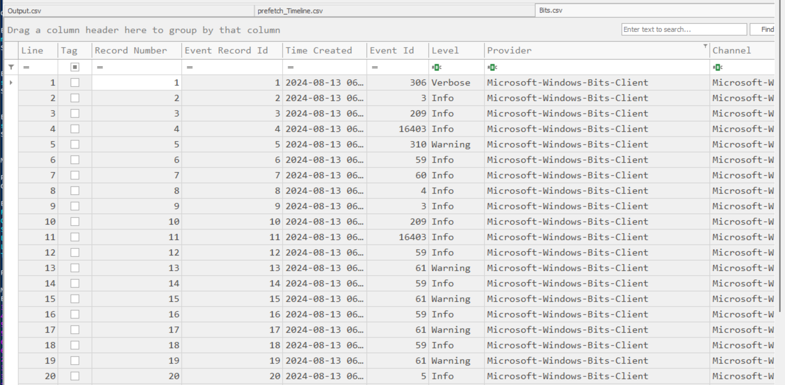

As usual, once it was opened, I had to remove unecessary columns so we can focus on what actally matters.

I'd focus on the BITS events around the attack timeframe.. thus after `15:01:28 UTC`. My first clue was to focus on Event ID 3.. thus job creating and the subsequent bit transfer start and stop under it.

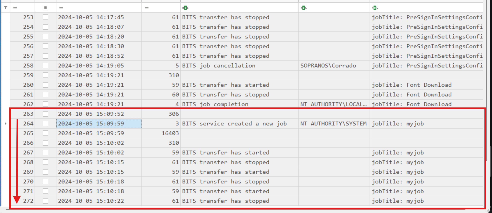

As you can clearly see above, I found a job creation event at `2024-10-05 15:09:59`

Lets scroll through to the Payload column. You'll realize the transfer was for sharphound from the address: `192.168.110.129`.. same IP of the attacker.

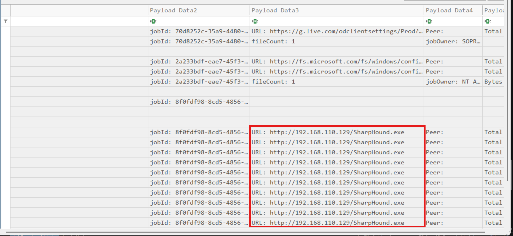

**The download logs indicate when the malicious file was brought onto the system. What time did the download occur?**

I tried the timestamps for the bits transer job but did not work, that was when I realised MFT would be a better way to analyze for the time at which the file came into the system.

The Master File Table (MFT) is an NTFS filesystem database that keeps metadata about files and directories on a Windows system, including their creation, modification, and access timestamps.

In this case, we're gonna be using the MFT because directly answers when the malicious file was brought onto the system. We already know the malicious filename from the BITS download logs, hence we can search for that file in the MFT and examine its creation timestamp. This gives us an indication of when the downloaded file first appeared on the filesystem.

For an NTFS Windows system, the MFT is located at the root of the NTFS volume:

```
C:\$MFT
```

Since, we are working with an acquired artifact, below shows its exact location:

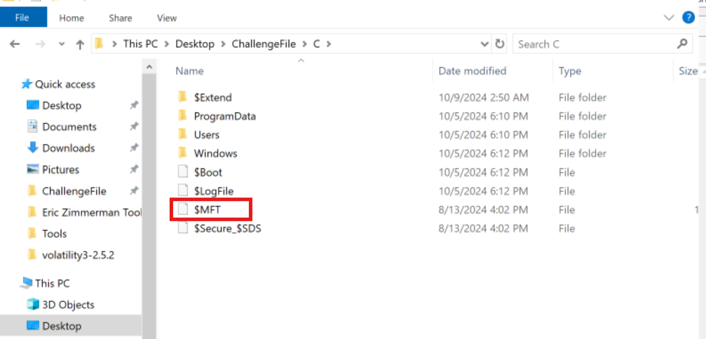

Once again, parsing parsing parsing lol. What can I do without 'Eric's Tools'? Lol don't mind me.

So we're basically going to parse the $MFT with `MFTECmd.exe`, one of Eric's tools.

```powershell
.\MFTECmd.exe -f "C:\Users\LetsDefend\Desktop\ChallengeFile\C\`$MFT" --csv "C:\Users\LetsDefend\Desktop\ChallengeFile\C" --csvf parsed_
mft.csv
```
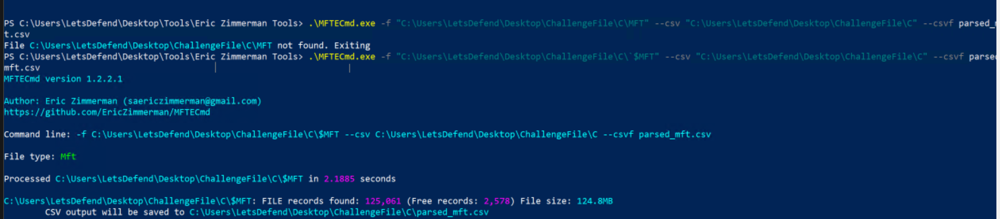

I then opened the parsed file in Timeline Explorer and removed columns we do not need. Then, I filtered for `Sharphound` which reduced the entried to just 3 as seen below. You can equally see the time of download from the `Created0x10` column.

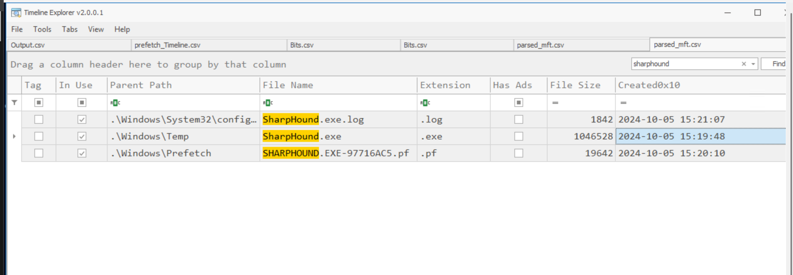

**Windows Defender detected the malicious file and generated an alert. What is the SHA1 hash of this file?**

Are you thinking what I am thinking now? Well yeah, we have to parse the Windows defender operational logs.

Before that, note the event IDs we gonna be leveraging on:
- 1116 - Malware detected
- 1117 - Malware action taken
- 1118 - Malware action failed

Since the download was made at `2024-10-05 15:19:48 UTC`, Microsoft Defender's event would likely be some microseconds or seconds later.

The talk is okay.. let's go straight into parsing those logs.

```powershell
.\EvtxECmd.exe -f "C:\Users\LetsDefend\Desktop\ChallengeFile\C\Windows\System32\winevt\logs\Microsoft-Windows-Windows Defender%4Operational.evtx" --csv "C:\Users\LetsDefend\Desktop" --csvf mic_defender.csv
```
Then we open the parsed log: `mic_defender.csv` in Timeline Explorer.

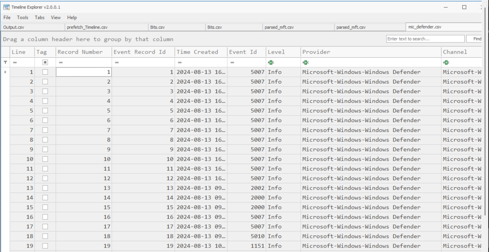

I then removed unnecessary columns and focused on the exact time I mentioned earlier.

Interestingly, although there was the entry for the malicious file, the hash was not present in the payload data.

I then investigated the Windows Defender Event ID 1116 associated with `BloodHound.exe` directly from event viewer, expecting the file's SHA1 hash to be included in the event details. However, neither Timeline Explorer nor Event Viewer contained the hash.

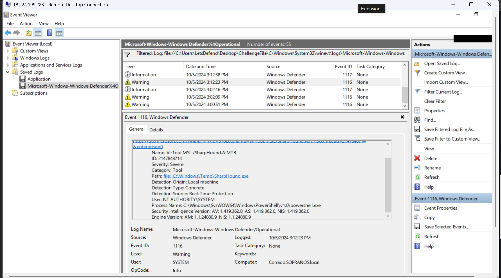

I then checked the Amcache artifact, but there was no `BloodHound.exe` entry.

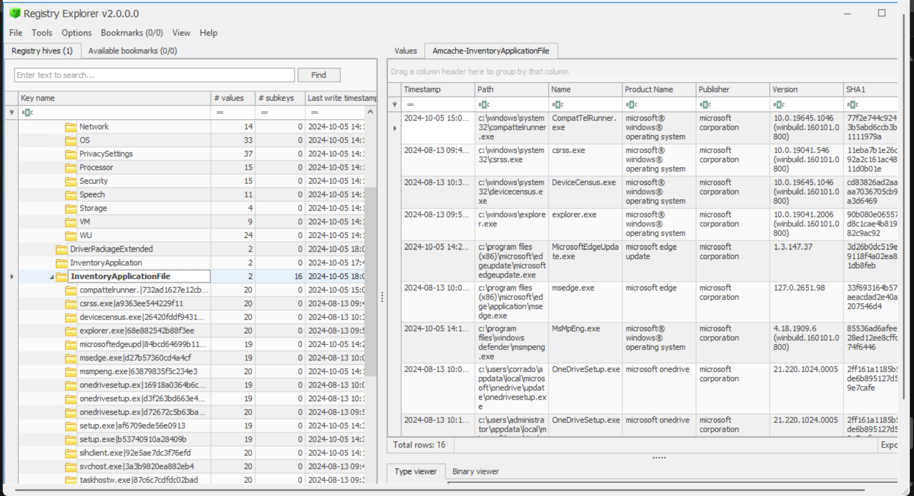

This suggested that the attacker may have managed to evade or limit Defender's normal file-hash recording.

I therefore expanded the investigation beyond the parsed Defender events and examined the Defender log files stored under `C:\Users\LetsDefend\Desktop\ChallengeFile\C\ProgramData\Microsoft\Windows Defender\Support`.

The hash was present in the raw log data, allowing me to recover the SHA1 of the malicious `BloodHound.exe` file.

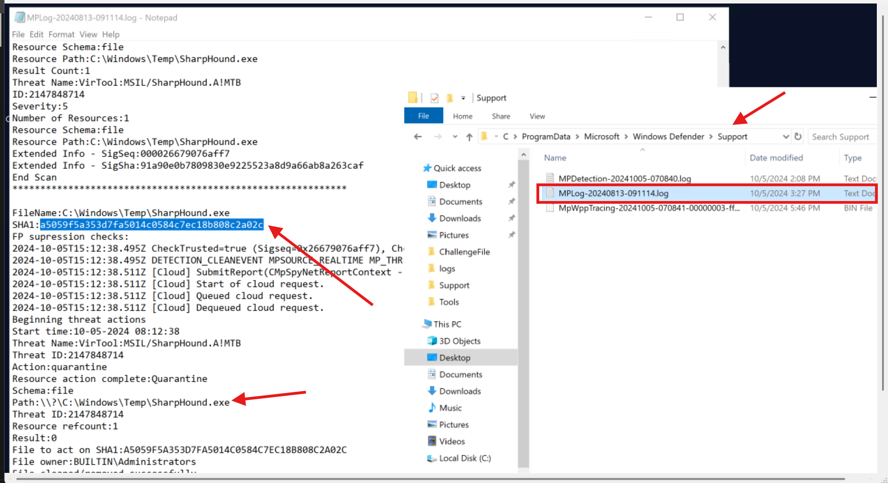

**To evade detection, the attacker excluded a specific directory from the Defender scan. What command did they use to do so?**

Talking about commands.. let's investigate Powershell as that's mostly the application attackers rely on to execute commands.

To know the time to look out for, I went back to the log from which we got the hash so we can see the timestamp at which the attacker cleaned to evade detection which was logged..

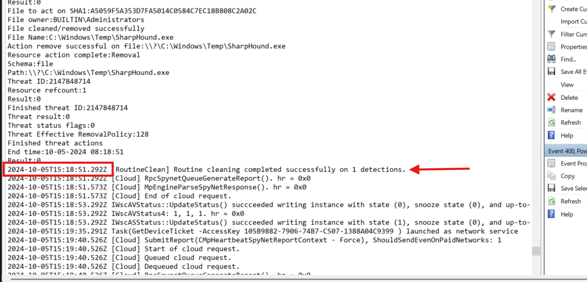

Knowing that to be `2024-10-05T15:18:51.292Z`, this search for powershell command would be after that timestamp.

I parsed the powershell logs using the command below:

```powershell
.\EvtxECmd.exe -f "C:\Users\LetsDefend\Desktop\ChallengeFile\C\Windows\System32\winevt\logs\Windows PowerShell.evtx" --csv "C:\Users\LetsDefend\Desktop" --csvf powershell.csv
```

I then opened the parsed file with Timeline explorer. From the results shown below, you could see that the attacker tried to evade detection by disabling microsoft defender at `2024-10-05T15:19:12`.

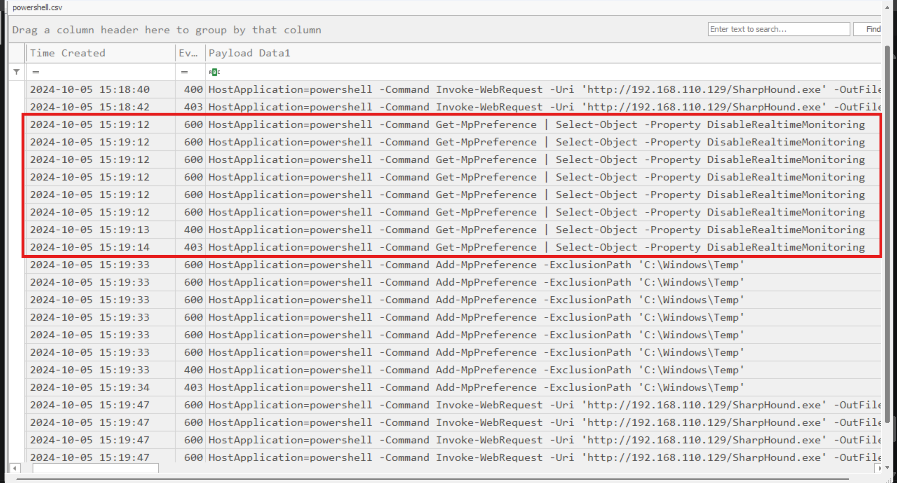

Then moved on to excluding the directory shown below from the defender scan at `2024-10-05T15:19:23`:

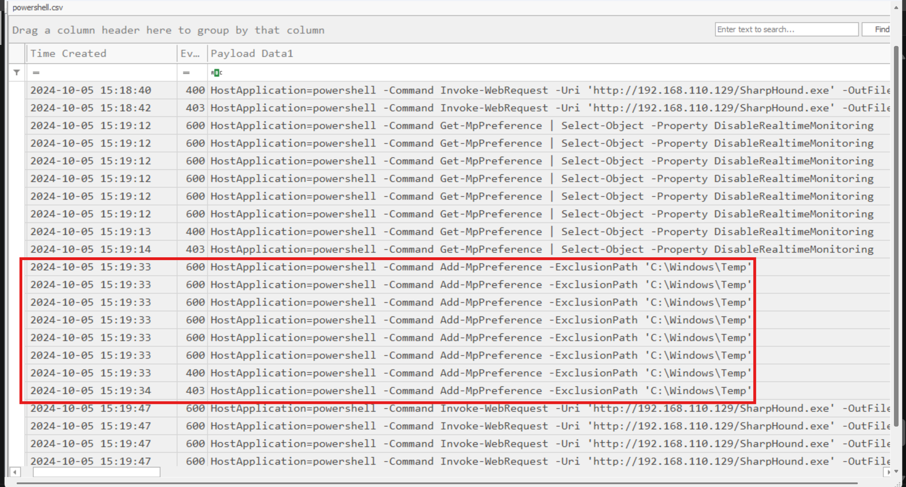

**The attacker executed the malicious file soon after downloading it. When exactly did they first run it?**

This is where the prefetch files come in one more time. Remember we parsed the prefetch files earlier on? Yeah so what I'll do now is to search for `sharphound`. The results showed the exact path where the attacker excluded from defender scans and also the timestamp of execution which is basically what we're looking for at this point:

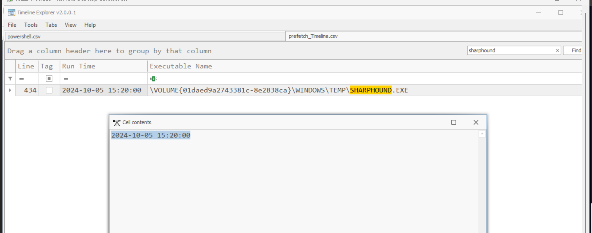

**After executing the malicious file, a zip file was created on the system. What is the full path of this zip file?**

Now, we know the malicious exe was executed at `2024-10-05 15:20:00 UTC`,we now need to look at what happened after execution. We run back to our parsed MFT logs.

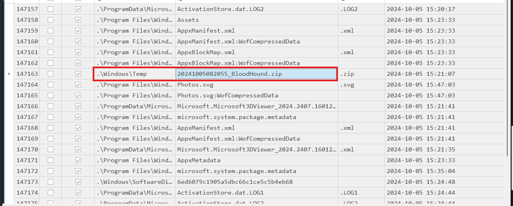

Looking at the screenshot above, we could see the exact zip file which was created on `2024-10-05 15:21:07` thus about a minute after execution of the exe file.

The full path becomes: `C:\Windows\Temp\20241005082055_BloodHound.zip`

**What is the malware family name associated with the malicious file that was downloaded?**

I submitted the hash which was found earlier to virustotal where I learned the malware family for this threat.

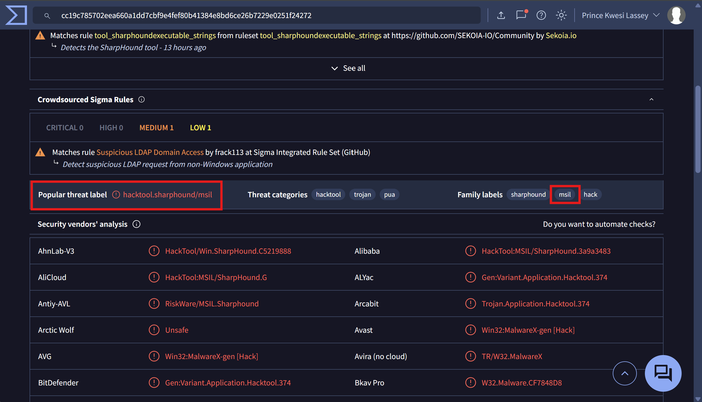

**What is the malware signature detected by Windows Defender for the malware?**

I checked the microsoft defender logs for the malware signature. I had actually come across it during the previous questions.. should have noted it down lol. Anyways, it does not hurt to investigate and hence, I opened the Microsoft Defender Operational logs once again in event viewer where I checked the event details for the threat name as you can see below:

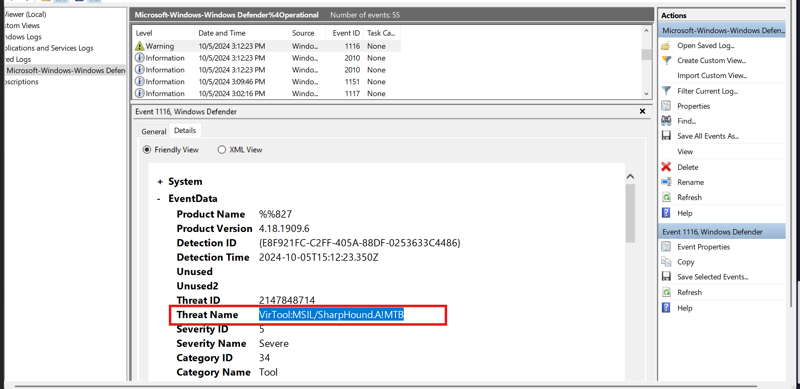

---

## Timeline of the Incident

| Timestamp (UTC) | Event |
|---|---|
| 2024-10-05, 14:48:58 | First successful login from the malicious IP (192.168.110.129) - Logon Type 3, anonymous network logon |
| 2024-10-05, 15:01:28 | First command executed post-access: `WHOAMI.EXE` - establishing current user and privilege context |
| 2024-10-05, 15:09:59 | BITS job created for the download of SharpHound, sourced from the attacker's IP (192.168.110.129) |
| 2024-10-05, 15:18:51.292 | Windows Defender detects the malicious file (`BloodHound.exe`) - Event ID 1116 |
| 2024-10-05, 15:19:12 | PowerShell command executed to disable Windows Defender |
| 2024-10-05, 15:19:23 | PowerShell command executed to exclude the malicious file's directory from Defender scanning |
| 2024-10-05, 15:19:48 | Download of the malicious file completes on disk, per MFT `Created0x10` timestamp |
| 2024-10-05, 15:20:00 | Malicious file (SharpHound/`BloodHound.exe`) executed for the first time |
| 2024-10-05, 15:21:07 | Resulting zip archive created at `C:\Windows\Temp\20241005082055_BloodHound.zip` - about a minute after execution |

---

## MITRE ATT&CK Mapping

| Tactic | Technique ID | Technique Name | Where Observed |
|---|---|---|---|
| Initial Access | T1078 | Valid Accounts | First successful login from the attacker's IP, Logon Type 3 (anonymous network logon) |
| Discovery | T1033 | System Owner/User Discovery | `WHOAMI.EXE` executed immediately after gaining access |
| Command and Control | T1105 | Ingress Tool Transfer | SharpHound downloaded via a BITS job sourced from the attacker's IP |
| Defense Evasion | T1562.001 | Impair Defenses: Disable or Modify Tools | PowerShell commands disabling Windows Defender and excluding the malicious file's directory from scanning |
| Execution | T1059.001 | Command and Scripting Interpreter: PowerShell | PowerShell used to disable Defender and configure the scan exclusion |
| Execution | T1204.002 | User Execution: Malicious File | Execution of the downloaded SharpHound binary |
| Discovery | T1087 / T1069 / T1018 / T1482 | Account Discovery / Permission Groups Discovery / Remote System Discovery / Domain Trust Discovery | LDAP enumeration performed by SharpHound to map the Active Directory environment |
| Collection | T1560 | Archive Collected Data | SharpHound output packaged into `20241005082055_BloodHound.zip` after execution |

---


Thanks for staying! Smash that follow button so you do not miss any writeups!

See you in my next,

Peace.