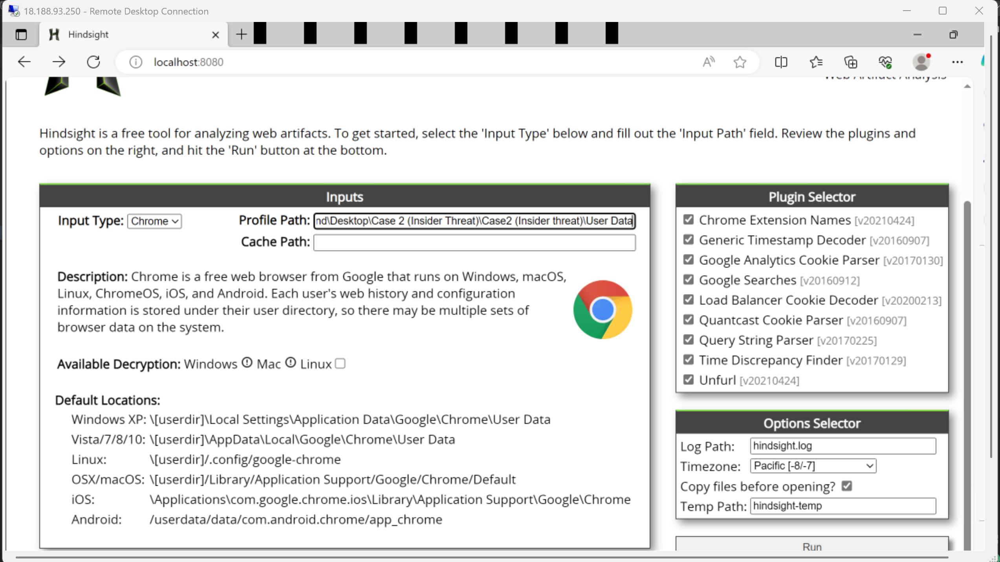
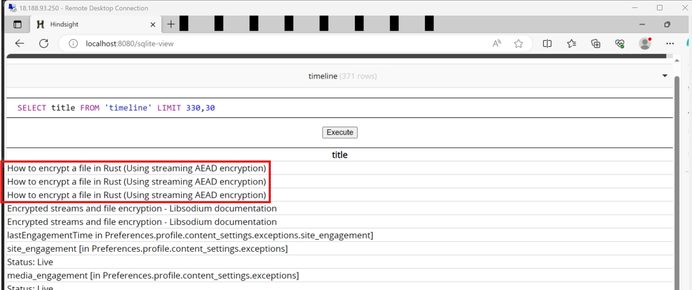
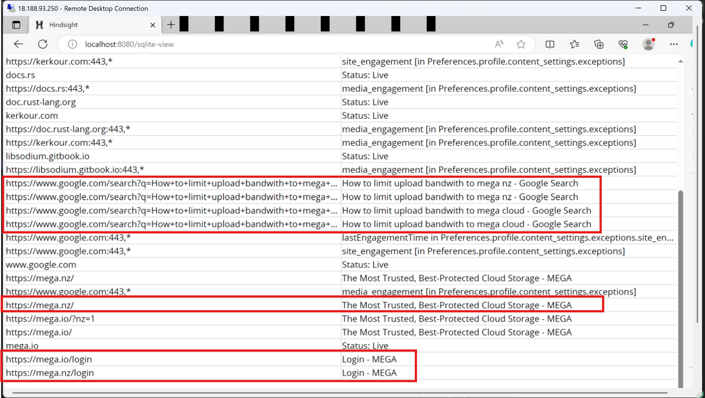
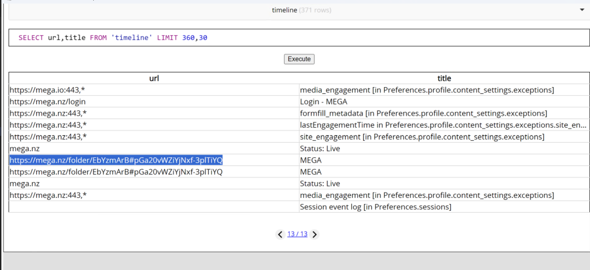
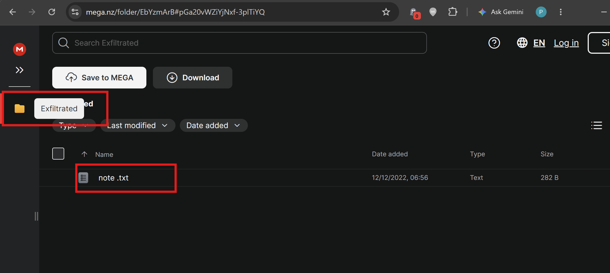
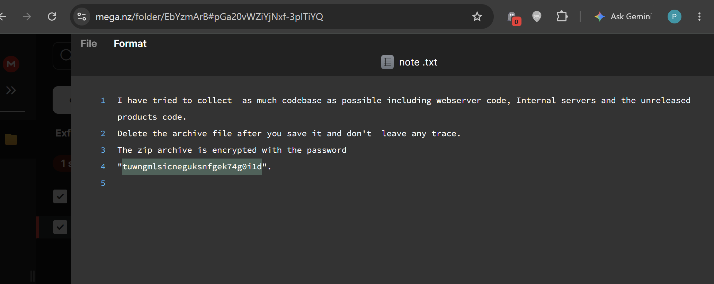

# LetsDefend Practical Case 2: Insider Threat | Browser Forensics

## Scenario
SOC team found a spike in the network bandwidth that causes degraded network performance. 
We noticed that large amount of data was uploaded from an employee’s workstation within the IT 
department. I have been given the browser data of employee’s computer to track users' activities.

Link to this case: https://app.letsdefend.io/training/lesson_detail/practical-case-2-insider-threat

Questions
1. Which Programming language does the user seem he is interested in?
I started by loading the path to User data (thus the case file) for profile path field in Hindsight. 

I then run the analysis and viewed the results in SQLite DB in browser.

Definately, to understand what the user is interested in, the browser history can help me connect those
pieces together. I opened the timeline table and selected the title field from the table so I 
could track the user's activity. While looking through the titles, I saw a search he made on
`How to encrypt a file in rust`

I guess that's exactly what I have been looking for.

Ans: rust

2. Which domain is used to exfiltrate the data?

This meant looking at possible cloud providers. I had a couple in mind which would have been easier
if I were to be using BrowsingHistoryView tool as that will allow me to specify urls which contain
specific text.

Nevertheless, at the point I was.. from the previous question, I now modified the SQL query to add urls
and I kept scrolling. That is where I came across a search made on `how to limit upload bandwidth to 
mega nz`. Then it clicked for me lol. Myself, I have used the services of mega.nz for a while now.

Ans: mega.nz

3. What's the full URL where the data was uploaded?
For this, I just had to closely monitor the urls after the mega.nz login url

Ans: https://mega.nz/folder/EbYzmArB#pGa20vWZiYjNxf-3plTiYQ

4. What's the folder name where the data was uploaded?
I opened the link found in the previous question where I notices the data exfiltrated was note.txt and stored
in the folder: `exfiltrated`

Ans: exfiltrated

5. What was the password with which exfiltrated data was encrypted?
I think I was now closer to the evidence which is note.txt hence I opened it to view what it contained.

Indeed, the text file contained the password.

Ans: tuwngmlsicneguksnfgek74g0i1d

