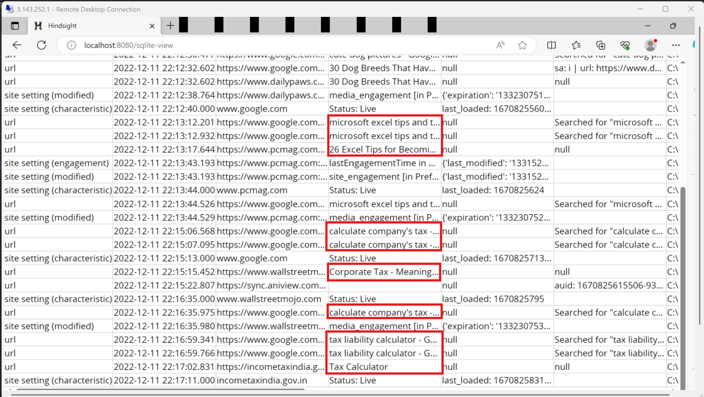
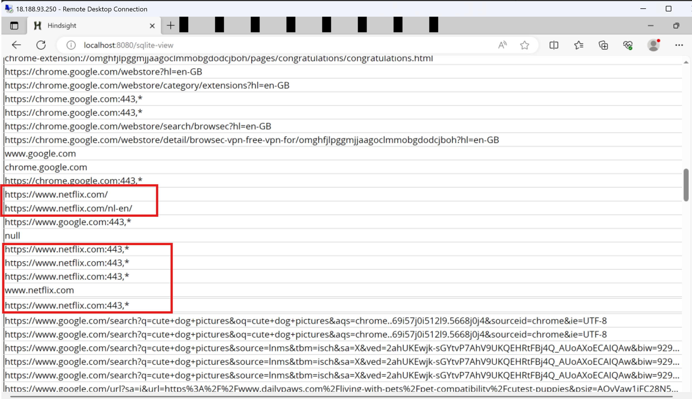
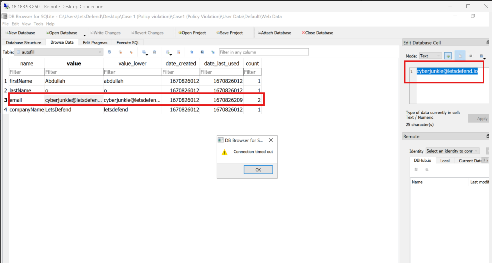
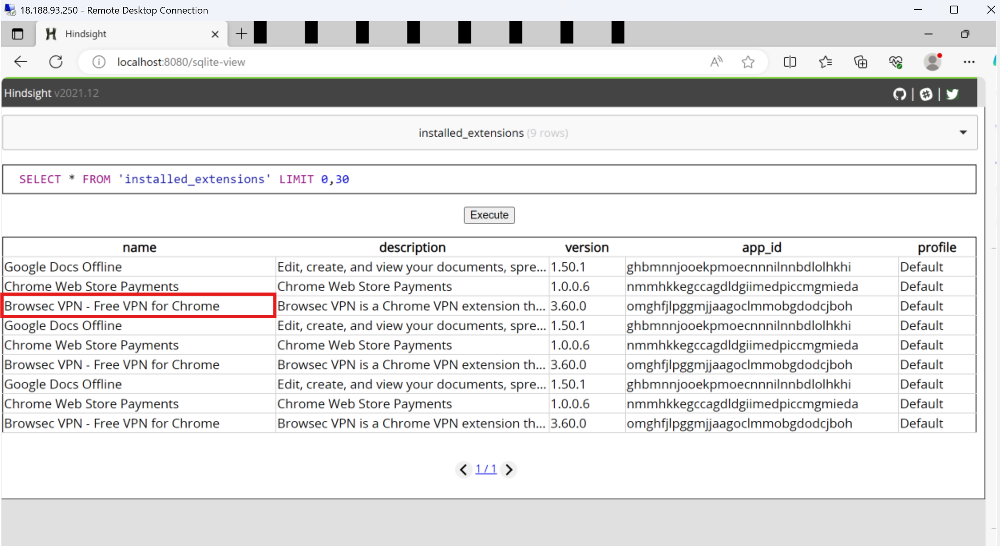
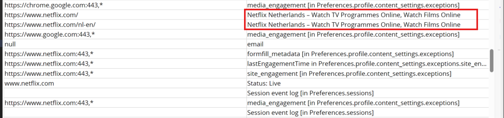

# LetsDefend Practical Case: Corporate Policy Violation | Browser Forensics

## Scenario
We have serious concerns for an employee’s performance as he is lagging behind his tasks all the time. 
He spends 8 hours in the office on working days, arrives on time but doesn't get the work done. 
Project leader suspects that the employee wastes his time online. I have been given the browser data of 
the employee's computer to track users' activities.

Link to this Case: https://app.letsdefend.io/training/lesson_detail/practical-case-corporate-policy-violation

## Questions

1. In which department does the user work?

A) IT
B) Finance
C) Marketing
D) SOC

What I did here was to open the artifact using Hindsight, selected the timeline table and looked through
the title column which proved most of the user's searches were minly towards finace related activities.

Ans: B

2. Which entertainment website (domain) the user visited?
Here, I was mainly interested in urls or domains that does not make sense to be accessed during work hourrs.
I filtered to select urls from the timeline table and looked through the list of accessed urls of which
netflix stood out.

Ans: netflix.com

3. What's the user’s email address?
To answer this, I fell back on manual browser analysis where I opened Web data database under autofills table
within DB Browser SQLite
Path: C:\Users\LetsDefend\Desktop\Case 1 (Policy violation)\Case1 (Policy Violation)\User Data\Default\Web Data

Ans: cyberjunkie@letsdefend.io

4. Which extension was used to bypass restricted content?
One of the ways in which this becomes feasible is when the user uses a VPN which makes it seem like
he is in an authorized location. Hence, still using Hindsight, I opened the installed_extensions table where
I saw a couple of extensions the user had installed. A notable one was the vpn extension.

Ans: Browsec VPN - Free VPN for Chrome

5. What is the version of the extension from the previous question?
So based on the screenshot I have shared in the previous question.. the version is seen vividly.

Ans: 3.60.0

6. Which country does the VPN IP belong to?
Since the user used the VPN to bypass restrictions and to be able to access netflix, I filtered the sql
query in hindsight to SELECT url,title FROM 'timeline' 

I did this so I can check the title of the netflix page loaded.. which could ell the country of origin
of the vpn IP.

Ans: Netherlands

