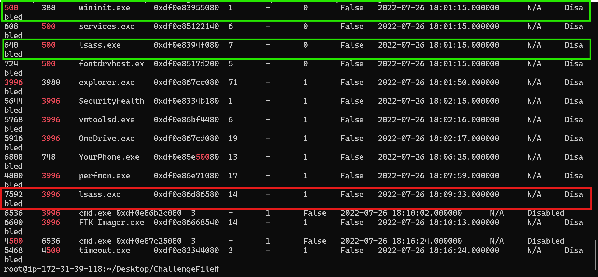
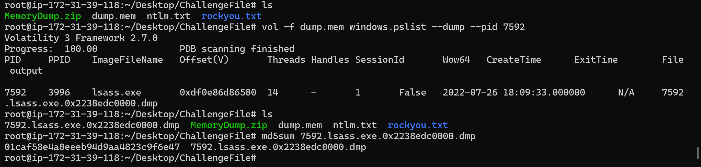
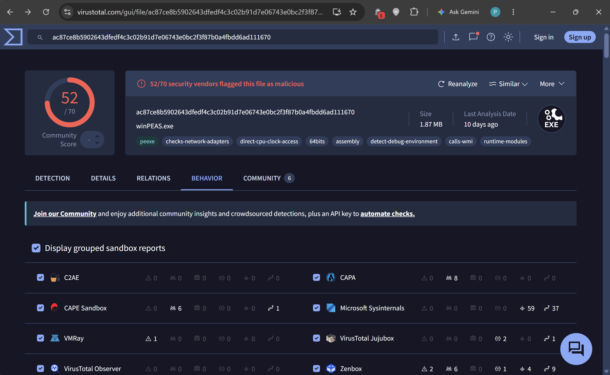
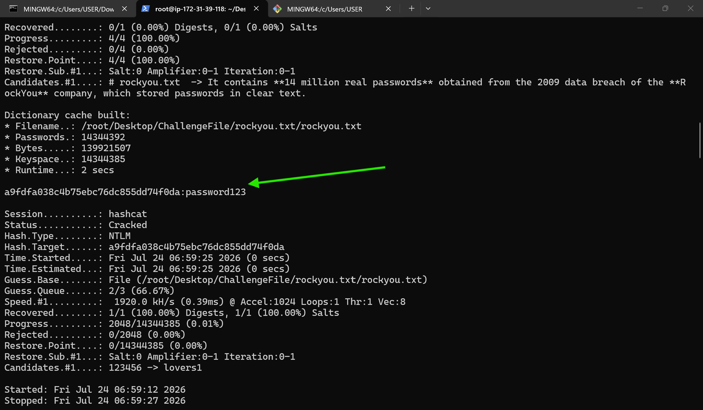

# LetsDefend Challenge: Memory Analysis

## Scenario
A Windows Endpoint was recently compromised. Thanks to our cutting-edge EDR/IDS solution we immediately noticed it. The alert was escalated to Tier 2 (Incident Responders) for further investigation. As the Forensics guy, I was given the memory dump of the compromised host. I would continue to investigate.

---

**1. What was the date and time when Memory from the compromised endpoint was acquired?**

I used the `windows.info` plugin, which pulls high-level metadata about the memory image itself — things like the OS version/build, kernel base address, number of processors, and, most importantly for this question, the system's boot time and the time the sample was collected. This is usually the first plugin to run against any new memory dump, since it confirms the image is readable and gives useful context (OS build, architecture) before running any other plugin.

```bash
vol -f dump.mem windows.info
```

---

**2. What was the suspicious process running on the system? (Format: name.extension)**

To identify malicious processes more systematically, I kept the following checklist in mind:
- Suspicious or randomly-named processes
- Suspicious parent-child relationships (example: `winword.exe` spawning `powershell.exe`)
- Broken parent relationships (a process whose parent doesn't match its known-legitimate parent)
- Advanced evasion methods: process injection, DLL injection, process hollowing

```bash
vol -f dump.mem windows.pslist
```

Running this, I spotted a rogue `lsass.exe` whose parent process was `explorer.exe` instead of `wininit.exe`, which is the only legitimate parent `lsass.exe` should ever have. This broken parent-child relationship was the giveaway that this particular `lsass.exe` was masquerading as the legitimate Windows credential process.



---

**3. Analyze and find the malicious tool running on the system by the attacker (Format: name.extension)**

I dumped the malicious process to disk so it could be analyzed as a standalone file, and then calculated its MD5 hash to use as a unique identifier for lookups.

```bash
vol -f dump.mem windows.pslist --dump --pid 7592
```



I checked the hash against Hybrid Analysis first, but it didn't return anything conclusive. Submitting the same hash to VirusTotal, however, returned a clear detection and identified the name of the tool, as shown below.



---

**4. Which User Account was compromised? Format (DomainName/USERNAME)**

Here I used the `envars` plugin, which lists the environment variables associated with each process at the time of acquisition. Since environment variables like `USERNAME` and `USERDOMAIN` are set per-session for the user context a process is running under, this is a quick way to tie a suspicious process back to the specific account it was executed as, without having to cross-reference session/logon tables separately.

```bash
vol -f dump.mem windows.envars
```


---

**5. What is the compromised user password?**

I first dumped the credential hashes stored in memory:

```bash
vol -f dump.mem windows.hashdump
```

I then took the NTLM hash for the compromised account, saved it into a text file, and cracked it offline using hashcat. The lab environment didn't have a wordlist directory available locally, so I cloned a repo containing `rockyou.txt` and used it as the dictionary for the crack:

```bash
hashcat -m 1000 ntlm.txt /root/Desktop/ChallengeFile/rockyou.txt --force
```

