# LetsDefend Challenge: Windows Registry Forensics Writeup

## Scenario
As a cybersecurity analyst, I've been given an image containing all the registry 
hives from one of the employee's machines. My task is to thoroughly examine the 
provided artifacts and respond to a series of questions based on my analysis.

- Challenge link: https://app.letsdefend.io/challenge/windows-registry

---

Before we get into it, if you haven't read my notes on Windows Registry Forensics, 
I'd strongly recommend doing so first. A lot of what I'll reference here 
(hives, tools, key paths) is explained in detail there. Think of this writeup as 
the practical application of those notes. Alright, let's get into it.

---

## 1. How many users were added?

When you want to find out information about local user accounts on a Windows system, 
your first stop should always be the **SAM hive** (Security Accounts Manager). 
This is where Windows stores information about local accounts - usernames, group 
memberships, password hashes, and so on.

I started by extracting the challenge file using 7zip, then loaded the SAM hive 
into **Registry Explorer** from:
```
C:\Users\LetsDefend\Desktop\ChallengeFile\C\Windows\System32\config\SAM
```

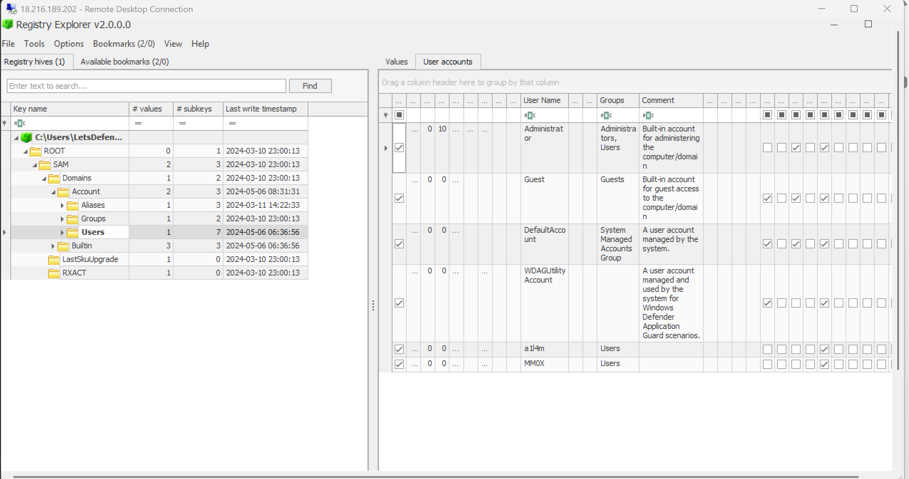

Now here's the thing.. when you look at the users list, you'll see 5 accounts in 
total. But don't let that fool you lol. Three of those are **built-in Windows 
accounts** (accounts like Administrator, Guest, DefaultAccount come baked into 
every Windows installation). The two that were actually *added* by someone are 
**a1l4m** and **MMOX**.

So the answer is **2** users.

---

## 2. What is the build number of the user's operating system?

OS version info lives in the **SOFTWARE hive**, specifically under 
the `CurrentVersion` key for Windows NT. This is one of those registry paths 
that's really worth memorising as an analyst - it tells you exactly what 
build of Windows you're dealing with, which matters a lot when you're trying 
to correlate an incident with known vulnerabilities for that specific version.

I loaded the SOFTWARE hive from:
```
C:\Users\LetsDefend\Desktop\ChallengeFile\C\Windows\System32\config\SOFTWARE
```

> **Quick note for anyone following along:** I experienced this and maybe you might as well.
> If Registry Explorer shows "dirty hive detected" error, that just means there are 
> uncommitted transaction logs. Hold **SHIFT** when selecting the hive file and load the transaction logs as prompted. 
> This ensures you're analyzing the most complete and up-to-date version of the hive.

Rather than manually expanding every folder in the tree (which is tedious), I just 
used Registry Explorer's search function and searched for `CurrentVersion` to jump 
straight to it. The key path is:
```
SOFTWARE\Microsoft\Windows NT\CurrentVersion
```

The build number was in the values panel.

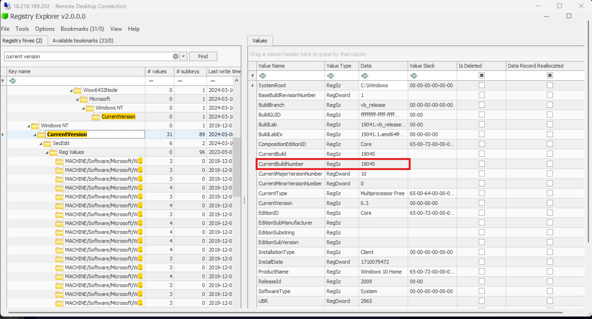

---

## 3. What was the IP address of the machine?

Alright, we're switching hives here from SOFTWARE to **SYSTEM**. Network configuration 
on a Windows machine is stored in the SYSTEM hive, specifically under the 
TCP/IP parameters for each network interface.

The key path we're looking for is:
```
SYSTEM\ControlSet001\Services\Tcpip\Parameters\Interfaces
```

Honestly though, if you don't want to navigate that whole path manually, just 
search for `Interfaces` in Registry Explorer and you'll get there much faster. 
There's only a few results and it's easy to spot the right one.

Once you're in the right key, look for the `DhcpIPAddress` value.. that's the IP 
address assigned to the machine.

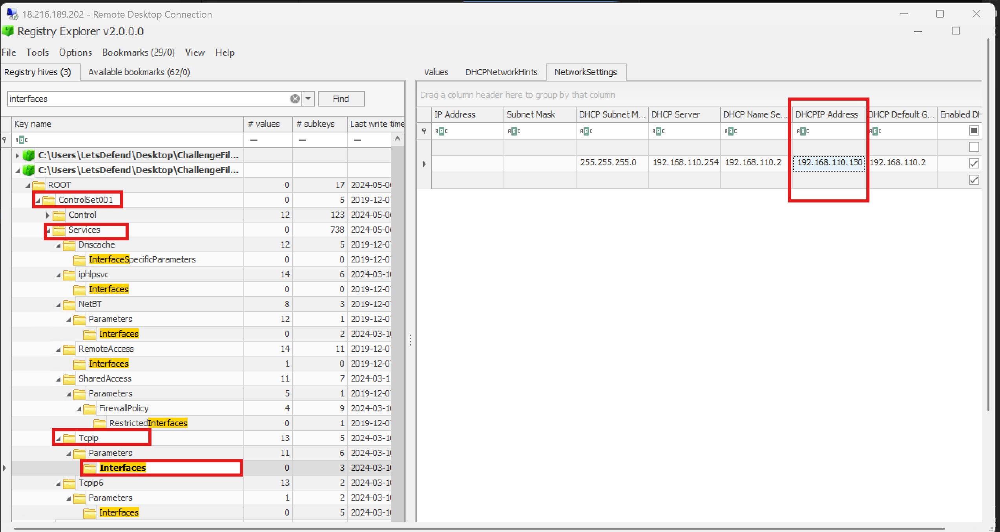

---

## 4. We suspect the user may have some video games on their work PC. What is the name of the game?

Now this is where things get interesting and where we switch tools entirely. 
For this one, we're bringing in **ShellBags Explorer**.

For those unfamiliar: ShellBag artifacts are created every time a user browses 
a folder in Windows File Explorer. Windows stores these to remember how you had 
your folders arranged (view settings, size, and so on..), but from a forensics 
standpoint, they're important because they record evidence of folder access *even 
if the folder itself was later deleted*. Think of them as footprints left behind 
in the registry even after someone tried to clean up.

The hive we're interested in here is **UsrClass.dat**, which is the user-specific 
hive that stores ShellBags data (among other things). I loaded it offline from:
```
C\Users\Administrator\AppData\Local\Microsoft\Windows\UsrClass.dat
```

After parsing, ShellBags Explorer found **26 shellbags** total. Expanding 
through the folder tree under Documents, I found a folder called `Play`, and 
inside that - **Rainbow Six Siege**.

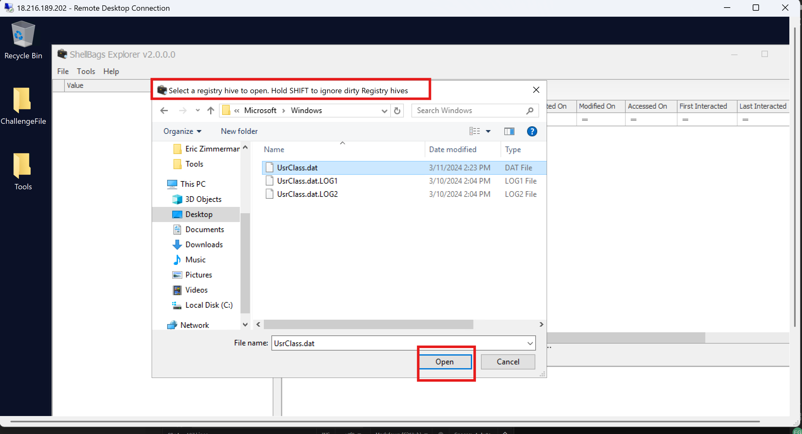
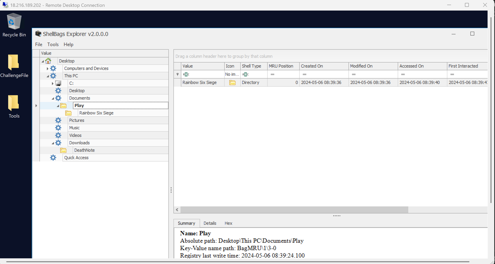

Now tbh, I wasn't 100% certain at first glance. But two things confirmed it:
- The answer format matched exactly with `Rainbow Six Siege`
- A quick Google search confirmed it's indeed a game (and a pretty popular one at that)

The takeaway here is that even if a user deleted that folder trying to hide 
evidence of having games on their work PC, the ShellBag artifact still preserved 
the folder name in the registry. That's exactly why this artifact is so valuable.

---

## 5. There was a file executed from the Downloads directory. What is the modification time of the said file?

For execution evidence tied to file paths and timestamps, we turn to 
**Shimcache** (also called AppCompatCache). Quick refresher: Shimcache is a 
Windows artifact that records executables that were either run *or* just viewed in 
File Explorer. It's important to remember that shimcache alone can't confirm 
execution - it just proves the file existed and was visible. But it's still very 
useful for pinpointing a time window.

To parse this, I used **AppCompatCacheParser** (one of Eric Zimmerman's CLI tools) 
via Git Bash with admin privileges:

```bash
./AppCompatCacheParser.exe -f "C:\Users\LetsDefend\Desktop\ChallengeFile\C\Windows\System32\config\SYSTEM" --csv "C:\Users\LetsDefend\Desktop" --csvf file.csv
```

Breaking that down for anyone new to this:
- `-f` points to the SYSTEM hive of our challenge file (on a live system you'd omit this and it would use the live hive automatically)
- `--csv` specifies where to save the output
- `--csvf` names the output file

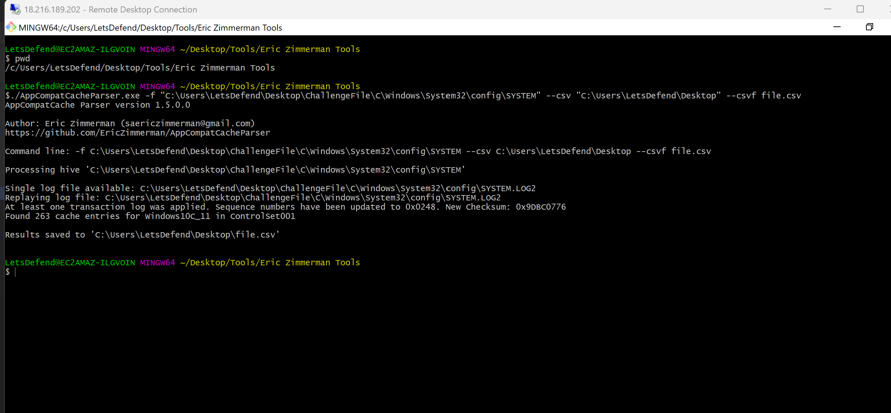

Once the CSV was generated, I opened it in **Timeline Explorer** (another EZ tool but much cleaner than Excel and read-only, so no accidental edits).

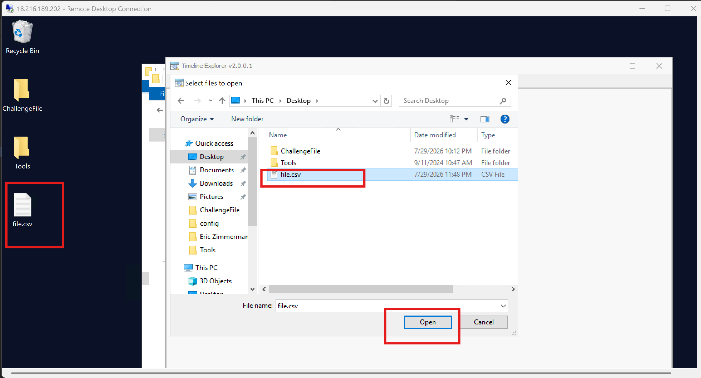

I then searched for `Downloads` and spotted the executable file within the Downloads 
directory. Right next to the path was the last modification time.. and that was 
our answer.

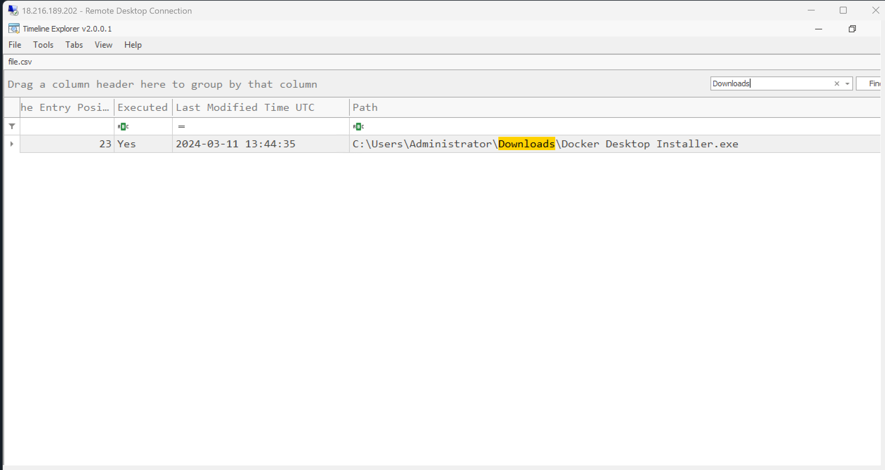

---

## 6. We believe the user installed some malicious files. What is the SHA1 hash of the malicious file?

Here's where Shimcache's biggest limitation comes in; it doesn't store file hashes. 
But that's also where **Amcache** steps in and becomes the more reliable artifact. 
Unlike Shimcache, Amcache records confirmed execution evidence *and* 
stores SHA-1 hashes of the executables, which is what makes it so powerful for 
threat hunting. You can take that hash straight to VirusTotal or Hybrid Analysis 
and know immediately if it's been flagged.

I used **AmcacheParser** (another Eric Zimmerman CLI tool) to parse the Amcache 
hive from our challenge file:

```bash
./AmcacheParser.exe -f "C:\Users\LetsDefend\Desktop\ChallengeFile\C\Windows\AppCompat\Programs\Amcache.hve" --csv "C:\Users\LetsDefend\Desktop" --csvf file2.csv
```

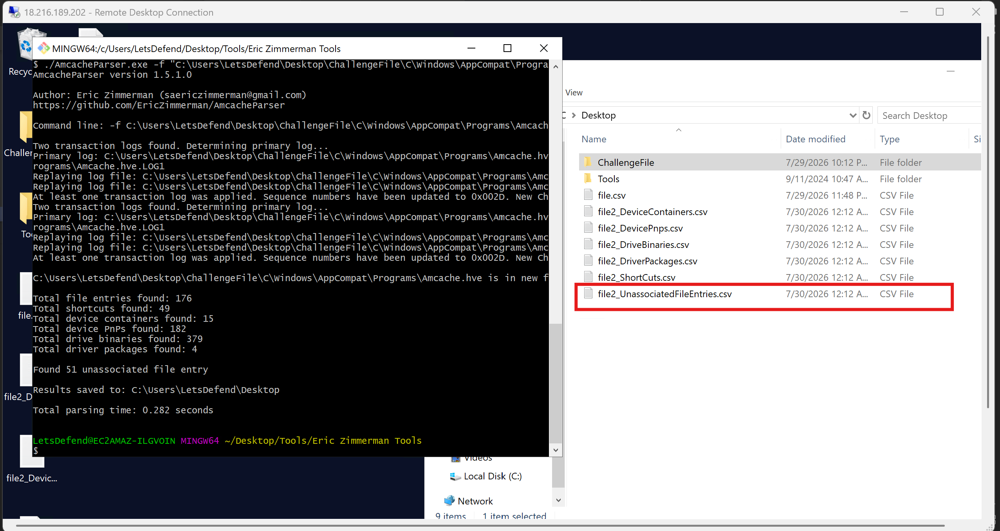

This produced several CSV files, but the one we care about is 
`file2_UnassociatedFileEntries.csv` - these are executables that ran but aren't associated with a formally installed application, 
which makes them immediately more suspicious.

I opened it in Timeline Explorer and started filtering. Given what we found earlier (the game in Documents/Play and activity in the Downloads folder), 
I searched `Downloads` first - and found 5 executable files. One of them stood out: **deathnote.exe** in a folder called `deathnote`. I mean... if that doesn't 
raise an eyebrow, I don't know what will.

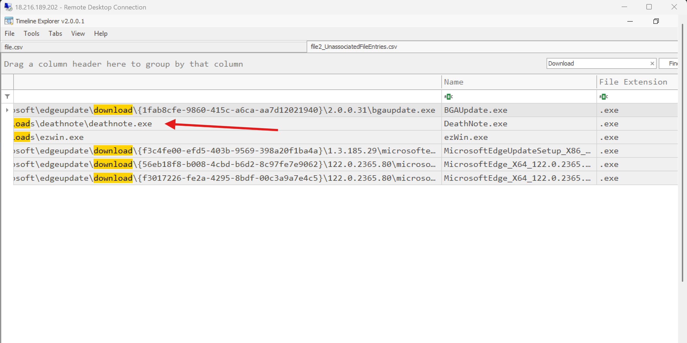

The SHA-1 hash for `deathnote.exe` was right there in the corresponding column.

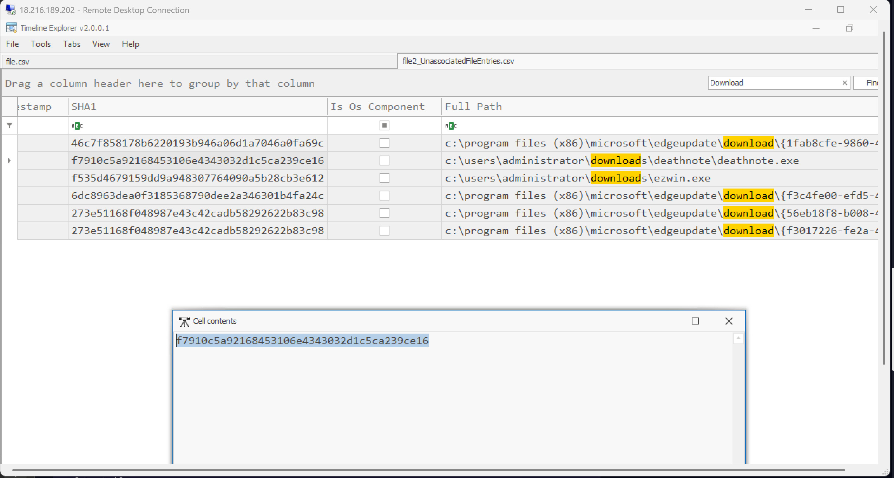

---

## 7. What is the malware family name of that file?

Now that we have the SHA-1 hash, this part is straightforward. We take the hash and run it through a threat intelligence platform. 
I used **Hybrid Analysis**, and the result came back labelling the sample as `Gen:Variant.Jaik` - making the malware family **Jaik**.

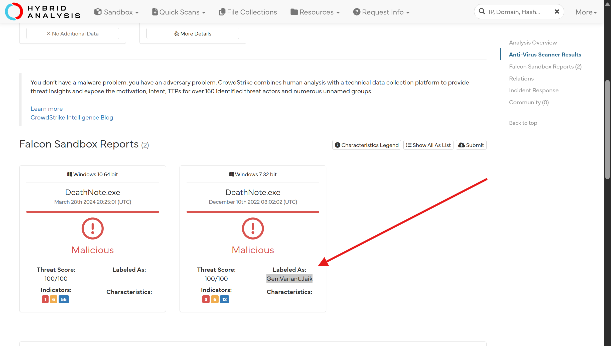

---

## 8. The user opened a file on 2024-05-06 06:39:09. What is the name of that file?

For this one, we need to look at **RecentDocs** which is the Windows artifact that tracks recently accessed files of all types. 
This is stored in the user's **NTUSER.DAT** hive. It's worth noting that this artifact records *evidence of access*, not just execution - 
so even if a user simply opened, renamed, or modified a file, it gets recorded here.

I loaded NTUSER.DAT from:
```
C:\Users\LetsDefend\Desktop\ChallengeFile\C\Users\Administrator\NTUSER.DAT
```

Rather than manually expanding the full tree, I searched for `recentdocs` to jump straight to the key. From there, I looked through 
the `Opened On` column for the exact timestamp given in the question (**2024-05-06 06:39:09**) and the associated filename was right there.

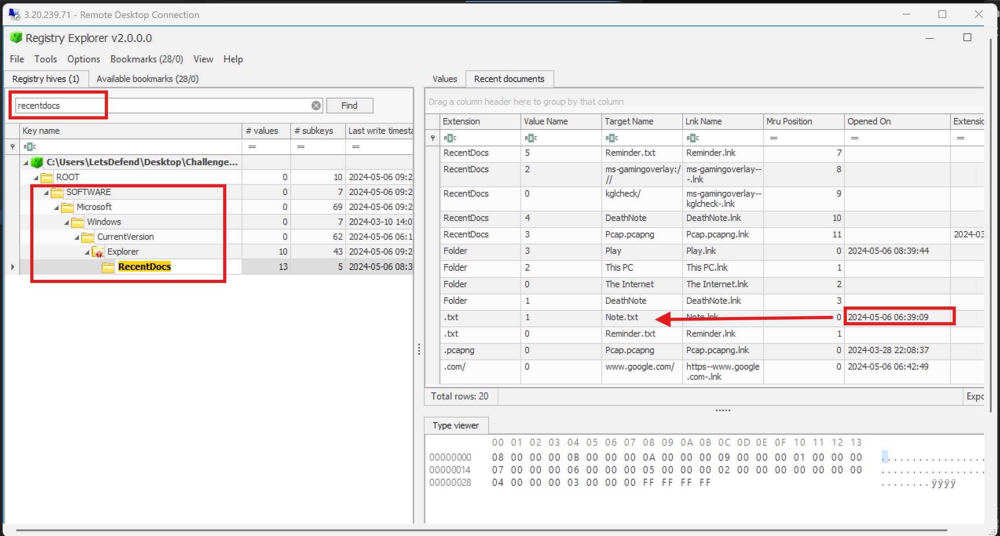

---

## 9. The user opened MSPaint on their work PC. Can you determine the exact time it happened?

MSPaint opening through a dialog box means we want to look at the **Dialog Box MRU** (Most Recently Used) artifacts. 
These record file paths and executables accessed through Windows Explorer dialog prompts - things like file open/save dialogs 
triggered from within an application.

Still in Registry Explorer with NTUSER.DAT loaded, I first tried searching for `opensavepid` to find the OpenSavePidlMRU key 
directly but got nothing. So I switched approach and browsed through the **Bookmarks** menu in Registry Explorer, then selected MRU from there.

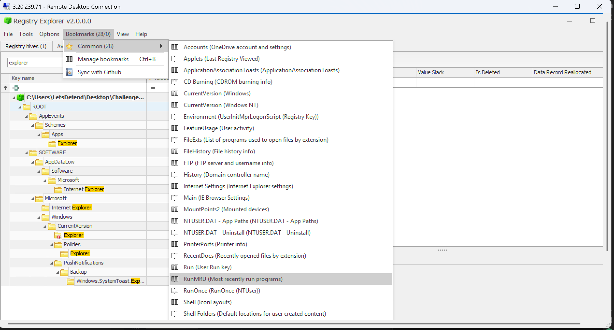

 `mspaint.exe` was listed as an executable with a value name of `c`, along with the exact timestamp it was opened.

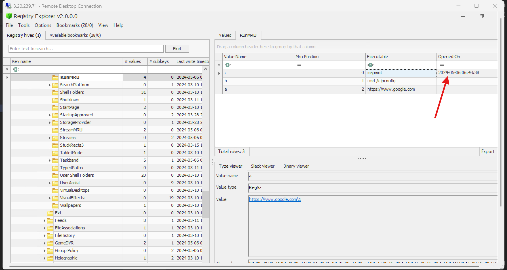

---

## 10. How long did the user have MSPaint open?

For application usage duration, we need to check **UserAssist** - a registry key that tracks GUI-based program execution, including how long each 
application was in focus. This is different from just knowing *when* something was opened; it tells you *how long* the user actively had it open.

The key is located at:
```
NTUSER.DAT\SOFTWARE\Microsoft\Windows\CurrentVersion\Explorer\UserAssist
```

I searched for `userassist` in Registry Explorer to get there quickly. In the results, the `FocusTime` column gives us the 
duration the application was in active use - and for MSPaint, it showed **1 minute and 3 seconds**, which formatted to the 
required answer format is **01:03**.

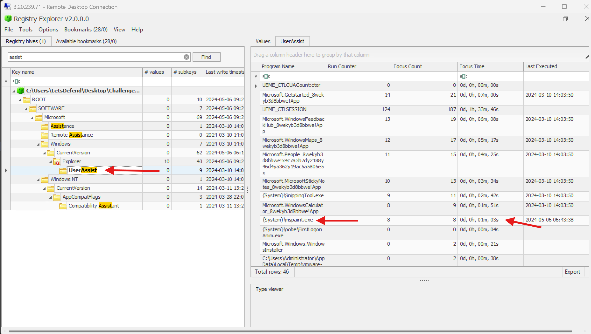

---

## Challenge Complete 


And that's a wrap on this one! This challenge was a great full walkthrough of Windows Registry Forensics.. from user account 
investigation with the SAM hive, to network config in SYSTEM, execution evidence via Shimcache and Amcache, file access history in RecentDocs, 
and application usage tracking through UserAssist.

If you enjoyed this writeup, consider following me on Medium or GitHub for more content like this. 

Until next time, happy hunting.

Peace.