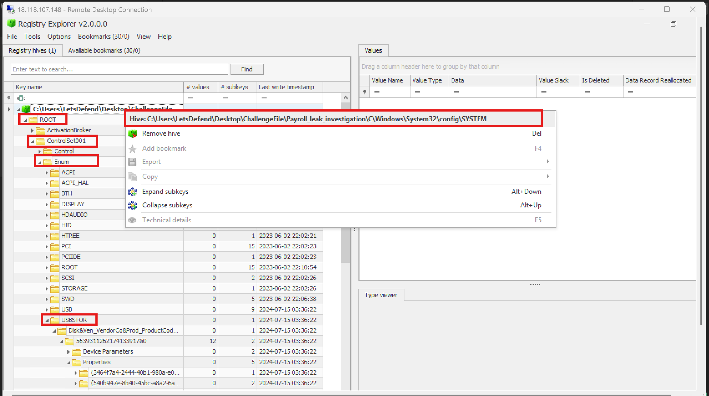
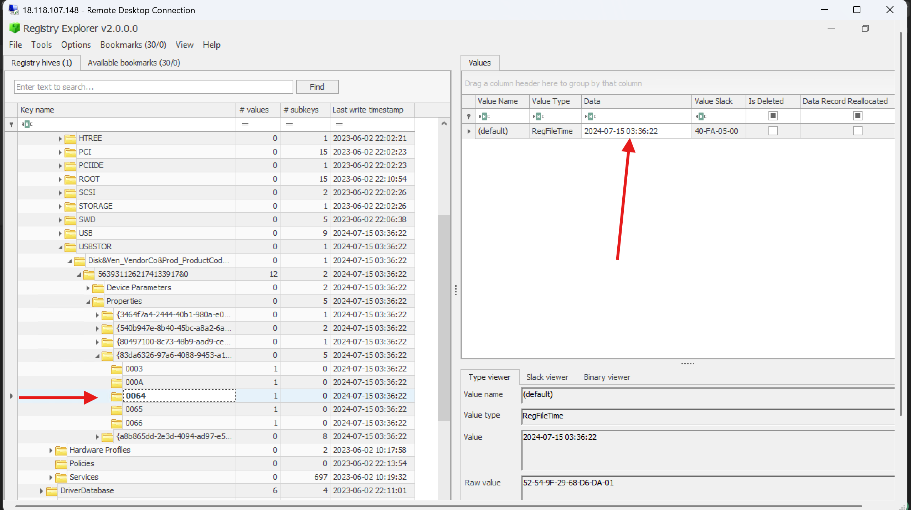
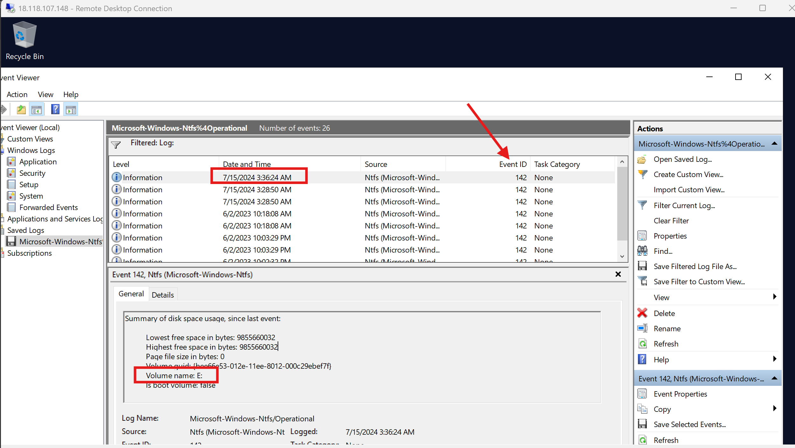
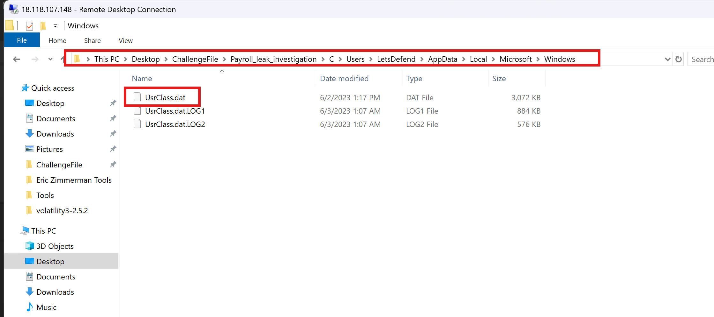
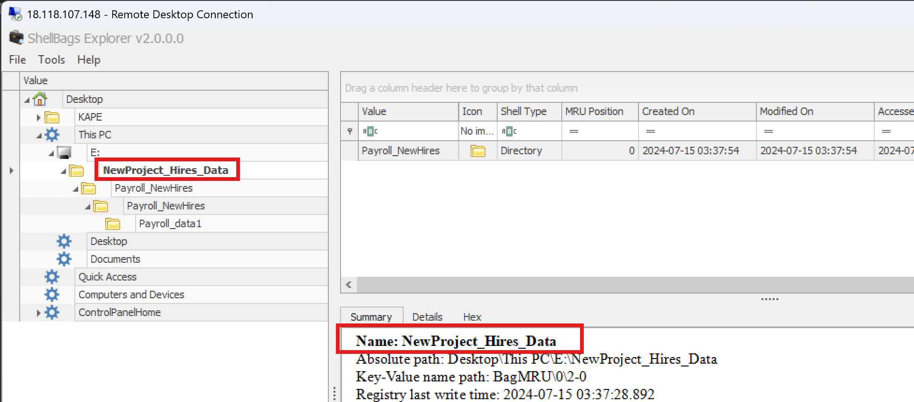
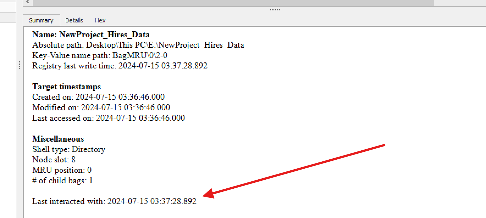
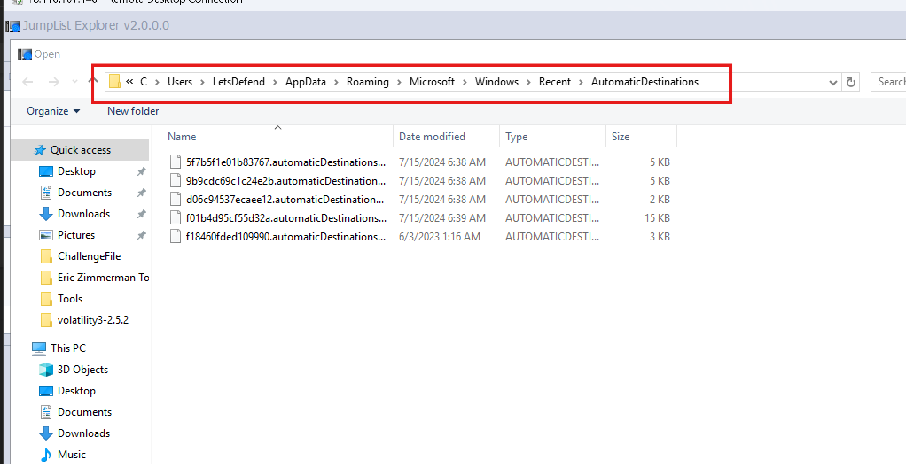
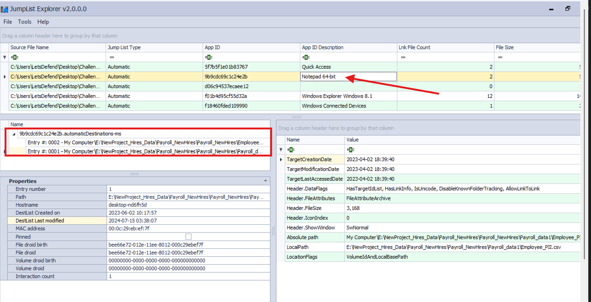
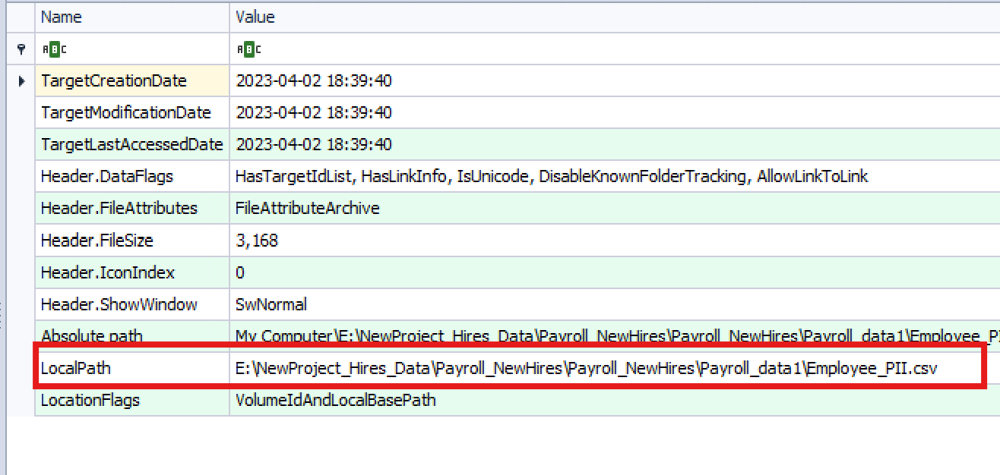
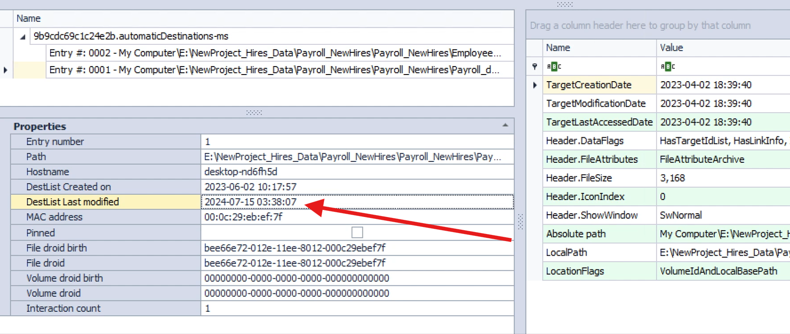

# LetsDefend USB Forensics Challenge

## Scenario
As a Digital Forensics and Incident Response (DFIR) analyst, we have been tasked with investigating a suspected 
insider data leak involving a Windows endpoint. Triage artifacts from the affected system have already been 
collected, and our objective is to determine whether a USB storage device was used to access or exfiltrate 
sensitive company data.


Windows leaves behind numerous forensic artifacts whenever removable storage devices are connected to a system. 
By examining the evidence, we can reconstruct a detailed timeline showing when the USB device was connected, 
what folders were browsed, what files were opened, and even which application was used to access them.


Let's begin the investigation..

---

## When was the USB device first connected?

To answer this question, we begin by examining the Windows Registry since it stores valuable information about 
hardware devices that have interacted with the system. Specifically, we load the **SYSTEM** registry hive into 
**Registry Explorer**.

The SYSTEM hive is located at:

```text
C:\Windows\System32\Config\SYSTEM
```

But for this challenege purposes, located in the path as shown in the screenshot below..



When investigating USB activity, there are two registry locations that are commonly encountered:

- **USB** - Stores information about every USB device connected to the computer, including keyboards, mice, webcams, and storage devices.
- **USBSTOR** - Specifically stores information about USB mass storage devices such as flash drives and external hard drives.

Since we're investigating a USB storage device, we focus on the **USBSTOR** key.

After expanding the **USBSTOR** key, we open the device subkey (the one beginning with **83DA...**). Within it, we 
locate two important subkeys named **0064** and **0066**.

The **0064** key records the device's connection timestamp, while **0066** records its disconnection timestamp.

Inspecting the timestamp associated with the **0064** key reveals that the USB device was first connected on:

**Answer**

```text
2024-07-15 03:36:22
```



---

## What is the serial number assigned to the USB device?

Since we're already inside the **USBSTOR** registry key from the previous question, we don't need to load another 
artifact.

Windows stores the USB device's serial number as the name of the second subkey beneath the device description.

The hierarchy looks like this:


Initially, I copied the entire subkey name into LetsDefend, but it returned an incorrect answer.

Looking more closely, I noticed that the registry key ended with **`&0`**. The portion after the ampersand (&)
is not part of the actual USB serial number, so removing everything beginning with the ampersand 
resulted in the correct answer.

**Answer**

```text
5639311262174133917
```

---

## What Volume Drive Letter was assigned to the USB device?

For this question, we shift our attention from the Registry to the Windows Event Logs.

I loaded the **Microsoft-Windows-NTFS/Operational** log into **Event Viewer** and filtered the events using Event ID: 142.

Event ID **142** records NTFS volume mounting operations, making it extremely useful when determining which 
drive letter Windows assigned to an external storage device.

Reviewing the event details according to the time identified in the previous question shows that Windows mounted the USB device using the following drive letter:

**Answer**

```text
E:
```



---

## What was the name of the folder on the USB device where stolen data was placed?

Simply confirming that a USB drive was connected isn't enough to prove data theft. We also need evidence showing 
what the user actually browsed on the USB device.

To do this, we examine **ShellBags**.

ShellBags are Windows Registry artifacts that record folders opened through Windows File Explorer. They preserve 
folder navigation history even after the USB device has been removed.

Most ShellBag entries are stored inside the user's **UsrClass.dat** file, located under:

```text
C:\Users\<username>\AppData\Local\Microsoft\Windows\UsrClass.dat
```

In this challenge, located at:



I loaded the **UsrClass.dat** file into **ShellBags Explorer** and reviewed the recovered folder entries, then expanded the drive E:
which was identified earlier. Among the folders listed was :

**Answer**

```text
NewProject_Hires_Data
```

This indicates that the user navigated into this folder through Windows File Explorer.



---

## At what time was this folder browsed?

Since we're already examining the ShellBag entry from the previous question, we simply inspect its associated 
timestamps.

Each ShellBag entry records metadata describing when that folder was accessed through File Explorer.

Reviewing the timestamps shows that the folder was browsed at:

**Answer**

```text
2024-07-15 03:37:28
```

This adds another important event to our forensic timeline.



---

## Which tool was used to open the stolen files containing sensitive information?

Next, we investigate **Jump Lists**.

Jump Lists provide a history of files recently opened by applications, making them incredibly useful 
during forensic investigations because they allow us to identify which program accessed a particular file, 
even after the USB drive has been removed.

The Jump List artifacts are located under: `AppData\Roaming\Microsoft\Windows\Recent\AutomaticDestinations` and `AppData\Roaming\Microsoft\Windows\Recent\CustomDestinations`



I loaded these artifacts into **JumpList Explorer** and searched for entries associated with the USB device.

Reviewing the recovered information reveals that the stolen files were opened using:

**Answer**

```text
Notepad 64-bit
```



---

## What is the full path of the file containing the PII data of employees?

While still inside **JumpList Explorer**, selecting the relevant Jump List entry provides a detailed view 
containing additional metadata about the accessed file.

Among the information displayed is the complete path to the file that was opened from the USB drive.

The full path is:



**Answer**

```text
E:\NewProject_Hires_Data\Payroll_NewHires\Payroll_NewHires\Payroll_data1\Employee_PII.csv
```

This confirms that the user accessed employee payroll information stored on the USB device.

---

## At what time was the file containing the PII data opened?

Since we're already examining the same Jump List entry, we inspect its recorded timestamps.

Each Jump List entry stores timestamps indicating when the associated file was opened by its application.

Reviewing the timestamp shows that the employee PII file was opened at:



**Answer**

```text
2024-07-15 03:38:07
```
This represents the final significant event in our investigation and provides strong evidence that the insider 
accessed sensitive employee information stored on the USB device.


---

### Investigation Timeline

| Time | Event |
|------|-------|
| **2024-07-15 03:36:22** | USB storage device connected |
| **2024-07-15 03:37:28** | User browsed the `NewProject_Hires_Data` folder |
| **2024-07-15 03:38:07** | Employee_PII.csv opened using Notepad 64-bit |

---

### Key Forensic Artifacts Used

| Artifact | Purpose |
|----------|---------|
| **SYSTEM Registry Hive (USBSTOR)** | USB connection history, serial number, connection and disconnection timestamps |
| **NTFS Operational Event Logs (Event ID 142)** | Determines the drive letter assigned to the USB device |
| **ShellBags (UsrClass.dat)** | Records folder browsing activity through Windows File Explorer |
| **Jump Lists** | Reveals recently opened files, associated applications, file paths, and timestamps |

---


By correlating evidence from multiple Windows forensic artifacts, we successfully reconstructed the user's 
interaction with the USB storage device. The Registry established when the device was connected and identified 
its serial number, the NTFS Operational logs revealed the assigned drive letter, ShellBags confirmed which 
folders were browsed, and Jump Lists showed exactly which sensitive file was opened, when it was accessed, and 
the application used to view it.

Together, these artifacts provide a clear forensic timeline demonstrating that the USB device was used to access 
sensitive employee payroll data, supporting the investigation into the suspected insider data leak.

Peace.

