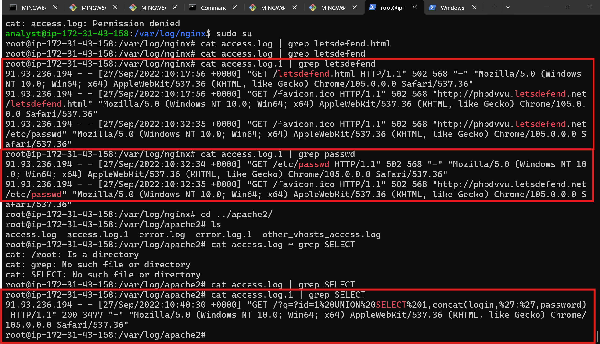
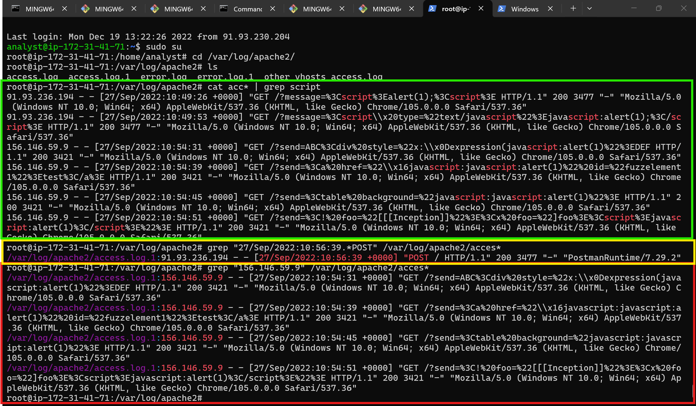
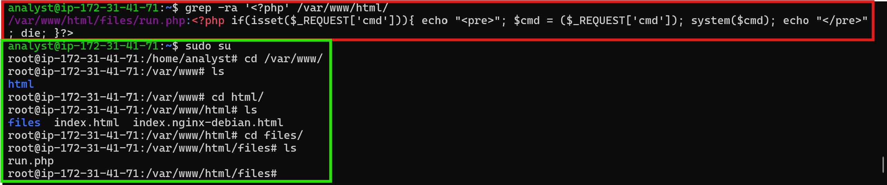

# Hacked Web Server Analysis — Summary Notes

## Table of Contents

1. [Introduction & Web Server Log Analysis](#1-introduction--web-server-log-analysis)
   - Log analysis fundamentals
   - Apache
   - Nginx
   - IIS
   - Questions & methodology
2. [Attacks on Web Servers](#2-attacks-on-web-servers)
   - Tomcat
   - GlassFish
   - JBoss
   - Questions
3. [Attacks Against Web Applications](#3-attacks-against-web-applications)
   - SQL Injection
   - Broken Authentication
   - XSS
   - CSRF
   - Security Misconfiguration
4. [Server & Programming Language Vulnerabilities](#4-server--programming-language-vulnerabilities)
   - Apache (Shellshock)
   - IIS vulnerabilities
   - PHP
   - Java
5. [Web Shell Discovery & Hacked WordPress Investigation](#5-web-shell-discovery--hacked-wordpress-investigation)
   - Web shell hunting
   - Shell hiding techniques
   - WordPress compromise walkthrough
   - Key takeaways

---

## 1. Introduction & Web Server Log Analysis

Web services are widely targeted by attackers seeking to steal data, disrupt service, gain notoriety, or carry out illegal activity. Logs are the primary evidence trail for reconstructing what happened.

### Log Analysis Fundamentals
Three key steps to effective log analysis:
1. **Accessing the logs**
2. **Determining the purpose** of the analysis (what you're looking for)
3. **Extracting/filtering** the relevant records for that purpose

Note: requests sent via **POST** are often not captured in standard access logs by default. Modules like `mod_forensic` or `mod_security` can capture this data; otherwise, raw network traffic (e.g., via Wireshark) must be inspected.

### Apache
Logs are stored at `/var/log/apache2/`:
- `access.log` — records of all requests (IP, method, path, timestamp, user-agent, status code)
- `error.log` — records of server-side errors (e.g., failed directory access)

Example investigation — **SQL Injection**:

```bash
cat access.log
```

Search for common SQL injection indicators:

```bash
cat access.log | grep -E "%27|--|union|select|from|or|@|version|char|varchar|exec"
```

Filter for successful (HTTP 200) responses to confirm a successful injection:

```bash
cat access.log | grep 200
```

Decoding the captured URL reveals payloads such as:
```
/cat.php?id=1 UNION SELECT 1,concat(login,':',password),3,4 FROM users;
```

Check whether the attacker accessed the admin panel:

```bash
cat access.log | grep 192.168.2.232 | grep admin/index.php
```

POST requests to the admin panel (visible in Wireshark) confirm successful login.

### Nginx
Logs stored at `/var/log/nginx/` (`access.log`, `error.log`), same structure as Apache.

Example investigation — **Directory Traversal** (`../` or `..\`):

```bash
cat access.log | grep ../
```

This can reveal attempts to read files like `/etc/passwd`, followed by the attacker retrieving the page with `wget`.

### IIS
Log files are stored at:
```
C:\inetpub\logs\LogFiles\W3SVC1
```

### Questions & Methodology (Nginx/Apache Log Practice)

**1. In what year was the request made to the "/letsdefend.html" path of the Nginx web server?**
Found by grepping the Nginx `access.log` for the `/letsdefend.html` path and reading the timestamp field of the matching entry.

**2. What is the IP address trying to read the /etc/passwd file on the Nginx web server?**
Found via the `../` directory traversal grep shown in the Nginx section above — the IP tied to the repeated traversal attempts against `/etc/passwd` is the answer.

**3. What is the IP address that attempted SQL injection attack on Apache2 web server?**
Found via the SQL injection detection grep pattern shown in the Apache section above — the IP repeating the injection payloads is the answer.

*Combined methodology for all three questions above:*



---

**Additional practice questions (XSS-focused):**

**1. The attacker with the IP address "91.93.236.194" made various XSS attempts on the Apache2 server. On what September day did this attack happen? (??/Sept/2022)**
Found by searching the logs for the `script` keyword, which is present in most XSS attempts, then reading the date from the matching entry for that IP.

**2. What is the name of the attack that the IP address "156.146.59.9" tried on the Apache2 web server?**
Identified as XSS by filtering the log for that specific IP address and reviewing the resulting matches.

**3. What is the User Agent information of the POST request sent to the Apache2 web server on "27/Sep/2022 10:56:39"?**
Found by filtering all logs under the Apache2 log directory for that date/time stamp combined with the POST method.

*Answers (format: Q1 highlighted in green, Q2 highlighted in red, Q3 highlighted in yellow):*



---

## 2. Attacks on Web Servers

Application servers (Tomcat, GlassFish, JBoss) can introduce vulnerabilities independent of the underlying OS or web server software.

### Tomcat
Vulnerability arises from `mod_jk` allowing **double-encoded** directory traversal:
```
".."  →  "%2e"  →  "%252e"
```

Direct access to `/manager/html` is blocked, but the encoded path bypasses the filter:
```
/examples/jps/%252e%252e/%252e%252e/manager/html
```
Default credentials grant admin access, after which a webshell can be deployed by prefixing the deploy action with the traversal path, then invoked at:
```
/examples/jsp/%252e%252e/%252e%252e/test
```

**Log Records:**

```bash
cat access.log | grep manager/html | grep 200
```

```bash
cat access.log | grep 192.168.68.1 | grep 200
```

Wireshark filter to inspect the relevant POST (webshell/WAR upload):
```
ip.src == 192.168.68.1 && http.request.method == POST
```

**Protection:** Update `mod_jk`.

### GlassFish
Covers **CVE-2011-0807** (remote code execution). Exploited via Metasploit:
```
exploit/multi/http/glassfish_deployer
```
Workflow: nmap scan → identify GlassFish 2.1 → select/configure exploit in `msfconsole` → run → obtain Meterpreter session.

**Log Records:** `netstat -an` reveals a suspicious connection on port 4444. Network traffic shows three GET requests followed by heavy TCP traffic on port 4444 — Metasploit's traffic is AES-encrypted, so command content isn't recoverable from the wire.

**Protection:** Avoid default credentials; keep software updated.

### JBoss
Covers remote code execution in JBoss AS versions 3–6 (target: JBoss 6 on Ubuntu 14.04), using Exploit-DB ID 36575:

```bash
python 36575.py http://192.168.2.105:8080
```

Post-exploitation commands run: `whoami`, `uname -a`.

**Log Records:** Requests reveal parameters like `id`, `whoami`, `uname -a`, hitting the path `/jbossass/jbossass.jsp`.

Locate the planted file on disk:

```bash
find /opt/jboss-6.0.0.Final/ -type f -name "jbossass.jsp"
```

Inspection confirms it is a webshell.

**Protection:** Upgrade to JBoss EAP 7; avoid running services with unauthorized/excessive user privileges.

---

## 3. Attacks Against Web Applications

### SQL Injection
Manipulating SQL queries via injected parameters to leak or alter database data.

**Detection payloads:**
```
'
?id=6 ORDER BY 6--
?id=6 UNION SELECT 1,null,null--
```

**Logic-based tests:**
```
test.php?id=6
test.php?id=7-1
test.php?id=6 OR 1=1
test.php?id=6 OR 11-5=6
```

**Time-based tests:**
```
SLEEP(25)--
SELECT BENCHMARK(1000000,MD5('A'));
userID=1 OR SLEEP(25)=0 LIMIT 1--
userID=1) OR SLEEP(25)=0 LIMIT 1--
userID=1' OR SLEEP(25)=0 LIMIT 1--
userID=1') OR SLEEP(25)=0 LIMIT 1--
userID=1)) OR SLEEP(25)=0 LIMIT 1--
userID=SELECT SLEEP(25)--
```

**Example exploitation payload:**
```
' or 0=0 union select null, version() #
```
This bypasses the expected query logic (`or 0=0` always true), appends a `UNION SELECT` to leak the DB version, and comments out the remainder with `#`.

**Log detection command:**

```bash
cat access.log | grep -E "%27|--|union|select|from|or|@|version|char|varchar|exec"
```

**Protection:**
- Use prepared statements
- Validate/sanitize input
- Filter sent data
- Restrict database user privileges

### Broken Authentication and Session Management
Weaknesses in session handling allow account takeover without credentials.

**Example:** A session cookie value matching the username (e.g., `user1`) is manually changed to `admin` in the browser/request, granting access to the admin account without authentication.

**Log Records:** Standard logs show nothing unusual (login as `user1` looks normal); the anomaly is only visible by comparing cookie values across requests from the same IP in raw network traffic.

**Protection:**
- Strong authentication & session management
- Prevent XSS (a common vector for cookie theft)

### Cross-Site Scripting (XSS)
Injecting HTML/JavaScript that executes in victims' browsers — used for actions like cookie theft or redirection. Common in input fields (search boxes, comments, guestbooks, registration forms).

**Example payload:**
```html
"><script>alert(1)</script>
```

**Log detection command:**

```bash
cat access.log | grep -E "%3C|%3E|alert|script|src|cookie|onerror|document"
```

**Protection:**
- Validate input type
- Prefer whitelisting over blacklisting

### Cross-Site Request Forgery (CSRF)
Tricks an authenticated victim into unknowingly submitting a request (e.g., via a hidden form/button on a malicious page) that performs an action on their behalf, such as changing their password.

**Protection:**
- Framework-provided CSRF protections
- CSRF tokens tied to session

### Security Misconfiguration
Caused by default, weak, or improperly configured settings — e.g., an admin account left with default/unchanged credentials, allowing trivial login.

**Protection:**
- Change default configurations
- Keep software up to date
- Disable unused services/ports

---

## 4. Server & Programming Language Vulnerabilities

### Apache — Shellshock (CVE-2014-6271)
Affects systems using `mod_cgi`/`mod_cgid` with Bash versions 1.14–4.3. Exploited by injecting a malicious function definition into the `User-Agent` (or other environment variable) passed to CGI scripts.

**Example (reading `/etc/passwd` remotely):**

```bash
echo -e "HEAD /cgi-bin/status HTTP/1.1\r\nUser-Agent: () { :;}; echo \$(</etc/passwd)\r\nHost: TARGET_ADDRESS\r\nConnection: close\r\n\r\n" | nc TARGET_ADDRESS 80
```

**Log Records:** A HEAD request to `/cgi-bin/status` stands out, along with `/etc/passwd`-related content in the traffic/response.

**Protection:**

```bash
sudo apt-get update && sudo apt-get install --only-upgrade bash
```

### IIS Web Server Vulnerabilities

**MS15-034** — Remote code execution via a crafted HTTP `Range` header, affecting IIS on Windows 7 / Server 2008 R2 / 8 / Server 2012 / 8.1 / Server 2012 R2 (HTTP.sys).

Test for the vulnerability:

```bash
wget --header="Range: bytes=0-18446744073709551615" http://192.168.10.169/welcome.png
```
A `416 Requested Range Not Satisfiable` response confirms exposure. A follow-up request with an adjusted range can trigger denial-of-service/overload conditions:

```bash
wget --header="Range: bytes=18-18446744073709551615" http://192.168.10.169/welcome.png
```

**Protection:** Apply Windows security updates.

**CVE-2017-7269** — Buffer overflow in the `ScStoragePathFromUrl` function of IIS 6.0's WebDAV service (Windows Server 2003 R2). Exploitable via Metasploit's `iis_webdav_scstoragepathfromurl` module, yielding a Meterpreter session.

### PHP — CVE-2016-10033
Remote code execution in PHP's `mail()` function / PHPMailer library, due to insufficient validation of extra parameters.

Reference exploit: `https://github.com/opsxcq/exploit-CVE-2016-10033`

**Log Records:** GET requests to a planted `backdoor.php` file; commands are often base64-encoded within requests and must be decoded to reveal attacker activity.

**Protection:** Update PHP (affects versions 5.2.18 and below).

### Java — Play Framework Session Injection
Exploits how the framework encodes/parses session data. By registering a user and appending a null-byte-separated admin parameter to the username field:
```
%00%00admin%3a1%00
```
the server misinterprets the session as belonging to `admin:1`, granting admin rights.

**Log Records:** Registration appears normal in logs, but inspecting the session cookie value reveals the injected parameter.

**Protection:** Apply the vendor patch/update that fixes the session encoding issue.

---

## 5. Web Shell Discovery & Hacked WordPress Investigation

### Web Shell Hunting
Web shells (e.g., c99, r57) grant the uploader continued control over a compromised server. PHP shells typically rely on functions such as `system()`, `shell_exec()`, `eval()`, `passthru`, `phpinfo`, `base64_decode`, `chmod`, `mkdir`, `fopen`, `fclose`, `readfile`, and `php_uname`.

Search for a simple indicator function:

```bash
grep -Rn "system *(" /var/www
```

Broader scan across common webshell functions:

```bash
grep -RPn "(passthru|shell_exec|system|phpinfo|base64_decode|chmod|mkdir|fopen|fclose|readfile|php_uname|eval) *\(" /var/www
```

### Practice Questions

**1. There is a PHP shell on the server. What is the filename of this shell?**
Webshells rely on specific PHP functions to execute system commands, so the following command was used:

```bash
grep -rniE '(eval|passthru|shell_exec|system|base64_decode)\s*\(' /var/www/html/
```

Alternatively, this command can also be used:

```bash
grep -ra '<?php' /var/www/html/
```

**2. Is there a webshell hidden in the image on the server?**
There was no image found on the server.

*Answers (format: Q1 highlighted in red, Q2 highlighted in green):*



### Shell Hiding Techniques
Attackers use several methods to evade detection/firewalls:
1. **Remote summoning** — the shell isn't hosted locally; code is pulled from a remote address and executed on the target.
2. **Encrypted code** — the shell's source is encrypted/obfuscated to bypass filtering.
3. **Hiding in an image** — malicious code is embedded in an image's EXIF metadata (via `exiftool`), then read and executed by a small PHP loader script.

When hunting hidden shells, also scan for `exif_read_data()` and `preg_replace()` usage, in addition to the standard function list above.

### WordPress Compromise Walkthrough
Full post-compromise analysis of a hacked WordPress server:

1. **Check for admin panel access attempts:**

```bash
cat access.log | grep POST | grep wp-login
```

2. **Inspect network traffic for POST data to the login page** (Wireshark):
```
ip.src == 192.168.2.232 && ip.dst == 192.168.2.31 && http.request.method == POST
```
This reveals a **brute-force attack** against `wp-login`, ultimately succeeding with credentials `admin:admin`.

3. **Check `error.log`** for anomalies — reveals an attempt to trigger `fsockopen()`, and a request to a nonexistent path:
```
/words/test123123
```
Instead of the default 404 page, the attacker had modified the custom 404 error page to include malicious code that opens a backdoor listener on port 1234, granting `www-data`-level access.

4. **Review commands executed as `www-data`** — the attacker read `wp-config.php`, discovered that the database password matched the root user's password, and used it to escalate to **root**, fully compromising the server.

### Key Takeaways
- Effective log analysis and network traffic review are essential to detect and reconstruct attacks.
- Understanding common attack vectors (SQLi, XSS, CSRF, traversal, RCE, shell uploads) is a prerequisite for spotting them in logs.
- Vulnerabilities can originate from the web server, the application server, the programming language, or the application itself.
- Keeping all components (OS, web server, app server, language runtime, CMS/plugins) updated, and avoiding default/reused credentials, closes the majority of the attack paths described above.