# Forensic Acquisition and Triage - Summary Notes

## Table of Contents

1. [Introduction to Forensic Acquisition & Triage](#1-introduction-to-forensic-acquisition--triage)
   - Scenario walkthrough
2. [Acquiring Memory Images (Windows & Linux)](#2-acquiring-memory-images-windows--linux)
   - Belkasoft Live RAM Capturer
   - FTK Imager
   - AVML (Linux)
3. [Custom Imaging & Mounting with FTK Imager](#3-custom-imaging--mounting-with-ftk-imager)
   - Building a custom image
   - Mounting an image
   - Questions & methodology
4. [KAPE Targets for Acquisition](#4-kape-targets-for-acquisition)
   - Target collection concept
   - Running an acquisition
   - Questions & methodology
5. [KAPE Modules for Triage and Analysis](#5-kape-modules-for-triage-and-analysis)
   - Modules, EZTools, bin, compound modules
   - Running acquisition + triage together
   - Questions & methodology
6. [Triage Using FireEye Redline](#6-triage-using-fireeye-redline)
   - Collector types
   - Running a collector & analyzing a session
   - Questions & methodology
7. [Acquisition and Triage of Disks Using Autopsy](#7-acquisition-and-triage-of-disks-using-autopsy)
   - Key features
   - Basic workflow

---

## 1. Introduction to Forensic Acquisition & Triage

- **Forensic acquisition (imaging)** = creating an exact bit-by-bit copy of a storage device/media (incl. deleted/unallocated space) to preserve original data for legal/investigative use. The image is hashed for integrity, and the source device is never modified. Proper chain of custody and device labeling is essential.
- **Triage** = analyzing acquired data to identify/prioritize evidence relevant to the case, using manual review and/or automated tools (keyword search, file-type filtering, pattern matching). Triage also helps isolate active malware and scope/impact the incident.
- Acquisition and triage work side by side - triage is performed on the data acquisition produces.

### Scenario Walkthrough
- SOC gets an alert: production server compromised, suspected credit-card data theft.
- **Acquisition:** Investigators use **KAPE, FTK Imager, Magnet RAM Capture** to image disks/memory across affected systems; data is hashed to preserve integrity.
- **Triage:** Investigators use **KAPE, FireEye Redline, Volatility** plus keyword/file-type filters and manual review.
- **Findings:** Initial access via phishing email; data exfiltrated over several weeks before detection; active malware found and isolated.
- Prioritizing relevant data let investigators trace attacker IPs to an individual, and use IOCs to find other compromised workstations used for lateral movement to the production server.
- **Key principle:** Minimize footprint during acquisition - any tampering can produce false evidence. Commercial tools (Belkasoft Remote Acquisition, Magnet Axiom) and most free tools leave minimal footprint; running tools from USB or a network share (rather than installing locally) further reduces footprint.
- Tools covered in this course: **FTK Imager** (Windows), **Belkasoft Live RAM Capture** (Windows), **AVML** (Linux), **KAPE** (Windows), **FireEye Redline** (Windows), **Autopsy** (Windows/Linux).

---

## 2. Acquiring Memory Images (Windows & Linux)

Memory acquisition is often done first because RAM is smaller than disk and highly volatile - it captures running processes, network connections, accessed files, and active malware.

### Belkasoft Live RAM Capturer
- Free, tiny forensic tool; extracts full volatile memory contents even against anti-debugging/anti-dumping protections, by operating in **kernel mode** (unlike FTK Imager/PMDump, which run in user mode and can be blocked by such protections).
- Compatible with Windows XP through 10, and Server 2003/2008.
- **Workflow:** download (registration required) -> run `RamCapture64.exe` as admin -> choose output path -> click **Capture** (output file is randomly named).
- Recommended for most cases due to minimal footprint.

### FTK Imager
- Free data preview/imaging tool; can image drives, CDs/DVDs, USB devices, folders/files, or capture memory.
- **Workflow:** run as admin -> **File -> Capture Memory** -> set Destination Path and filename (e.g. `.mem`, `.bin`, `.raw`) -> optionally include pagefile -> click **Capture Memory**.
- Not purpose-built for memory acquisition, so occasional errors occur - Belkasoft or Magnet RAM Capturer are considered better dedicated options.

### AVML (Linux)
- Microsoft's free, static Rust binary for x86_64 Linux userland memory acquisition - no prior knowledge of distro/kernel needed, no on-target compilation.
- Memory sources tried (in order, if unspecified): `/dev/crash`, `/proc/kcore`, `/dev/mem`.
- No dependencies; can write output directly to a remote file share to avoid touching the compromised host further.

**Workflow:**

```bash
chmod +x avml
```

Then run the binary with an output filename (e.g. `Linux_Acquisition.raw`) - it produces no console output, and completion is confirmed by listing the resulting file and checking its size.

---

## 3. Custom Imaging & Mounting with FTK Imager

Instead of a full disk image (which can take hours/days), FTK Imager can build a **custom image** containing only specific files/folders - useful for fast triage while a full image is acquired in parallel.

### Building a Custom Image
1. Run FTK Imager as admin -> **File -> Add Evidence Item**.
2. Choose evidence source type:
   - **Physical Drive** - full hardware capacity, incl. unallocated space (larger, supports deleted-file recovery)
   - **Logical Drive** - only allocated space/files
   - **Image File** - carve files from an already-acquired image
   - **Contents of a Folder** - logical space of a specific folder only
3. Select the drive (e.g. `C:\`), expand the Evidence Tree (`NONAME[NTFS] -> [root]`), and add desired files/folders (e.g. a user's Documents folder, registry hives at `%SYSTEMROOT%\config\`, or a specific PowerShell script).
4. Click **Create Image** -> **Add** destination (local or network share) -> optionally fill chain-of-custody details -> name the image (commonly date/time + hostname/IP).
5. Enable **Verify images after they are created** (integrity check) and optionally **Create directory listings of all files** (preserves original folder structure vs. flattening to root).
6. Click **Start** to build the image.

### Mounting an Image
- Mounting should be done on a **separate forensics workstation**, not the source machine.
- **File -> Image Mounting** -> add the custom (or full disk) image -> click **Mount** -> note the assigned drive letter.
- The mounted drive can then be browsed like a normal file system (data appears under `[root]`), enabling analysis without altering the original evidence.

### Questions & Methodology

**1. Mount the Lesson3.ad1 image, available at "C:\Users\LetsDefend\Desktop\Lesson 3\Lesson3.ad1" using FTK Imager. What is the file name present in the users Desktop?**
Mounted the image and navigated to the Desktop folder within the user directory to find the file.

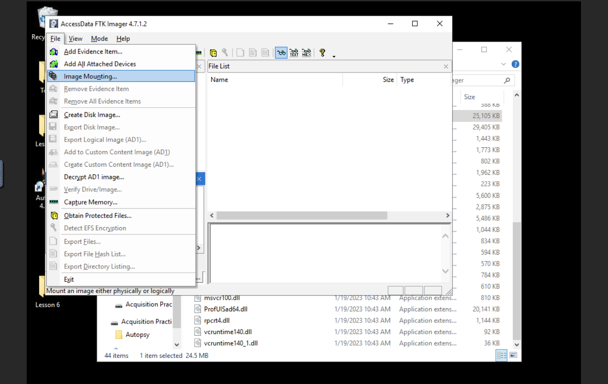
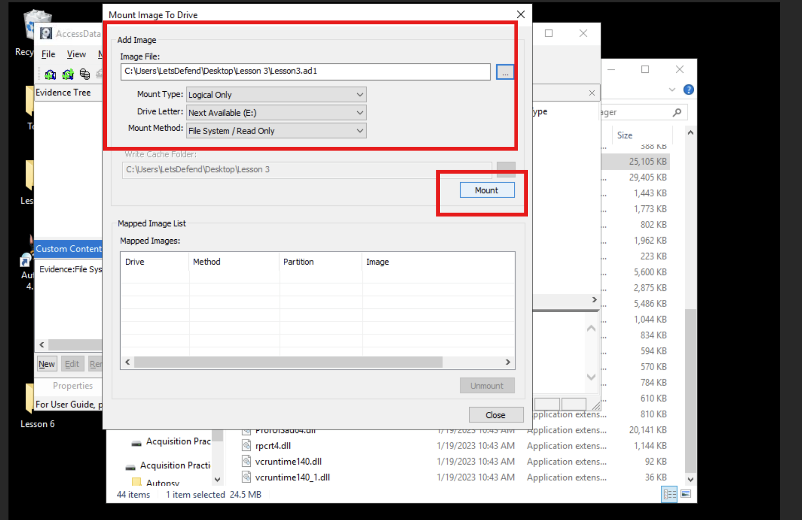
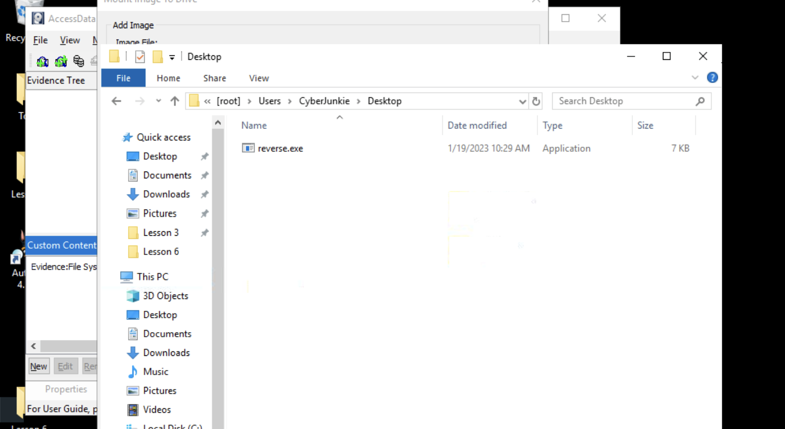

**2. What tool is the PowerShell script of in the Documents folder?**
Reading the script directly was blocked by privilege restrictions (even running Git Bash as admin), so the script was executed instead - Microsoft Defender flagged it, and its detection history revealed the associated hacktool name.

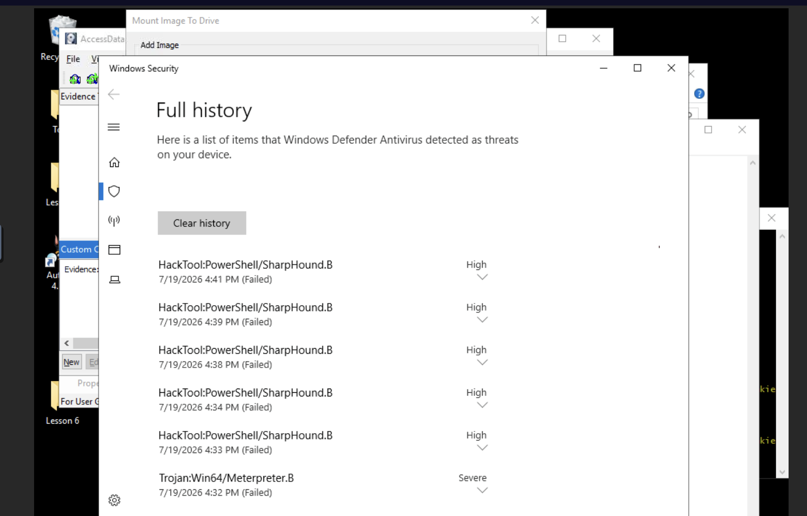

---

## 4. KAPE Targets for Acquisition

**KAPE** (Kroll Artifact Parser and Extractor) is a free, fast triage tool that targets a device/location and collects the most forensically relevant Windows artifacts in minutes, grouped into categorized directories (e.g. EvidenceOfExecution, BrowserHistory, AccountUsage) - so examiners don't need to manually know how to process each individual artifact type.

**Two phases:**
- **Targets** - file/directory specifications defining what to collect
- **Modules** - programs run against collected (or existing) data, i.e. the triage phase (covered in the next section)

### Target Collection Concept
- Config files live in KAPE's `Targets` directory, organized by category (e.g. Antivirus, Browsers, Logs, Windows, Compound).
- Target files use the `.tkape` extension and specify known artifact storage locations (e.g. `avast.tkape` lists Avast's data paths).
- **Compound targets** (e.g. `!SANS_Triage`, KAPE's own triage target) reference multiple individual target files together, collecting a broad, curated set of artifacts in one pass - these are the most commonly used for incident response.
- Locked files are queued and copied via raw disk reads if normal copying fails; original timestamps are reapplied to copied files, and metadata is logged.

### Running an Acquisition
1. Run `gkape.exe` (GUI version) as admin.
2. Enable **Use Target Options**; set **Target Source** (e.g. filesystem/Windows root) and **Target Destination**.
3. Select a target (e.g. **SANS Triage** compound target).
4. Optional settings: **Process VSCs** (include volume shadow copies), **Container** (e.g. Zip, with a base name).
5. Click **Execute** - KAPE runs via CLI in the background and completes collection (e.g. a ~2.52 GB SANS triage set collected in under 5 minutes, versus a full disk image that could reach terabytes).

### Questions & Methodology

**1. What is the full name of the target KAPE config file which tells KAPE where to find artifacts related to USB usage?**
Navigated to `KAPE/target/windows` and searched for "usb" to find the matching config file.

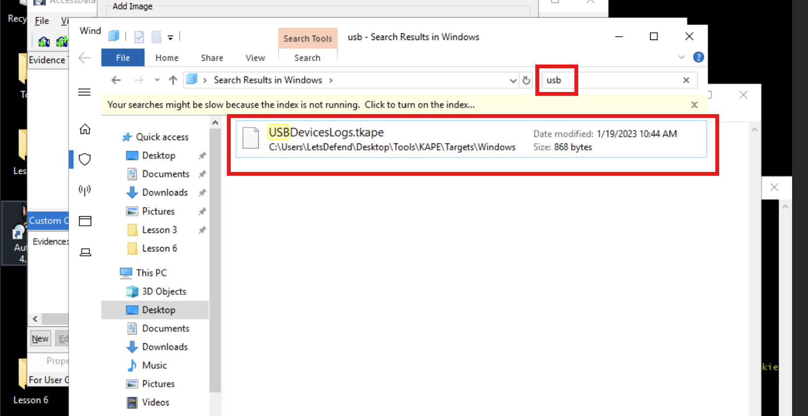

**2. Who is the author of KAPE basic collection target?**
Opened the `Compound` folder under `Targets`, then opened `!BasicCollection.tkape` in Notepad++ to read the author metadata.

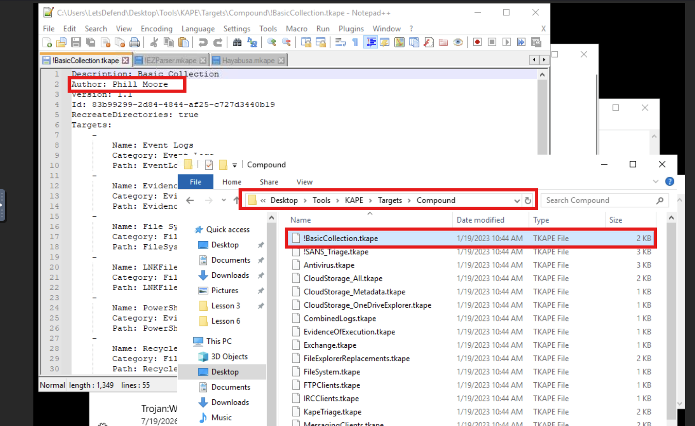

**3. Use the Compound Target module "RecycleBin" to acquire artifacts related to Recycle Bin. Specify "C:\" as Target Source, and specify the Target destination of your choice. Select ZIP as a container. Then Unzip the file after successful acquisition. And go inside the unzipped folder. What's the Folder name inside the Folder "C"?**
Followed the acquisition steps exactly as described (Target Source `C:\`, RecycleBin target, Zip container), then unzipped and inspected the resulting folder structure.

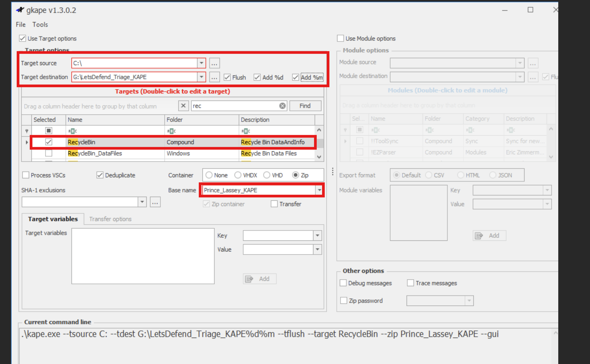
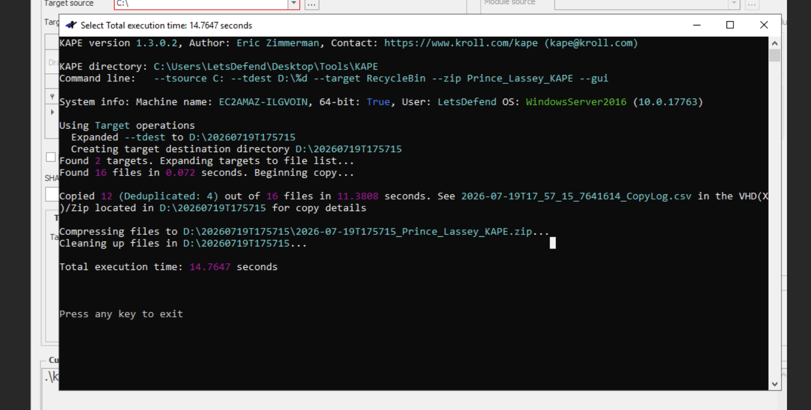
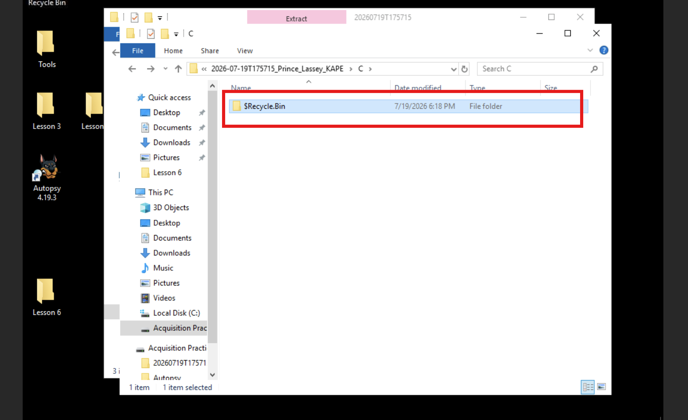

---

## 5. KAPE Modules for Triage and Analysis

**Modules** are configuration files (`.mkape`) that define how to run a program against collected (or existing) data - essentially the triage/processing phase. Modules can invoke built-in Windows tools (PowerShell, etc.), external tools, or query the live system directly (e.g. a Scheduled Tasks module runs `schtasks.exe` and saves results automatically).

### Key Directories
- **Modules/Windows** - e.g. the Scheduled Tasks module.
- **EZTools** - `.mkape` files that drive Eric Zimmerman's tools to parse specific artifacts (e.g. `AmcacheParser.exe` for Amcache data).
- **bin** - contains the actual Eric Zimmerman tool binaries used by the EZTools modules (custom tools/modules can also be added here).
- **Compound modules** (e.g. `!EZParser`) - reference multiple individual EZTools modules together, running a full artifact-parsing sweep in one pass.

### Running Acquisition + Triage Together
1. Configure **Target Options** as before (e.g. `!SANS_Triage`).
2. Enable **Use Module Options**. Leave **Module Source** empty when triaging on the fly (KAPE auto-sets it to the Target Destination); set a separate **Module Destination** (e.g. a `triage` folder).
3. Select a module (e.g. **!EZParser**) to parse the most common/important artifacts automatically.
4. Click **Execute** - KAPE acquires and triages in one pass, producing categorized, ready-to-analyze output (e.g. under a `ProgramExecution` folder) without manual artifact parsing.

### Questions & Methodology

**1. Who is the author of KAPE compound module named "hayabusa"?**
Navigated to the KAPE compound module folder and opened the `hayabusa` module in Notepad++ to find the author in its metadata.

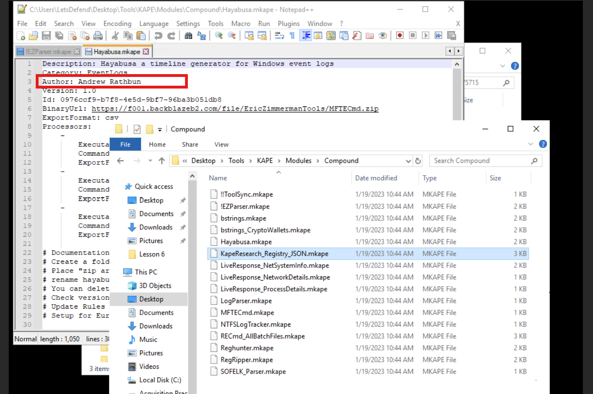

**2. Uncheck the Target option section and only enable the use Module options. Select the folder "C:\Users\letsdefend\Desktop\Lesson5\practice" as Module source. Choose the destination of your choice. Use the module named "EvtxECmd_RDP" and select the Export Format as CSV. What's the file size of this CSV file?**
Followed the steps exactly as specified (Module source set to the given practice folder, `EvtxECmd_RDP` module, CSV export), then checked the resulting file's size.

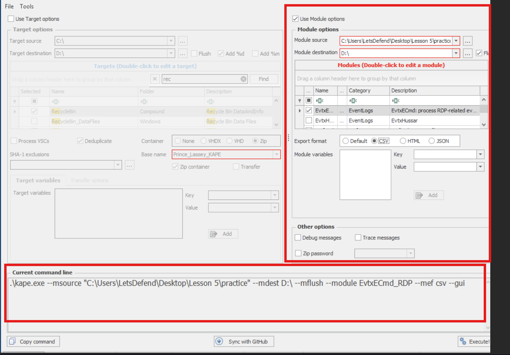
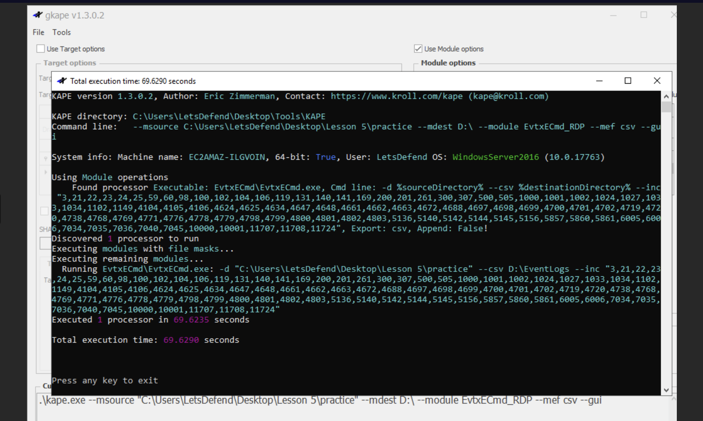
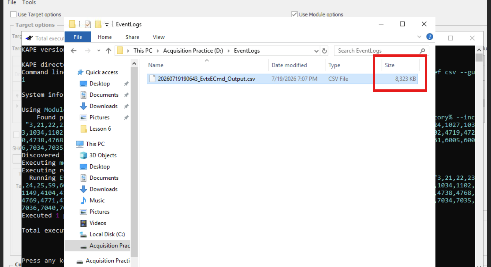

---

## 6. Triage Using FireEye Redline

**Redline** (FireEye, free) is a Windows endpoint investigation tool for memory/file analysis, threat assessment, and IOC hit review. Running a **Redline Collector** on a host both acquires and triages data, producing a Mandiant session file (`.mans`) that's opened and analyzed inside Redline itself.

### Collector Types
- **Standard Collector** - minimum data needed for basic analysis.
- **Comprehensive Collector** - most/all data Redline can collect; best for a full analysis or single-opportunity collection.
- **IOC Search Collector** (Windows only) - collects only data matching selected IOCs; ideal for targeted threat hunting.

### Running a Collector & Analyzing a Session
1. Run Redline as admin -> **Create a Standard Collector** -> select platform (Windows) -> **Edit your script** to customize what's collected (Memory, Disk, System, Network, Other tabs - e.g. disable memory acquisition to save time, or enable event logs/system restore points/browser data as needed; the "Other" tab can flag persistence-mechanism anomalies).
2. Browse to a destination folder for the collector script and resulting data -> confirm.
3. Run the generated batch script (`RunRedlineAudit`) as admin on the target endpoint - this can be run directly from USB or a network share. Output is written to a `Sessions\AnalysisSessionN\Audits` folder as a `.mans` file, alongside the `MemoryzeAuditScript.xml` config used.
4. Open the `.mans` file in Redline (~10 min load time) -> choose an investigation approach, e.g. **"I am Investigating a Host Based on an External Investigative Lead"** (other options suit browser-focused review, IOC hunting, or FireEye HX-integrated workflows) -> click **Investigate** to view categorized triage data (depth of data shown depends on what was selected for collection).

### Questions & Methodology

**1. There's a Mandiant analysis file named "Lesson6.mans" placed in "C:\Users\letsdefend\Desktop\lesson6\lesson6.mans". Open this file in Redline and start the triage process as discussed in the course. Visit "hierarchical processes". What is the process ID (PID) of cmd.exe?**
Opened the file in Redline, selected the "external investigative lead" option, then checked **Hierarchical Processes** under Analysis Data and located `cmd.exe`.

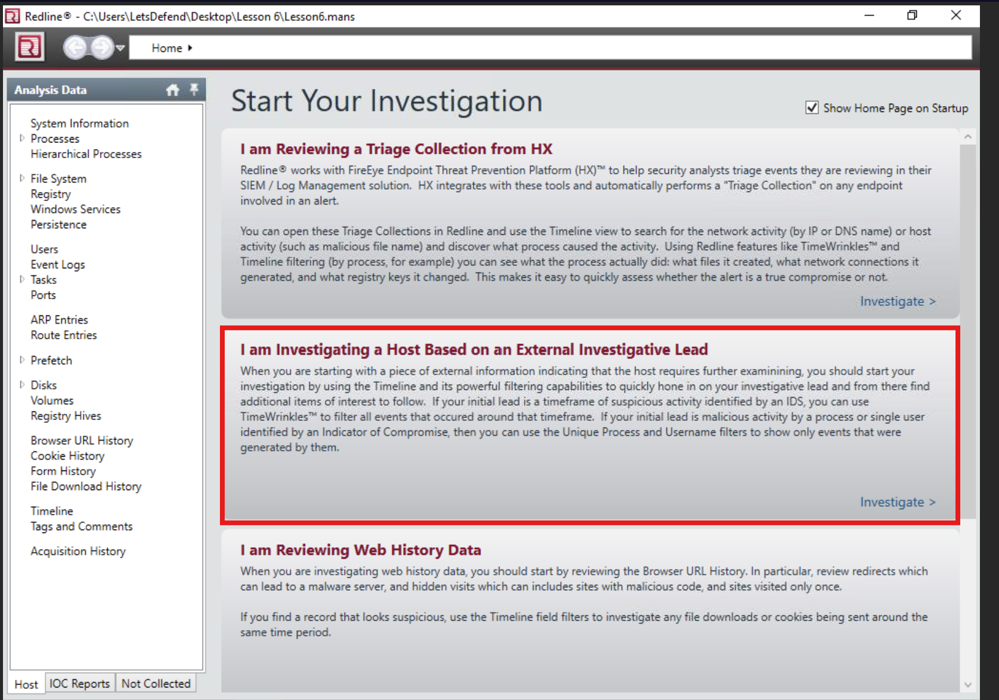
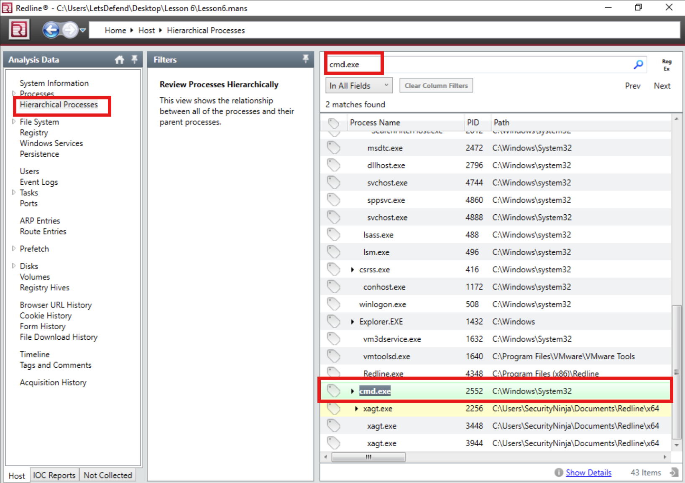

**2. Now visit the "Windows Services" tab. What's the name of the Service starting with "139"?**
Located the full service name under the **Windows Services** tab.

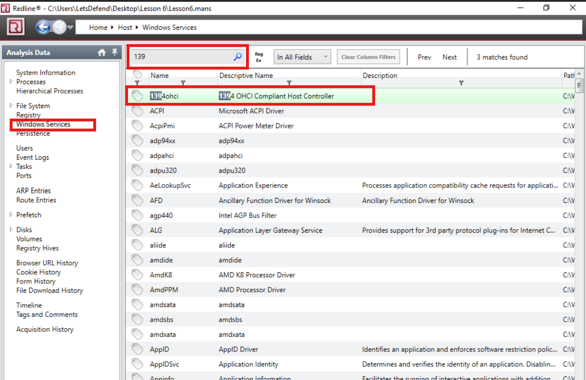

---

## 7. Acquisition and Triage of Disks Using Autopsy

**Autopsy** is a free, open-source, end-to-end digital forensics platform (Basis Technology) supporting Windows, Linux, and Android file systems.

**Key features:**
- Multi-user case collaboration
- Timeline analysis (graphical event view)
- Keyword search (text extraction + regex)
- Web artifact extraction (browser activity)
- Registry analysis (via RegRipper - recent docs, USB devices)
- LNK file analysis (shortcuts/accessed documents)
- Email analysis (MBOX format, e.g. Thunderbird)
- EXIF extraction (geo-location, camera info from JPEGs)
- Media playback/thumbnail viewer
- Broad file system support (NTFS, FAT12/16/32/ExFAT, HFS+, ISO9660, Ext2/3/4, Yaffs2)
- Unicode string extraction from unallocated space
- File type detection / extension-mismatch detection
- "Interesting Files" flagging by name/path
- Android data extraction (SMS, call logs, contacts, apps)

### Basic Workflow
1. Run as admin -> **New Case** -> name the case and set a storage directory -> add optional case details (supports chain of custody).
2. Add a **Data Source**: either an already-acquired disk image, or the local disk of the machine being triaged live (with timezone matched to the target system; optionally create a VHD image of the drive during analysis).
3. **Configure Ingest** - select which modules/plugins to run (e.g. Email Parser scans for emails across files, logs, deleted/unallocated space).
4. Review categorized results - e.g. **OS Accounts** (system users), **Recent Documents**, **Images/Videos**.
5. **Live Triage Drive** feature - sets up Autopsy on a removable drive (e.g. USB) with a ready-to-run triage script, letting analysts plug in and triage a machine automatically without manual setup each time.

*(This lesson was an introductory overview - deeper Autopsy analysis features are covered in a separate, more advanced course.)*