# Windows Registry Forensics - Summary Notes

## Table of Contents

1. [Introduction to Windows Registry Forensics](#1-introduction-to-windows-registry-forensics)
   - What is the Windows Registry
   - Registry Hives
   - Registry Backups and Transaction Logs
2. [Acquiring Registry Hives](#2-acquiring-registry-hives)
   - Questions
3. [Regedit and Registry Explorer](#3-regedit-and-registry-explorer)
4. [System, Users and Network Information](#4-system-users-and-network-information)
   - Questions
5. [Shellbags](#5-shellbags)
   - Questions
6. [Shimcache](#6-shimcache)
   - Questions
7. [Amcache](#7-amcache)
   - Questions
8. [Recent Files](#8-recent-files)
   - Questions
9. [Dialogue Boxes MRU](#9-dialogue-boxes-mru)
   - Questions
10. [Quiz](#10-quiz)
11. [Appendix: Key Paths & Tools Reference](#11-appendix-key-paths--tools-reference)
    - Windows registry paths cheat sheet
    - Forensic tools cheat sheet

---

## 1. Introduction to Windows Registry Forensics

### What is the Windows Registry?
The **Windows Registry** is a hierarchical central database storing configuration data for the OS and installed applications - covering hardware, installed programs, user settings, recently accessed files, connected devices, and executed applications. It is organized into **root keys**, the most important being:

- **HKEY_LOCAL_MACHINE (HKLM)** - system-wide hardware, drivers, services, startup programs, and system settings.
- **HKEY_CURRENT_USER (HKCU)** - settings specific to the logged-in user (desktop background, executed apps, search history, keyboard layout, etc.).
- **HKEY_USERS** - profiles and settings for all users on the system.
- **HKEY_CLASSES_ROOT** - file associations and COM classes (how file types are opened/handled).

Each key holds **name-value pairs** - e.g., the value name `WallPaper` holds the path to the current desktop background image, which Windows reads from the registry to load it.

### Registry Hives
Hives are the actual files that store registry data (logical groups of keys, subkeys, and values). The main system hives live at `C:\Windows\System32\Config\`:

- **DEFAULT** - default OS/app settings; used as a template for new user accounts.
- **SYSTEM** - low-level system component settings (drivers, services). Plugged into `HKLM\SYSTEM`.
- **SAM** (Security Accounts Manager) - local user account info including hashed passwords. Plugged into `HKLM\SAM`.
- **SOFTWARE** - installed programs and their settings. Plugged into `HKLM\SOFTWARE`.
- **SECURITY** - access control/security settings. Plugged into `HKLM\SECURITY`.

Two additional **user-specific** hives (each user has their own copy), plugged into `HKCU`:

- **NTUSER.DAT** - user's personal settings (desktop, start menu, app settings, recently accessed files, executed apps, etc.). Located at `C:\Users\{username}\` or `%USERPROFILE%`. *Hidden by default.*
- **USRCLASS.DAT** - per-user installed application settings. Located at `%USERPROFILE%\AppData\Local\Microsoft\Windows\`. *Hidden by default.*

One additional important hive:
- **Amcache** - tracks changes to installed applications, execution history, and file metadata. Located at `C:\Windows\appcompat\Programs\Amcache.hve`.

> `HKLM` and `HKCU` are the most forensically valuable root keys - the vast majority of useful artifacts sit under these two.

### Registry Backups and Transaction Logs
- **Registry Backup** - Windows automatically backs up the full registry structure to `C:\Windows\System32\Config\RegBack`. Comparing the backup against the current hive can reveal tampered registry keys.
- **Transaction Logs** - files in the same location as hives with extensions `.LOG`, `.LOG1`, `.LOG2`, etc. They hold the most recent (not-yet-committed) changes to hive values, and protect the original hives from corruption. Most forensic tools load transaction logs automatically alongside the hive. Always acquire transaction logs together with hive files.

---

## 2. Acquiring Registry Hives

Windows **locks** active hive files as system-protected files - they can't simply be copied like normal files. Specialized tools like **FTK Imager** (run as admin) use raw disk reads to bypass these locks and acquire hive copies.

**Workflow in FTK Imager:**
1. Run as admin -> **File -> Add Evidence Item** -> select **Logical Drive** -> select `C:\`.
2. Expand Evidence Tree -> navigate to `[root] -> Windows -> System32 -> Config`.
3. Right-click each target hive (SAM, SECURITY, SOFTWARE, SYSTEM) and their transaction logs -> **Add to Custom Content Image**.
4. Also add `NTUSER.DAT` (from `C:\Users\{username}\`) and `UsrClass.dat` (from `%USERPROFILE%\AppData\Local\Microsoft\Windows\`) for each user on the system.
5. Click **Create Image** -> set destination -> verify image after creation to confirm bit-for-bit integrity via hash comparison.
6. Mount the resulting `.ad1` image via **File -> Image Mounting** for offline analysis, navigating it like a regular filesystem.

> Forensic analysis should ideally be performed on a separate forensics workstation using the acquired image - not on the live system under investigation.

### Question

**What is the default extension of disk image created via FTK Imager?**
Answer: `ad1`

---

## 3. Regedit and Registry Explorer

### Regedit
Built-in Windows tool (search "Regedit" in taskbar). Allows viewing, creating, and editing registry keys/values on a **live system only**. Useful for quick reference but changes take effect immediately - use carefully. Key paths can be pasted directly into the address bar at the top for fast navigation.

### Registry Explorer (Eric Zimmerman / EZ Tools)
Preferred tool for forensic registry analysis because it:
- Supports both **live hives** and **offline hives**
- Automatically **parses and applies transaction logs** to ensure the most complete, up-to-date view
- Displays deleted/modified records (under "Associated Deleted Records") by comparing the live hive against the registry backup - useful for spotting deleted or tampered keys
- Cleaner GUI with more readable, sorted values

**Loading hives:**
- **Live:** File -> Live System -> select hive(s) to load
- **Offline:** File -> Load Hive -> navigate to acquired hive files; when prompted about "dirty hives," select the corresponding transaction logs to apply them

Download: `https://ericzimmerman.github.io/#!index.md`

---

## 4. System, Users and Network Information

### User Information
Stored in the **SAM hive**. Path: `SAM\Domains\Account\Users`
- Lists active users (also shown under the `Names` subkey) and group memberships.
- Deleted user entries may still appear in "Associated Deleted Records" - useful if an attacker deleted user accounts.

### System Information
Stored in **SYSTEM** and **SOFTWARE** hives.

**Control Sets** - `SYSTEM\ControlSet001` (active config) and `SYSTEM\ControlSet002` (last known good/backup). Also accessible live via `SYSTEM\CurrentControlSet` (memory only - not available in offline hives). Useful when investigating system or hardware failure incidents.

**OS Version** - `SOFTWARE\Microsoft\Windows NT\CurrentVersion`
- Contains architecture, build number, release ID, etc. - helpful when researching vulnerabilities tied to a specific build.

### Network Information
Stored in **SOFTWARE** and **SYSTEM** hives.

**Networks connected to:** `SOFTWARE\Microsoft\Windows NT\CurrentVersion\NetworkList`
- Provides SSID, connection type (ethernet/wireless), first connection time, last active time, and MAC address of the router - useful evidence in insider threat or unauthorized access investigations.

**Open network shares:** `SYSTEM\CurrentControlSet\services\LanmanServer\Shares`
- Shows shares accessible to/from the compromised machine - helpful for tracing lateral movement.

**TCP/IP config and interfaces:**
- `SYSTEM\CurrentControlSet\Services\Tcpip\Parameters`
- `SYSTEM\CurrentControlSet\Services\Tcpip\Parameters\Interfaces`

### Questions

**1. When was the user account "LetsDefend" created?**
RDP'd into the instance and loaded the SAM hive in Registry Explorer. Navigated to `SAM\Domains\Account\Users` to find the creation timestamp.

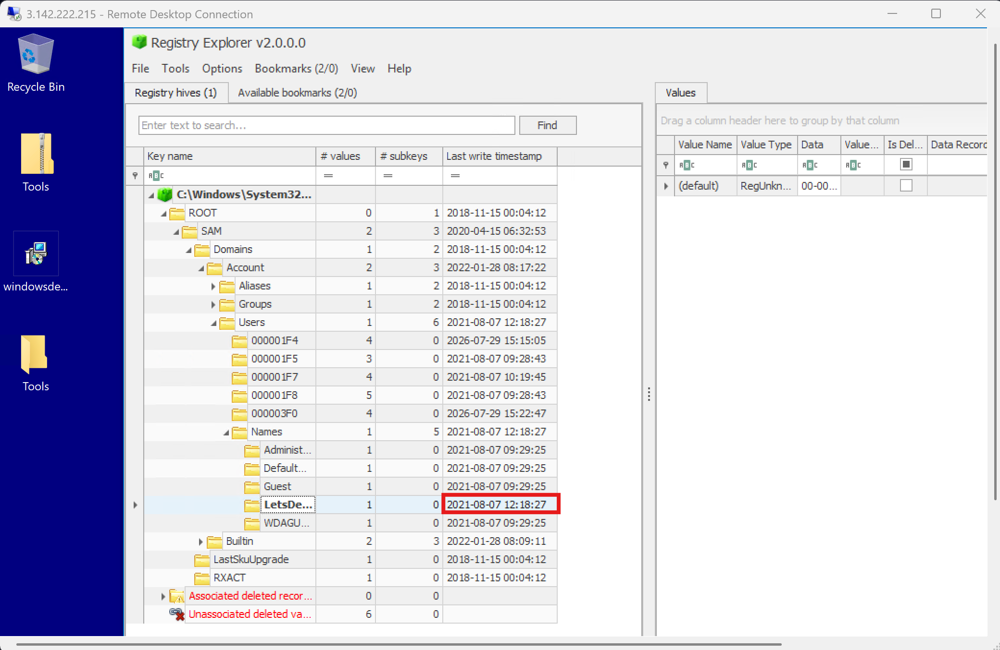

**2. What is the releaseID of Windows installed in the lab?**
Loaded the SOFTWARE hive and navigated to `SOFTWARE\Microsoft\Windows NT\CurrentVersion`. The `ReleaseId` value name was visible in the values panel.

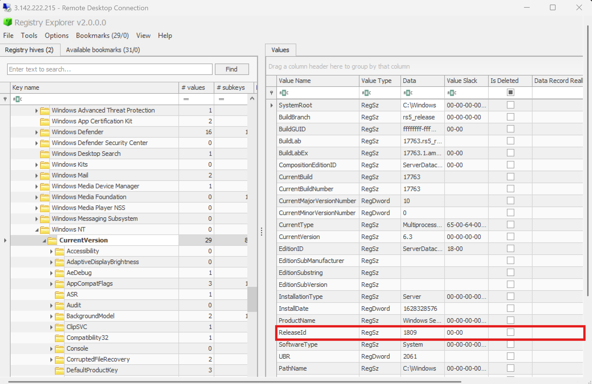

**3. When was the "Network 3" network connected for the first time?**
Loaded the SOFTWARE hive and navigated to `SOFTWARE\Microsoft\Windows NT\CurrentVersion\NetworkList` to find the first-connection timestamp for "Network 3".

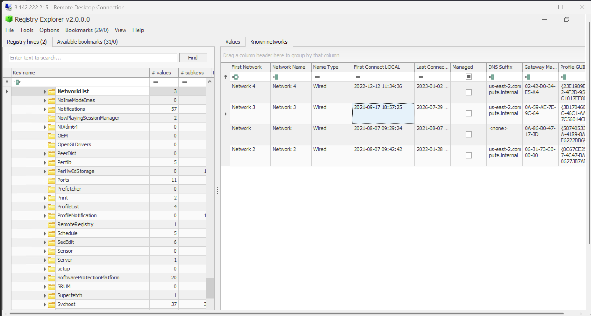

---

## 5. Shellbags

**Shellbags** are registry artifacts created when a user interacts with Windows File Explorer (the GUI shell - not CLI). They store the state of visited folders: size, position, view settings, and the items within. Windows uses them to restore a folder to the same state next time it's opened.

**Forensic value:**
- Prove a user visited a specific folder - even if the folder or its contents were deleted afterward.
- Track accessed network shares and removable drives (USB, etc.).
- Store names of ZIP archive contents (including folder names inside the archive), even if not password protected.
- Can be the only remaining record of a user's folder activity if files have been moved or deleted.

**Registry locations (stored in binary - requires a parser tool):**
- `NTUSER.DAT\Software\Microsoft\Windows\Shell\BagMRU`
- `NTUSER.DAT\Software\Microsoft\Windows\Shell\Bags`
- `USRCLASS.DAT\Local Settings\Software\Microsoft\Windows\Shell\Bags`
- `USRCLASS.DAT\Local Settings\Software\Microsoft\Windows\Shell\BagMRU`

**Tool: ShellbagExplorer** (Eric Zimmerman) - parses both NTUSER.DAT and UsrClass.dat automatically, presents data as a clean folder hierarchy.
- **File -> Load Active Registry** (live) or **Load Offline Registry** (offline hive).
- Deleted folders still appear in the parsed tree even after deletion from disk.

Download: `https://ericzimmerman.github.io/#!index.md`

### Questions

**1. What is the full path of the directory named "LetsDefend_ShellBags"?**
Opened ShellBags Explorer and loaded the active registry. After parsing, 69 shellbags were found. The folder wasn't visible under the real filesystem tree, only under the ShellBags (MRU) tree - so the actual path had to be reconstructed by expanding the shellbag entries.

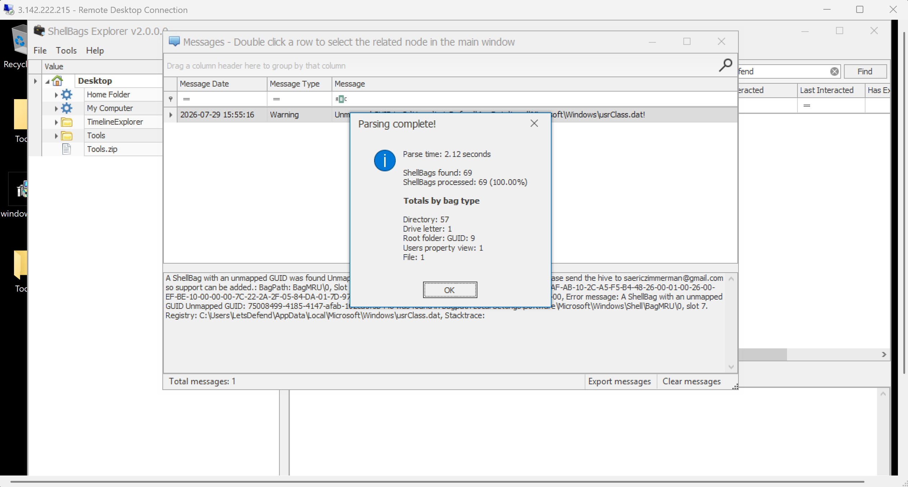
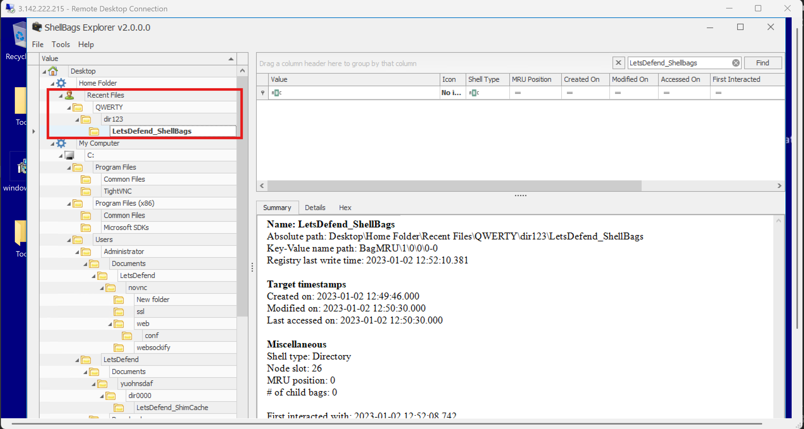
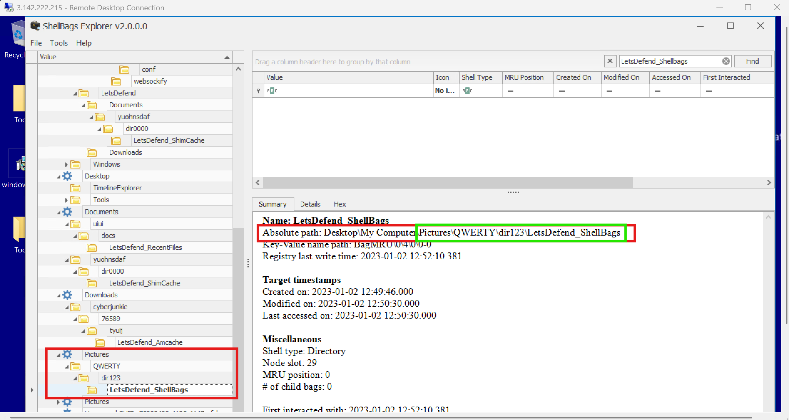

Answer: `C:\Users\LetsDefend\Pictures\QWERTY\dir123\LetsDefend_ShellBags`

---

## 6. Shimcache

**Shimcache** (also called **AppCompatCache**) is a Windows artifact that records information about executable files that have been **run or viewed** on the system. Its original purpose is to provide backward compatibility for older applications on newer Windows versions.

**What it stores:**
- Name and path of the executable
- Timestamp of when it appeared in cache
- Other metadata

**Important limitation:** Shimcache alone **cannot confirm execution**. On Windows 10+, executables that are merely *visible* in File Explorer (without being run) are also recorded. So it serves as:
- **Evidence of executable existence** - even if the file was later deleted
- **Possible evidence of execution** - must be correlated with other artifacts like Amcache to confirm

**Registry location:** `SYSTEM\CurrentControlSet\Control\Session Manager\AppCompatCache`
(Use `ControlSet001` if `CurrentControlSet` isn't available in offline hives.)

**Tool: AppCompatCacheParser** (Eric Zimmerman) - CLI tool that parses shimcache and outputs a CSV for analysis in **Timeline Explorer**.

```bash
AppCompatCacheParser.exe --csv "C:\output\path" --csvf filename.csv
```

Key arguments:
- `-f` - path to SYSTEM hive (omit for live hive)
- `--csv` - output directory (in quotes)
- `--csvf` - output filename

Output is best reviewed in **Timeline Explorer** (read-only, cleaner than Excel, sorts by timestamp).

### Questions

**1. What's the switch used in AppCompatCacheParser tool to parse the data only for a specific date(s)?**
Ran the tool with no arguments via PowerShell to read the help section and identified the date-filtering switch.

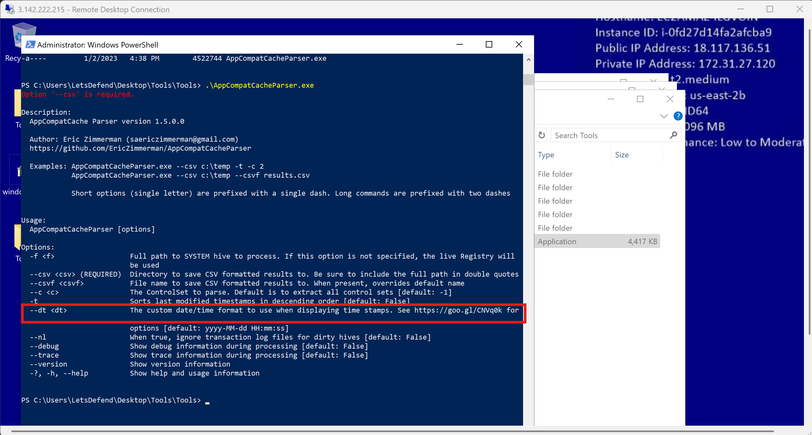

**2. How many executables were visible in the "File Explorer" directory named "LetsDefend_ShimCache"?**
Ran AppCompatCacheParser against the live hive:
```bash
./AppCompatCacheParser.exe --csv "C:\Users\LetsDefend\Desktop\Tools\Tools" --csvf file.csv
```
Found 814 cache entries for Windows 10 Creators in ControlSet001. Opened the output CSV in Timeline Explorer and filtered for the `LetsDefend_ShimCache` folder.

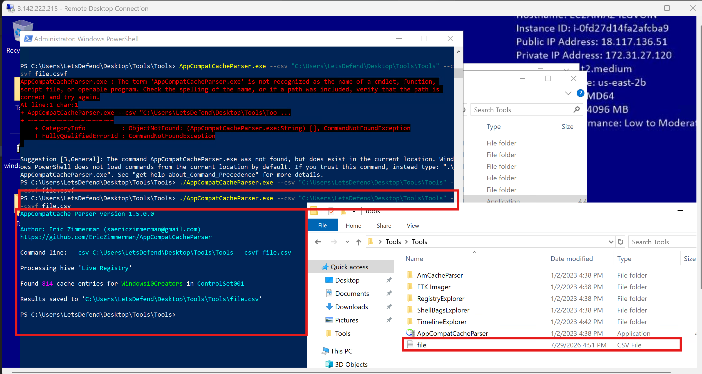
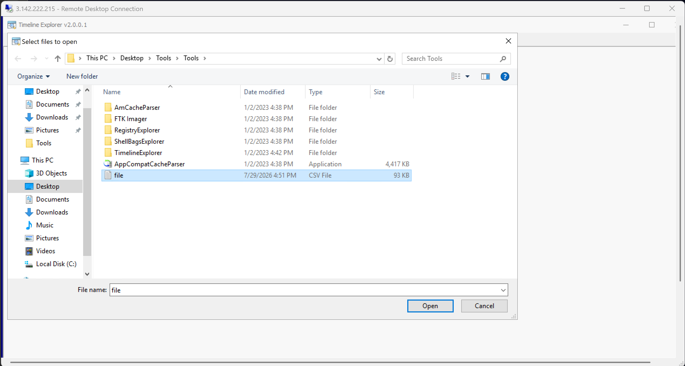
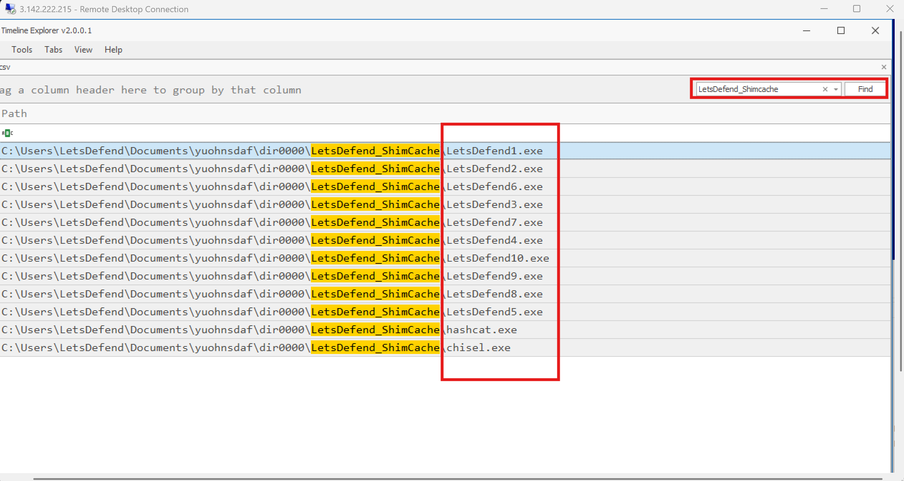

**3. What is the executable name starting with letter "h" present in a folder named "LetsDefend_ShimCache"?**

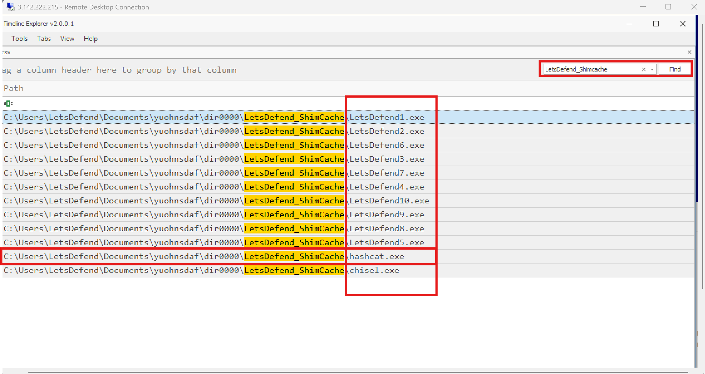

---

## 7. Amcache

The **Amcache hive** records information about applications executed on the system, as part of the Windows Application Compatibility Cache. It is a more forensically reliable evidence of execution compared to Shimcache.

**What it stores:**
- Application path
- File metadata (description, publisher name)
- Timestamps: first execution, creation, modification, and deletion
- **SHA-1 hash** of the executable - enables quick reputation checks on VirusTotal
- Data from external sources too (network shares, USB devices, etc.)

**Difference from Shimcache:**
| | Shimcache | Amcache |
|---|---|---|
| Confirms execution | No (may just be viewed) | Yes (more reliable) |
| Hash stored | No | Yes (SHA-1) |
| Deletion timestamp | No | Yes |
| Publisher name | No | Yes |

No publisher name on a file is a red flag - most malware generators (Metasploit, Empire) don't embed metadata in their stagers.

**Location:** `C:\Windows\AppCompat\Programs\Amcache.hve`

**Evidence of execution key:** `AMCACHE\{GUID}\Root\InventoryApplicationFile`

**Driver data key:** `AMCACHE\{GUID}\Root\InventoryDriverBinary` - useful for uncovering malicious drivers/rootkits.

**Tool: AmcacheParser** (Eric Zimmerman) - CLI tool, outputs CSVs for Timeline Explorer.

```bash
AmcacheParser.exe -f "C:\Windows\appcompat\Programs\Amcache.hve" --csv "C:\output\path" --csvf output.csv
```

Key arguments:
- `-f` - path to Amcache hive
- `--csv` - output directory
- `--csvf` - output filename with extension
- `-w` - whitelist file of SHA-1 hashes (known-good apps to exclude from results)
- `-b` - blacklist file of SHA-1 hashes (known malicious files to match against)

Open `amcache_UnassociatedFileEntries` CSV in Timeline Explorer for the most relevant execution data. Irrelevant columns can be hidden by right-clicking column headers.

### Questions

**1. What's the binary version of executable present in a directory named "LetsDefend_Amcache"?**
Ran AmcacheParser pointing at the live Amcache hive:
```bash
./AmcacheParser.exe -f "C:\Windows\appcompat\Programs\Amcache.hve" --csv "C:\Users\LetsDefend\Desktop\Tools\Tools\AmCacheParser" --csvf output.csv
```
Opened `amcache_UnassociatedFileEntries` in Timeline Explorer, filtered for `LetsDefend_Amcache`, and checked the Binary Version column.

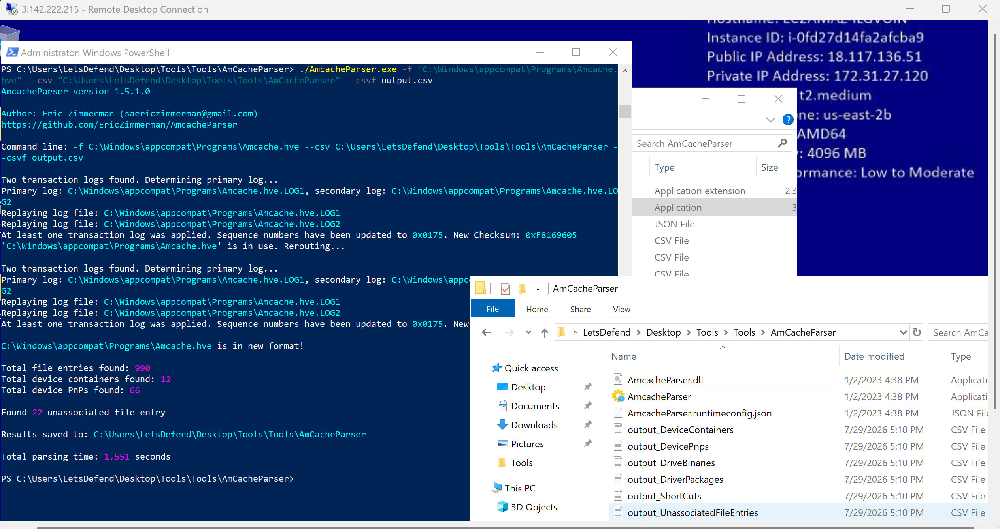
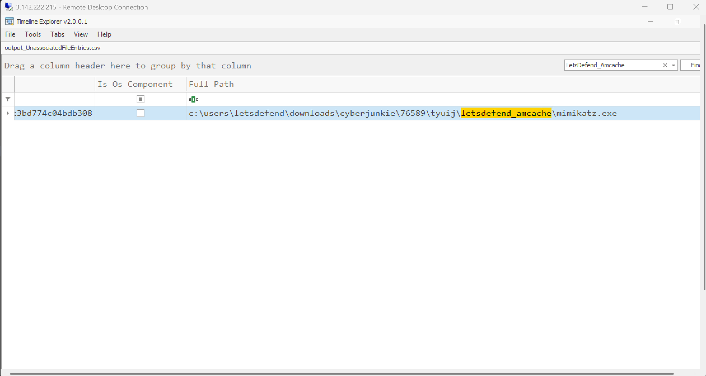
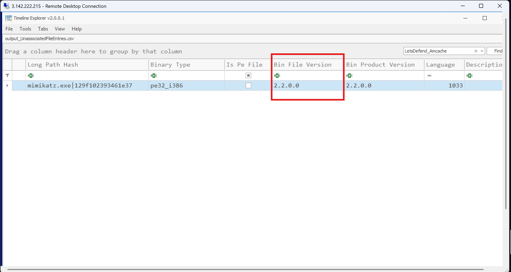

**2. What's the full path where the executable was stored?**
Follow-up to Q1 - found in the full path field in the same AmcacheParser output.

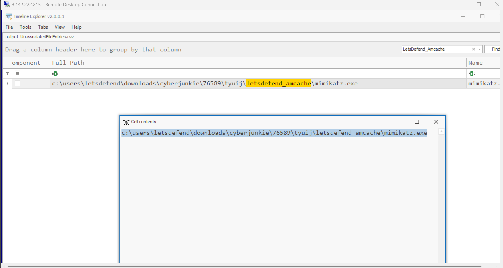

**3. When was the executable executed?**
Found in the `File Key Last Write` column in AmcacheParser output.

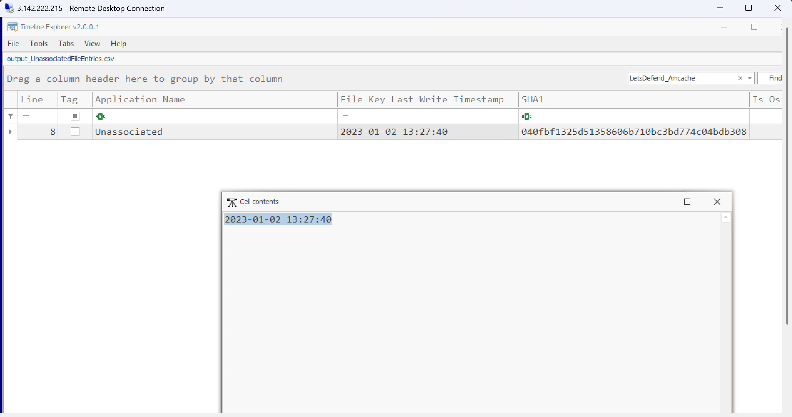

**4. What's the SHA-1 hash value of that executable?**
Visible in the same screenshot as Q3 above.

---

## 8. Recent Files

Windows tracks recently used files and applications to populate the "Recent Items" list in File Explorer and the Start Menu. This artifact serves as **evidence of access**, not just execution - even opening, modifying, or renaming a file via CLI populates this artifact.

**File shortcut location:** `%USERPROFILE%\AppData\Roaming\Microsoft\Windows\Recent`

**Registry key:** `NTUSER.DAT\Software\Microsoft\Windows\CurrentVersion\Explorer\RecentDocs`

**What it stores:**
- Filename (with extension) of opened/modified file
- Shortcut (`.lnk`) file reference
- Last accessed timestamp

**Important:** Values without a file extension under `Target Name` are typically folders. The `RecentDocs` key also has **subkeys per file extension** (e.g., `.xlsx`, `.docx`), letting you quickly filter recent files by type - very useful when investigating a specific file category (e.g., Office documents in a phishing investigation).

**Key for extension-specific lookups:**
`NTUSER.DAT\Software\Microsoft\Windows\CurrentVersion\Explorer\RecentDocs\.{extension}`

### Questions

**1. What's the name of the jpg file which was recently opened?**
Loaded the NTUSER.DAT hive in Registry Explorer on the live system, navigated to `RecentDocs`, and checked the `.jpg` extension subkey for the TargetName.

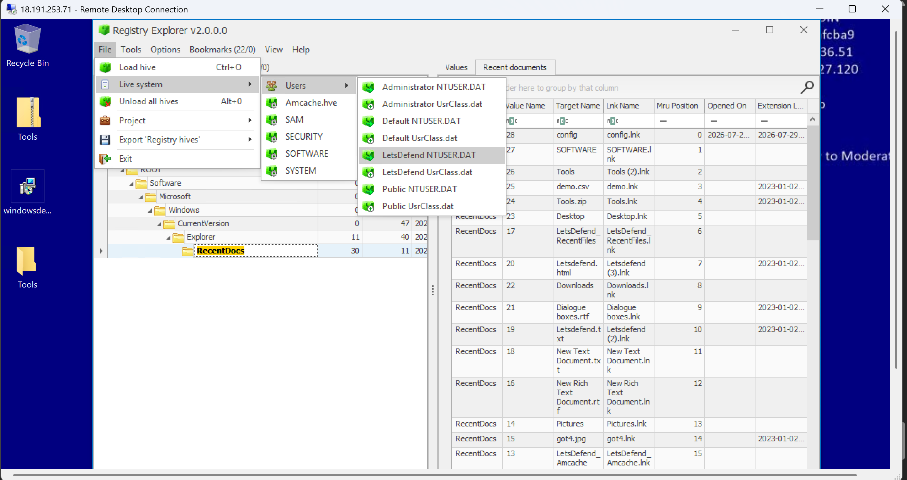
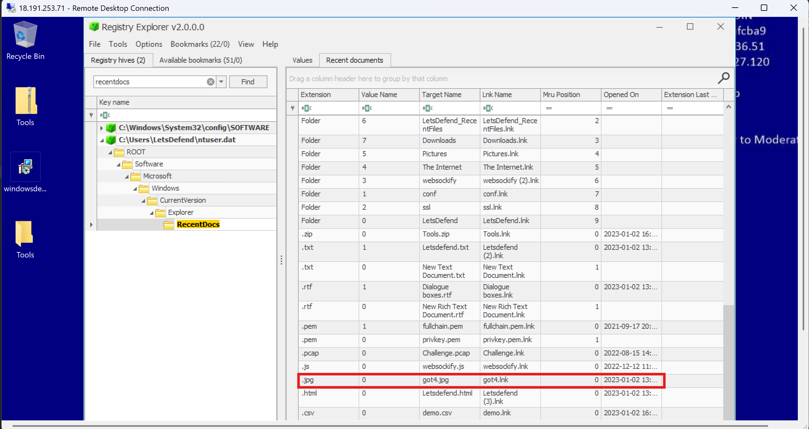

**2. What's the html file name most recently accessed?**
Checked the `.html` extension subkey - visible in the screenshot for Q1 above.

**3. When was the html file accessed?**
Found in the `Opened On` column for the `.html` extension entry.

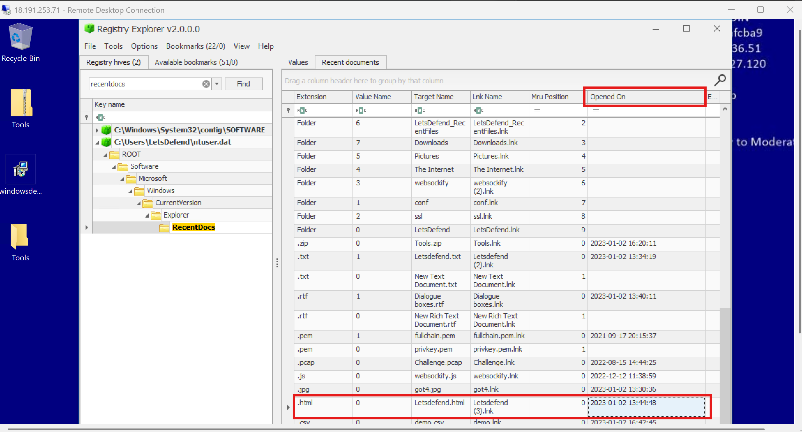

**4. What's the "Value name" for filename "Letsdefend.txt"?**
Analyzed the RecentDocs key for the value name column.

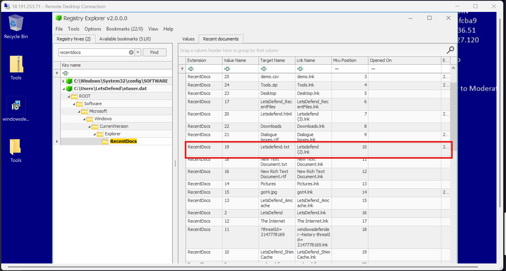

---

## 9. Dialogue Boxes MRU

A **Dialog Box MRU** (Most Recently Used) artifact records file names, paths, and timestamps for files accessed through Windows dialog boxes - for example, when uploading a file on a website, or opening/saving a file through an application. This is a supporting artifact that helps corroborate other artifacts (Amcache, Shimcache, etc.) by showing which files were interacted with via dialog prompts.

Two keys in `NTUSER.DAT`:

### OpenSavePidlMRU
`NTUSER.DAT\Software\Microsoft\Windows\CurrentVersion\Explorer\ComDlg32\OpenSavePidlMRU`

Records the **full path of files opened or saved** through a dialog box. Has subkeys per file extension (similar to RecentDocs), plus a `*` subkey holding the most recent 10 entries across all extensions (in hex/ASCII - less readable). Useful for identifying what files were uploaded, loaded, or saved through application dialogs.

### LastVisitedPidlMRU
`NTUSER.DAT\Software\Microsoft\Windows\CurrentVersion\Explorer\ComDlg32\LastVisitedPidlMRU`

A supporting key for OpenSavePidlMRU - records the **executable responsible** for opening/saving the file, and the **folder path** where the file was accessed (not the filename itself). Correlating both keys together with timestamps gives a fuller picture of what application touched what folder and when.

> Note: Some applications may log a GUID instead of the proper executable name in LastVisitedPidlMRU due to inconsistencies in how Windows records this data.

### Questions

**1. What's the name of the RTF document which was opened from another application? (Provide the filename with full path)**
Loaded NTUSER.DAT in Registry Explorer, navigated to `OpenSavePidlMRU`, and checked the `.rtf` extension subkey for the absolute path.

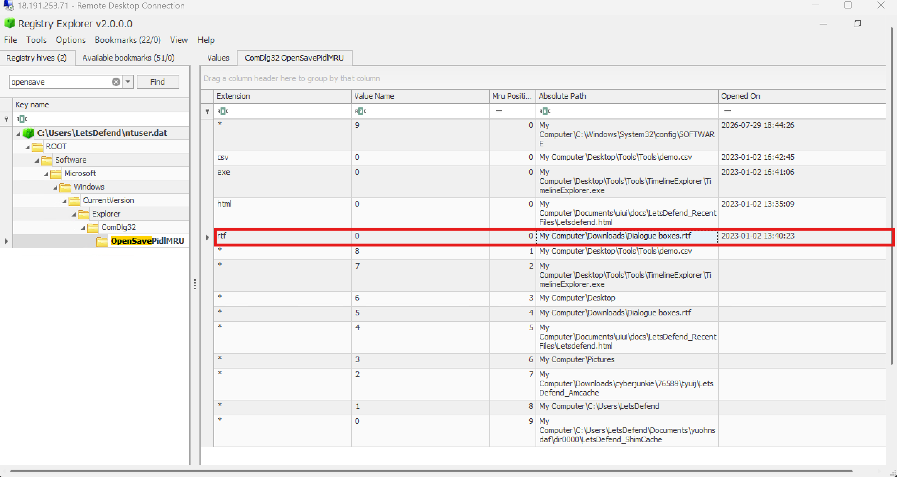

Answer: `C:\Users\LetsDefend\Downloads\Dialogue boxes.rtf`

**2. When was the document accessed?**
Visible in the `Opened On` column - same screenshot as Q1 above.

**3. What's the binary name which was responsible for opening a file from "C:\Users\Letsdefend" directory?**
Moved from `OpenSavePidlMRU` to `LastVisitedPidlMRU` and checked the executable column for the entry whose path matched `C:\Users\Letsdefend`.

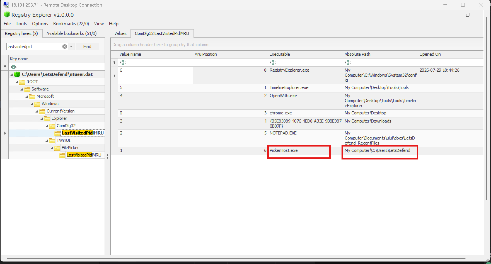

Answer: `pickerhost.exe`

---

## 10. Quiz

**Q1. Which registry root key is user oriented?**
- HKEY_LOCAL_MACHINE
- **HKEY_CURRENT_USER**
- HKEY_USERS
- HKEY_CLASSES_ROOT

**Q2. Where are the registry hives located?**
- C:\Windows\System32\registry32\Config
- C:\Windows\System32\Config32
- C:\Windows\System32\Win32\registry config
- **C:\Windows\System32\Config**

**Q3. Amcache is considered as:**
- Evidence of deletion
- Evidence of modification
- **Evidence of execution**
- Evidence of renaming

**Q4. What information do the Shellbags store?**
- Files
- CLI Commands
- **Directories**
- Documents

**Q5. Which control set is used live by the system?**
- Controlset000
- **ControlSet001**
- ControlSet002
- ControlSet003

**Q6. What information does the RecentDocs registry key hold?**
- **Recent applications**
- Recent documents
- Recent folders
- Recent executables

**Q7. Which hive stores data about the local accounts?**
- SECURITY
- **SAM**
- SOFTWARE
- SYSTEM

**Q8. What is the extension of the amcache artifact file?**
- txt
- evtx
- hive
- **hve**

**Q9. Which of the following is the log file that stores data yet to be included in registry hives?**
- Registry log
- Data log
- **Transaction log**
- File log

---


---

## 11. Appendix: Key Paths & Tools Reference

Quick-reference tables consolidating the registry locations and tools covered throughout this course, with a focus on what each one actually tells an incident responder during an investigation.

### Windows Registry Paths Cheat Sheet

| Artifact | Path | What It Tells an Incident Responder |
|---|---|---|
| Hive files (root) | `C:\Windows\System32\Config\` | Location of DEFAULT, SAM, SECURITY, SOFTWARE, SYSTEM hives - the starting point for any offline registry acquisition. |
| Registry backup | `C:\Windows\System32\Config\RegBack` | Windows' automatic backup of the registry. Comparing it against the live/current hive can reveal keys that were tampered with or deleted by an attacker. |
| Transaction logs | Same folder as hive, extensions `.LOG`, `.LOG1`, `.LOG2` | Contains the most recent, not-yet-committed changes. Must be acquired alongside the hive itself, or recent attacker activity may be missed. |
| NTUSER.DAT | `C:\Users\{username}\` (`%USERPROFILE%`) | User-specific settings and activity - feeds most of `HKEY_CURRENT_USER`, including RecentDocs, Shellbags, and Dialog Box MRU. Central artifact for reconstructing a *specific user's* actions. |
| UsrClass.dat | `%USERPROFILE%\AppData\Local\Microsoft\Windows\` | Per-user installed application data; also stores half of the Shellbags data (paired with NTUSER.DAT). |
| Amcache hive | `C:\Windows\AppCompat\Programs\Amcache.hve` | Reliable evidence of program execution - first-run timestamp, deletion timestamp, SHA-1 hash, publisher name. Best artifact to confirm "was this actually run," and to quickly hash-check a binary against threat intel. |
| Users list | `SAM\Domains\Account\Users` | All local user accounts (including deleted ones under Associated Deleted Records) and group memberships - useful for spotting attacker-created or attacker-deleted accounts. |
| Control Sets | `SYSTEM\ControlSet001`, `SYSTEM\CurrentControlSet` | Active/last-known-good system configuration - services, drivers, hardware profiles. Useful when an incident coincides with a system or driver failure. |
| OS version info | `SOFTWARE\Microsoft\Windows NT\CurrentVersion` | Build number, release ID, architecture - helps confirm whether the host was vulnerable to a specific known exploit. |
| Connected networks | `SOFTWARE\Microsoft\Windows NT\CurrentVersion\NetworkList` | SSID, connection type, first/last connected time, router MAC - evidence of unauthorized network connections (e.g., insider threat plugging into a restricted LAN, or a rogue Wi-Fi/hotspot). |
| Open network shares | `SYSTEM\CurrentControlSet\services\LanmanServer\Shares` | Which shares were exposed from this host - useful for tracing lateral movement paths an attacker could have used. |
| TCP/IP config | `SYSTEM\CurrentControlSet\Services\Tcpip\Parameters` (and `\Interfaces`) | Network interface and IP configuration at the time of acquisition - baseline for spotting rogue interfaces, static IP changes, or proxy/VPN artifacts. |
| Shellbags | `NTUSER.DAT\...\Shell\BagMRU` / `\Bags`; `USRCLASS.DAT\...\Shell\Bags` / `\BagMRU` | Proof a specific folder (local, network share, USB, or even inside a ZIP) was **browsed**, even if its contents were later deleted - strong evidence when a user denies visiting a folder. |
| Shimcache (AppCompatCache) | `SYSTEM\CurrentControlSet\Control\Session Manager\AppCompatCache` | Proof a file **existed** (and possibly ran) on the system, even after deletion - but can't confirm execution alone; must be corroborated with Amcache. Good for narrowing down a time window around an incident. |
| Amcache execution records | `AMCACHE\{GUID}\Root\InventoryApplicationFile` | Confirmed execution evidence: path, timestamps, SHA-1 hash - the go-to artifact for building a reliable execution timeline. |
| Amcache driver records | `AMCACHE\{GUID}\Root\InventoryDriverBinary` | Installed/loaded drivers with hashes - useful for catching malicious drivers or rootkits. |
| Recent Files | `NTUSER.DAT\Software\Microsoft\Windows\CurrentVersion\Explorer\RecentDocs` (and `\{.extension}` subkeys) | Evidence of **access** (opened, modified, or renamed) to any file type, filterable by extension - useful for scoping which documents an insider or phishing victim actually touched. |
| Dialog Box MRU (Open/Save) | `NTUSER.DAT\...\Explorer\ComDlg32\OpenSavePidlMRU` | Full file paths opened or saved through a dialog box (e.g., a file picked for upload on a website, or opened inside an app) - corroborates Amcache/Shimcache findings. |
| Dialog Box MRU (Last Visited) | `NTUSER.DAT\...\Explorer\ComDlg32\LastVisitedPidlMRU` | The **executable** that opened/saved a file via a dialog box, and the folder it came from - ties a specific application to a specific file interaction. |

### Forensic Tools Cheat Sheet

| Tool | Author/Vendor | Used For | Key Output/Value |
|---|---|---|---|
| **FTK Imager** | Exterro | Acquiring disk images, custom images, and registry hives from a live or offline system; mounting images for analysis | Produces a verified (hashed), tamper-evident copy of protected system files - the standard first step before any offline registry analysis. |
| **Regedit** | Microsoft (built-in) | Quick, live-only registry viewing/editing | Fast manual lookups on a live system; not suited for offline hives or transaction log parsing. Riskier since edits take effect immediately. |
| **Registry Explorer** | Eric Zimmerman (EZ Tools) | Browsing live *and* offline hives, with automatic transaction log parsing | Cleaner, safer GUI than Regedit; shows deleted/modified values by diffing against registry backups - critical for spotting tampering. |
| **ShellbagExplorer** | Eric Zimmerman (EZ Tools) | Parsing Shellbags from NTUSER.DAT/UsrClass.dat | Reconstructed folder-access history, including deleted folders, USB/network share paths, and ZIP archive contents. |
| **AppCompatCacheParser** | Eric Zimmerman (EZ Tools) | Parsing Shimcache/AppCompatCache into CSV | List of executables that existed/were viewed on the system with timestamps - used to narrow down a time window, then cross-check with Amcache. |
| **AmcacheParser** | Eric Zimmerman (EZ Tools) | Parsing the Amcache hive into CSV | Reliable execution evidence: timestamps, SHA-1 hashes, publisher info - supports whitelist (`-w`) and blacklist (`-b`) hash filtering to speed up triage. |
| **Timeline Explorer** | Eric Zimmerman (EZ Tools) | Viewing/filtering/sorting CSV output from the above parsers | Read-only (safer than Excel), sorts by timestamp, lets you hide irrelevant columns - the standard viewer for correlating multiple parsed artifacts by time. |
| **VirusTotal** | Google/Chronicle | Hash/IP/domain reputation lookups | Quick triage signal on whether an extracted hash (from Amcache, dumped binaries, etc.) is known-malicious - always corroborate with other evidence rather than trusting a single clean/dirty result. |
