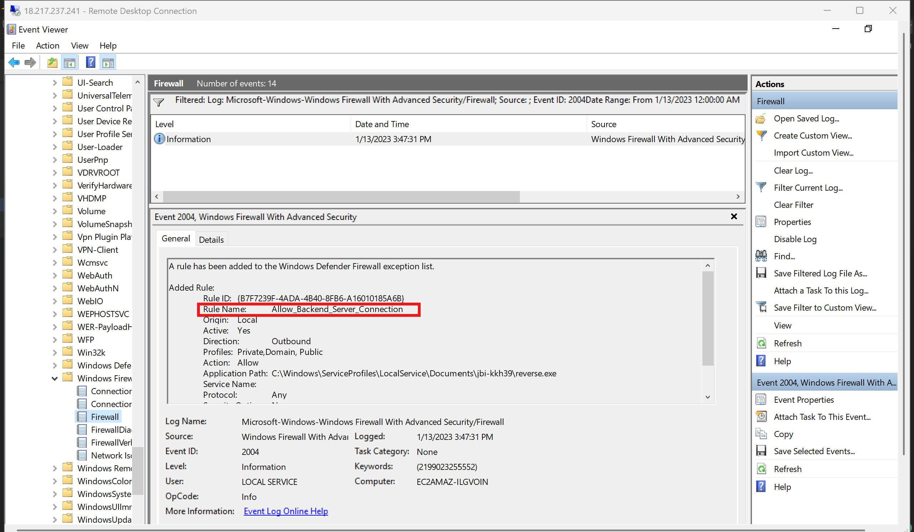

# LetsDefend: Event Log Analysis Notes

## Table of Contents

1. [Introduction to Event Logs](#1-introduction-to-event-logs)
2. [Event Log Analysis Tools](#2-event-log-analysis-tools)
   - Event Viewer
   - Wevtutil
   - Get-WinEvent
   - Question
3. [Authentication Event Logs](#3-authentication-event-logs)
   - Logon types
   - Local/domain authentication
   - RDP authentication
   - Scenario & questions
4. [Windows Scheduled Tasks Event Logs](#4-windows-scheduled-tasks-event-logs)
   - Questions
5. [Windows Services Event Logs](#5-windows-services-event-logs)
   - Questions
6. [Account Management Events](#6-account-management-events)
   - Questions
7. [Event Log Manipulation](#7-event-log-manipulation)
   - Questions
8. [Windows Firewall Event Logs](#8-windows-firewall-event-logs)
   - Questions
9. [Windows Defender Event Logs](#9-windows-defender-event-logs)
   - Questions
10. [Quiz](#10-quiz)
11. [Appendix: Event ID Cheat Sheet](#11-appendix-event-id-cheat-sheet)

---

## 1. Introduction to Event Logs

- **Event logs** are records of system, application, and security events on a Windows computer - logins, service start/stops, errors, suspicious activity, etc. Used for troubleshooting, pattern detection, auditing, and compliance.
- Stored in **binary format** (not plain text) at `C:\Windows\System32\Winevt\Logs`, with the file extension **`.evtx`**. Requires specialized tools (Event Viewer, wevtutil, Get-WinEvent) to read.
- **Log categories (Windows Logs):**
  - **Application** - installed application events
  - **Security** - logon/logoff, RDP connections, services installed, tasks created, etc.
  - **System** - hardware states, drivers, etc.
  - **Setup** - OS installation events (and Active Directory events on domain controllers)
  - **Forwarded Events** - logs forwarded from other machines on the network
- **Application and Services Logs** - a separate category with detailed per-application logs (native or user-installed), mostly organized under `Microsoft → Windows` (e.g., Defender, Firewall, RDP logs).
- **Event ID** - a unique numerical identifier for a specific event type (e.g., `4624` = successful logon). Used for filtering/organizing events.
- **Event types/levels:**
  - **Information** - operation completed successfully
  - **Warning** - minor issue that could escalate
  - **Error** - a problem causing loss of functionality
  - **Critical** - urgent, significant issue
  - **Verbose** - progress/success messages
- **Security log keywords:** **Audit Success** (successful access attempt) / **Audit Failure** (failed access attempt).

---

## 2. Event Log Analysis Tools

### Event Viewer
Native GUI tool (search "Event Viewer" in Windows search).
- **Windows Logs** section holds Security, Application, System, etc.
- Each event row shows: level, date/time, source, Event ID, and task category.
- Clicking an event shows full details (General view or Details view - Friendly/XML).
- **Filtering (Action → Filter Current Log):**
  - Filter by one or more **Event IDs** (comma-separated for multiple)
  - Filter by **date/time range** (predefined or custom), combinable with Event ID filters
  - **Clear Filter** removes filters; **never click "Clear Log"** - that permanently deletes events from the system
  - **Save Selected Events** exports only the currently filtered/displayed events, not the full log

### Wevtutil
Native CLI tool for retrieving/filtering/clearing event logs.

```bash
wevtutil.exe /?
```

List all available logs:
```bash
wevtutil.exe el
```

Query events (example - last 3 System events, newest first, plain text):
```bash
wevtutil.exe qe System /c:3 /rd:true /f:text
```

### Get-WinEvent
PowerShell cmdlet for reading events from local or remote machines; supports advanced filtering (hash tables, structured XML queries).

List available logs:
```powershell
Get-WinEvent -Listlog *
```

Filter System log events by source ("Service Control Manager"):
```powershell
Get-WinEvent -LogName System | Where-Object {$_.ProviderName -Match 'Service Control Manager'}
```

### Question

**How many events were recorded in the System log between 5 PM and 8 PM on 17 September 2021?**
Filtered System logs in Event Viewer for that date/time range; the filtered count was displayed at the top.
Answer: **854**

---

## 3. Authentication Event Logs

Brute-force attacks attempt many password/credential combinations to gain unauthorized access. Windows records both successful and failed logon attempts, making event logs valuable for spotting brute-force patterns (e.g., repeated failures followed by a success = red flag).

### Logon Types (of 9 total, key ones):
- **Type 2 - Interactive** - physical logon at the machine
- **Type 3 - Network** - logon from across the network
- **Type 4 - Batch** - scheduled tasks running unattended
- **Type 5 - Services** - service account logons (very high volume/noise - usually **not** of interest)
- **Type 10 - RemoteInteractive** - RDP/Remote Desktop/Terminal Services logon

> When analyzing Security logs, filter out Type 5 noise and focus on Types 2, 3, and 10 for meaningful analysis.

### Local/Domain User Authentication

- **Successful logon** → Event ID **4624**, keyword "Audit Success." Check the **Logon Type** field - Type 5 = routine service logon (low interest); Type 2 = physical interactive logon (worth reviewing); Type 3 across multiple hosts = possible lateral movement.
- **Failed logon** → Event ID **4625**. Shows logon type, account name, and failure reason. Multiple failures in a short window suggest either a forgotten password or a brute-force/guessing attempt - context (logon type, source) determines which.

### RDP Authentication

RDP is a favorite attacker target for both initial access (internet-facing RDP) and internal lateral movement. Both the **source** machine (initiating RDP) and the **destination** machine (being connected to) generate relevant logs.

**Successful RDP logons:**
- Also recorded as Event ID 4624 with **Logon Type 10** in Security logs, but cleaner to check: `Applications and Services Logs → Microsoft → Windows → TerminalServices-RemoteConnectionManager → Operational`, **Event ID 1149** - shows the source IP/account of the RDP connection. Useful for identifying other potentially compromised machines that initiated a lateral RDP session.

**Tracing lateral movement from the source machine:**
- On the machine that *initiated* an outbound RDP session: `Applications and Services Logs → Microsoft → Windows → TerminalServices-ClientActiveXcore → Microsoft-Windows-TerminalServices-RDPClient/Operational`, **Event ID 1102** - shows the destination server IP (but not success/failure).
- Cross-reference with Security log **Event ID 4648** at the same timestamp to see the target account and destination domain used to confirm the connection attempt.

**Failed RDP attempts:**
- No dedicated "RDP failed" Event ID exists in RemoteConnectionManager logs. **Event ID 261** indicates a TCP connection was received on the RDP port (not necessarily an auth attempt - could just be a port scan). If no corresponding **1149** (success) follows shortly after, a failed authentication can reasonably be inferred.
- Confirm via Security log **Event ID 4625** in the same timeframe as the 261 event - shows username and source IP of the failed attempt.

> Best practice: configure an account lockout policy after N failed attempts to blunt brute-force RDP attacks.

### Scenario

*An attacker gained credentials of a user through social engineering. The attacker (from Pakistan) targets a US-based organization's internet-facing RDP server, brute-forces it, and succeeds after a few attempts. A SOC analyst spots an anomalous successful RDP login from an unusual country/time and investigates. Incident occurred January 13, ~3:15 PM. (This scenario continues across later lessons too.)*

### Questions

**1. There was a failed brute force attempt on RDP service. How many attempts were made?**
Filtered Security logs for Event ID 4625 (any time range), narrowed to events around January 13th, and focused specifically on **Logon Type 3** (network) failures.
Answer: **6**

**2. What's the IP Address of the attacker who attempted the brute-force attack?**
Checked `TerminalServices-ClientActiveXcore → Microsoft-Windows-TerminalServices-RDPClient/Operational`, filtered between 3–4 PM on Jan 13, 2023, and found the successful login (Event ID 1149) right after the brute-force attempts.
Answer: **72.255.51.37**

**3. Which city does the IP originate from?**
Used a WHOIS lookup - confirmed the IP belonged to Cyber Internet Services Pakistan, but WHOIS didn't give a city. Used **AbuseIPDB** instead, which specified the city.
Answer: **Lahore** (Punjab)

**4. At what time was the attacker able to log in via RDP? (Format: same as event logs)**
Read the timestamp directly from the previously identified Event ID 1149.
Answer: **1/13/2023 3:16:32**

**5. The lab machine was used by the attacker to pivot to another internet-facing RDP machine only accessible from certain IPs. What's the IP address of that RDP machine?**
Filtered `TerminalServices-ClientActiveXcore` logs for the incident date and Event ID **1102** (destination server IP for outbound RDP connections). Only one matching event was found: *"The client has initiated a multi-transport connection to the server 3.15.195.136."*
Answer: **3.15.195.136**

---

## 4. Windows Scheduled Tasks Event Logs

**Task Scheduler** automates recurring or triggered actions. Attackers abuse it to: run malicious code, modify existing tasks to change behavior stealthily, maintain persistence, or run tasks with elevated privileges.

> ⚠️ Scheduled task events are **not logged in Security logs by default** - must be enabled via Group Policy Object (GPO). Highly recommended in corporate/AD environments.

**Even if a task is later deleted by the attacker, the creation event itself often still remains in the logs** - making this a powerful way to find evidence of past intrusions that have since been "cleaned up."

### Key Event IDs

**In Security logs (requires GPO logging enabled):**
- **4698** - Task created (shows task name, trigger/scheduled time, and the exact command/binary that will run)
- **4702** - Task updated/modified (same detail as creation - compare against the original creation event to spot what changed)
- **4699** - Task deleted (task name + deletion time only)

**In Application/Services logs** (`Microsoft → Windows → Task Scheduler → Operational`) - less detailed, but useful if Security log auditing isn't enabled:
- **106** - Task registered/created (task name only)
- **140** - Task updated
- **141** - Task deleted
- **201** - Task action completed (records the command that was executed at trigger time)

**What to look for in a 4698 event:** the **Task Author** (who created it - note that `NT AUTHORITY\SYSTEM` isn't automatically trustworthy if an attacker has admin rights), the **trigger time/schedule**, and critically the **command/binary path** - e.g., a binary named to look legitimate ("Windows Update") but sitting in an odd location like a user's Documents folder is a strong red flag.

### Questions

**How many scheduled tasks were created by a user account between the incident timeframe (13 January – 14 January 2023)?**
Filtered Security log for Event ID 4698 - 7 total events, 6 within the timeframe, but some of those were created by the system itself (not a user) and were excluded.
Answer: **2**

**What is the task name of the suspicious scheduled task?**
Answer: **Connect_Backend_Server**

**What is the command being executed by the suspicious task?**
Answer: **C:\Users\LetsDefend\Documents\jbi-kkh39\nc64.exe**

**Which port number is the backdoor communicating to?**
Answer: **4444**

**What time is the suspicious task scheduled for?**
Found in the `<StartBoundary>` tag of the event's XML view.
Answer: **2023-01-14 19:28:13**

**What is the updated description of the task which was modified by the user account from the previously found created tasks?**
Filtered for Event ID **4702**, timestamped after the original task creation.
Answer: **LetsDefend is awesome. This is the modified task**

---

## 5. Windows Services Event Logs

**Windows services** are background processes, either **system services** (part of the OS) or **application services** (installed alongside a specific app). Attackers abuse services by: modifying legitimate service configs to run malicious code, creating new malicious services, disabling critical services, or exploiting service vulnerabilities for privilege escalation.

Services are attractive for persistence because there are hundreds running at once - easy to blend in, and services can be configured to auto-start on every boot/login, giving attackers a resilient backup C2 channel.

**Service creation event:** logged in **System log**, Event ID **7045**. Shows the service's binary file path, install time, service name, and **start type** (e.g., Auto = runs on every boot). Pay close attention to **user-mode services** (installed by a user/attacker) versus kernel-handled ones (routine OS operation) - user-mode is where malicious services typically show up.

If a suspicious binary path is spotted (e.g., a fake "Windows Update" binary sitting in a Documents folder), retrieve and analyze the file - hash lookups (VirusTotal) are a fast first check, though fully obfuscated malware may evade AV detection and require static/dynamic analysis instead.

### Questions

**What's the Service name which was created by a user account between January 13 and 14, 2023?**
Filtered System log for Event ID **7045** within the timeframe - one matching service creation event found.
Answer: **Connect_Backend**

**What's the binary path which will be executed as a Service?**
Answer: **c:\users\LetsDefend\Documents\jbi-kkh39\reverse.exe**

---

## 6. Account Management Events

Attackers create new user accounts to: maintain persistence (a backup login independent of the original compromised account), gain additional privileges (by joining privileged groups), or obscure their activity (separating "attacker actions" from the original victim account in logs).

> Account creation/group-membership events are **not logged by default** - requires GPO configuration.

### Key Event IDs (Security logs)
- **4720** - New user account created. Shows the **Subject Account Name** (who created the new account) and the new account's name. A legitimate-looking account created by an already-suspicious user is a strong persistence indicator. Watch for deliberately generic/trustworthy-sounding names like "SysAdmin," "helpdesk," "supportdesk."
- **4732** - User added to a local group. Shows the account performing the action, the account being added, and the **target group name**. Especially concerning when the target group is highly privileged (e.g., Administrators) - a classic privilege escalation move. Also relevant for exploit-based privilege escalation (e.g., Print Spooler, Juicy/Hot Potato exploits) which can trigger the same event.

### Questions

**1. Which user account was added after 15 November 2022?**
Filtering directly for the specified date returned no results (a platform quirk), so switched the time range to "Anytime" instead, which surfaced the relevant events. Checked Event ID 4720 (creation) before 4732 (group addition).
Answer: **CyberJunkie_SysAdmin** (created 1/13/2023 3:38:46 PM, added to the `users` and `incidentresponders` groups)

**2. In which local group was the user added?**
Answer: **incidentresponders**

---

## 7. Event Log Manipulation

Attackers delete or disable event logs to: cover their tracks, disrupt security monitoring, or avoid detection by security teams reviewing logs. Requires **high-level (admin) privileges** to do so.

**Methods attackers use:**
- Event Viewer → right-click log → "Clear Log" (requires admin rights)
- CLI: `wevtutil.exe cl <logname>` (e.g., `wevtutil.exe cl Security`)

Regardless of method, **clearing a log always generates its own event** - attackers can't clear logs without leaving evidence of having done so.

### Key Event IDs

- **1102** (Security log only) - Security log was cleared. Recorded **only within the Security log itself**. Shows the timestamp and the user who cleared it - track that user's other activity closely, as it's likely a compromised or attacker-created account.
- **104** (System log) - Any *other* audit log was cleared (e.g., Firewall log, RDP log, PowerShell log, Office alerts log). Recorded in the System log regardless of which log was actually cleared.
- **1100** (Security log) - Event Logging service was disabled entirely - generated **right before** logging stops. High-value alert for SOC teams since it can be caught by SIEM before further attacker activity goes unlogged. Not triggered on normal shutdown - only when the logging service itself is stopped while the system is running.

**Why studying event logs still matters even though they can be cleared:**
1. Clearing logs requires admin privileges - not all attackers reach that level.
2. If an attacker *does* escalate and clear logs, all prior activity during the intrusion (before the clearing) will likely have already been forwarded to the SIEM.
3. Clearing logs is itself a loud, suspicious action attackers often avoid - leaving evidence in place is sometimes stealthier for them than the alternative.

### Questions

**1. At what time did the firewall event logs get cleared during the incident timeframe (January 13, 2023)?**
Filtered Security logs for Event ID **104** - found two relevant "log cleared" events (Firewall log and RDP RemoteConnectionManager log); isolated the firewall one specifically.
Answer: **1/13/2023 3:42:23**

**2. When was event logging disabled around the incident timeframe (January 13, 2023)?**
Filtered for Event ID **1100** around the incident date - found two service shutdown events.
Answer: **1/13/2023 3:43:52**

---

## 8. Windows Firewall Event Logs

**Windows Firewall** filters inbound/outbound traffic based on configured rules (by program, service, traffic type, IP, or domain). Firewall logs help detect suspicious activity like internal port scanning, lateral movement, or C2 communication - though dedicated network monitoring tools (hardware firewalls, NetFlow) are generally more reliable in production environments.

**Why attackers tamper with firewall rules:** to allow their C2/backdoor traffic through without restriction (as a persistence backup), or to enable unrestricted data exfiltration.

### Key Event IDs
(Located under `Application and Service Logs → Microsoft → Windows → Windows Firewall with Advanced Security → Firewall`)

- **2004** - New firewall rule added. Shows rule name, active status, **direction** (inbound/outbound - outbound rules for unfamiliar apps can indicate a C2 channel), the **application path**, and **protocol**. Note: Windows itself constantly adds routine rules (modifying app = `SYSTEM`, no bound application) - this is expected noise. Look instead for rules tied to a real application path, and check whether the **Modifying Application** is something like `mmc.exe`, `powershell.exe`, or `cmd.exe` - these indicate the rule was added via human/script interaction, not automatic OS behavior. Also watch service-account paths like `\windows\ServiceProfiles\LocalService\` - the true underlying file is usually under the modifying user's own profile path.
- **2005** - Existing rule modified. Attackers may prefer modifying an existing (less noticeable) rule rather than creating a new one. The **Rule ID stays constant** even if the attacker renames everything else about the rule - use it to trace back to the original 2004 creation event and diff what changed.
- **2003** - Firewall enabled/disabled. Look for **Setting Type = "Enable Windows Defender Firewall"** with **Value = "No"** to catch a full firewall disable - a highly suspicious, rarely-legitimate event that stands out much more than a rule addition/modification would.

### Questions

**1. What's the rule name which was added by a user on January 13, 2023 between 3pm and 4pm?**
Filtered the Firewall operational log for Event ID **2004** in that window - one matching rule addition found.



Answer: **Allow_Backend_Server_Connection**

**2. What's the network direction configured for the rule?**
Visible in the same event shown above.
Answer: **Outbound**

**3. What's the protocol configured for the rule?**
Answer: **any**

**4. What is the application name for which this firewall rule was added?**
Answer: **reverse.exe**

**5. What's the protocol after the rule is modified/updated?**
Added Event ID **2005** to the filter - protocol was changed to a specific value.
Answer: **TCP**

**6. At what time was the firewall disabled?**
Filtered for Event ID **2003** (firewall disabled).
Answer: **1/13/2023 3:54:31**

---

## 9. Windows Defender Event Logs

**Windows Defender** is Windows' built-in antivirus, providing real-time and on-demand scanning. Its logs can reveal historic malware detections tied to an incident - and disabling Defender is frequently one of the first things attackers do after gaining control, to operate without interference.

(Located under `Application and Service Logs → Microsoft → Windows → Windows Defender → Operational`)

### Key Event IDs

- **1116** - Malware/suspicious file detected. Shows detection time, malware name, severity, file path, malware category, and the **process name** that triggered detection (e.g., `explorer.exe` if copied via GUI, `cmd.exe` if copied via command line). Note: sophisticated/obfuscated attacker tools may evade detection initially but get caught later as Defender's signature database updates - a "clean" historical scan doesn't guarantee a file stays undetected forever.
- **1117** - Action taken against detected malware/file. Adds an **Action** field (removed / quarantined / allowed) and an **Error Description** (success/failure of that action) - important for confirming whether a malicious file was actually neutralized or is still present.
- **5001** - Real-Time Protection disabled. No extra parameters - this event ID alone is the signal. Highly suspicious in a corporate environment, since disabling it removes ongoing real-time scanning of new files.
- **5007** - Any Defender **configuration change** (not exclusively exclusions - lots of routine noise here too). To specifically identify an **exclusion** being added, look for the registry path `HKLM\SOFTWARE\Microsoft\Windows Defender\Exclusions\Paths\` within the event description - the excluded path follows `\Paths\` in that string. Attackers use exclusions to hide malicious tools (e.g., Mimikatz) from scanning while remaining less noisy than fully disabling Defender.

### Questions

**1. What malicious file was detected by Windows Defender after 4 PM on 13 January 2023?**
Filtered Windows Defender operational log for Event ID **1116**.
Answer: **Invoke-Mimikatz.ps1**

**2. What is the category of the malicious file?**
Answer: **trojan**

**3. What action was taken against the malicious file?**
Added Event ID **1117** to the filter.
Answer: **remove**

**4. Which folder was excluded last from the Defender scanner around the time of the incident?**
Added Event ID **5007** to the filter and located the exclusion path in the event description.
Answer: **C:\Users\LetsDefend\Documents**

---

## 10. Quiz

**Q1. Where are the event logs stored in the Windows systems?**
- C:\Windows\System32\Config\EventLogs
- C:\Windows\Winevt\Logs
- **C:\Windows\System32\Winevt\Logs**
- C:\Windows\System32\Events\Logs

**Q2. What is the name of the unique identifier that the events in the Event logs are given according to their type?**
- Event Keywords
- **Event IDs**
- Event type
- Event record

**Q3. Event Viewer allows filtering the logs using which of the options below?**
- Filter Logs
- **Filter Current Log**
- Filter
- Filter Events

**Q4. What is the Event ID for "Failed Logon Attempt"?**
- **4625**
- 4624
- 4621
- 4629

**Q5. What is the Event ID for "Scheduled Task Creation"?**
- 4699
- 4649
- **4698**
- 5001

**Q6. In events related to scheduled task being created, the trigger time of the task value can be determined between which tag?**
- \<Start\>
- \<StartTime\>
- \<TriggerTime\>
- **\<StartBoundary\>**

**Q7. Service creation event is logged in which event log?**
- Security
- **System**
- Setup
- Application

**Q8. What is the Event ID for "the event when a service is created"?**
- 5001
- 7041
- **7045**
- 5000

**Q9. What is the Event ID for the event when a user is added to a LocalGroup?**
- **4732**
- 4742
- 4766
- 4731

**Q10. What is the Event ID for the recorded event when the System Log is cleared?**
- 1004
- 2004
- 5004
- **104**

**Q11. If an attacker adds a new firewall rule, which Event ID would you use to filter firewall event logs?**
- 1004
- **2004*
- 4222
- 4444

**Q12. What Event ID do you need to track the PowerShell execution in Microsoft-Windows-PowerShell logs?**
- 4245
- **4104**
- 4100
- 4249

---

## 11. Appendix: Event ID Cheat Sheet

A consolidated quick-reference for every Event ID covered in this course, organized by category, with the log location and what it tells an incident responder.

### Authentication & Logon

| Event ID | Log Location | Meaning | IR Value |
|---|---|---|---|
| 4624 | Security | Successful logon | Check **Logon Type** - Type 5 (Service) is noise; Type 2 (Interactive), Type 3 (Network), Type 10 (RDP) are worth reviewing, especially after failed attempts. |
| 4625 | Security | Failed logon attempt | Multiple failures in a short window = possible brute-force. Combine with logon type (e.g., Type 3 across many hosts = lateral movement attempt). |
| 4648 | Security | Explicit credential logon (e.g., outbound RDP) | Confirms the target account/domain used when connecting out to another machine - pairs with RDPClient Event ID 1102. |
| 1149 | TerminalServices-RemoteConnectionManager/Operational | Successful RDP connection | Shows source IP/account of an inbound RDP session - key for tracing lateral movement *into* a host. |
| 1102 | TerminalServices-ClientActiveXcore → RDPClient/Operational | RDP client initiated outbound connection | Shows the destination server IP for an *outbound* RDP session - key for tracing where a compromised host moved *to*. |
| 261 | TerminalServices-RemoteConnectionManager/Operational | TCP connection received on RDP port | Not proof of an auth attempt (could be a port scan) - but absence of a following 1149 suggests a failed login attempt. |

### Scheduled Tasks

| Event ID | Log Location | Meaning | IR Value |
|---|---|---|---|
| 4698 | Security (requires GPO) | Task created | Shows task name, trigger time (`<StartBoundary>`), and exact command/binary - persists even after the task is deleted, so it's valuable for uncovering "cleaned up" persistence. |
| 4702 | Security (requires GPO) | Task updated | Compare against the original 4698 to see exactly what an attacker changed (schedule, binary, etc.). |
| 4699 | Security (requires GPO) | Task deleted | Only shows task name/time - attackers delete tasks once no longer needed to reduce visible footprint. |
| 106 | Task Scheduler/Operational | Task registered (fallback if Security auditing isn't enabled) | Task name only - less detail than 4698 but useful when GPO logging isn't configured. |
| 140 | Task Scheduler/Operational | Task updated (fallback) | Task name/time only. |
| 141 | Task Scheduler/Operational | Task deleted (fallback) | Task name/time only. |
| 201 | Task Scheduler/Operational | Task action completed | Records the command actually executed at trigger time. |

### Services

| Event ID | Log Location | Meaning | IR Value |
|---|---|---|---|
| 7045 | System | Service created/installed | Shows binary path, start type, and service name - check user-mode services closely; auto-start services are a classic persistence mechanism. |

### Account Management

| Event ID | Log Location | Meaning | IR Value |
|---|---|---|---|
| 4720 | Security (requires GPO) | New user account created | Shows who created the account - a suspicious account created by an already-compromised user strongly suggests persistence setup. |
| 4732 | Security (requires GPO) | User added to a local group | Especially critical when the target group is privileged (e.g., Administrators) - classic privilege escalation/persistence combo with 4720. |

### Log Tampering

| Event ID | Log Location | Meaning | IR Value |
|---|---|---|---|
| 1102 | Security (only) | Security log cleared | Shows who cleared it - investigate that account immediately, it's likely compromised or attacker-created. |
| 104 | System | Any *other* log cleared (Firewall, RDP, PowerShell, etc.) | Confirms an attacker specifically targeted a non-Security log to hide a particular category of activity. |
| 1100 | Security | Event logging service disabled | Generated right *before* logging stops - high-value, low-noise alert; SIEM should catch this immediately. |

### Firewall

| Event ID | Log Location | Meaning | IR Value |
|---|---|---|---|
| 2004 | Windows Firewall with Advanced Security/Firewall | New rule added | Check direction, application path, and protocol; watch for Modifying Application = `mmc.exe`/`powershell.exe`/`cmd.exe` (human/script-driven, not automatic OS behavior). |
| 2005 | Windows Firewall with Advanced Security/Firewall | Existing rule modified | Rule ID stays constant even if renamed - use it to trace back to the original 2004 event and diff the changes. |
| 2003 | Windows Firewall with Advanced Security/Firewall | Firewall enabled/disabled | Look for Setting Type "Enable Windows Defender Firewall" + Value "No" - a loud, rarely-legitimate event. |

### Windows Defender

| Event ID | Log Location | Meaning | IR Value |
|---|---|---|---|
| 1116 | Windows Defender/Operational | Malware/suspicious file detected | Shows malware name, severity, file path, category, and triggering process - useful for understanding attacker tooling and how it was delivered. |
| 1117 | Windows Defender/Operational | Action taken against detected malware | Confirms whether the threat was actually removed/quarantined or merely allowed - critical for knowing if remediation is still needed. |
| 5001 | Windows Defender/Operational | Real-Time Protection disabled | No extra detail - the event alone is the red flag. Attackers disable this to move tools in undetected. |
| 5007 | Windows Defender/Operational | Configuration change (incl. exclusions) | Check the event description for `HKLM\SOFTWARE\Microsoft\Windows Defender\Exclusions\Paths\` to confirm it's specifically an exclusion, then read the path that follows. |

### PowerShell (referenced in Quiz Q12)

| Event ID | Log Location | Meaning | IR Value |
|---|---|---|---|
| 4104 | Microsoft-Windows-PowerShell/Operational | Script block logging (PowerShell execution) | Captures the actual PowerShell code executed - one of the most valuable artifacts for reconstructing attacker commands, especially against obfuscated scripts. |