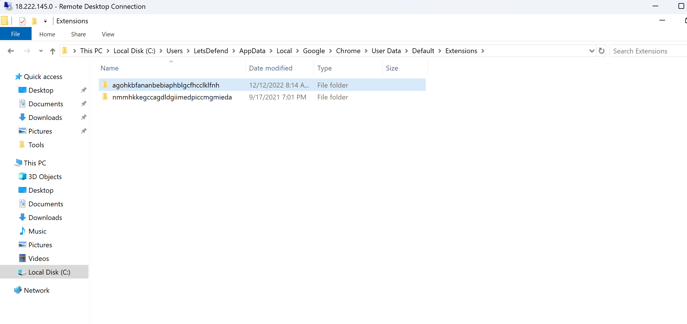
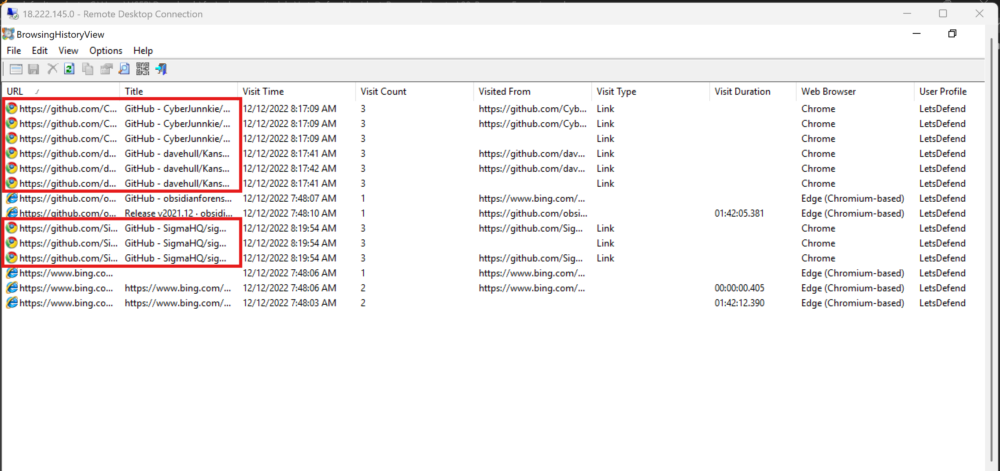
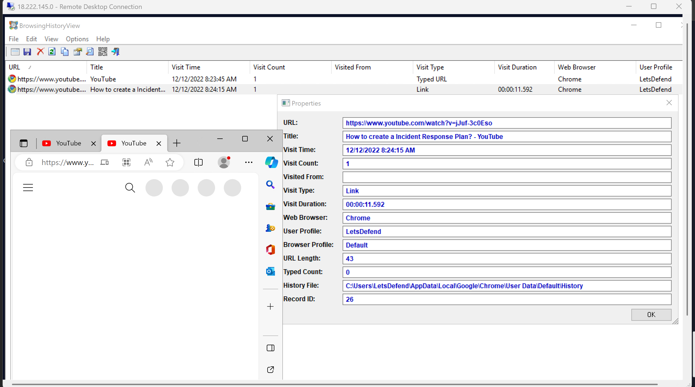
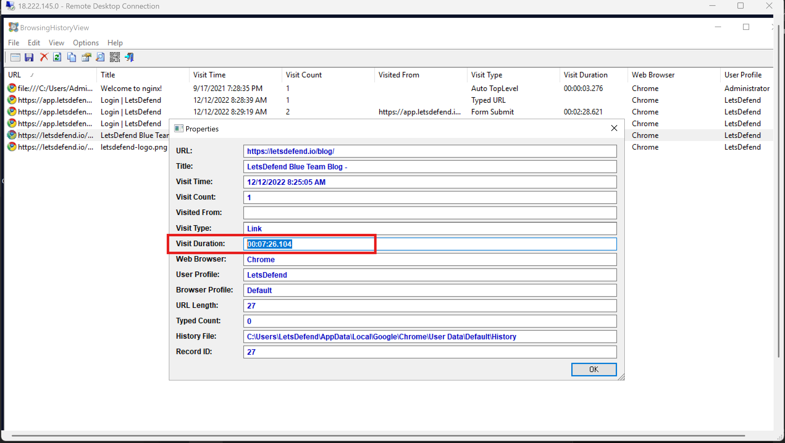
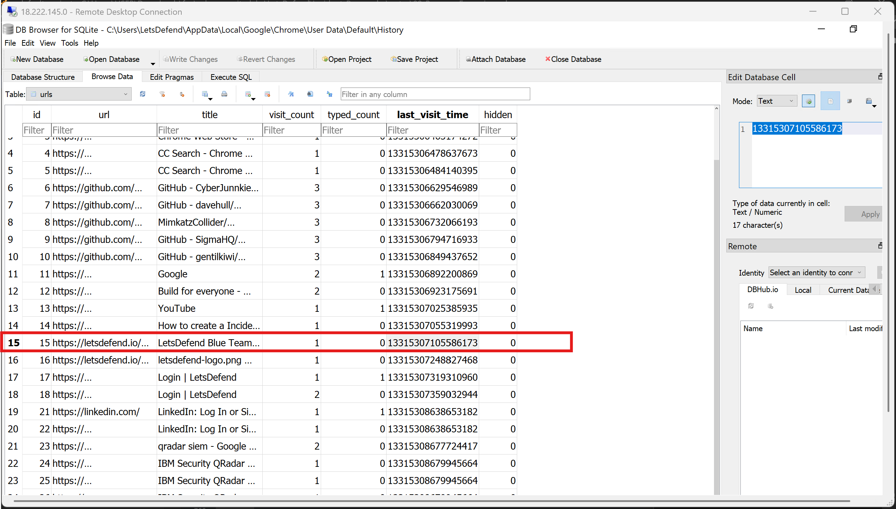
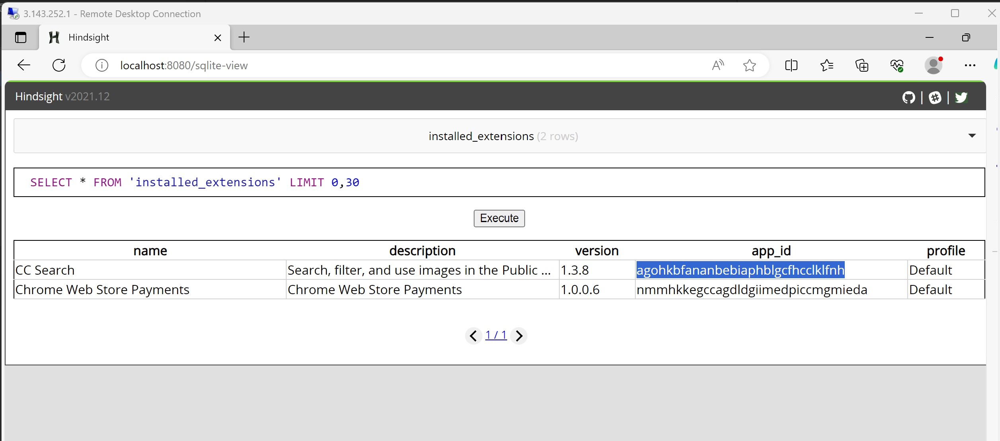
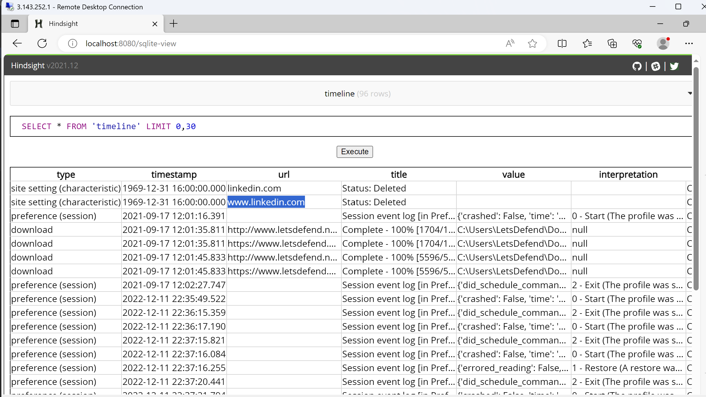

# LetsDefend Incident Responder Path: Browser Forensics Notes

## Table of Contents

1. [Introduction to Browser Forensics](#1-introduction-to-browser-forensics)
   - Scope and objectives
   - A typical scenario
   - Questions
2. [Acquisition](#2-acquisition)
   - Questions
3. [Browser Artifacts](#3-browser-artifacts)
   - Questions
4. [Tool: BrowsingHistoryView](#4-tool-browsinghistoryview)
   - Questions
5. [Manual Browser Analysis](#5-manual-browser-analysis)
   - DB Browser for SQLite
   - Session file analysis (strings)
   - Questions
6. [Hindsight Framework](#6-hindsight-framework)
   - Recovering deleted information
   - Questions
7. [Quiz](#7-quiz)
8. [Appendix: Browser Forensics Cheat Sheet](#8-appendix-browser-forensics-cheat-sheet)

---

## 1. Introduction to Browser Forensics

**Browser forensics** examines web browsers and their artifacts to extract evidence - useful for investigating insider threats, root cause of compromise, and data exfiltration. Core artifacts: **history**, **cache** (temporary storage speeding up page loads), and **cookies** (small tracking/session data files). Browser **extensions** are also examined, since they can be abused for malicious purposes.

### Scope and Objectives
- Establishes a timeline of user activity - helps pinpoint the root cause of an incident (e.g., malicious site visited, phishing link clicked).
- Helps identify the source of malware, adware, spyware, phishing sites.
- Applicable beyond criminal cases - civil cases, workplace harassment, IP theft investigations.
- This course focuses on **Google Chrome**, though the techniques generalize to other browsers.

### A Typical Scenario
A company suspects an employee leaked sensitive customer data to a competitor. A forensic analyst acquires the employee's disk image (using FTK Imager, EnCase, Autopsy, etc.), then extracts browser history, cache, cookies, and extensions. Evidence found: repeated visits to the competitor's site, and use of a file-sharing browser extension - together supporting the conclusion that the employee used the work computer to leak data. This becomes supporting evidence for legal proceedings.

### Questions

**1. What is the goal of browser forensics?**
- A) Invading individuals' privacy
- B) Track user's online activity to find cause of compromise
- C) Find corporate policy violations
- D) B and C

Answer: **D**

**2. Browser extensions are not considered browser artifacts.**

Answer: **False**

---

## 2. Acquisition

**Forensic acquisition** = creating an exact, tamper-preserving copy of storage media (including deleted/hidden data) for analysis without altering the original - critical for evidentiary integrity and court admissibility.

- In practice, a **full disk image** is typically acquired (not just browser data) using tools like FTK Imager, Autopsy, or Axiom - browser artifacts are then carved out from the image afterward.
- **Never analyze a live/original image directly** - risk of unintentional data corruption or tampering.
- Browser data is stored in **SQLite databases** and **JSON files**.

**Default browser storage locations:**
- Firefox: `%USERPROFILE%\AppData\Roaming\Mozilla\Firefox\Profiles\`
- Chrome: `%USERPROFILE%\AppData\Local\Google\Chrome\User Data\`
- Edge: `%USERPROFILE%\AppData\Local\Microsoft\Edge\User Data\`
- Opera: `%USERPROFILE%\AppData\Roaming\Opera Software\Opera Stable`

> Chrome, Edge, and Opera are all **Chromium-based**, so they share very similar internal database structures and file names - techniques learned for Chrome largely transfer directly.

### Questions

**1. Forensics copy of data doesn't always need to be same as its original bit by bit.**

Answer: **False**

**2. What is the full path where the majority of artifacts are stored?**

Answer: **C:\Users\LetsDefend\AppData\Local\Google\Chrome\User Data\Default**

---

## 3. Browser Artifacts

Overview of the key artifacts and what each reveals. (Full path table consolidated in the Appendix below.)

| Artifact | Storage Format | What It Reveals |
|---|---|---|
| **Search History** | SQLite (`History` DB, `keyword_search_term` table) | Exact search terms typed by the user - reveals intent. |
| **Visited Websites** | SQLite (`History` DB, `visits` table) | Full browsing history with URLs and timestamps - core artifact for reconstructing user activity. |
| **Downloads** | SQLite (`History` DB, `downloads` / `downloads_url_chains` tables) | Downloaded file names and source URLs - useful for spotting malicious downloads. |
| **Cookies** | SQLite (`Cookies` DB, `cookies` table, under `Network` folder) | Domains visited, session data, expiration - evidence of past web sessions. |
| **Cache** | Indexed data block files | Temporary storage of HTML/images - helps identify frequently visited sites. |
| **Bookmarks** | JSON file (`Bookmarks`) | Saved pages - reveals regularly visited sites/interests. |
| **Favicons** | SQLite (`Favicons` DB) | Site icons tied to domains - **persists even after history is deleted**, though not all sites have favicons and this artifact can be inconsistent on newer browser versions. |
| **Sessions** | SQLite (`Sessions` DB) | Open tabs/URLs from the last session - valuable when history was deleted right before closing the browser (data is nullified once a *new* session starts, though). Great for reconstructing a terminated employee's last activity. |
| **Form History** | SQLite (`Web Data` DB) | Autofill data - potentially passwords, credit card info, addresses. |
| **Thumbnails** | `Top Sites` file | Small preview images of frequently visited sites/media. |
| **Extensions** | Folder of randomly-named subfolders under `Extensions\` | Installed add-ons - potential source of malicious or compromised (supply-chain attacked) functionality. |

### Questions

> Lab note: don't open Chrome during these labs (it can modify the evidence) - use Edge instead.

**1. What's the size of the favicon database?**

Navigated to `C:\Users\LetsDefend\AppData\Local\Google\Chrome\User Data\Default` and checked the Favicons file properties.

Answer: **44 KB**

**2. What's the name of the first folder where extensions are stored?**



Answer: **agohkbfananbebiaphblgcfhcclklfnh**

---

## 4. Tool: BrowsingHistoryView

**BrowsingHistoryView** (Nirsoft) - free GUI tool that parses and displays browsing history from Firefox, Chrome, IE, Edge, and Opera in one unified table (URL, title, visit time, visit count, browser, user profile). Works on **live systems or disk images**; exports to CSV/TSV/HTML/XML (GUI or CLI). Download: `https://www.nirsoft.net/utils/browsing_history_view.html`

**Key filtering options:**
- **Date/time range** - narrow results to a known incident window, useful for correlating activity right before/after an event.
- **Matching Strings filter** - show only URLs containing specified substrings (comma-separated) - good for known IOCs/domains.
- **Non-Matching Strings filter** - exclude known-benign URLs/domains to cut noise.
- Both filters can be combined. Can also filter by **specific browser** and **specific user profile** - very useful on shared/AD workstations.

### Questions

**1. How many times was "github.com" visited where the repository was NOT related to the mimikatz tool?**

Set the matching filter to `githu`, non-matching filter to `mimikatz`, restricted to Chrome only, 
and counted the resulting rows.



Answer: **9**

**2. How many URLs are displayed when applying the matching filters for "google" and "youtube"?**
Answer: **16**

**3. What is the YouTube channel name of the video streamed?**



Answer: **letsdefend**

**4. How much time was spent visiting the LetsDefend blog?**



Answer: **00:07:26.104**

---

## 5. Manual Browser Analysis

### DB Browser for SQLite
Free tool for viewing/editing SQLite database files with a spreadsheet-like GUI - no SQL knowledge required, though SQL queries are supported. Used to manually browse the `History`, `Favicons`, `Top Sites`, and `Web Data` databases under `%USERPROFILE%\AppData\Local\Google\Chrome\User Data\Default`.

> Never have the database file open in the tool while the browser itself is running/writing to it - risk of corruption.

**Key tables explored:**
- **`History` -> `urls` table** - visited URLs.
- **`History` -> downloads-related tables** - downloaded file location and referrer URL (source of the download) - useful for spotting malicious download origins.
- **`Favicons` -> `favicon` table** - only sites *with* a favicon appear here, but this persists after history deletion; even subdomain/CDN-hosted favicon URLs (e.g., `paypalobjects.com`) can hint at the actual site visited.
- **`Top Sites`** - another source of "most visited" domains, independent of the main history file.
- **`Web Data`**:
  - **`keywords` table** - search/URL history plus favicon info.
  - **`autofill` table** - emails, usernames, and other typed form values.
  - **Credit card data** - card number and CVV are typically *not* stored (encrypted/omitted by design in most cases), but the **expiration date** often is, since it's considered less sensitive - still enough to help establish purchase/transaction activity.
  - **`autofill_profile_addresses`** - saved physical addresses, phone numbers, etc.

### Extensions (Manual)
Navigate to `...\Default\Extensions\` - each randomly-named subfolder corresponds to one installed extension. Metadata files and icon images inside each folder can identify the extension name/purpose (or use Hindsight to automate this, covered next).

### Session File Analysis
Session files only retain useful data if the user **deleted history and then closed the browser** without starting a new session afterward (a new session nullifies the old file's contents). Since session files aren't human-readable directly, use the **`strings`** tool (Sysinternals) to extract readable text:

```bash
strings64.exe -a "C:\Users\[username]\AppData\Local\Google\Chrome\User Data\Default\Sessions\Session_Filename" > filename.txt
```
(`-a` = ASCII-only output; redirecting to a file makes the output easier to review.)

This can recover evidence of recent browsing activity even after the history database itself was cleared.

> **Manual vs. automated analysis:** manual review can surface details automated tools might overlook or not flag as significant - valuable for deep-dive investigations. Automated tools remain essential for fast triage when time is limited. Use both as complementary approaches.

### Questions

**1. What's the last visit time for the LetsDefend blog page?**
Opened the `History` file in DB Browser for SQLite, checked the `urls` table.



Answer: **13315307105586173** (Chrome/WebKit timestamp format)

**2. What's the GUID value for the download of the LetsDefend logo?**
Checked the downloads table.
Answer: **ffd210b3-5770-45e2-af05-538a4ada5112**

**3. What's the fourth top visited site? (Full URL)**
Loaded the `Top Sites` database and looked at the row where `urlrank = 3` (0-indexed, so rank 3 = 4th site).
Answer: `https://www.youtube.com/`

**4. What's the favicon URL for YouTube according to the evidence found?**
Checked the `favicon` table under the Favicons database.
Answer: `https://www.youtube.com/s/desktop/25bf5aae/img/favicon_32x32.png`

**5. What is the email address of the user?**
Checked the `autofill` table in the Web Data database.
Answer: `letsdefendisawesome@letsdefend.io`

---

## 6. Hindsight Framework

**Hindsight** is a free, automated tool that parses Chromium-based browser artifacts (URLs, downloads, cache, bookmarks, autofill, saved passwords, preferences, extensions, cookies, local storage) far faster than manual database browsing. Download: `https://github.com/obsidianforensics/hindsight/releases`

**Workflow:**
1. Run the binary (GUI runs locally via `http://localhost:8080` - bypass the SmartScreen warning if prompted). Use a *different* browser than the one being analyzed (e.g., analyze Chrome using Edge) to avoid tampering with the evidence.
2. Select **Input Type** (browser - currently supports Chrome and Brave).
3. Provide the **Profile Path** - the default location, or a custom path if importing artifacts from another machine/disk image.
4. Select **plugins** - recommended to select all for maximum data unless narrowing to a specific use case (e.g., only extensions).
5. Click **Run** - get a results overview of everything parsed.
6. Review output as **Excel, JSON, or SQLite** - the built-in SQLite engine lets you browse tables and run **SQL queries** directly in the browser, correlating multiple artifact types in one place instead of checking separate databases individually.

**Key tables:**
- **`installed_extensions`** - automated version of the manual extension lookup from the previous lesson.
- **`storage`** - parsed cookies, cache, and Web Data (autofill/form history) combined.
- **`timeline`** - chronological view combining History, Top Sites, Bookmarks, and more.

### Recovering Deleted Information - Site Characteristics
Chrome tracks certain site behaviors (title/favicon changes, etc.) in a **Site Characteristics** database, keyed by the **MD5 hash of the site's origin** (value stored as Protobuf). Hindsight computes the MD5 hash of every origin URL it finds across *other* artifacts and compares it against these keys - if a match is found, it replaces the hash with the actual origin URL in its output.

**Forensic value:** this can prove a specific site was visited **even if all other traces of it were deleted**, since the hashed key remains in Site Characteristics regardless. To hunt for a specific known site with no other trace, you can manually compute its MD5 hash and search for matching keys.

**Example SQL query (timeline table, URLs only, first 30 rows):**
```sql
SELECT URL FROM 'timeline' LIMIT 0,30
```

### Questions

**1. What's the app_id for the found extension? (starts with "ag...")**

Used profile path `C:\Users\LetsDefend\AppData\Local\Google\Chrome\User Data`, then opened the results 
in the built-in SQLite browser.



Answer: **agohkbfananbebiaphblgcfhcclklfnh**

**2. What's the extension name installed by the user?**

Visible in the same results as above.

Answer: **CC Search**

**3. What's the value of 'key' for the Google website with sequence value of '45'?**

Checked the `storage` table, filtered for sequence value 45.

Answer: **sb_wiz.zpc.gws-wiz.**

**4. Which website (domain) was deleted from history?**

Checked the `timeline` table filtered for type `characteristic` (i.e., a Site Characteristics MD5 match recovered from a deleted entry).



Answer: **linkedin.com**

---

## 7. Quiz

**Q1. What is the purpose of conducting browser forensics?**
- To recover deleted browsing history
- To identify the web browser used in a crime
- To determine the identity of a user based on their browsing history
- **All of the above**

**Q2. What is a browser artifact?**
- **A trace left behind by the web browser on a computer**
- A security vulnerability in a web browser
- A malicious plugin or extension installed on a web browser
- A digital forensic tool used to analyze web browsers

**Q3. What's the full path of the cookies SQLite database? (For Google Chrome)**
- %USERPROFILE%\AppData\Local\Google\Chrome\UserData\Default\Cookies
- %USERPROFILE%\AppData\Local\Google\Chrome\UserData\Default\Cookies\Cookies
- **%USERPROFILE%\AppData\Local\Google\Chrome\UserData\Default\Network\Cookies**
- %USERPROFILE%\AppData\Local\Google\Chrome\UserData\Default\Web Data\Cookies

**Q4. Browser artifacts can be potential evidence for:**
- Legal proceedings
- Corporate incidents
- Tracking user activities
- **All of them**

**Q5. Which of the following is NOT typically considered as part of browser forensics?**
- Analysis of browser cache and history
- Analysis of browser extensions and plugins
- **Analysis of the operating system on a computer**
- Analysis of the webpages visited by a user

**Q6. Favicons were introduced to be a forensic artifact?**
- True
- **False**

**Q7. Bookmarks are stored in a JSON file.**
- **True**
- False

**Q8. Downloads database also stores the downloaded files.**
- False
- **True**

**Q9. Every visited website has a favicon URL too.**
- True
- **False**

**Q10. Browser forensics can be used to determine the location of a user?**
- **True**
- False

---


## 8. Appendix: Browser Forensics Cheat Sheet

### Artifact Paths by Browser

| Artifact | Chrome | Firefox | Edge | Opera |
|---|---|---|---|---|
| **Base profile folder** | `%USERPROFILE%\AppData\Local\Google\Chrome\User Data\` | `%USERPROFILE%\AppData\Roaming\Mozilla\Firefox\Profiles\` | `%USERPROFILE%\AppData\Local\Microsoft\Edge\User Data\` | `%USERPROFILE%\AppData\Roaming\Opera Software\Opera Stable` |
| **Search History / Visited Websites** | `...\Default\History` | `...\Profiles\[folder]\places.sqlite` | `...\Default\History` | `...\Opera Stable\History` |
| **Downloads** | `...\Default\History` (downloads / downloads_url_chains tables) | `...\Profiles\[folder]\places.sqlite` | `...\Default\History` | `...\Opera Stable\History` |
| **Cookies** | `...\Default\Network\Cookies` | `...\Profiles\[folder]\cookies.sqlite` | `...\Default\Network\Cookies` | `...\Opera Stable\Network\Cookies` |
| **Cache** | `...\Default\Cache\Cache_Data` | `...\Profiles\[folder]\webappsstore.sqlite` | `...\Default\Cache\Cache_Data` | `...\Opera Stable\Cache\Cache_Data` (under `\Local\`, unlike rest of Opera data which is under `\Roaming\`) |
| **Bookmarks** | `...\Default\Bookmarks` (JSON) | `...\Profiles\[folder]\places.sqlite` | `...\Default\Bookmarks` (JSON) | `...\Opera Stable\Bookmarks` |
| **Favicons** | `...\Default\Favicons` | `...\Profiles\[folder]\favicons.sqlite` | `...\Default\Favicons` | `...\Opera Stable\Favicons` |
| **Sessions** | `...\Default\Sessions\*` | `...\Profiles\[folder]\sessionstore.jsonlz4` and `\sessionstore-backups\*` | `...\Default\Sessions\*` | `...\Opera Stable\Sessions\*` |
| **Form History / Autofill** | `...\Default\Web Data` | `...\Profiles\[folder]\formhistory.sqlite` | `...\Default\Web Data` | `...\Opera Stable\Web Data` |
| **Thumbnails / Top Sites** | `...\Default\Top Sites` | *(not applicable - Firefox uses a different mechanism)* | `...\Default\Top Sites` | `...\Opera Stable\Top Sites` |
| **Extensions** | `...\Default\Extensions\{random_folder}\*` | `...\Profiles\[folder]\extensions\*` | `...\Default\Extensions\{random_folder}\*` | `...\Opera Stable\Extensions\{random_folder}\*` |

> Chrome, Edge, and Opera are all **Chromium-based** - same underlying database structure and file names, just different root folders. Firefox uses its own format (`places.sqlite` handles history, downloads, and bookmarks together).

### What Each Artifact Tells an Investigator

| Artifact | Format | Investigative Value |
|---|---|---|
| History (`urls` table) | SQLite | Full record of sites visited - the backbone of any browsing timeline. |
| History (`downloads` tables) | SQLite | What was downloaded and from where - spot malicious payloads and their source. |
| Cookies | SQLite | Confirms actual sessions/domains interacted with, not just visited. |
| Cache | Indexed data blocks | Reconstructs frequently accessed content, even without a clean history entry. |
| Bookmarks | JSON | Sites the user *deliberately* saved - signals genuine interest/intent, not accidental visits. |
| Favicons | SQLite | **Survives history deletion** - can prove a domain was visited even with no other trace; not fully reliable (missing on some sites, inconsistent on newer browser versions). |
| Sessions | SQLite | Recovers "last known state" of open tabs - valuable specifically when history was deleted right before the browser closed. |
| Web Data (autofill) | SQLite | Emails, usernames, addresses, partial payment info - can be a goldmine of PII and user identity confirmation. |
| Top Sites | File | Independent "most visited" ranking - cross-check against History for consistency or gaps. |
| Extensions | Folder + metadata files | Identifies installed add-ons - critical if a malicious or hijacked (supply-chain) extension is the suspected entry point. |

### Tools Cheat Sheet

| Tool | Purpose | Notes |
|---|---|---|
| **FTK Imager / Autopsy / EnCase / Axiom** | Full disk/forensic image acquisition | Always acquire a proper image before analysis - never analyze a live/original system directly. |
| **BrowsingHistoryView** (Nirsoft) | Unified GUI history viewer across all major browsers | Great for fast triage on live systems or multi-user/shared machines; supports date range + matching/non-matching string filters; GUI and CLI versions available. |
| **DB Browser for SQLite** | Manual SQLite database viewer/editor | Best for deep-dive manual analysis; spreadsheet-like interface, supports raw SQL queries; never open a DB file while the browser that owns it is running. |
| **strings** (Sysinternals) | Extracts readable ASCII text from binary/non-human-readable files | Used specifically to recover data from Session files; `-a` flag = ASCII-only output. |
| **Hindsight** | Automated multi-artifact parser (Chrome/Brave) | Correlates URLs, downloads, cache, bookmarks, autofill, passwords, extensions, cookies, and local storage into one queryable database (Excel/JSON/SQLite output); can recover deleted domain evidence via the Site Characteristics MD5 matching technique. Runs locally via `localhost:8080`. |

### Quick Reasoning Checklist for an Investigation

1. **Acquire first** - always work from a forensic image, never the live/original system.
2. **Triage fast** - use BrowsingHistoryView or Hindsight first to get a broad picture and narrow the incident time window.
3. **Go deep where it matters** - switch to DB Browser for SQLite for manual verification or artifacts automated tools might under-prioritize.
4. **Don't assume history = truth** - cross-check Favicons, Top Sites, Sessions, and Site Characteristics (via Hindsight) for evidence that survives history deletion.
5. **Check Extensions** whenever malware or a suspicious redirect/behavior is involved - supply-chain-compromised extensions are an easy blind spot.
6. **Correlate timestamps** across artifacts (downloads, cookies, form autofill) to build a reliable, evidence-backed timeline.

