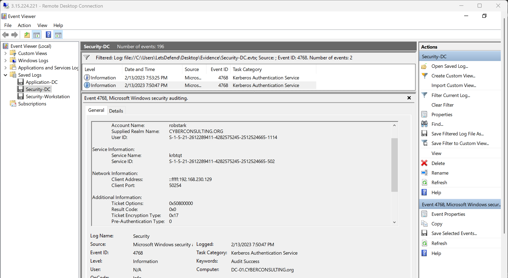
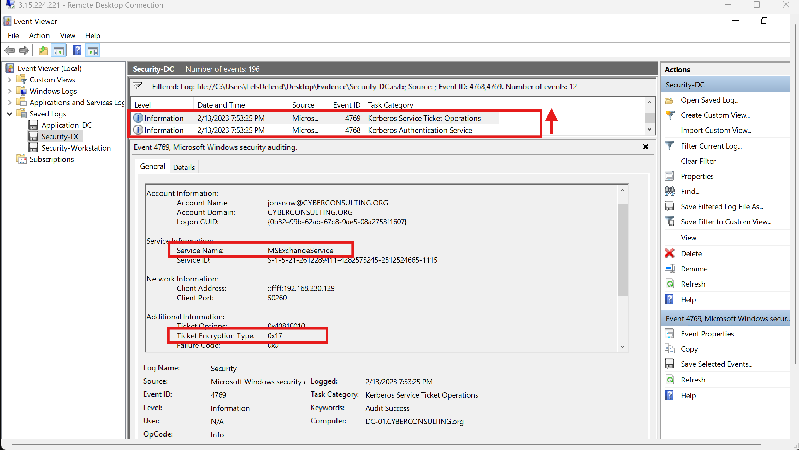
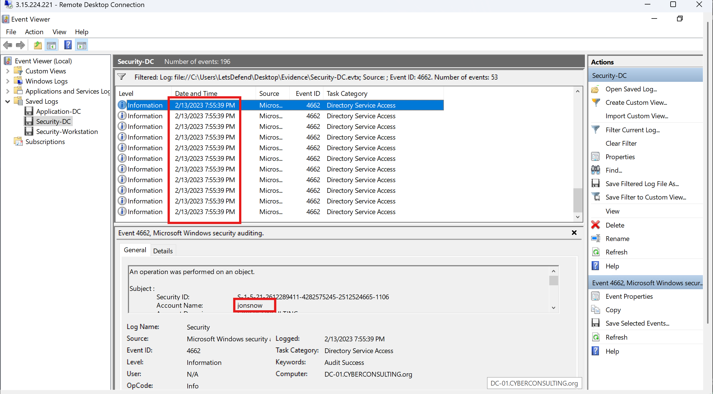
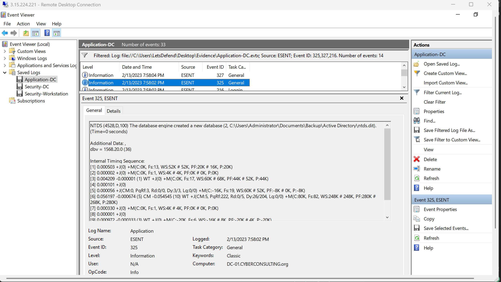
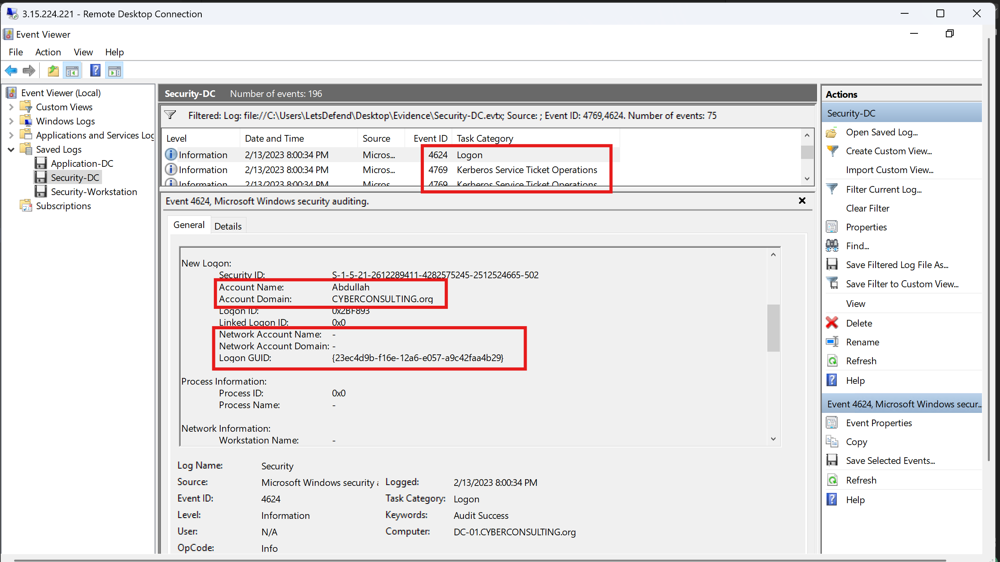

# LetsDefend Incident Responder Path: Hunting Active Directory Attacks | Notes

I worked through the AD hunting course in the Incident Responder Path on LetsDefend right now, and figured I'd 
put these notes together properly as i have done for the previous courses. 

I'm also slowly building out a personal project around attacking and defending Active Directory 
, so this file is doing double duty - it's my study notes from the course, and it's the reference 
I'll keep coming back to whenever I'm setting up detections or trying to reason through what 
a specific AD attack actually looks like in the logs.

I've kept the explanations a bit heavier than a plain cheat sheet would be, mainly because none 
of these attacks really click until you understand *why* Kerberos and LDAP behave the way they 
do in the first place - almost everything here is abuse of legitimate, by-design behavior rather 
than exploitation of an actual bug. Once that clicks, the detection logic makes a lot more sense too.

---

## Table of Contents

1. [Active Directory Fundamentals](#active-directory-fundamentals)
2. [How Kerberos Authentication Works](#how-kerberos-authentication-works)
3. [AS-REP Roasting](#1-as-rep-roasting)
   - [Questions](#questions)
4. [Kerberoasting](#2-kerberoasting)
   - [Questions](#questions-1)
5. [LDAP Enumeration (BloodHound / SharpHound)](#3-ldap-enumeration-bloodhound--sharphound)
   - [Questions](#questions-2)
6. [NTDS Database Dumping](#4-ntds-database-dumping)
   - [Questions](#questions-3)
7. [Golden Ticket Attacks](#5-golden-ticket-attacks)
   - [Questions](#questions-4)
8. [NTLM Relay Attacks](#6-ntlm-relay-attacks)
   - [Questions](#questions-5)
9. [Appendix A - Quiz](#appendix-a--quiz)
10. [Appendix B - Event ID Cheat Sheet](#appendix-b--event-id-cheat-sheet)
11. [Appendix C - Blue Team Hunting Playbook](#appendix-c--blue-team-hunting-playbook)

---

## Active Directory Fundamentals

Active Directory (AD) is Microsoft's directory service for Windows domain networks. Think of it as a centralized database plus a set of protocols that together answer two questions for every request on the network: who are you, and what are you allowed to do. It stores users, computers, groups, and applications in a hierarchical structure, and gives administrators a single place to manage authentication, authorization, and policy (via Group Policy Objects) across an entire organization.

The reason AD is such a high-value target is exactly why it's so useful operationally - it's the single source of truth for identity and access across the whole network. Compromise the directory, and you don't just compromise one machine, you potentially compromise every machine trusting that directory.

The core authentication protocol underpinning almost everything in AD is Kerberos.

---

## How Kerberos Authentication Works

Kerberos is the default authentication protocol in Windows domains, designed to be stronger than the older NTLM protocol by using third-party ticket issuance and stronger encryption. It runs on UDP port 88. Even though it's the "more secure" option, it still has design characteristics that attackers can abuse - not because Kerberos is broken, but because some of its trust assumptions can be manipulated if misconfigured.

**Key terminology:**

| Term | What it means |
|---|---|
| KDC (Key Distribution Center) | The service that issues tickets. Runs on every Domain Controller. Made up of the Authentication Service and the Ticket Granting Service. |
| TGT (Ticket Granting Ticket) | Proof that a user authenticated successfully. Used to request access to specific services without re-entering a password. |
| AS (Authentication Service) | The part of the KDC that issues the initial TGT. |
| TGS (Ticket Granting Service) | The part of the KDC that issues Service Tickets once a valid TGT is presented. |
| SPN (Service Principal Name) | An identifier that ties a specific service instance to a domain service account. Any service that needs Kerberos authentication needs an SPN registered. |

**The authentication flow, step by step**, using a user opening a file share as the example:

1. The client sends an authentication request to the KDC (in plaintext).
2. If the client exists in the directory, the KDC replies with a TGT and a session key.
3. The client presents that TGT back to the KDC and asks for a service ticket to the file share specifically.
4. The KDC replies with a service ticket encrypted using the earlier session key.
5. The client presents the service ticket to the file share server.
6. The file share server validates the ticket and grants access.

Service tickets expire - the Kerberos default ticket lifetime is 600 minutes (10 hours). That number matters later: Golden Ticket attacks abuse the fact that an attacker crafting their own ticket can set this lifetime to anything they want, including years.

For a deeper primer, see: [blog.netwrix.com - What is Kerberos](https://blog.netwrix.com/2022/08/18/what_is_kerberos/)

---

## 1. AS-REP Roasting

### What it is and why it works

Kerberos has a step called pre-authentication that happens before a TGT is issued. Its job is to stop brute-force password guessing: the client has to prove it already knows the password by encrypting a timestamp with a hash derived from that password, and the KDC checks that the decryption works before it hands out a TGT.

Some accounts have pre-authentication disabled - sometimes intentionally for legacy application compatibility, sometimes by administrator mistake. When that's the case, an attacker can request a TGT for that username without proving they know the password at all. The KDC just hands back an encrypted TGT, no questions asked. Because part of that response is encrypted with a hash of the user's password, the attacker can take it offline and try to crack it at their leisure - no interaction with the domain controller required after that first request, and no failed-logon events generated.

This is entirely a function of how Kerberos is designed to work; there's no bug being exploited. That's exactly what makes it hard to catch - it blends into legitimate day-to-day authentication traffic.

### The attack, step by step

1. Attacker enumerates domain usernames that don't require pre-authentication (or just tries a candidate list).
2. Attacker requests a TGT for one of those usernames.
3. The KDC replies without requiring a password, since pre-auth is disabled for that account.
4. Attacker extracts the recoverable hash from the response and cracks it offline.

### Attack tooling

If the attacker doesn't have any valid usernames yet, a tool like `kerbrute` can enumerate them:
```bash
./kerbrute_linux_amd64 userenum -d CYBERCONSULTING.org --dc 192.168.230.140 users.txt
```

Once a candidate username list exists, the Impacket script `GetNPUsers.py` checks each one for disabled pre-authentication and pulls the hash if so:
```bash
python3 /usr/share/doc/python3-impacket/examples/GetNPUsers.py CYBERCONSULTING.org/ -dc-ip 192.168.230.140 -user users.txt -no-pass
```
The `-no-pass` flag tells the script the attacker has no credentials yet. If they do have valid creds already (e.g. for lateral movement), those can be supplied instead. Adding a format flag formats the hash for cracking with John the Ripper:
```bash
python3 /usr/share/doc/python3-impacket/examples/GetNPUsers.py CYBERCONSULTING.org/ -dc-ip 192.168.230.140 -user users.txt -no-pass -format john
```
In this exercise, this returned the hash for user `abdullah`, meaning pre-authentication was disabled for that account. The user `cyberjunkie` returned nothing, meaning pre-auth was still enabled for them.

Cracking the hash with John the Ripper:
```bash
john --wordlist=pass.txt hash.txt
```
This cracked `abdullah`'s password as `Password1`.

Note that this whole attack can be performed from any machine with network access to the domain controller - the attacker doesn't need to be on a compromised host, and in many cases doesn't need any valid credentials at all going in. Tools like Rubeus can also perform this attack directly from a compromised machine, without needing an external Kali box.

### How to detect it

Every Kerberos TGT request generates Event ID 4768 on the Domain Controller. The problem is volume - this event fires constantly for entirely legitimate logons. Two fields narrow it down dramatically:

- Ticket Encryption Type - a legitimate, properly pre-authenticated request typically shows `0x12` (AES-256). An AS-REP roasted request shows `0x17` (RC4) - though note RC4 alone isn't damning, since some legacy services still require it.
- Pre-Authentication Type - a value of `0` means pre-authentication was not performed. Anything other than `0` (commonly `2`) means it was.

The combination of `0x17` encryption + pre-authentication type `0` is the specific signature to hunt for. That combination is rare enough in normal traffic to be a strong, actionable indicator.

**Summary - hunt for:**
1. Event ID 4768 on the Domain Controller
2. Ticket Encryption Type `0x17`
3. Pre-Authentication Type `0`

### Mitigation

1. Find accounts with pre-authentication disabled:
```powershell
Get-ADUser -Filter * -Properties DoesNotRequirePreAuth | Where-Object {$_.DoesNotRequirePreAuth -eq $true}
```
2. Enforce long, complex passwords domain-wide - even if an account is roastable, a strong password makes offline cracking impractical.

### Questions

1. Which user account was targeted in the AS-REP roasting attack?

Using the "Evidence" folder provided, I opened the "Security-DC" file to answer this. I filtered for Event ID 4768, which returned two events. One was legitimate - Ticket Encryption Type `0x17`, Pre-Authentication Type `2`. The other was the malicious attempt - Ticket Encryption Type `0x17`, Pre-Authentication Type `0`.

Ans: robstark



2. At what time did this attack occur?

Same timestamp seen in the previous screenshot.

Ans: 7:50:47

---

## 2. Kerberoasting

### What it is and why it works

Kerberoasting targets service accounts rather than user accounts. Any account with a registered SPN can have a service ticket requested for it by any authenticated domain user - no elevated privileges required. That service ticket is encrypted with a hash derived from the service account's password. If that password is weak, the attacker can crack it offline after grabbing the ticket.

The reason this attack is so effective in real environments: service accounts are routinely over-privileged. Administrators frequently grant service accounts domain admin rights "to make things work," and often set passwords once and never rotate them. An attacker who cracks a Kerberoastable service account's password may walk straight into domain admin.

### The attack, step by step

Attackers first need to discover which accounts have SPNs set (which is a strong proxy for "this is a service account"). The PowerSploit framework's `PowerView.ps1` script is a common enumeration tool for this. First importing it:
```powershell
. .\Desktop\PowerView.ps1
```
Then enumerating accounts with an SPN set:
```powershell
Get-NetUser -SPN
```
This returns all accounts with an SPN - commonly including the built-in `krbtgt` account and any custom service accounts. In this exercise, a `SQLService` account showed up, and its password was even visible sitting in the account's description field - a very common real-world mistake where admins jot down a password in the description thinking no one else can see it.

Once a target service account is known, a tool like Rubeus can directly request and dump kerberoastable ticket hashes:
```powershell
.\Rubeus.exe kerberoast
```
The resulting hash is then cracked offline the same way as AS-REP roasting.

### How to detect it

The pattern looks similar to AS-REP roasting but at the service ticket stage rather than the initial TGT stage:

1. A TGT is requested first (Event ID 4768), often with encryption type `0x17` - same signal as AS-REP roasting.
2. Immediately after, a service ticket is requested (Event ID 4769) - also with encryption type `0x17`. In legitimate traffic this is typically `0x12` or `0x11`.
3. Filter out requests where the account name starts with `$` - those are computer/service accounts doing routine Windows operations, not user accounts requesting Kerberoastable tickets.
4. Check for the Audit Success keyword on the 4769 event - this means the attacker actually received the ticket.
5. Multiple 4769 requests with `0x17` encryption in a tight time window is a strong signal of automated/scripted Kerberoasting across several service accounts at once.

**Summary - hunt for:**
1. Event ID 4768 with encryption type `0x17`
2. Immediately followed by Event ID 4769, also `0x17`
3. Requesting account is a real domain user, not a `$`-suffixed service/computer account
4. Audit Success on the 4769 event
5. Multiple such requests in a short window (possible automated tooling)

### Mitigation

1. Service accounts need complex, lengthy, regularly rotated passwords.
2. Apply least-privilege to service accounts - if one is compromised, limit the blast radius.

### Questions

1. What is the name of the service account which was kerberoasted?

I added Event ID 4769 to the previous filter and looked for the event occurring immediately after 4768, with Ticket Encryption Type `0x17`.

Ans: MSExchangeService



2. At what time was the service ticket requested from the domain controller?

Ans: 7:53:25

3. Which user's credentials did the attacker use to perform this attack?

Looking at the account name for this event, the attacker had already compromised the `jonsnow` account via AS-REP roasting earlier.

Ans: jonsnow

---

## 3. LDAP Enumeration (BloodHound / SharpHound)

### What it is and why it works

LDAP (Lightweight Directory Access Protocol) is the underlying protocol AD uses to query and update directory data - user lookups, permission checks, resource access, all of it runs through LDAP under the hood. Because it's foundational and constantly in use, auditing every LDAP object-access event by default would generate crushing log volume and hurt domain performance - which is exactly why object-access auditing is off by default in AD.

Attackers exploit that gap. Tools like SharpHound (the data collector for BloodHound) query LDAP en masse to pull the entire logical structure of a domain - every user, computer, group, and the relationships/permissions between them - and package it into a graph that shows the attacker the shortest path to Domain Admin. A manual LDAP query by a legitimate admin looks identical to a single automated query by SharpHound; the difference is volume and speed, not content.

### The attack, step by step

Running SharpHound on a compromised or foothold machine (in this exercise, run from the `cyberjunkie` user's machine) collects the domain's LDAP data and packages it into a zip file. The enumeration completes, and the attacker then moves the zip file to their own machine and loads it into BloodHound, which renders the whole domain as a graph and highlights privilege-escalation paths depending on the configurations and privileges present in the domain.

### How to detect it

Since object-access auditing is off by default, the trick isn't to log everything - it's to log a small, deliberately placed subset that a broad automated tool is guaranteed to touch.

Enter CANARY objects. Create fake user accounts, computers, and groups that no legitimate process ever touches, make them blend in convincingly, and turn on auditing only for those specific objects. A legitimate admin never queries a canary object because they don't know it's meaningless. An automated enumeration tool like SharpHound will query it along with everything else, because it doesn't discriminate - it queries the whole directory. The more canary objects deployed, the higher the odds of catching automated enumeration in a large environment.

The relevant event is Event ID 4662 (object access). In this exercise, the first event showed the LDAP query originating from the `cyberjunkie` account, querying a username called "dr strange" - a canary object placed for the exercise. A second event showed the same account querying a canary computer object named "Test." The tell isn't the event itself - a single 4662 on a canary object is already suspicious, but the real confirmation is volume and timing: looking closely at the timestamps between these events showed essentially no time difference between them, which is not something a human does manually. That timing signature is what separates SharpHound from a curious admin. With hundreds of canary objects deployed, you'd expect to see many of them hit in this same tight window, making the automated-tool conclusion even more obvious.

**Summary - hunt for:**
1. Event ID 4662 against deliberately placed canary objects
2. Many such events in a very short time window from the same account (a strong automation signal)

### Mitigation

1. Prevent unprivileged session enumeration where possible (restrict what regular authenticated users can query via LDAP).

### Questions

1. Which user account was used by the attacker to enumerate LDAP?

After filtering for Event ID 4662, I saw what can be termed LDAP enumeration performed by `jonsnow` - multiple events recorded within milliseconds of each other.

Ans: jonsnow



2. At what time was the first LDAP enumeration event logged?

Ans: 7:55:39

---

## 4. NTDS Database Dumping

### What it is and why it works

`ntds.dit` is the actual Active Directory database file - every domain object, security policy, and password hash for the entire forest, stored on every domain controller at `%SystemRoot%\NTDS\Ntds.dit` by default. If an attacker gets this file (plus the SYSTEM registry hive, which holds the key needed to decrypt password data within it), they effectively hold the keys to the entire domain - every account, every password hash, recoverable offline with no rate limiting.

The tool most commonly abused for this is `ntdsutil` - a built-in Windows utility normally used by administrators to legitimately back up the NTDS database. Because it's a routine, expected tool on a domain controller, attackers use it specifically because it blends into normal operational activity far better than a third-party dumping tool would.

### The attack, step by step

Dumping the NTDS database on the domain controller "DC-01":
```text
ntdsutil "ac i ntds" "ifm" "create full C:\Users\Administrator\Desktop\NTDS_BACKUP" q q
```
Breaking that down:
- `ac i ntds` - activates the local NTDS service instance
- `ifm` - opens the Install-From-Media submenu, used for backup/restore
- `create full C:\Users\Administrator\Desktop\NTDS_BACKUP` - creates a full backup of `ntds.dit` at the specified path
- `q q` - the first `q` quits the Install-From-Media submenu, the second `q` quits `ntdsutil` itself

This dumps `ntds.dit` alongside the `SYSTEM` and `SECURITY` registry hives to the chosen path, ready for exfiltration and offline decryption to recover the domain's sensitive data.

### How to detect it

Check Application event logs, filtered to event source ESENT (the database engine ntds.dit runs on). You get there by opening Application logs, filtering the current log, then selecting Event sources and choosing "ESENT."

| Event ID | Meaning |
|---|---|
| 325 | A new database was created - in this scenario, the dumped copy |
| 327 | The database engine detached a database - the dumped copy being detached after creation |
| 216 | The NTDS database was written to a location other than its default path (`%SystemRoot%\NTDS\ntds.dit`) |

Event ID 325/327 alone can be a strong signal, but pairing it with 216 firing within milliseconds of the same window removes almost all doubt - 216 specifically flags a non-default write location, which is exactly what a dump-to-Desktop or dump-to-Downloads operation looks like. Attackers often try to disguise the destination path with innocuous names like "Backup" or "Critical_Backup" - so the detection logic isn't "is this path suspicious-looking," it's "is this path anything other than the real default."

In this exercise, Event ID 216 occurred just 2 milliseconds before Events 325 and 327 fired - that tight a window is a very strong confirming signal on its own.

**Summary - hunt for:**
1. Event IDs 325, 327, and 216 in Application logs, source ESENT
2. Any path in 325/327 other than `C:\Windows\NTDS\`
3. Event 216 occurring right around the same time as 325/327
4. If volume is still high, use Event Viewer's Find feature to search for the keyword "ntds" directly

### Mitigation

There's no direct mitigation against this since the underlying process is a normal Windows Server operation - the response is about reducing exposure:
1. Restrict administrative privileges as tightly as possible.
2. Routinely audit administrative logins to domain controllers, since this attack can only be performed there.

### Questions

1. At what time was the NTDS database dumped?

I filtered the Security-DC logs for Event IDs 325, 327, and 216, with event source ESENT.

Ans: 7:58:02

2. What was the path where the NTDS database was dumped?

Ans: C:\Users\Administrator\Documents\Backup\Active Directory\ntds.dit



---

## 5. Golden Ticket Attacks

### What it is and why it works

A Golden Ticket is a forged TGT for a privileged account - most commonly `krbtgt` itself, the service account the entire Kerberos trust chain relies on. To forge one, an attacker needs the NTLM hash of the `krbtgt` account, which requires domain admin (or equivalent) access to obtain in the first place. Once they have it, they can mint a TGT for literally any user, with literally any permissions, and set its lifetime to anything they want - the default is 10 hours, but a forged ticket can be set to last several years.

Because the resulting ticket is technically "valid" from Kerberos's point of view (it's encrypted with the real `krbtgt` hash), authentication using it looks legitimate on its face. This is what makes Golden Ticket attacks a long-term persistence mechanism, not just a smash-and-grab - an attacker can walk away and come back to a still-valid golden ticket weeks or months later.

### The attack, step by step

Using Mimikatz to first pull the `krbtgt` NTLM hash from `lsass.exe`:
```text
lsadump::lsa /inject /name:krbtgt
```
This reveals the account's SID, RID, and NTLM hash - all required inputs for forging the ticket.

Then, forging and injecting the golden ticket into memory:
```text
kerberos::golden /User:Administrator /domain:CYBERCONSULTING.org /sid:S-1-5-21-2612289411-4282575245-2512524665 /id:502 /krbtgt:2e3d7350dd8210ebe7f03ce2147d8786 /ptt
```
The `/ptt` flag injects the forged ticket directly into memory, granting the attacker `krbtgt`-equivalent privileges under whatever username they chose - in this case `Administrator`. From here, they can access any machine in the domain - including domain controllers - with system-level privileges. Running `klist` shows the forged ticket sitting active among the session's Kerberos tickets, and now the `cyberjunkie` user (originally just a normal domain user) effectively has domain admin privileges. The attacker confirmed this by connecting to the `C$` administrative share on the domain controller and succeeding.

### How to detect it

This is one of the hardest AD attacks to reliably detect because a Golden Ticket, by design, produces authentication events that look mostly legitimate. Detection depends on correlating multiple fields across two event IDs rather than any single smoking gun.

Event ID 4769 - a service ticket request for `krbtgt` itself. This alone is fairly normal (admin operations touch the Kerberos service regularly), but the client address matters: if the request originates from a normal workstation rather than a domain controller, it's worth a second look - though not conclusive on its own, since a domain admin logging into a workstation and doing normal work can trigger the same thing.

Event ID 4624 - successful logon - correlated with the 4769 above. The specific fields to check:
- Subject Account Domain - blank is a common (though not exclusive) indicator
- Logon Type - Golden Ticket attacks are typically performed over the network, so Logon Type `3` is the expected pattern
- Impersonation Level - legitimate requests show Impersonation; forged tickets often show Delegation
- Security ID vs Account Name mismatch - this is the strongest signal. A legitimate Administrator logon shows the Administrator's own SID. A forged ticket built with the `krbtgt` SID but an Account Name of "Administrator" is a direct mismatch - the SID says one thing, the claimed identity says another
- Account Domain - a legitimate logon shows just the domain name (e.g. `CYBERCONSULTING`); a forged ticket often shows the fully qualified domain name (`CYBERCONSULTING.org`) instead - a subtle but consistent tell
- Source network address - the workstation the request actually came from, useful for tracing back to the compromised host

None of these signals alone is conclusive - SID/name mismatches, blank subject domains, and FQDN account domains can all occur in edge cases. The confidence comes from how many of them line up together on the same event pair.

An additional, independent check: run `klist` on a suspect endpoint and inspect ticket lifetimes. A default ticket lasts 10 hours; Mimikatz-forged tickets are commonly set to last years - an outlier that's easy to spot once you're looking at the right session.

Given how much manual correlation this requires, production environments are generally better served by security tooling with built-in behavioral analytics (e.g. Microsoft Defender for Identity/ATA) plus Sysmon process-creation logging, so analysts can also search directly for tool signatures - command-line keywords like "golden," "lsadump," "lsa," etc. - rather than relying purely on native Windows event correlation.

**Summary - hunt for:**
1. Event ID 4769 requesting a `krbtgt` service ticket from a non-DC source
2. Event ID 4624 immediately following, with Logon Type `3`
3. SID / Account Name mismatch in the 4624 event
4. Account Domain shown as a fully qualified domain name
5. Source network address pointing to a workstation, not a domain controller - that workstation becomes the investigation target

### Mitigation

1. This attack requires the `krbtgt` hash, which only privileged accounts can access - restrict administrative rights as tightly as possible.
2. Rotate administrative account passwords (and the `krbtgt` hash itself) routinely.

### Questions

1. What is the source network address from where the golden ticket attack was performed?

I used the "Security-DC" file, filtered for Event ID 4769, then found Event ID 4624 immediately following it.

Ans: 192.168.230.133

2. Which account name did the attacker use when injecting the golden ticket into memory?

Ans: abdullah

3. What is the Logon GUID value?

Ans: {23ec4d9b-f16e-12a6-e057-a9c42faa4b29}



---

## 6. NTLM Relay Attacks

### What it is and why it works

NTLM relay abuses a design gap in the NTLM authentication protocol: NTLM doesn't validate that the machine relaying an authentication request is who it claims to be. An attacker positioned as a man-in-the-middle can intercept an authentication attempt meant for one machine, and simply forward (relay) it to a different target machine - authenticating as the original user without ever knowing their password.

This attack requires SMB signing to be disabled on the target - which, notably, is the default state for regular Windows workstations (domain controllers require it by default, workstations don't). Attackers scan for this condition with tools like Nmap before attempting the relay.

### The attack, step by step

Step 1 - Recon. Scan the network for hosts with SMB signing disabled:
```bash
nmap --script=smb2-security-mode.nse -p445 192.168.230.0/24
```
In this exercise, SMB signing was enabled-but-not-required on user workstations, and enabled-and-required on the domain controller - the default state for both. "Not required" on the workstations is the gap that makes the attack viable.

Step 2 - Trigger. The relay needs an authentication attempt to intercept. In real environments this often happens by accident - a user mistypes a UNC file share path. In this exercise, a file share path of `\\192.168.230.100\Share` was mistyped by the user as `\\192.168.230.100\Sare` (missing the "h"), making the path non-existent. When DNS resolution fails for a mistyped or nonexistent name, Windows falls back to LLMNR (Link-Local Multicast Name Resolution). A tool called Responder acts as an LLMNR server, positioning the attacker's machine as if it were the legitimate resolver and putting it in the middle of the request.

Step 3 - Relay. With Responder listening, the attacker runs `ntlmrelayx` (part of Impacket) targeting a specific victim machine - in this case Workstation-01 (192.168.230.134), used by `cyberjunkie`:
```bash
python3 ntlmrelayx.py -tf target.txt -smb2support
```
`target.txt` contains the IP address of the machine being targeted. When user `jonsnow` on Workstation-02 (192.168.230.133) tries the mistyped share path, his machine's hash gets sent to what it thinks is a legitimate LLMNR server - actually Responder, run by the attacker at 192.168.230.129. That hash is then relayed by `ntlmrelayx` to authenticate against Workstation-01, and hashes from that entirely separate machine end up dumped in the `ntlmrelayx` output.

The net effect: the attacker only had access to Workstation-02 originally, but through the relay, ended up with access to Workstation-01 - a completely different machine than the one the original user was ever trying to reach. From here they can pursue lateral movement or privilege escalation.

### How to detect it

Detection here shifts to the target machine's security event logs, not the domain controller's. The relevant event is again Event ID 4624 (successful logon), but this time the tell is a mismatch between the source IP address and the claimed workstation name.

In a genuine logon, the source IP resolves to the workstation named in the event. In a relayed logon, the workstation name field correctly reflects the original victim's machine (since that's whose credentials were relayed), but the source IP address is actually the attacker's relay machine - because the attacker's box is the one that physically completed the authentication handshake with the target.

In this exercise, checking the Event ID 4624 logs on Workstation-01 showed exactly that: the IP address belonged to the attacker's machine, but the workstation name field correctly showed Workstation-02, since the logon was really performed by the attacker relaying the request on behalf of `jonsnow`.

Reliable automated detection requires a maintained IP-to-hostname reference list to catch this mismatch at scale - checking every 4624 event by hand doesn't scale. Two practical sources for that reference data:
- EDR telemetry - tools like Microsoft Defender for Endpoint periodically report accurate hostname/IP pairings.
- Routine domain authentication events - legitimate computer-account logons reveal accurate IP/hostname pairs that can be cross-referenced against suspect events.

Be aware this approach is prone to false positives in environments using load balancers or proxies, where authentication traffic legitimately passes through an intermediary device - those IPs/hostnames need to be explicitly allowlisted to keep the detection usable.

**Summary - hunt for:**
1. Event ID 4624 on the target workstation
2. Workstation name field correctly matches the original victim machine
3. Source IP address does NOT match that workstation's real IP - it belongs to a different (attacker) host
4. Cross-reference against a maintained IP-hostname list, with known proxies/load balancers allowlisted

### Mitigation

1. Enable SMB signing and make it a requirement, not just enabled, on all endpoints.
2. Disable NTLM authentication where possible and prefer Kerberos.

### Questions

1. A user entered an incorrect file share address which caused an NTLM relay attack. Which workstation was the user using?

I filtered for Event ID 4624 in the Security-Workstation logs and used Find to locate events involving "NTLM V2." I found an event with Logon Type 3 and no account or domain name.

Ans: Workstation-01

2. What's the attacker's IP address, acting as man-in-the-middle in the network?

From the same log event described above, I checked the Network Information field for the source IP.

Ans: 192.168.230.129

---

## Appendix A - Quiz

**Q1.** Which of the following is the default port for the Kerberos protocol?
- TCP 888
- UDP 888
- TCP 88 
- UDP 88 (correct)

**Q2.** Which entity is responsible for managing Kerberos tickets and service tickets?
- Service Principal Name
- Authentication Service
- Key Distribution Centre (correct)
- Ticket Granting Service

**Q3.** Which encryption type is used by modern servers as the default?
- RC4
- AES-256 (correct)
- AES-128
- SHA-1

**Q4.** Which Event ID related to Kerberos activity can be used to possibly detect AS-REP attack attempts?
- 4768 (correct)
- 4769
- 4771
- 4770

**Q5.** Which Event ID is associated with service ticket requests?
- 4768
- 4769 (correct)
- 4772
- 4771

**Q6.** Which ticket encryption type can point to possible AS-REP roasting and Kerberoasting activity?
- 0x12
- 0x17 (correct)
- 0x11
- 0x19

**Q7.** What is the default location where the NTDS.dit database is stored on domain controllers?
- %SystemRoot%\NTDS\Ntds.dit (correct)
- %SystemRoot%\system32\NTDS\Ntds.dit
- %SystemRoot%\system32\NTDS\db\Ntds.dit
- %SystemRoot%\NTDS\db\Ntds.dit

**Q8.** Which Event ID is associated with the detection of automated LDAP enumeration?
- 4666
- 4661
- 4662 (correct)
- 4663

**Q9.** Which data source can help uncover events related to NTDS dumping?
- Win32
- ESENTUTIL
- App Agent
- ESENT (correct)

**Q10.** Which Event ID is associated with the detachment of a database in Windows?
- 325
- 322
- 327 (correct)
- 328

**Q11.** Which pair of Event IDs can potentially be used to look for traces of Golden Ticket attacks?
- 4769, 4625
- 4768, 4624
- 4769, 4624 (correct)
- 4768, 4769


---

## Appendix B - Event ID Cheat Sheet

| Event ID | Source | What it means | What to check |
|---|---|---|---|
| 4768 | Security (DC) | TGT requested (initial Kerberos authentication) | Ticket Encryption Type `0x17` + Pre-Auth Type `0` -> AS-REP roasting |
| 4769 | Security (DC) | Service ticket requested | Encryption `0x17` + non-`$` account + Audit Success -> Kerberoasting; `krbtgt` request from non-DC source -> possible Golden Ticket |
| 4624 | Security (DC or target host) | Successful logon | Logon Type `3` + SID/Account Name mismatch + FQDN domain -> Golden Ticket; IP/hostname mismatch -> NTLM Relay |
| 4662 | Security (DC) | Object access | Many rapid-fire events against canary objects -> LDAP enumeration (BloodHound/SharpHound) |
| 325 | Application (ESENT) | New database created | Path other than `C:\Windows\NTDS\` -> NTDS dump |
| 327 | Application (ESENT) | Database detached | Correlate timing with 325/216 -> NTDS dump |
| 216 | Application (ESENT) | Database written to non-default path | Timing close to 325/327 -> confirms NTDS dump |

**Quick reference - suspicious ticket encryption types:**

| Value | Algorithm | Context |
|---|---|---|
| `0x12` | AES-256 | Normal, modern, expected |
| `0x11` | AES-128 | Normal in most environments |
| `0x17` | RC4 | Legacy - flag for further review, especially combined with Pre-Auth Type `0` |

**Attack-to-tool quick reference:**

| Attack | Common tooling | Primary detection signal |
|---|---|---|
| AS-REP Roasting | kerbrute, Impacket GetNPUsers.py, John the Ripper | 4768, enc `0x17`, pre-auth `0` |
| Kerberoasting | PowerView, Rubeus | 4768 -> 4769, enc `0x17`, non-`$` account |
| LDAP Enumeration | SharpHound / BloodHound | 4662 rapid-fire on canary objects |
| NTDS Dumping | ntdsutil (built-in) | 325 / 327 / 216, non-default path |
| Golden Ticket | Mimikatz | 4769 (krbtgt) -> 4624, SID/name mismatch, FQDN domain |
| NTLM Relay | Responder, Impacket ntlmrelayx | 4624 IP/hostname mismatch |

---

## Appendix C - Blue Team Hunting Playbook

### 1. Instrument the right log sources first
Almost everything above depends on Domain Controller Security event logs (Kerberos/logon events) and, for NTDS dumping specifically, Application logs filtered to source ESENT. Make sure these are centrally shipped to a SIEM with retention long enough to correlate slow-moving attacks like Golden Ticket persistence.

### 2. Think in event pairs and sequences, not single log lines
Almost none of these attacks are reliably detected from one event in isolation:
- AS-REP Roasting needs the encryption type and the pre-auth type together
- Kerberoasting needs 4768 immediately followed by 4769, both flagged
- Golden Ticket needs 4769 correlated with 4624, checking five different fields for consistency
- NTDS dumping needs 325/327 correlated with 216 by timing
- NTLM relay needs the workstation-name field cross-checked against the source-IP field

Build correlation searches, not single-field alerts.

### 3. Deploy canary objects for LDAP enumeration specifically
This is the one attack category in this document where the standard telemetry (broad object-access auditing) is deliberately off by default for performance reasons. Canary accounts/computers/groups are the practical workaround - deploy enough of them, in enough places, that any automated enumeration tool is statistically guaranteed to touch several within milliseconds.

### 4. Maintain reference data for validation checks
Two of these techniques (Golden Ticket, NTLM Relay) depend on comparing a claimed identity/location against ground truth - SID-to-username mapping, and IP-to-hostname mapping. Keep these reference sets current (EDR telemetry is a good ongoing source) and allowlist known proxies/load balancers to control false positive rates.

### 5. Reduce the attack surface, don't just detect
Several of the mitigations above are more valuable than detection because these attacks are genuinely hard to catch reliably:
- Disable Kerberos pre-authentication exceptions unless truly required (kills AS-REP roasting outright)
- Enforce strong, rotated service account passwords (guts Kerberoasting even if detection misses it)
- Require SMB signing everywhere, not just enable it (closes NTLM relay's prerequisite entirely)
- Tightly restrict who can access `krbtgt` and domain admin credentials (limits Golden Ticket blast radius)

### 6. Escalate to behavioral tooling for the hardest cases
Golden Ticket and, to a lesser extent, NTLM Relay are explicitly acknowledged as difficult to catch through manual log correlation alone. If budget allows, tools with built-in behavioral analytics (e.g. Microsoft Defender for Identity) plus Sysmon process-creation logging (to catch tool signatures like Mimikatz command-line keywords) meaningfully raise detection confidence beyond what native Windows event logs alone can provide.