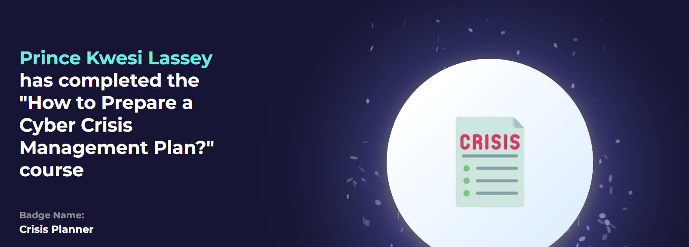

# How to Prepare a Cyber Crisis Management Plan - Summary Notes

## Table of Contents

1. [Introduction to Crisis Management](#1-introduction-to-crisis-management)
2. [General Preparation](#2-general-preparation)
   - Relevant standards
   - Nature of a cyber crisis
   - Inventory of resources
   - Communication channels
   - Insurance
   - Tools
   - Questions
   - Questions #2
3. [Preparing the Response Units](#3-preparing-the-response-units)
   - Management Unit
   - Operational Unit
   - Questions
4. [Backups](#4-backups)
   - Rule of 3-2-1
   - Rule of 3-2-1-1-0
5. [Alerts and End of Crisis](#5-alerts-and-end-of-crisis)
7. [Quiz](#quiz)

---

## 1. Introduction to Crisis Management
- A cyber crisis = an event risking major financial loss or reputational damage.
- Must involve C-level managers (CEO, CFO, COO), not just IT - decisions under crisis stress are hard.
- A pre-built **Crisis Management Plan** enables faster, calmer decisions and reduces chaos when a real incident hits.

## 2. General Preparation
- No universal definition of "cyber crisis" - each org defines it by impact on production/operations.
- **Relevant standards:** NIST SP 800-34 (onset of crisis), ISO 27035 (security incident mgmt), ISO 22301 (business continuity).
- A cyber crisis is not purely technical: resolution takes time, and some delays (travel, data gathering) can't be compressed.

**Inventory of resources** - know in advance:
- Do you have dedicated/trained incident response staff?
- Any special requirements for the personnel who'd be called in?

**Communication channels**
- Keep a secure comms channel independent of your (possibly compromised) infrastructure.

**Insurance** - check:
- *Coverage:* Are cyber-origin crises actually covered?
- *Scope:* Insurers usually only cover return-to-normal costs, not improvements, overtime, or new equipment (e.g., won't pay ransoms).
- *Partner support:* Does the insurer provide a dedicated cyber-crisis response agent?

**Tools** (keep ready outside the network, e.g. on USB):
- **CAINE Linux** - Italian live DFIR distro, tools pre-installed.
- **TSURUGI Linux** - free/independent open-source DFIR project.
- **Forensicator** - automates evidence collection (e.g. via `winpmem`).
- **Netstat with Timestamps** - shows network connections with timestamps.
- **Mandiant RedLine** - free memory analysis + IOC matching.
- **Velociraptor** - pulls workstation info (CPU/RAM, prefetch, event logs, RAM extraction).
- **THOR APT Scanner** - YARA/IOC scanner for compromise assessment.

**Questions**
1. Which standard would be more appropriate to apply to ensure security?

Ans: ISO 27035

2. “It is important to have incident responders designated under insurance.” Is this statement true or false?

Ans: true

**Questions #2**
1. You are preparing a process for crisis management. Which tool would you list to analyze the memory dump? - Mandiant RedLine - Wireshark - Netstat - Python

Ans: mandiant redline

2. Is it necessary to specify the workstation that will be used for the analysis in the preparation of the process?

Ans: Y

## 3. Preparing the Response Units
Two units minimum:

**1. Management Unit**
- Sets strategic priorities (what gets restored first), owns internal/external/press communication, handles cross-department impact.
- *Example decisions:* payroll during downtime, overtime approval, customer/press messaging, staff scheduling.
- Best staffed from the existing management committee (faster decisions).
- Decides when the crisis officially ends (= resuming "normal" ops, not necessarily full resolution) - crises can't be sustained indefinitely (cost + staff burnout).

**2. Operational Unit**
- Handles: rebuilding isolated new infrastructure, and restoring business operations per Management Unit's priorities.
- Made of technical experts (investigation) + technical staff (workstation prep).
- **Key tasks:**
  - *Find compromise source* - how the attacker got in (not who), to avoid repeating the same flaw in new infra.
  - *Determine initial compromise date* - tells you which backups are trustworthy and how long attacker had access.
  - *Generate IOCs* - verify restored backups are clean (e.g. scan for a known malicious file's MD5 hash).
  - *Rebuild infrastructure* - done in isolation, in parallel with investigation.
  - *Harden systems* - a breach signals hardening was insufficient; must be reviewed/tightened.
  
  
**Questions**
1. Which unit is responsible for making decisions about strategic priorities? Answer format: X unit

Ans: management unit

2. Which unit is responsible for determining the IOCs? Answer format: X unit

Ans: operational unit

## 4. Backups
- Backups aren't protection themselves, but enable faster recovery; always encrypt, keep keys outside company IT systems.

**Rule of 3-2-1** (baseline):
- 3 copies of data
- 2 different storage media/supports (unrelated, e.g. not same data center/RAID)
- 1 off-site copy (protects against fire etc.)

**Rule of 3-2-1-1-0** (for critical resources - adds):
- 1 offline copy (fully disconnected, unreachable even if network is compromised)
- 0 errors while restoring (test backups regularly)

**Questions**
1. What does the "3" in the 3-2-1 rule represent?

Ans: copy

## 5. Alerts and End of Crisis
- **Authorities:** know who to alert, within what deadline, and who's responsible - varies by org/regulation/location.
- **Partners:** notify interconnected partners - you could be a risk to them, or the attack may have come via them.
- **End of crisis:**
  - Clean-desk policy - destroy incident-related notes/papers (exception: keep encrypted ransomware files offline in case keys surface later).
  - Maintain oversight of new infrastructure and staff, since people tend to relax post-crisis.
  - Evaluate service-provider offers (continued contracts, buying "loaned" tools) carefully rather than under pressure.
  
**QUIZ**

1. Which standard should be followed in the initial phase of the crisis?
- NIST SP 800-34 (correct)
- ISO 27035
- ISO 22301
- ISO 27001

2. Which of the following statement is true about cyber insurance?
- It doesn't matter whether the insurance company pays for ransomware or not.
- There is no need to choose dedicated partners who will help in times of crisis.
- You need to make a deal on ransomware ransom payment.(correct)
- Cyber ​​insurance is not required

3. Why is it important to predetermine the tools to be used in a crisis?
- To use only permitted tools
- In order to carry out the process faster and smoother in the time of crisis(correct)
- Because the rulers ordered it this way
- It doesn't matter

4. Which is one of the tasks of the Management Unit?
- Setting priorities in a crisis(correct)
- Performing forensics analysis
- Tracking down cyber attackers
- Technical report preparation

5. Who should be Management Unit members?
- SOC Team
- Forensics analysts
- 3rd party consultants
- Management committee (correct)

6. Who are the members of the Operation Unit?
- Personnel with technical knowledge(correct)
- Managers
- HR professionals
- Investors

7. Which of the following is not one of the expectations from the Operational Unit?
- Identify the source of compromise
- Date of initial compromise
- Making a press release(correct)
- Rebuild the new infrastructure

8. What does “2” in the 3-2-1 Backup rule represent?
- Support (correct)
- Terabyte
- Number of people
- Copy

9. Why is it important to have an offline copy when making a backup?
- As a precaution against deletion of backups during an online attack(correct)
- To do more work
- Because there is not enough space on the cloud
- Because it's expensive

10. Why is it important to stay in touch with business partners during a cyber incident?
- For information disclosure to occur
- To maintain the friendship relationship
- Because we do business together
- To protect them from a possible threat or to determine if there is a threat arising from them. (correct)

