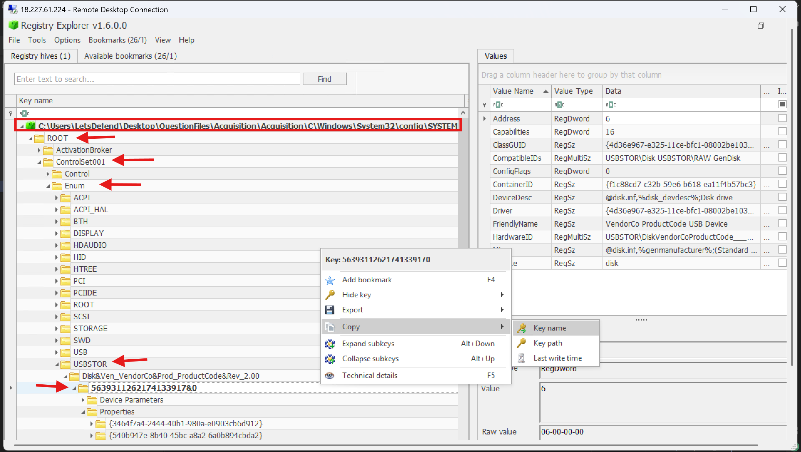
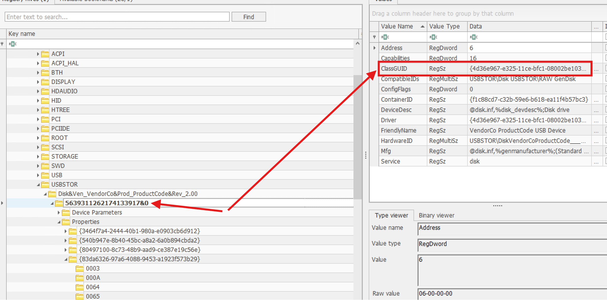
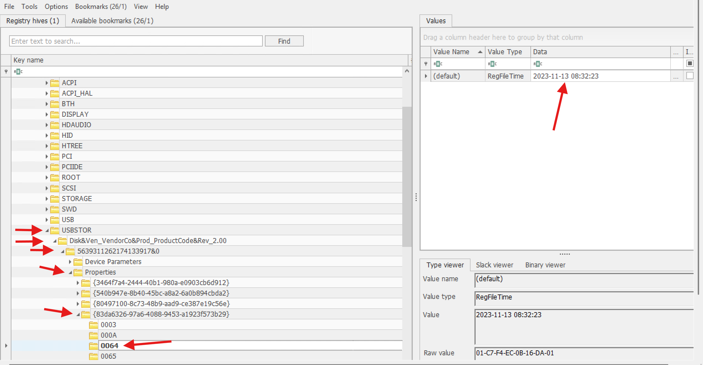
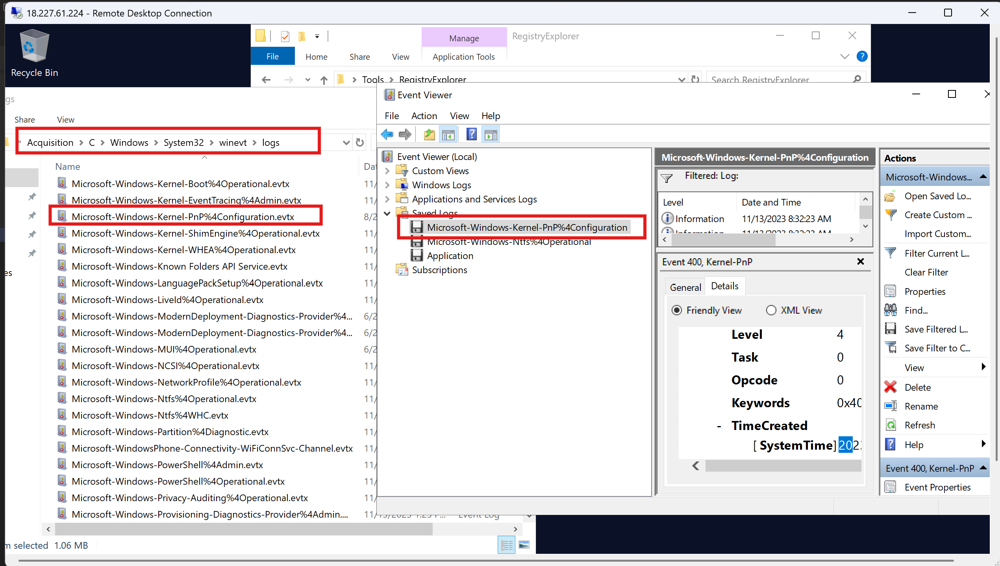
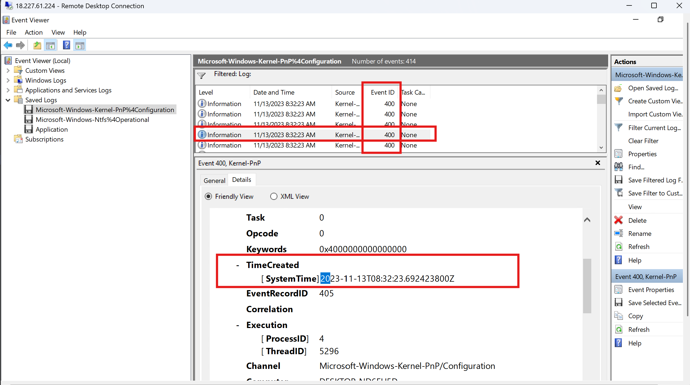
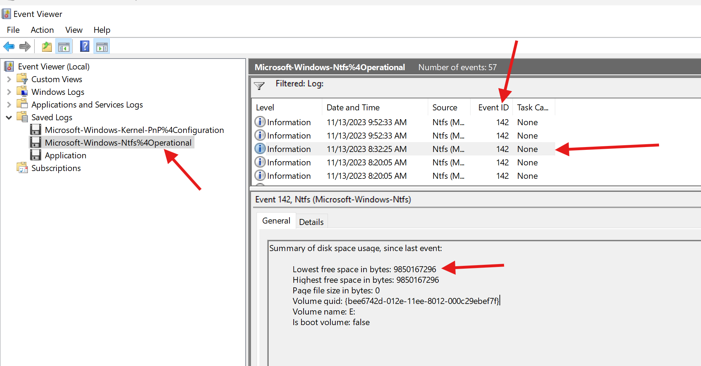
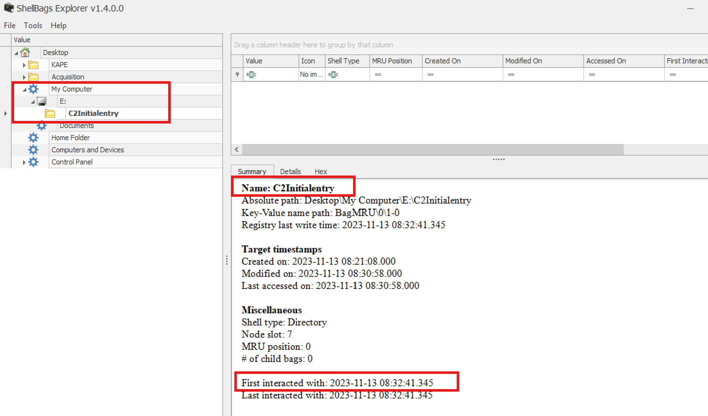
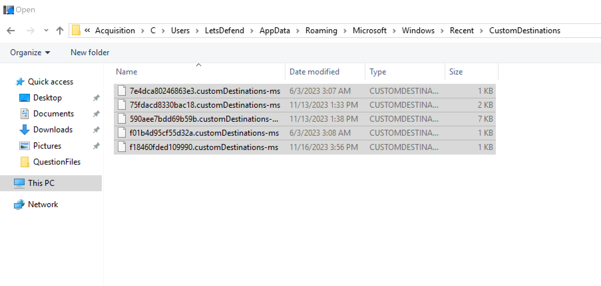
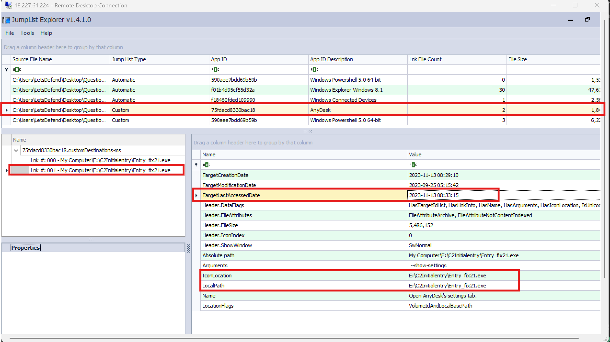

# LetsDefend Incident Responder Path: USB Forensics | Notes

## Table of Contents

1. [Introduction to USB Forensics](#1-introduction-to-usb-forensics)
2. [USB Registry Key](#2-usb-registry-key)
   - Questions
3. [USB Event Logs](#3-usb-event-logs)
   - Partition, Kernel-PnP, NTFS
   - Questions
4. [Folder Access Analysis via Shellbags](#4-folder-access-analysis-via-shellbags)
   - Questions
5. [File Access Analysis via Jumplists](#5-file-access-analysis-via-jumplists)
   - Questions
6. [Automated USB Parser Tools](#6-automated-usb-parser-tools)
7. [Quiz](#7-quiz)
8. [Appendix: USB Forensics Cheat Sheet](#8-appendix-usb-forensics-cheat-sheet)

---

## 1. Introduction to USB Forensics

USB flash drives are among the most common pieces of evidence in digital forensics investigations - they enable unauthorized data exfiltration or 
removal of sensitive information from a system. This course covers how to forensically analyze USB device usage on Windows: identifying **first connection**, 
**last connection**, and **disconnection** timestamps to build a forensic timeline; relevant **native event logs**; **interacted files**; and how the 
device's assigned paths help reveal a suspect's motivations.

---

## 2. USB Registry Key

### USBSTOR key
```
HKLM\SYSTEM\CurrentControlSet\Enum\USBSTOR
```
Holds information specifically about **external storage media** (USB drives, external hard drives, etc.) - one of the first places to check in any USB-related 
investigation. Provides: device model/version name, Windows-assigned **serial number**, and **last connected timestamp**.

**Navigating in Registry Explorer** (see the Windows Registry Forensics course for tool basics):
- Expanding USBSTOR reveals a randomly-named subkey per connected device, corresponding to its assigned serial number.
- Clicking that key shows the **Friendly Name** of the device (useful in insider threat cases) and its **Container ID** (useful for cross-referencing against other data sources).
- Expand further -> **Properties** key -> the subkey starting with `83da...` -> look for:
  - **`0064`** - timestamp the USB was **connected** (UTC)
  - **`0066`** - timestamp the USB was **disconnected**

### USB key (broader device scope)
```
HKLM\SYSTEM\CurrentControlSet\Enum\USB
```
Covers **all** USB-connected devices generally (keyboards, adapters, etc. - not just storage). Same hierarchy as USBSTOR. The **Service** value identifies device type - e.g., `BTHUSB` = Bluetooth adapter, `disk` = an actual external/USB storage drive (as seen with USBSTOR entries).

### Questions

**1. What is the serial number assigned by Windows to the USB device?**
Opened the SYSTEM hive from the acquisition file in Registry Explorer, located the USBSTOR key, and read the subkey name under it (the serial number).



**2. What is the ClassGUID value for the USB device in question?**
Answer: `{4d36e967-e325-11ce-bfc1-08002be10318}`



**3. When did the USB device first connect to the system?**
Answer: **2023-11-13 08:32:23**



---

## 3. USB Event Logs

Registry artifacts alone are valuable, but corroborating them with independent event log sources reduces the room for error - a core forensic principle: **multiple data sources confirming the same fact strengthens the finding.**

Location: Event Viewer -> **Applications and Services Logs -> Microsoft -> Windows** (then the relevant sub-log).

### Partition Log
**Event ID 1006** - fires around the same time as the USB connection timestamp found in the registry. Details include: disk size (bytes), serial number, manufacturer, and model - a strong corroborating source for the registry findings.

### Kernel-PnP Log
**Event ID 400** - logged when an external device (e.g., USB) is *configured* (i.e., connected) on the system. The **Device name** and **Class GUID** in this event match what's found in the USBSTOR registry key, and the timestamp lines up exactly with both the registry and the Partition log event - triple corroboration.
**Event ID 410** - also relevant (related PnP configuration event, referenced alongside 400).

### NTFS Log
Filter for **Event ID 142** around the previously identified connection time. This event reveals the **disk drive letter** (volume name, e.g., `E:`) assigned to the USB device - critical context, since any file paths starting with that letter can now be tied directly back to this specific USB device in later analysis steps (shellbags, jumplists, etc.).

### Questions

**1. Analyze the Kernel-PnP event logs to identify the relevant events for the USB device discussed previously. What is the timestamp indicating when the USB device drivers were configured on the system?**
Opened the application logs from the acquisition path (`...\Acquisition\C\Windows\System32\winevt\logs`), filtered for Event ID **400** around the previously identified USB connection time, and confirmed the match via the same Class GUID found earlier. Since the required answer format included milliseconds (`YYYY-MM-DD HH:MM:SS.MS`), switched to the **Details tab** and expanded the `TimeCreated` field to get the precise value.




Answer: **2023-11-13 08:32:23.69**

**2. Analyze the NTFS operational event logs. What is the lowest value for free space in bytes?**
Filtered the NTFS operational log for Event ID **142** around the previously identified connection time (~8:32:25 AM) and checked the free space value on the General tab.



Answer: **9850167296**

---

## 4. Folder Access Analysis via Shellbags

**Shellbags** record folder-view state (size, position, contents) whenever a user browses a folder via File Explorer (GUI shell - not CLI). Because this data persists in the registry independent of the actual folder/file still existing on disk, it's extremely valuable for USB forensics - it can prove a user browsed a specific folder on a USB drive even if that folder or the drive itself is no longer available.

**Registry locations:**
```
NTUSER.DAT\Software\Microsoft\Windows\Shell\BagMRU
NTUSER.DAT\Software\Microsoft\Windows\Shell\Bags
USRCLASS.DAT\Local Settings\Software\Microsoft\Windows\Shell\Bags
USRCLASS.DAT\Local Settings\Software\Microsoft\Windows\Shell\BagMRU
```

**Tool: ShellBag Explorer** (Eric Zimmerman) - run as admin, load either **Active Registry** (live system) or an **Offline Hive** (NTUSER.dat / UsrClass.dat from an acquisition).

**Workflow:** Since we already know the USB was assigned drive letter `E:` (from the NTFS event log), expand that drive entry in ShellBag Explorer to see folders the user actually browsed on it - including name, and **first/last accessed timestamps**.

> Since shellbags live in `NTUSER.dat` (a per-user hive), whichever user's hive you're analyzing tells you exactly **which user account** accessed that folder.

**Bonus - ZIP file contents:** Shellbags also record ZIP archive names if browsed in Explorer, and even the **folder names inside** a ZIP - but only if that inner folder was actually opened/viewed in Explorer (not just the ZIP itself), and only if the ZIP isn't password-protected. This means visible inner-ZIP folder names in shellbags are themselves evidence the user explored that content.

### Questions

**1. What is the name of the directory in the USB device that was malicious and accessed by the user?**
With the USB drive letter (`E:`) already known, opened `UsrClass.dat` (from `...\AppData\Local\Microsoft\Windows`) in ShellBag Explorer and expanded the `E:` drive entry.
Answer: **c2initialentry**

**2. When was this directory accessed by the user?**
Answer: **2023-11-13 08:32:41**



---

## 5. File Access Analysis via Jumplists

**Jumplists** (introduced in Windows 7, still present through Windows 11) provide quick access to recently used application files and common tasks. Forensically, they reveal file creation/access/modification history tied to specific applications - and critically, **this data persists on the host system long after the source file (or even the USB device itself) is gone.** This makes jumplists one of the best artifacts for proving a USB file was accessed, even long after the fact.

### Two Types
- **Automatic Destinations** - `%USERPROFILE%\AppData\Roaming\Microsoft\Windows\Recent\AutomaticDestinations`
- **Custom Destinations** - `%USERPROFILE%\AppData\Roaming\Microsoft\Windows\Recent\CustomDestinations`

Each file is named with a 16-digit hex **AppID** followed by `.automaticDestinations-ms` or `.customDestinations-ms`. These files are **hidden** and won't appear in Explorer even with hidden items enabled - must be accessed by typing the full path directly into the address bar.

**Tool: JumpList Explorer** (Eric Zimmerman) - run as admin, load all Automatic Destination files, then all Custom Destination files (empty custom-destination files, or load errors, are normal/expected and can be ignored).

**Workflow:** The **Quick Access** jumplist shows general recently-accessed files across the system. Clicking a specific application (e.g., Notepad) filters to files opened by that app. Cross-referencing the previously identified USB drive letter (`E:`) against file paths here can directly confirm which files on the USB were opened, by which application, and when - e.g., confirming a file like `Dumped_Passwords.txt` was opened via Notepad from the `Secret_Project_LD` folder on the USB. Clicking a specific entry gives a focused view: exact access timestamp and the full local file path.

### Questions

> Approach used across all three questions: opened the Custom Destination files in JumpList Explorer and browsed through the listed applications to find the entry containing the previously identified USB drive letter and folder name.



**1. What is the name of the binary that was executed from the USB?**
Answer: **Entry_fix21.exe**

**2. The SOC team confirms this binary is a legitimate RMM tool. Can you find the original app name?**
Answer: **AnyDesk**

**3. When was this binary executed on the system?**
Answer: **2023-11-13 08:33:15**



---

## 6. Automated USB Parser Tools

**USB Detective** (Community Edition, free) - automatically parses all relevant USB artifacts (registry hives, event logs, etc.) and presents the results in an organized report, removing the need to manually check each artifact source individually.
Download: `https://usbdetective.com/community-download/`

**Typical workflow:**
1. Acquire the relevant artifacts first (e.g., via **KAPE** - covered in the *Forensic Acquisition and Triage* course).
2. Open USB Detective -> **Select Files/Folders**.
3. Enter a case name and output directory, then point the tool at the acquired USB artifacts folder.
4. The tool parses everything and presents a consolidated result per detected USB device (one result per unique connected drive).

---

## 7. Quiz

**Q1. Which of the following registry keys holds the most important data related to USB devices from a forensic standpoint?**
- HKCU\SYSTEM\CurrentControlSet\Enum\USBSTOR
- **HKLM\SYSTEM\CurrentControlSet\Enum\USBSTOR(correct)**
- HKLM\SYSTEM\CurrentControlSet\Enum\USB
- HKCU\SYSTEM\CurrentControlSet\Enum\USB

**Q2. Which of the following registry keys holds the timestamp indicating the disconnection of the USB device from the system?**
- **0066(correct)**
- 0003
- 0064
- 0065

**Q3. Which Event Log and Event ID can be used to determine the disk drive letter assigned to a USB device when attached to a system?**
- KernelPnP Log Event ID 400
- Partition Log Event ID 1006
- KernelPnP Log Event ID 410
- **NTFS Log Event ID 142(correct)**

**Q4. Identify one of the correct registry paths for shellbags.**
- **USRCLASS.DAT\Local Settings\Software\Microsoft\Windows\Shell\Bags(correct)**
- USRCLASS.DAT\Local Settings\Software\Microsoft\Windows\CurrentVersion\ShellBags
- USRCLASS.DAT\Local Settings\Software\Microsoft\Windows\ShellBagsMRU
- USRCLASS.DAT\Local Settings\Software\Microsoft\Windows\Shell\BagsMRU

**Q5. Which is the correct path to CustomDestination Jumplists?**
- C:\%UserProfile%\AppData\Roaming\Microsoft\Windows\CurrentVersion\Recent\CustomDestinations
- C:\%UserProfile%\AppData\Local\Microsoft\Windows\Recent\CustomDestinations
- **C:\%UserProfile%\AppData\Roaming\Microsoft\Windows\Recent\CustomDestinations(correct)**
- C:\%UserProfile%\AppData\Roaming\MicrosoftNT\Windows\Recent\CustomDestinations

---

## 8. Appendix: USB Forensics Cheat Sheet

### Registry Keys

| Key/Subkey | Path | What It Tells an Investigator |
|---|---|---|
| USBSTOR | `HKLM\SYSTEM\CurrentControlSet\Enum\USBSTOR` | External storage device model/version, Windows-assigned serial number, last connected time - the primary starting point for any USB investigation. |
| USB (general) | `HKLM\SYSTEM\CurrentControlSet\Enum\USB` | All USB-connected devices (not just storage) - check the **Service** value to confirm device type (`disk` = storage drive, `BTHUSB` = Bluetooth adapter, etc.). |
| `Properties\{83da...}\0064` | Under the device's USBSTOR subkey | **First connection** timestamp (UTC). |
| `Properties\{83da...}\0066` | Under the device's USBSTOR subkey | **Disconnection** timestamp (UTC). |
| Friendly Name / Container ID | Under the device's USBSTOR subkey | Human-readable device name; Container ID useful for cross-referencing against other artifact sources. |

### Event Logs

| Log Source | Event ID | What It Confirms |
|---|---|---|
| Partition | **1006** | Disk size, serial number, manufacturer, model - corroborates USBSTOR registry data with an independent source. |
| Kernel-PnP | **400** | Device configured/connected - Device Name and Class GUID match USBSTOR; timestamp should align exactly with registry and Partition log. |
| Kernel-PnP | **410** | Related PnP device configuration event. |
| NTFS (Operational) | **142** | **Disk drive letter** assigned to the USB (e.g., `E:`) - essential for linking later file-path evidence (shellbags, jumplists) back to this specific device. |

### User Activity Artifacts

| Artifact | Location | What It Reveals |
|---|---|---|
| Shellbags | `NTUSER.DAT\Software\Microsoft\Windows\Shell\BagMRU` / `\Bags`; `USRCLASS.DAT\Local Settings\Software\Microsoft\Windows\Shell\Bags` / `\BagMRU` | Folders (and even ZIP-internal folders, if unlocked and browsed) the user viewed on the USB drive, with first/last access timestamps - persists even after the folder/device is gone. Per-user (tied to whichever NTUSER.dat is analyzed). |
| Automatic Destinations Jumplists | `%USERPROFILE%\AppData\Roaming\Microsoft\Windows\Recent\AutomaticDestinations` | Recently accessed files per application - hidden files, access via full path only. |
| Custom Destinations Jumplists | `%USERPROFILE%\AppData\Roaming\Microsoft\Windows\Recent\CustomDestinations` | Same as above, app-pinned/custom entries - often more detailed for specific application usage patterns. |

### Tools Cheat Sheet

| Tool | Author/Vendor | Purpose |
|---|---|---|
| **Registry Explorer** | Eric Zimmerman | Browse USBSTOR/USB registry keys (live or offline hives) - starting point for device identification and connect/disconnect timestamps. |
| **Event Viewer** | Microsoft (built-in) | Review Partition, Kernel-PnP, and NTFS event logs to corroborate registry findings. |
| **ShellBag Explorer** | Eric Zimmerman | Parse NTUSER.DAT/UsrClass.dat shellbags to determine which folders (including ZIP contents) were browsed on the USB drive letter. |
| **JumpList Explorer** | Eric Zimmerman | Parse Automatic/Custom Destinations jumplists to identify specific files opened from the USB, which application opened them, and when. |
| **USB Detective (Community Edition)** | USB Detective | Fully automated parser - ingests acquired artifacts (e.g., via KAPE) and produces a consolidated per-device report, saving manual cross-referencing time. |
| **KAPE** | Kroll | Used to acquire the relevant artifacts (registry hives, event logs) prior to feeding them into USB Detective or manual analysis. |

### Investigation Order

1. **USBSTOR registry key** -> identify device serial number, friendly name, first/last connection timestamps.
2. **Event logs** (Partition 1006, Kernel-PnP 400/410, NTFS 142) -> corroborate registry timestamps and identify the assigned **drive letter**.
3. **Shellbags** -> determine which folders on that drive letter were actually browsed, and by which user.
4. **Jumplists** -> determine which specific files were opened from the device, via which application, and exactly when.
5. **Automated tools (USB Detective)** -> use for fast triage/validation, or when time is limited - cross-check against manual findings for completeness.