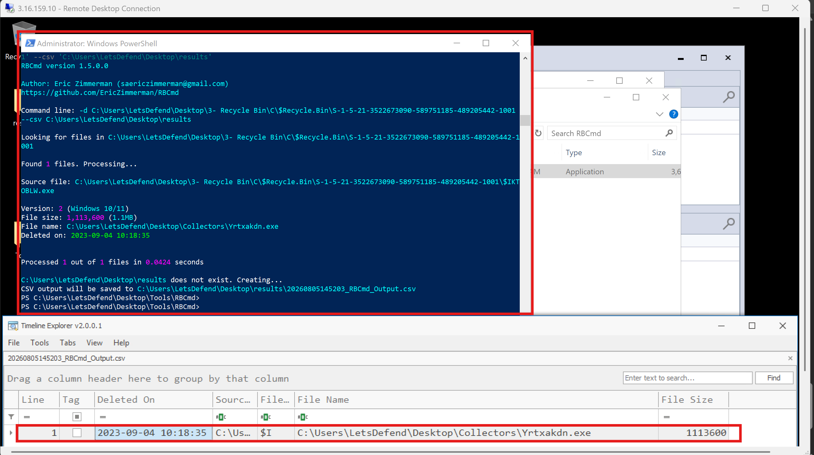
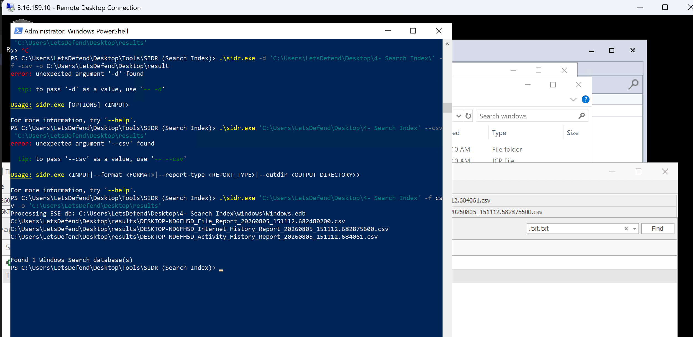
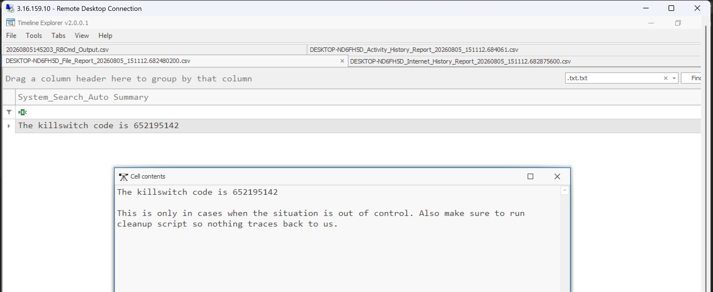
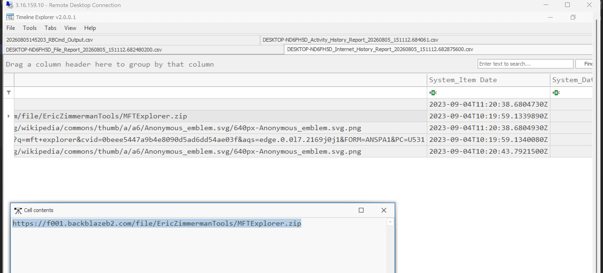
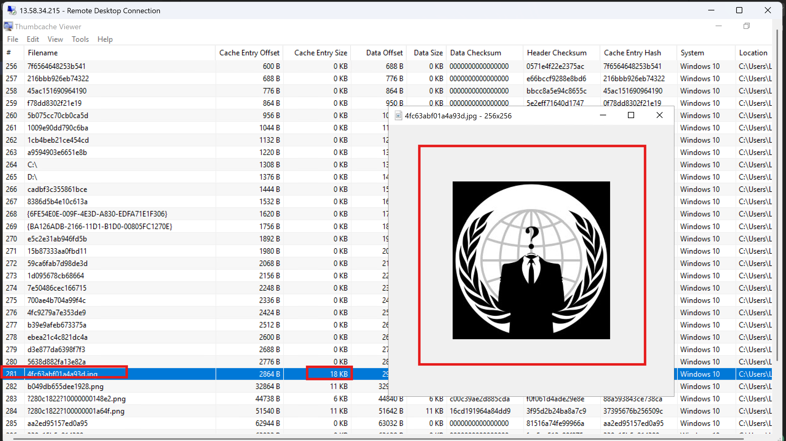
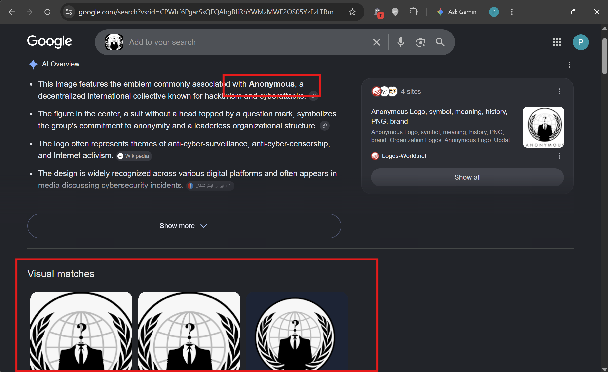

# LetsDefend Incident Responder Path: Windows Disk Forensics Course Notes

## Table of Contents

1. [SRUM Database](#1-srum-database)
   - Questions
2. [Jumplists](#2-jumplists)
   - Questions
3. [Recycle Bin Artifacts](#3-recycle-bin-artifacts)
   - Questions
4. [Search Index](#4-search-index)
   - Questions
5. [RDP Cache](#5-rdp-cache)
6. [Thumbnail Cache](#6-thumbnail-cache)
   - Questions
7. [Quiz](#7-quiz)
8. [Appendix: Windows Disk Forensics Cheat Sheet](#8-appendix-windows-disk-forensics-cheat-sheet)

---

## 1. SRUM Database

**SRUM (System Resource Usage Monitor)** - introduced in Windows 8, tracks **30–60 days** of system resource usage: application resource usage, energy usage, push notifications, network connectivity, and data usage. Considered a goldmine for forensics because it can retain evidence of program execution and network activity **even after the source file/application is deleted**.

**Location:** `C:\Windows\System32\SRU\SRUDB.dat` (Extensible Storage Engine/ESE database format).

**Data categories** (2 covered in depth - most valuable): Application Resource Usage, Network Usage, Network Connections, Energy Usage, Push Notification Data, Energy Usage (Long Term).

**Tool: SrumECmd** (Eric Zimmerman) - parses the database into CSV. Requires both the SRUDB.dat **and** the SOFTWARE registry hive, since current/recent entries aren't pushed into SRUM until reboot or hourly - the SOFTWARE hive fills that gap.

```bash
SrumECmd.exe -f "C:\Users\LetsDefend\Desktop\srum\C\Windows\System32\SRU\SRUDB.dat" -r "C:\Users\LetsDefend\Desktop\srum\C\Windows\System32\config\SOFTWARE" --csv "c:\users\letsdefend\desktop\results"
```
(`-f` = SRUM db path, `-r` = SOFTWARE hive path, `--csv` = output directory)

Open results in **Timeline Explorer**.

### Application Resource Usage
The most useful (and noisiest) category - tracks **every executable run** on the system, whether or not it still exists on disk. Stores: full executed path, timestamp, executing username, plus resource metrics (bytes read/written, CPU cycles). Useful for spotting execution from unexpected paths, or unusual resource patterns (e.g., a cryptominer's high CPU usage, or an infostealer's high read/write volume).

### Network Usage
Second most valuable category - tracks wired/wireless connections, Wi-Fi SSID, and **bytes sent/received per application** (distinct from the read/write I/O bytes in Application Resource Usage - these are actual network bytes). Includes an **Application ID** usable to cross-reference the same app across other SRUM categories.

> Excellent for spotting **data exfiltration** - example, an unexpected process (like `notepad.exe`) transferring large amounts of network data is a red flag for process injection/shellcode abusing a legitimate process.

### Questions

**At what time was PowerShell used to download malicious tools from the internet? (Format: YYYY-MM-DD HH:MM:SS)**

I Parsed the SRUM data with SrumECmd, opened all output CSVs in Timeline Explorer, and checked the Timestamp column in the App Resource Usage data filtered for the PowerShell executable.

Ans: **2023-09-28 18:25:00**

**How many foreground context switches were made for the executable with SRUM ID 12629?**

I filtered App Resource Usage data by that SRUM ID - initially returned no results because an existing filter (restricting to `powershell.exe` only) was still active from the previous question; unticking that filter revealed the correct entry.

Answer: **235**

---

## 2. Jumplists

**Jump Lists** (introduced Windows 7, still present through 11) - provide quick access to recently used files/applications. Valuable because the data **persists on the system long after the source file/application is gone**, making it useful for reconstructing historical file interaction timelines.

### Two Types
- **Automatic Destinations** - `%USERPROFILE%\AppData\Roaming\Microsoft\Windows\Recent\AutomaticDestinations`. Created automatically on file/app open. Compound File Binary (CFB/OLE) format containing SHLLINK streams + a DestList stream.
- **Custom Destinations** - `%USERPROFILE%\AppData\Roaming\Microsoft\Windows\Recent\CustomDestinations`. Created when a user **pins** a file/app to the Taskbar or Start Menu. Sequential MS-SHLLINK binary format.

Each jumplist file is named with a 16-digit hex **AppID** + `.automaticDestinations-ms` or `.customDestinations-ms`. **Hidden by default** - must be accessed via full path in Explorer's address bar (even with hidden items enabled, they won't show).

**Tool: JumpList Explorer** (Eric Zimmerman) - after acquisition (e.g., via KAPE), load all Automatic Destination files, then all Custom Destination files (ignore any error prompts).

**What it reveals:** full file path, access count, and access timestamp - plus, notably, the **file's creation timestamp** too. Can also recover **pinned/frequently visited browser URLs**, and - via the Windows Explorer jumplist specifically - **folder access history** similar to shellbags (folder name, created/accessed timestamps, visit count).

### Questions

**1. What is the name of the secret file which was accessed via Wordpad?**

Loaded Automatic Destinations in JumpList Explorer and located the Wordpad-specific jumplist entries.

Ans: **secret769121.txt.txt**

**2. When was this secret file accessed? (UTC, YYYY-MM-DD HH:MM:SS)**

Answer: **2023-09-04 10:15:44**

---

## 3. Recycle Bin Artifacts

Windows Recycle Bin (since Windows 95) is a temporary holding area for deleted items before permanent removal - a key evidence source since deleted-file metadata often survives even after the item is later permanently deleted.

**Artifact files:**
- **`$I######`** files - metadata only: original file path, size, and deletion timestamp. Located under `C:\$Recycle.Bin\{SID}\`.
- **`$R######`** files - the actual **content** of the deleted item (only exists if the item hasn't been permanently deleted yet).

**Tool: RBCmd** (Eric Zimmerman) - parses recycle bin artifacts into CSV.

```bash
RBCmd.exe -d c:\Users\LetsDefend\Desktop\RecycleBinArtifacts\ --csv c:\Users\LetsDefend\Desktop\results
```
(`-d` = directory to recursively search, `--csv` = output directory)

Output includes: UTC deletion time, original filename/full path, and file size in bytes. A double file extension (e.g., `invoice.pdf.exe`) is a classic technique to trick users into executing malware disguised as a document.

### Questions

**1. What was the original full path of the deleted file?**

RBCmd initially threw a persistent "Directory not found" error - caused by a trailing backslash escaping the closing quote in PowerShell, combined with PowerShell misinterpreting the `$Recycle` folder name as an empty variable reference. Fixed by wrapping the path in **single quotes** (forcing literal string interpretation) and removing the trailing backslash:
```bash
.\RBCmd.exe -d 'C:\Users\LetsDefend\Desktop\3- Recycle Bin\C\$Recycle.Bin\S-1-5-21-3522673090-589751185-489205442-1001' --csv 'C:\Users\LetsDefend\Desktop\results'
```
Ans: **C:\Users\LetsDefend\Desktop\Collectors\Yrtxakdn.exe**

**2. What was the size (bytes) of the deleted file?**

Ans: **1113600**

**3. At what time was the file deleted? (UTC, YYYY-MM-DD HH:MM:SS)**

Ans: **2023-09-04 10:18:35**



---

## 4. Search Index

**Windows Search** (since Vista) indexes file, email, and other content in the background so searches query a pre-built index rather than scanning in real time. Enabled by default and runs largely invisibly to the user - making it valuable evidence users may not think to worry about.

**Database location:** `C:\%USERPROFILE%\ProgramData\Microsoft\Search\Data\Applications\Windows\Windows.edb`

Can recover **partial file contents** (docx, pdf, txt, etc.) and **browser history** - even after the original file or history entry was deleted. (Note: deleted-item records are eventually purged from the index after some days, so this isn't permanent.) Especially valuable for **insider threat** cases.

**Tool: SIDR** (`https://github.com/strozfriedberg/sidr`) - parses the search index database.

```bash
sidr.exe "c:\Users\LetsDefend\Desktop\Search index" -f csv -o c:\Users\LetsDefend\Desktop\results
```
(first argument = acquired artifact directory, `-f` = output format [csv easier to work with than default json], `-o` = output directory)

**Key outputs:**
- **FileReport CSV ("System search auto summary")** - filename, modified/created/accessed times, size, owner, indexed time, and **partial recovered content** of the file - usable even for permanently deleted files (within the index's retention window).
- **Internet History Report** - visited URLs, page titles, and visit timestamp (**"System link date visited"** column).

### Questions

**1. A secret file (from the Jumplists lesson) was deleted by the insider threat. What is the killcode inside it?**

Parsed the search index with SIDR:

```bash
.\sidr.exe 'C:\Users\LetsDefend\Desktop\4- Search Index' -f csv -o 'C:\Users\LetsDefend\Desktop\results'
```
Opened the output CSV in Timeline Explorer, filtered for the `.txt.txt` extension (known from the earlier jumplist finding), and located the recovered partial content.




**2. At 10:19:59 on 4 September 2023, which URL was accessed?**

Checked the Internet History Report, matched against the timestamp.

Ans: **https://f001.backblazeb2.com/file/EricZimmermanTools/MFTExplorer.zip**



---

## 5. RDP Cache

When a user connects via **RDP**, small bitmap image tiles are cached locally in the RDP profile to speed up repeated on-screen content - effectively small fragments/screenshots of what was seen during the session. This is especially valuable for investigating **lateral movement** via RDP.

**Location (per-user):** `C:\Users\<username>\AppData\Local\Microsoft\Terminal Server Client\Cache`

**Tool: bmc-tools** (`https://github.com/ANSSI-FR/bmc-tools`) - extracts cached bitmap tiles as individual images.

```bash
python3 bmc-tools.py -s "C:\Users\LetsDefend\Desktop\bitmap\C\Users\LetsDefend\AppData\Local\Microsoft\Terminal Server Client\Cache" -d c:\Users\LetsDefend\Desktop\results -b
```
(`-s` = source cache directory, `-d` = output directory, `-b` = also generate a combined **collage** image of all tiles for a quicker overview)

**Analysis approach:** the tool can produce thousands of small images (2,000+ in the lesson example). Reviewing them individually can reveal folder names, commands run in a terminal, browser activity, etc. seen during the session. Maximizing the output folder's preview view makes scanning faster; the collage image (search for "collage" in the output folder) gives a single combined overview of the whole session at a glance.

**Tool: RdpCacheStitcher** (`https://github.com/BSI-Bund/RdpCacheStitcher`) - attempts to reconstruct more coherent, larger screenshots by stitching adjacent bitmap tiles together, rather than reviewing them as disconnected small images.

*(No specific lab questions for this lesson although I would have really loved to work with the tool - RdpCacheStitcher wasn't available in the practice environment.)*

---

## 6. Thumbnail Cache

**ThumbCache** (since Vista) caches thumbnail images for files shown in Windows Explorer's thumbnail view, avoiding repeated disk I/O and reprocessing. Supports many file types: JPEG, BMP, GIF, PNG, TIFF, AVI, PDF, PPTX, DOCX, HTML, MP4, etc.

**Forensic value:** thumbnails **persist after the original file is deleted** - used by law enforcement to prove a file of interest existed on a system's drive even without the file itself. Stores metadata: cache ID, header checksum, data offset, type, and size - tied back to original file creation/access/modification context.

**Location:** `C:\Users\[Username]\AppData\Local\Microsoft\Windows\Explorer`
Files named `Thumcache_xxx.db` and `iconcache_xxxx.db` (xxx = bits/pixel/resolution value).

**Tool: ThumbCache Viewer** (`https://thumbcacheviewer.github.io/`) - load all thumbcache db files from the acquired artifact folder to browse cached images directly.

> Note: the resolution/clarity of a cached thumbnail depends on the Explorer view setting active at the time (e.g., "Extra Large Icons" produces a higher-res cached thumbnail than "Medium" or "Small").

### Questions

**1. Threat intel reports a JPG image was found on all hacked company systems (no data stolen/ransomed). Identify the hacker group behind it.**

Opened the thumbcache files located at `C:\Users\LetsDefend\Desktop\6- Thumbnail Cache\C\Users\LetsDefend\AppData\Local\Microsoft\Windows\Explorer` in ThumbCache Viewer. Most results were BMP files (leftover from the RDP cache parsed in the previous lesson), but one JPEG result stood out as a logo-style image. Saved it and ran a **reverse image search** to identify the group behind it via open-source intelligence.

Ans: **Anonymous group**

**2. What was the size (KB) of the image?**
Ans: **18**




---

## 7. Quiz

**Q1. SRUM database is located at:**
- C:\Windows\System32\SRUM\SRUDB.dat
- **C:\Windows\System32\SRU\SRUDB.dat** (correct)
- C:\Windows\System32\SRU\DB\SRUDB.dat
- C:\Windows\System32\SRU\SRU.db

**Q2. How many types of Jump Lists are there?**
- 3
- 1
- **2** (correct)
- 5

**Q3. For recycle bin artifacts, which kind of file provides us with metadata and important information about deleted files?**
- $R
- $D
- $K
- **$I** (correct)

**Q4. In the Windows search index, which kind of data provides us with partial contents of files?**
- System Item
- **System Auto Summary** (correct)
- System Contents
- System Cache

**Q5. In Windows search index, which kind of data provides us with the timestamp when a URL or link was visited?**
- **System link date visited**(correct)
- System url visited date
- Accessed timestamp
- System recorded timestamp

**Q6. RDP cache is stored at:**
- C:\Users\<username>\AppData\Local\Microsoft\Cache\Terminal Server Client\
- C:\Users\<username>\AppData\Local\Microsoft\Terminal Server Client\
- **C:\Users\<username>\AppData\Local\Microsoft\Terminal Server Client\Cache** (correct)
- C:\Users\<username>\AppData\Local\Microsoft\Terminal Server\Cache

**Q7. In which format does the RDP cache store the small images cached from the session?**
- JPG
- **BMP** (correct)
- PNG
- JPEG

**Q8. ThumbCache is stored at:**
- **C:\Users\[Username]\AppData\Local\Microsoft\Windows\Explorer** (correct)
- C:\Users\[Username]\AppData\Local\Microsoft\Windows\Thumbnails
- C:\Users\[Username]\AppData\Local\Microsoft\Thumbnails\Explorer
- C:\Users\[Username]\AppData\Local\Microsoft\Windows\Thumbnails\Explorer

---

## 8. Appendix: Windows Disk Forensics Cheat Sheet

### Artifact Paths & What They Reveal

| Artifact | Path | Retention/Persistence | Investigative Value |
|---|---|---|---|
| **SRUM Database** | `C:\Windows\System32\SRU\SRUDB.dat` | 30–60 days | Execution evidence (even for deleted files) + resource/network usage stats - great for confirming *what ran* and *how much data it moved*. Requires the SOFTWARE hive alongside it for the most recent entries. |
| **Jumplists (Automatic)** | `%USERPROFILE%\AppData\Roaming\Microsoft\Windows\Recent\AutomaticDestinations` | Persists after source file/app deleted | Auto-created file/app access history - file path, access count, access + creation timestamps. |
| **Jumplists (Custom)** | `%USERPROFILE%\AppData\Roaming\Microsoft\Windows\Recent\CustomDestinations` | Persists after source file/app deleted | User-pinned file/app access history - same data as above, different trigger (pinning vs. opening). |
| **Recycle Bin ($I files)** | `C:\$Recycle.Bin\{SID}\$I######` | Until bin is emptied | Metadata only - original path, size, deletion timestamp - survives even if content ($R file) is gone. |
| **Recycle Bin ($R files)** | `C:\$Recycle.Bin\{SID}\$R######` | Until permanently deleted | Actual recoverable file content. |
| **Windows Search Index** | `C:\%USERPROFILE%\ProgramData\Microsoft\Search\Data\Applications\Windows\Windows.edb` | A few days after deletion, then purged | Partial file content recovery (docx, pdf, txt, etc.) + browser history - valuable even after source file/history is deleted; runs silently, often unknown to the user. |
| **RDP Bitmap Cache** | `C:\Users\<username>\AppData\Local\Microsoft\Terminal Server Client\Cache` | Persists per user profile | Small BMP tiles reconstructing fragments of what was seen during an RDP session - key for lateral movement investigations. |
| **ThumbCache** | `C:\Users\[Username]\AppData\Local\Microsoft\Windows\Explorer` (`Thumcache_xxx.db`, `iconcache_xxxx.db`) | Persists after original file deleted | Visual proof a file/image existed on the system, even long after deletion. |

### Tools Cheat Sheet

| Tool | Author/Source | Purpose | Example Command |
|---|---|---|---|
| **SrumECmd** | Eric Zimmerman | Parses SRUM database into CSV | `SrumECmd.exe -f <SRUDB.dat path> -r <SOFTWARE hive path> --csv <output dir>` |
| **JumpList Explorer** | Eric Zimmerman | Parses Automatic/Custom Destinations jumplists | GUI tool - load files directly |
| **RBCmd** | Eric Zimmerman | Parses Recycle Bin $I/$R artifacts into CSV | `RBCmd.exe -d <artifact dir> --csv <output dir>` |
| **SIDR** | Stroz Friedberg (GitHub) | Parses Windows Search Index (Windows.edb) into CSV/JSON | `sidr.exe <artifact dir> -f csv -o <output dir>` |
| **bmc-tools** | ANSSI-FR (GitHub) | Extracts RDP bitmap cache tiles as images (+ collage) | `python3 bmc-tools.py -s <cache dir> -d <output dir> -b` |
| **RdpCacheStitcher** | BSI-Bund (GitHub) | Reconstructs larger, more coherent images from RDP bitmap tiles | GUI tool - load extracted bitmap folder |
| **ThumbCache Viewer** | thumbcacheviewer.github.io | Views cached thumbnail images from ThumbCache db files | GUI tool - load all `.db` files from artifact folder |
| **Timeline Explorer** | Eric Zimmerman | Universal CSV viewer/sorter for all of the above tools' output | Used throughout - read-only, sorts by timestamp, filterable |
| **KAPE** | Kroll | Acquisition of all artifacts above prior to parsing | Covered in the *Forensic Acquisition and Triage* course |

### Suggested Investigation Order

1. **SRUM:** confirm what executed, when, and how much network/resource activity it generated - establishes a broad activity timeline fast.
2. **Jumplists:** narrow down to specific files/folders interacted with and which applications were used.
3. **Recycle Bin:** check for anything deliberately deleted around the timeframe of interest - metadata survives even if content doesn't.
4. **Search Index:** attempt content recovery for deleted files flagged as significant, and cross-check browser history.
5. **RDP Cache:** (if lateral movement is suspected) -> reconstruct visual context of a remote session.
6. **ThumbCache:** final sweep for visual evidence (images/documents) that existed on disk but were deleted and aren't recoverable through the other artifacts above.