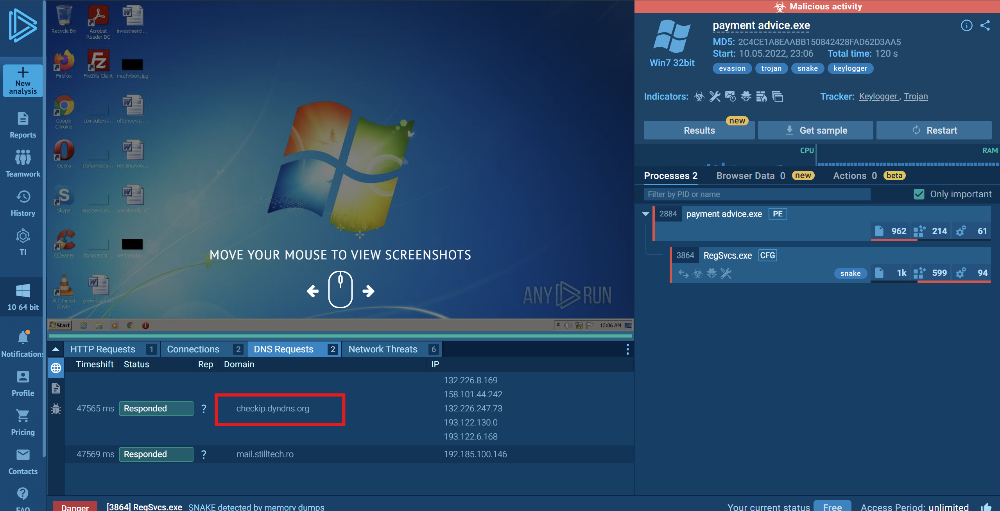
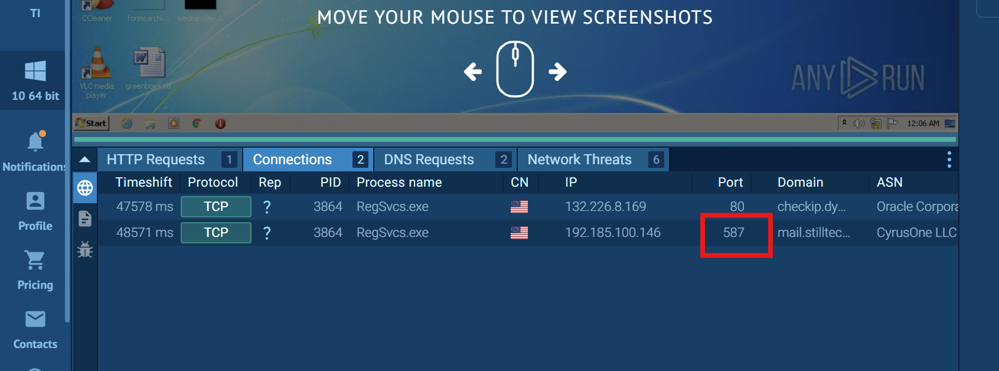
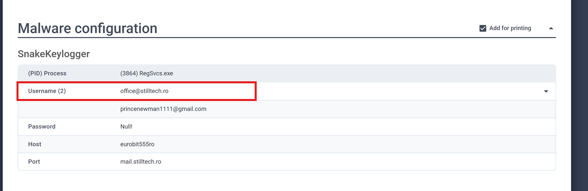
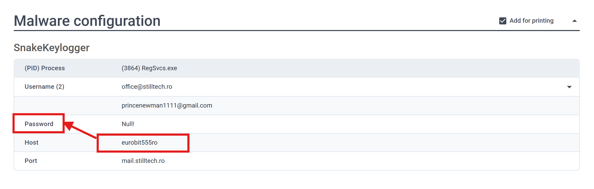

# Dynamic Malware Analysis #2 Walkthrough

## Scenario

In this exercise, the objective is to perform **dynamic malware analysis** of a malware sample. Myself, I used
**ANY.RUN** to identify the malware's network activity and extract its configuration details.

---

## Question 1: What is the domain name of the web application that the malware is requesting to learn its IP address?

I opened the malware analysis task in [**ANY.RUN**](https://app.any.run/tasks/1c8f0ad5-c14b-4cbe-aafd-17d03c1f4740/) and navigated to the **DNS Requests** section. Among the DNS queries generated during execution, I identified the web service the malware uses to determine the infected machine's public IP address.

The domain is highlighted in the screenshot below.

---

## Question 2: What is the domain name that the malware connects to for data hijacking?

While still in the **DNS Requests** tab, I examined the domains contacted by the malware after execution. One of the DNS requests revealed the remote mail server used by the malware for exfiltrating stolen data.

---

## Question 3: What port does the malware communicate over?

Next, I switched to the **Connections** tab in ANY.RUN to inspect the network connections established by the malware.

The connection to the previously identified mail server showed the destination port used for communication.

The screenshot below highlights the port.

---

## Question 4: What is the username used by the malware to authenticate to the mail server it connects to for data hijacking?

To obtain the malware's embedded configuration, I opened the [**ANY.RUN Text Report**](https://any.run/report/85f7f26cd9cfb9ab367d083f60b48e1594b1eadf8dd1a792c347273684855013/1c8f0ad5-c14b-4cbe-aafd-17d03c1f4740) associated with the analysis.

Within the extracted configuration, I located the SMTP authentication credentials, including the username used to connect to the mail server.

---

## Question 5: What is the password that the malware uses to authenticate to the mail server it connects to for data hijacking?

Continuing through the extracted malware configuration, I located the SMTP password.

Although the configuration label in the report is shown as **host** instead of **password**, the corresponding value represents the password used by the malware during authentication.

The extracted value is shown below.

---
