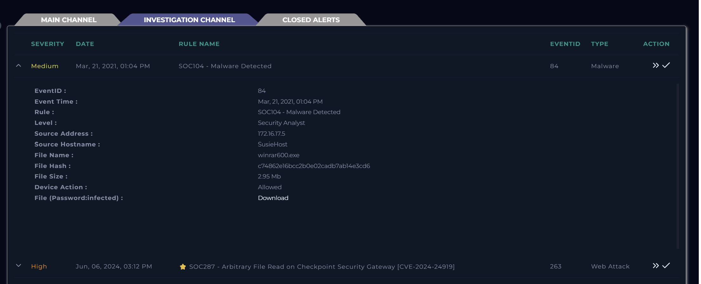
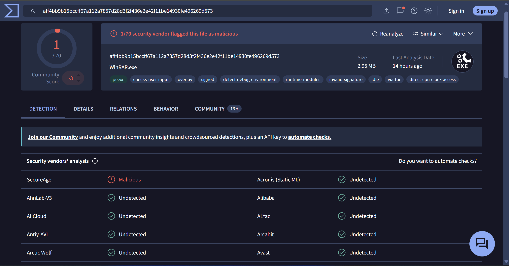
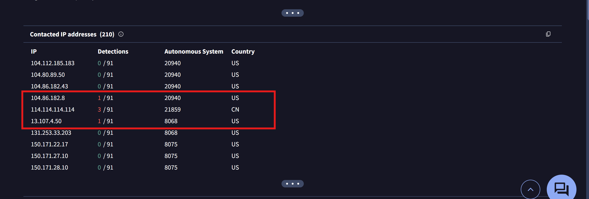
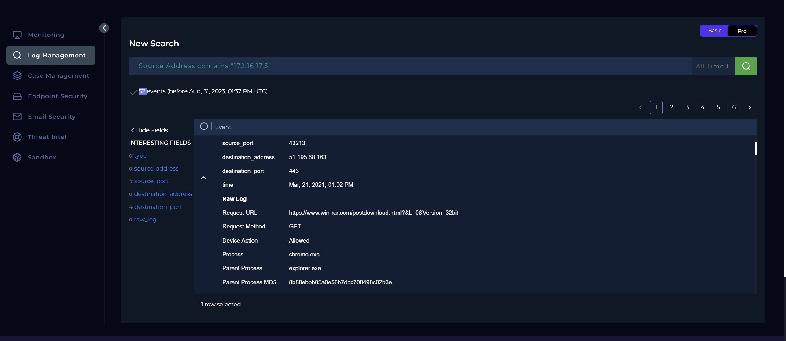
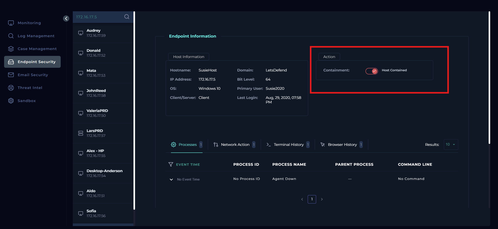
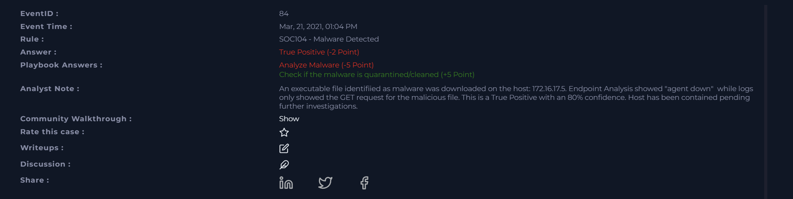
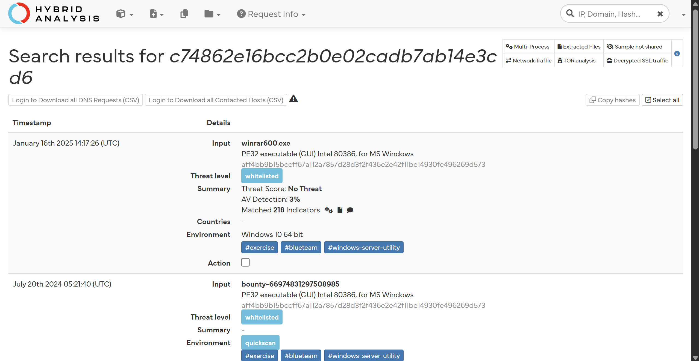
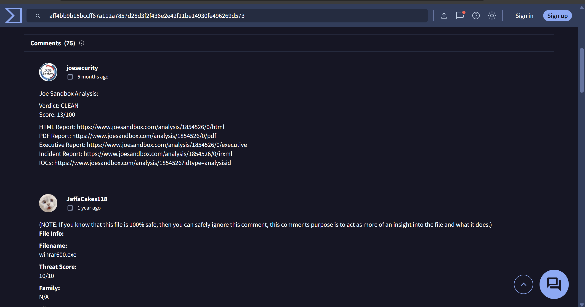
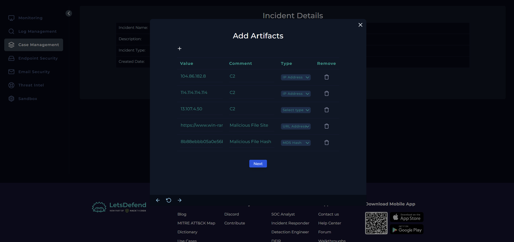

# SOC104 Analysis: Malware Detected

## Alert Overview

| Field | Value |
|-------|-------|
| **Alert Name** | SOC104 - Malware Detected |
| **Event ID** | 84 |
| **Event Time** | March 21, 2021, 01:04 PM |
| **Severity/Level** | Security Analyst |
| **Hostname** | SusieHost |
| **Source IP** | 172.16.17.5 |
| **File Name** | `winrar600.exe` |
| **File Hash (MD5)** | `c74862e16bcc2b0e02cadb7ab14e3cd6` |
| **File Size** | 2.95 MB |
| **Device Action** | Allowed |



---

# Investigation Summary

I started by reviewing the alert details to understand what exactly had been detected before diving 
into the investigation.

The alert indicated that a file named **winrar600.exe** had been detected on **SusieHost 
(172.16.17.5)**. Since the device action was **Allowed**, my immediate question was whether 
this was an actual malware infection or simply a benign application that had triggered an alert.

I assigned the alert to myself, created a case, and began investigating.


---

# Malware Reputation Analysis

The first thing I wanted to do was determine whether the file itself had a known malicious 
reputation.

Using the MD5 hash from the alert, I searched **VirusTotal**.

Interestingly, VirusTotal identified the file as **WinRAR 6.00**, and only **1 out of 70** 
security vendors detected it as malicious.

Normally, when I see detections such as **40/70** or **50/70**, it's relatively straightforward 
to conclude that the file is malicious. But **1/70** sits in that uncomfortable grey area 
where it could either be:

- a false positive from one antivirus vendor,
- a modified installer,
- or a legitimate application that has been abused by attackers.



Instead of jumping to conclusions, I continued gathering evidence.

---

# Threat Intelligence Investigation

Rather than focusing only on the detection ratio, I explored VirusTotal's **Relations** 
tab to understand what infrastructure the file had interacted with.

The relations page listed several contacted IP addresses.

Among them, three had malicious reputations.



At that point I noted the IP addresses down, planning to compare them later against the 
internal network logs.

I deliberately avoided concluding that the file was malicious solely because VirusTotal 
listed malicious infrastructure. Applications can sometimes contact shared 
infrastructure, so I wanted to see whether any of those connections actually occurred inside 
the environment.

---

# Log Analysis

Next, I switched over to the **Log Management** dashboard and filtered events for SusieHost: `172.16.17.5`

Several network events appeared, but I focused specifically on those generated at the same time 
as the alert: **March 21, 2021 – 01:04 PM**



One event  stood out.. the workstation made an HTTP GET request to:

```text
https://www.win-rar.com/postdownload.html?&L=0&Version=32bit
```

Additional details included:

| Field | Value |
|-------|-------|
| Process | chrome.exe |
| Parent Process | explorer.exe |
| Destination IP | 51.195.68.163 |
| Action | Allowed |

This told me that the user had downloaded the installer directly through Chrome from the 
official WinRAR download site.

One important observation here was that the firewall **allowed** the download, meaning the 
file had **not** been quarantined before reaching the endpoint.

However, downloading a file is very different from executing malicious code.

So I still needed to determine whether the executable itself had actually behaved maliciously.

---

# Endpoint Investigation

I then moved to the **Endpoint Security** dashboard hoping to review:

- Browser history
- Terminal history
- Running processes
- Network activity

Unfortunately, I was met with an **Agent Down** message.

That meant I couldn't collect any endpoint telemetry from the host.

Normally, endpoint evidence would be one of my strongest sources of truth during 
a malware investigation, so this definitely limited what I could conclude.

Since I couldn't verify the endpoint's current state and the file had already reached 
the system, I decided to contain the host as a precautionary measure while continuing 
the investigation.



---

# Searching for Command-and-Control Activity

At this point, I had collected several indicators.

From the logs: `51.195.68.163`


From VirusTotal:

- 13.107.4.50
- 114.114.114.114
- 104.86.182.8

I searched the logs for communications involving each of these IP addresses.

The only communication I found was the original download from **51.195.68.163**, 
originating from SusieHost.

I found no evidence that any internal endpoint had communicated with the three 
suspicious IP addresses identified by VirusTotal.

Initially, this made me think the executable may never have been executed, 
since I couldn't find any outbound communication matching the malware infrastructure.

---

# Something Didn't Quite Add Up

After completing the playbook, I discovered that I had answered two questions incorrectly.

- I classified the alert as a **True Positive**.
- I identified the file as **Malicious** during third-party analysis.



That genuinely surprised me.

To better understand the discrepancy, I decided to perform additional analysis outside 
of VirusTotal.

I submitted the file to **Hybrid Analysis**.

The result was even more confusing.

Hybrid Analysis classified the file as:

- Whitelisted
- Threat Score: **No Threat**



At this point, I wasn't sure what to believe.

VirusTotal showed **one antivirus detection**.

Hybrid Analysis considered the file clean.

The official filename matched a legitimate WinRAR installer.

Even the VirusTotal community wasn't in agreement.

Some users stated the file was completely legitimate.

Others insisted it was unquestionably malicious.



Honestly, this was probably the most interesting part of the investigation for me.

It reminded me that malware analysis isn't always black and white.

Not every antivirus detection means a file is malicious, and not every clean report 
guarantees that a file is safe.

Different vendors use different detection engines, signatures, heuristics, and machine 
learning models. It's therefore possible for security products to disagree on the same sample.

Because of that, relying solely on reputation scores would have been a mistake.

---

# Looking Beyond Detection Scores

I went back to VirusTotal one more time and reviewed the file's capabilities instead of 
focusing on the detection ratio.

The executable contained capabilities such as:

- Creating new processes
- Reading and writing files
- Modifying registry values
- Creating threads
- Setting environment variables
- Creating directories
- Loading code dynamically
- Resolving Windows API functions
- Anti-analysis techniques
- Encryption and hashing functions

At first glance, that list looks intimidating.

But after thinking about it, I realized that many of these capabilities are completely 
normal for legitimate Windows applications.

A utility like WinRAR naturally needs to:

- read and write files,
- create directories,
- interact with the registry,
- spawn child processes,
- and perform hashing or encryption for archive operations.

Even some anti-analysis indicators can appear in legitimate commercial software due to 
compiler behavior or software protection mechanisms.

In other words, capabilities alone don't prove malicious intent.

They only describe **what a program is capable of doing**, not **why it is doing it**.

That reinforced an important lesson for me: technical context always matters more than 
individual indicators.

---

# Reflection

Looking back at this investigation, I think this was less about identifying malware and more 
about learning how to deal with uncertainty fr.

Everything initially pointed me in different directions.

- The alert said **Malware Detected**.
- VirusTotal had a single detection.
- Hybrid Analysis considered the file safe.
- The endpoint agent was unavailable.
- The only network activity observed was downloading the installer from the official WinRAR website.

As an analyst, that's not the kind of investigation where you can confidently say 
"this is definitely malicious" after five minutes.

Instead, it reminded me that investigations are about collecting evidence until the 
overall picture makes sense.

Sometimes that picture is crystal clear like the previous investigations I performed and 
sometimes, like this case, it's much more nuanced.


---

# Conclusion

This investigation turned out to be much less straightforward than I initially expected. Although 
the alert classified the file as malware, third-party analysis produced conflicting results. 
VirusTotal reported only a single antivirus detection, while Hybrid Analysis classified the sample 
as clean. Reviewing the file's capabilities also showed behaviors that, while sometimes associated 
with malware, are equally common in legitimate software such as WinRAR.

Log analysis confirmed that the file had been downloaded from the official WinRAR website, and no 
evidence was found showing communication with the suspicious infrastructure identified in VirusTotal. Unfortunately, the Endpoint Security agent was unavailable, preventing further validation of whether the executable had actually been launched or exhibited malicious behavior.

Given the limited endpoint visibility and the uncertainty surrounding the file's reputation, 
I chose to contain the affected host as a precautionary measure while continuing the investigation.

More than anything, this investigation reinforced an important lesson for me: reputation scores 
should guide an investigation, not dictate its conclusion. Security vendors may disagree, 
behavioral capabilities require context, and the strongest conclusions come from correlating 
multiple sources of evidence rather than relying on a single detection engine.


## Final Thoughts

If this is your first time reading one of my walkthroughs, welcome!

I write these investigations exactly as I work through them capturing my thought process, the mistakes I make, the dead ends I explore, and the lessons I learn along the way. My goal isn't to present a flawless investigation, but to document a realistic one. I believe that understanding *why* something works (or doesn't) is far more valuable than simply showing the correct answer.

If you enjoy this style of learning and would like to follow along as I publish more cybersecurity walkthroughs, investigations, and hands-on labs, feel free to follow me on Medium and subscribe to receive notifications whenever I publish a new article.

Thanks for reading, and I hope you learned something new today.


