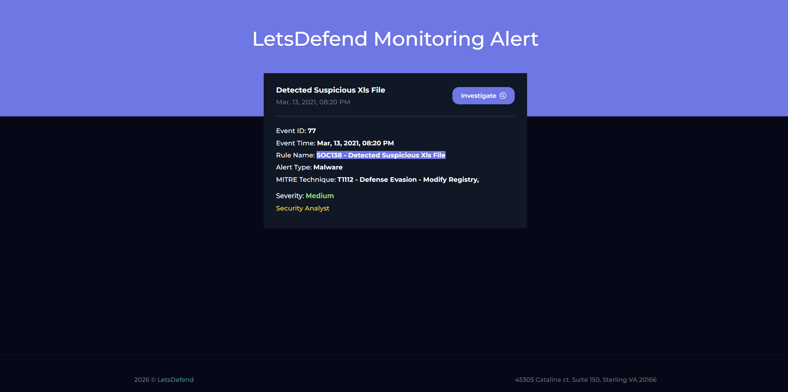
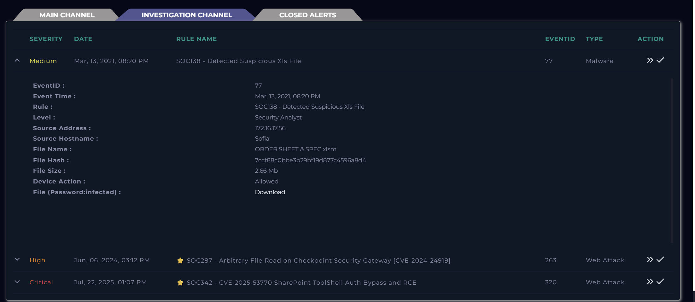
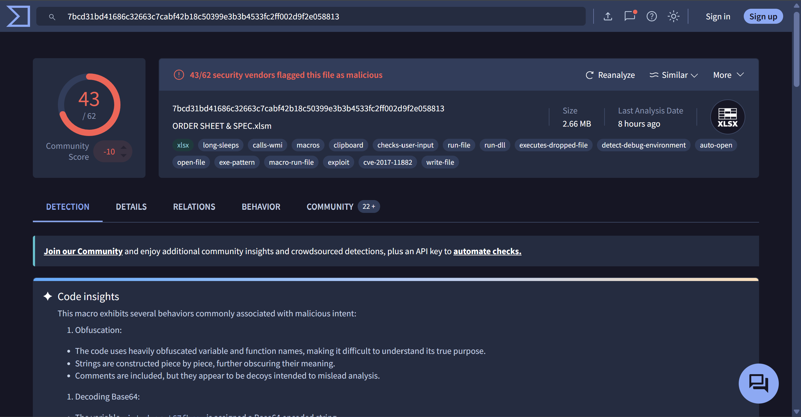
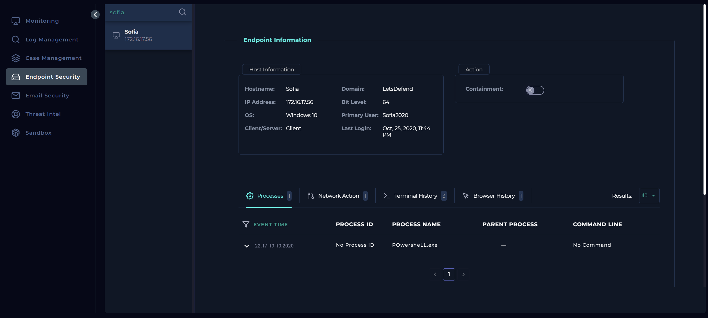
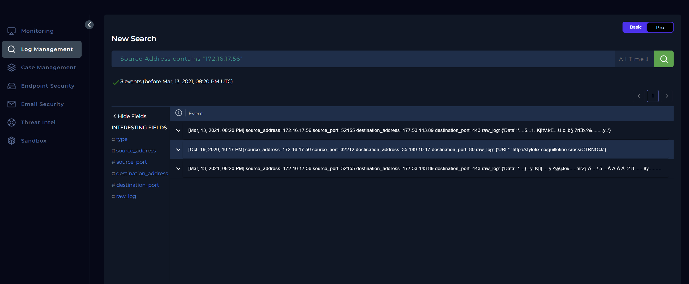
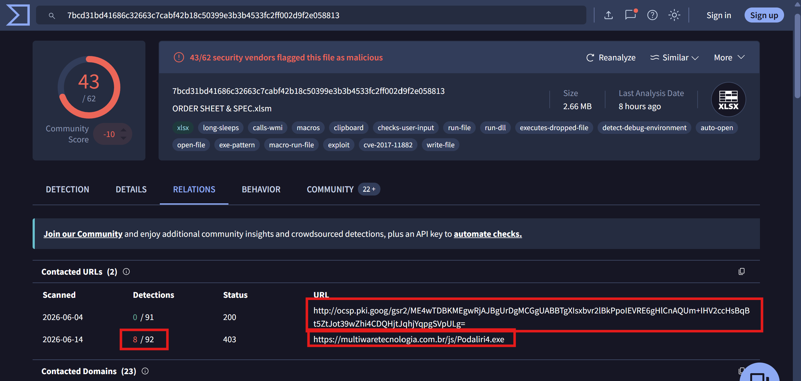

# SOC105 Analysis: Requested Threat Intelligence URL Address

## Alert Overview

| Field | Value |
|-------|-------|
| **Alert Name** | SOC105 - Requested T.I. URL Address |
| **Event ID** | 75 |
| **Event Time** | March 07, 2021, 05:47 PM |
| **Severity/Level** | Security Analyst |
| **Hostname** | MarksPhone |
| **Source IP** | 10.15.15.12 |
| **Username** | Mark |
| **Destination IP** | 67.199.248.10 |
| **Destination Hostname** | `bit.ly` |
| **Requested URL** | `https://bit.ly/TAPSCAN` |
| **Device Action** | Allowed |

---

# Investigation Summary

I assigned the alert to myself and created a case before taking a closer look at the details.

The alert showed that **MarksPhone** had accessed a URL that matched a Threat Intelligence (T.I.) indicator. 
Since shortened URLs can hide the actual destination, my goal was to determine whether the link
redirected to malicious content or if it had simply been flagged due to its reputation.

To verify this, I analyzed the indicators using multiple threat intelligence platforms, including:

- VirusTotal
- ANY.RUN
- Hybrid Analysis
- URLScan.io

---

# Threat Intelligence Analysis

I investigated the destination IP address, the Bitly URL, and the destination hostname across the 
different platforms.

VirusTotal showed that only **one security vendor** flagged the IP address and the shortened URL, 
which by itself wasn't enough to confidently classify it as malicious.

To understand where the shortened link actually led, I performed a dynamic analysis using **ANY.RUN**.

The sandbox revealed that the Bitly link redirected to a **PDF Scanner application on the Google Play 
Store**, indicating that the destination itself was legitimate.

Hybrid Analysis produced mixed results for the IP address, but after reviewing the associated domains and 
related activity, they all pointed toward legitimate content rather than malicious infrastructure.

Overall, the evidence consistently suggested that the alert was triggered because the URL appeared in a 
threat intelligence feed, not because it was actively malicious.

---

# Findings

| Investigation Item | Result |
|--------------------|--------|
| Threat Intelligence Reputation | Mostly Clean |
| Dynamic Analysis | Redirected to legitimate Google Play application |
| Malicious Activity Observed | No |
| Classification | Non-Malicious |

---

# Conclusion

After reviewing the URL across multiple threat intelligence sources and performing dynamic analysis, I 
found no evidence that the shortened Bitly link was serving malicious content. The URL redirected to a 
legitimate PDF Scanner application on the Google Play Store, and no suspicious behavior was observed 
during analysis.

Based on the available evidence, I classified the indicator as **Non-Malicious** and documented the 
relevant artifacts as part of the investigation.

