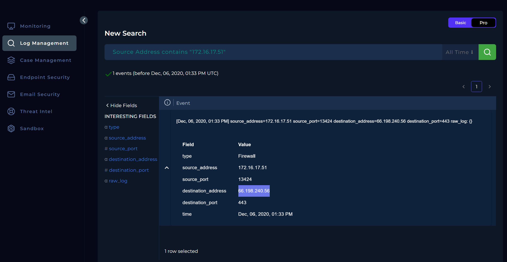
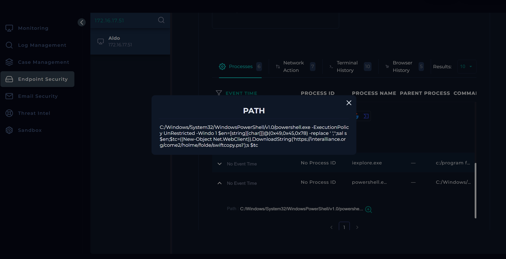
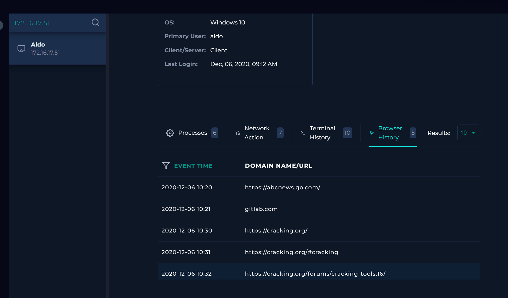
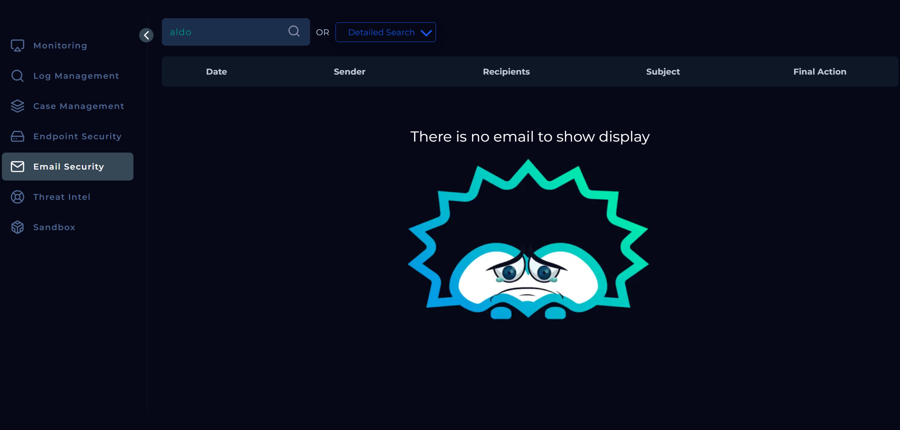
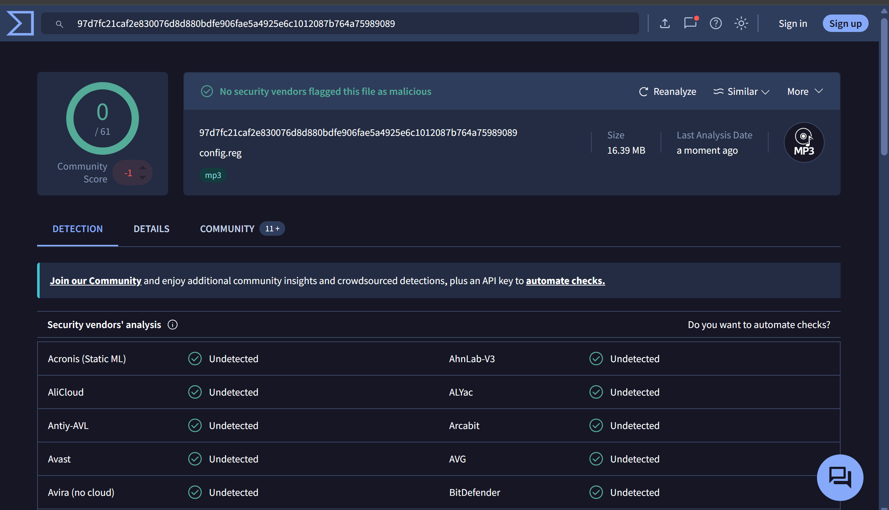
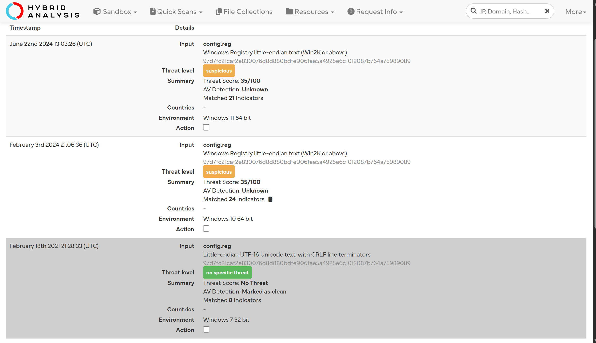
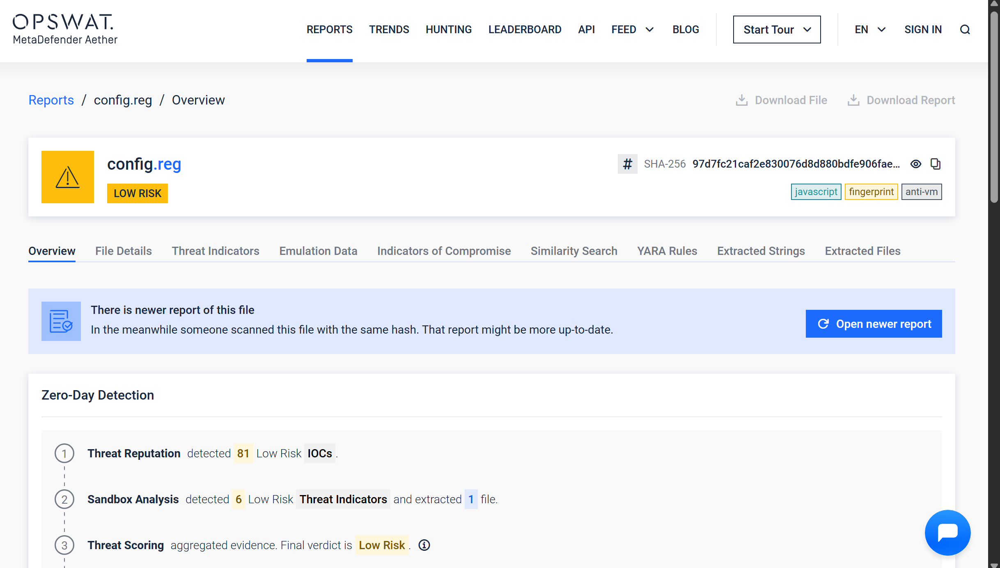
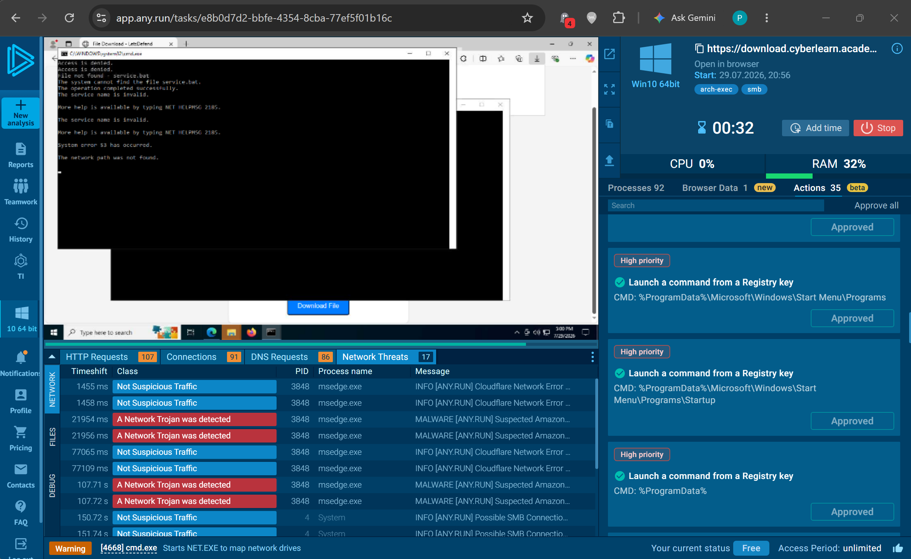
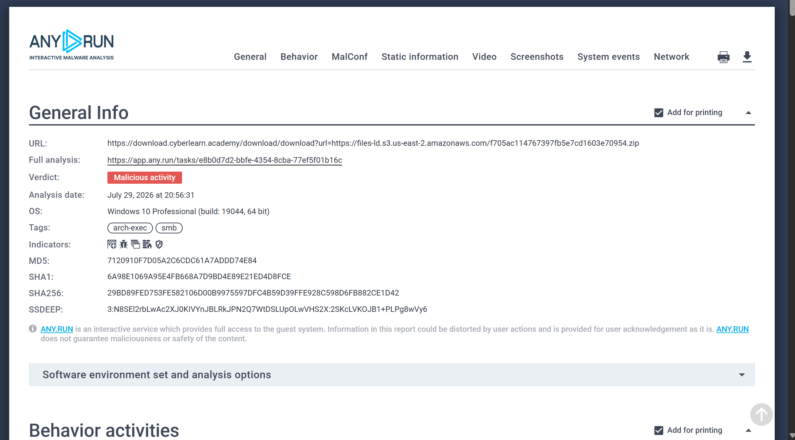
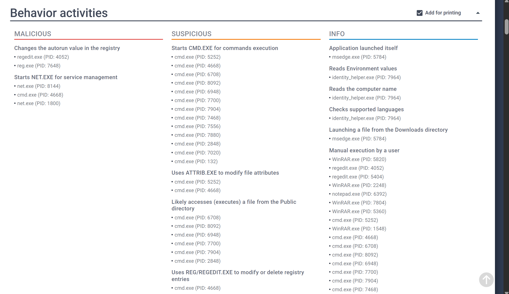

# SOC117 Analysis: Suspicious .reg File

## Alert Overview

| Field | Value |
|-------|-------|
| **Alert Name** | SOC117 - Suspicious .reg File |
| **Event ID** | 50 |
| **Event Time** | February 06, 2021, 01:58 PM |
| **Severity/Level** | Security Analyst |
| **Hostname** | Aldo |
| **Source IP** | 172.16.17.51 |
| **File Name** | `config.reg` |
| **File Hash** | `f705ac114767397fb5e7cd1603e70954` |
| **File Size** | 16.3 MB |
| **Device Action** | Blocked |

---

# Investigation Summary

I assigned the alert to myself and created a case before beginning the investigation.

From the alert details, I noted that the suspicious `.reg` file had been **blocked**, which suggested the security controls had already taken some action. The affected host was **Aldo (172.16.17.51)**, and my first objective was to determine whether the file had actually reached the endpoint or if it had been stopped before execution.

---

# Log Analysis

I started with the Log Management dashboard by filtering for the affected host.

Interestingly, only a single event was returned, and it dated back to **December 06, 2020**-roughly two months before the alert itself. Although the event didn't line up with the alert timestamp, I still investigated it to see whether there was any relationship.

The event showed communication with the destination IP **66.198.240.56**. I queried the IP on VirusTotal, but every security vendor classified it as clean, so I ruled it out as unrelated to the current investigation.



---

# Endpoint Investigation

Since the logs didn't provide much context, I switched over to the Endpoint Security dashboard.

The first thing I noticed was that the latest recorded login on the machine was also from **December 06, 2020**, which matched the only log entry I had found earlier.

I then reviewed the running processes and found an **obfuscated PowerShell command**. After decoding its behavior, I found that it:

- Launched PowerShell with a relaxed execution policy.
- Constructed the string **IEX (Invoke-Expression)** using hexadecimal characters to evade simple detection.
- Downloaded a remote PowerShell script (`swiftcopy.ps1`) using `Net.WebClient.DownloadString()`.
- Executed the downloaded script directly in memory.

This is a classic **PowerShell download cradle**, a technique commonly used by malware to retrieve and execute payloads without writing them to disk.

Naturally, I investigated the downloaded URL next. Both VirusTotal and Hybrid Analysis classified it as safe, which made the process a little more confusing.

I also reviewed the browser history and terminal history but found nothing suspicious around the alert timeframe.

At this point, my initial assessment was that the security controls had prevented the threat from reaching the endpoint.





---

# Email Investigation

To rule out phishing as the delivery mechanism, I searched the Email Security platform for messages sent to Aldo around the same period.

No related emails were found.

That suggested the suspicious `.reg` file wasn't delivered through the organization's monitored email system.



---

# Malware Analysis

Next, I analyzed the file hash using several external malware analysis platforms.

### Initial Analysis

My initial findings were somewhat inconsistent.

- **VirusTotal** reported **0 detections**.
- **Filescan.io** classified the sample as **Low Risk**.
- **Hybrid Analysis** returned mixed results, with some reports marking it as suspicious while others showed no specific threat level.

Based on those results alone, I initially leaned toward classifying the alert as a **False Positive**.







After documenting my findings, I added the relevant artifacts and closed the alert.

---

# Revisiting the Investigation

Once I completed the playbook, I noticed two answers were marked incorrect.

Specifically:

- The alert was actually a **True Positive**, not a False Positive.
- The malware should have been classified as **Malicious** during third-party analysis.

That made me question my initial conclusion. The static analysis tools hadn't provided enough evidence, so I decided to perform **dynamic analysis** using ANY.RUN.

That ended up giving me the missing context.



The sandbox showed behavior that was far more convincing than the earlier static reports.

When executed, the sample:

- Spawned multiple **Command Prompt (`cmd.exe`)** processes.
- Modified the Windows Registry to establish persistence through autorun entries.
- Attempted to disable Windows Defender and Windows Firewall services.
- Used `attrib.exe` to hide files.
- Leveraged `net.exe` to manipulate Windows services.
- Connected to remote infrastructure to retrieve additional content.

Taken together, these behaviors clearly demonstrated malicious intent. Rather than simply looking at reputation scores, the behavioral analysis revealed how the malware attempted to establish persistence, weaken system defenses, conceal itself, and download additional payloads.

---

# Network Indicators

Although I couldn't identify a confirmed Command-and-Control (C2) server, the sandbox did reveal several suspicious network indicators that appeared to be involved in payload delivery.

**Observed URLs**

- `https://download.cyberlearn.academy/download/download?url=https://files-ld.s3.us-east-2.amazonaws.com/f705ac114767397fb5e7cd1603e70954.zip`
- `https://files-ld.s3.us-east-2.amazonaws.com/f705ac114767397fb5e7cd1603e70954.zip`

**Observed IP Addresses**

- `104.21.11.167`
- `172.67.166.172`

ANY.RUN identified the Amazon S3 resource as suspicious and associated it with malware distribution, although I couldn't confidently identify it as a dedicated C2 server.





---

# Lessons Learned

This investigation was a good reminder that static reputation alone doesn't always tell the full story.

Initially, the sample looked relatively harmless because VirusTotal and other reputation-based platforms produced very few detections. Had I stopped there, I would have incorrectly classified the alert as a False Positive.

Running the sample in a controlled sandbox completely changed the picture. The malware's behavior clearly demonstrated persistence mechanisms, defense evasion, payload retrieval, and other techniques that static analysis simply didn't expose.

It reinforced something I've noticed repeatedly while working through these investigations: whenever the evidence doesn't quite add up, it's worth digging one layer deeper rather than relying solely on detection counts.

---

# Findings

| Investigation Item | Result |
|--------------------|--------|
| Alert Classification | True Positive |
| Device Action | Blocked |
| Endpoint Compromise | No evidence of successful execution on host |
| Malware Classification | Malicious |
| Quarantined/Cleaned | Quarantined |
| Confirmed C2 | None Identified |
| Suspicious Infrastructure | Amazon S3-hosted payload and related IPs |

---

# Conclusion

The investigation initially appeared to point toward a False Positive because the available static analysis reports showed little to no malicious reputation. However, after performing dynamic analysis with ANY.RUN, the sample exhibited clear malicious behavior, including persistence through registry modifications, attempts to disable security controls, concealed files, and communication with external infrastructure for payload retrieval.

Although no confirmed C2 server was identified, the observed network activity and behavioral indicators were sufficient to classify the file as malicious. Since the device action indicated the file was **Blocked**, and no evidence suggested successful execution on the endpoint, the threat was considered successfully prevented before it could compromise the host.

---

## Playbook Execution

- Define Threat Indicator: **Other**
- Check if the Malware was Quarantined/Cleaned: **Quarantined**
- Analyze Malware in Third-Party Tools: **Malicious**
- Identify C2 Address: **No confirmed C2 identified**
```
