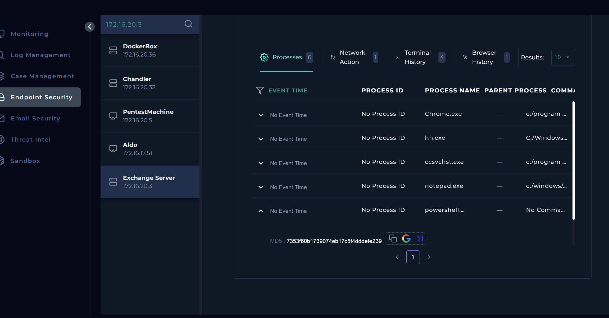
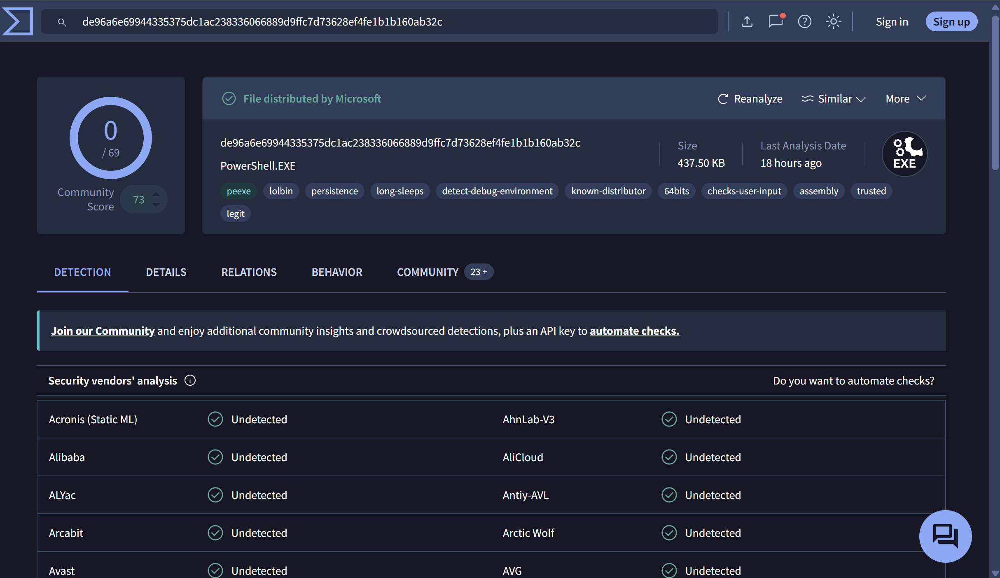
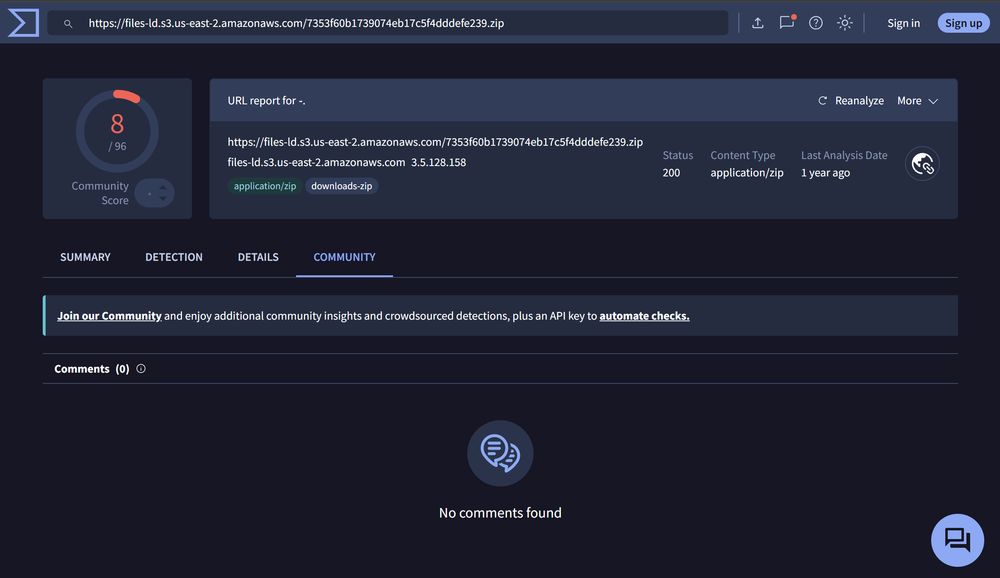

# LetsDefend SOC130 Analysis: Event Log Cleared 

## Event Details

| Field | Value |
|---|---|
| **Event ID** | 64 |
| **Event Time** | Feb 21, 2021, 07:23 PM |
| **Rule** | SOC130 - Event Log Cleared |
| **Level** | Security Analyst |
| **Source Address** | 172.16.20.3 |
| **Source Hostname** | Exchange Server |
| **File Name** | powershell.exe |
| **File Hash** | 7353f60b1739074eb17c5f4dddefe239 |
| **File Size** | 437.50 KB |
| **Device Action** | Allowed |

---

## Overview

An **event log cleared** rule firing on an **Exchange Server**  a high-value, internet-facing target - is never something you want to 
dismiss quickly. Exchange servers are a prime target for attackers because they sit on the network edge, handle sensitive email communication, 
and often have elevated privileges. Clearing event logs is a classic attacker technique to cover tracks after they've already done something 
they don't want you to see. So right from the start, this one deserved a thorough look.

Let me walk you through how I approached this.

---

## Understanding the Event IDs

Before diving into any tool, it helps to understand what "event log cleared" actually looks like from Windows' perspective. There are 
three key Event IDs relevant here:

- **Event ID 1102** - Security logs were cleared (recorded in the Security log)
- **Event ID 1100** - Event logging service was disabled (also in the Security log)
- **Event ID 104** - Event logs were cleared (recorded in the System log, not the Security log - useful because attackers sometimes forget to clear both)

Knowing these ahead of time tells you exactly what to filter for and where to look. If you see 1102 or 1100, someone deliberately 
cleared or disabled security logging. If you see 104 in System logs but no 1102 in Security logs, that could mean the Security 
log was already wiped before you arrived.

---

## Log Analysis

The natural first move was to pull up the logs and filter for the exact time range of the alert - **Feb 21, 2021 around 07:23 PM**.

And the result? Nothing.

Which, honestly, is itself a finding. An empty log around the exact time an alert fires for "event log cleared" is partially 
self-explanatory - if the logs were cleared, of course there's nothing there. But it does raise the question: *what was being hidden?* 
The absence of logs is not the same as the absence of activity. If anything, it raises the suspicion level.

---

## Endpoint Investigation

Since the logs weren't going to give me much, I shifted focus to the **Endpoint Security dashboard** and pulled up the 
Exchange Server (`172.16.20.3`). This is where things started getting more interesting.

I looked at three areas: **Processes**, **Terminal History**, and **Browser History**.

**Processes:**
The `powershell.exe` process related to this alert was visible - and the hash matched exactly what was in the alert 
details (`7353f60b1739074eb17c5f4dddefe239`). So this wasn't a phantom process - it was definitely running on this machine.

**Terminal History:**
This is where it got more telling. The terminal history showed commands executed back in **October of the previous year** -
well before this alert was generated in February 2021. 

The commands showed:
- User enumeration activity
- A user named **backupUser** being created
- That same user being added to a local group called **backupGroup**

Creating a user and adding them to a group without any legitimate change management record is a red flag for **persistence** - a 
common post-exploitation technique where attackers create a backdoor account to maintain access even if their initial foothold is removed. 
The fact that this happened months before the alert is especially concerning, because it suggests the attacker may have had prolonged, 
undetected access to this Exchange Server.

---

## Threat Intelligence

With a file hash in hand, my next move was to check it against threat intelligence platforms. I started with **VirusTotal**.

The result came back clean - zero vendors flagged `powershell.exe` with that hash as malicious.

Now here's the thing.. and this is an important lesson - **a clean VirusTotal result does not mean a file is safe.** VirusTotal reflects what 
antivirus vendors have catalogued at the time of the query. A freshly modified or custom-built payload, or a legitimate system binary 
being abused, may not be flagged by any vendor. This is especially true for `powershell.exe` specifically, since it's a legitimate Windows 
binary - the malicious behavior comes from *how* it's being used, not from the binary itself.

So I dug deeper and checked the **Community** tab on VirusTotal, where I found a reference to a **Joe Sandbox** analysis. I pulled that report:
https://www.joesandbox.com/analysis/1821657/0/pdf

Joe Sandbox told a very different story:
- Initial access via a **PowerShell executable**
- Spawned **conhost.exe** to handle console operations (a common behavior when PowerShell is used to run console-based commands)
- **Evasion techniques** detected: Location-based evasion and System file location anomaly
- **System event log enumeration**
- **Security event log enumeration**

That last two points directly tie back to our alert. The file was actively enumerating and interacting with event logs - consistent 
with an attacker clearing those logs to cover their tracks.

---

## Dynamic Analysis with Any.run

To get a more visual, behavioural picture of what this file actually *does* when executed, I submitted it to **Any.run** for dynamic analysis.

https://any.run/report/366c91d8aaca82a5d9559cc497039fcabfe5a38020373da80c0b36ec3502e2c0/98058f51-d59d-4cc9-9e99-9dee81788868

Any.run flagged suspicious activity consistent with everything Joe Sandbox reported. And within the **network activity**, the following IP addresses were observed:

- `18.239.50.82`
- `18.239.50.18`
- `18.239.50.4`
- `18.239.50.80`
- `3.5.128.158`

These are communication indicators. The fact that the compromised Exchange Server was reaching out to external IPs during execution is 
significant.

---

## Containment

Given everything above.. the cleared logs, the suspicious process, the backdoor user creation, the confirmed malicious behavior from sandbox 
analysis, and the observed C2 connections, I had to **contain the Exchange Server** and isolate it from the network.

Yes, containing an Exchange Server is disruptive. Email flow stops. People notice. But the alternative; leaving a potentially compromised, 
internet-facing server with active C2 connections sitting on the network is far worse.

---

## Playbook Execution

| Step | Action Taken |
|---|---|
| Define Threat Indicator | Other |
| Check if malware is quarantined | Not quarantined |
| Analyze Malware | **Malicious** |
| Check if Someone Requested the C2 | **Accessed** |
| Containment | **Contained** |

---

After completing the investigation, the playbook flagged two of my answers as incorrect:
- **Alert was not a true positive**
- **Analyze malware: not malicious**

I want to be transparent about this and also push back on it a little.

The VirusTotal result was clean, yes. But as I've explained above, that alone is not sufficient to call a file benign, especially when:
1. Joe Sandbox explicitly identified malicious behavior
2. Any.run confirmed suspicious activity and active C2 network connections
3. The endpoint showed user creation commands consistent with persistence
4. The logs were cleared around the time of the alert

To me, this alert is a **true positive** and the file is **malicious**. The playbook result may reflect an over-reliance on 
VirusTotal as the primary verdict mechanism. This is exactly the kind of case that deserves escalation or a second review - not closure as a 
false positive.

Sometimes the tools disagree. A good analyst doesn't just follow the playbook blindly; they document their reasoning and flag it 
for review.. which is exactly what I'm doing here.

---

## Conclusion

This investigation started with a single "event log cleared" alert on an Exchange Server and unfolded into something considerably more 
concerning - a likely compromised high-value host with:
- Evidence of persistence (backdoor user creation months prior)
- Active C2 communication
- Confirmed malicious behavior from dynamic analysis
- Deliberately cleared logs to hinder investigation

The key takeaway here: **absence of log evidence is not absence of malicious activity.** If anything, a suspicious lack of logs should *increase* 
your suspicion, not reduce it. And never let a clean VirusTotal result be the end of your investigation - go deeper, 
use multiple sources, and trust your analysis.

See you in my next one,
Peace.