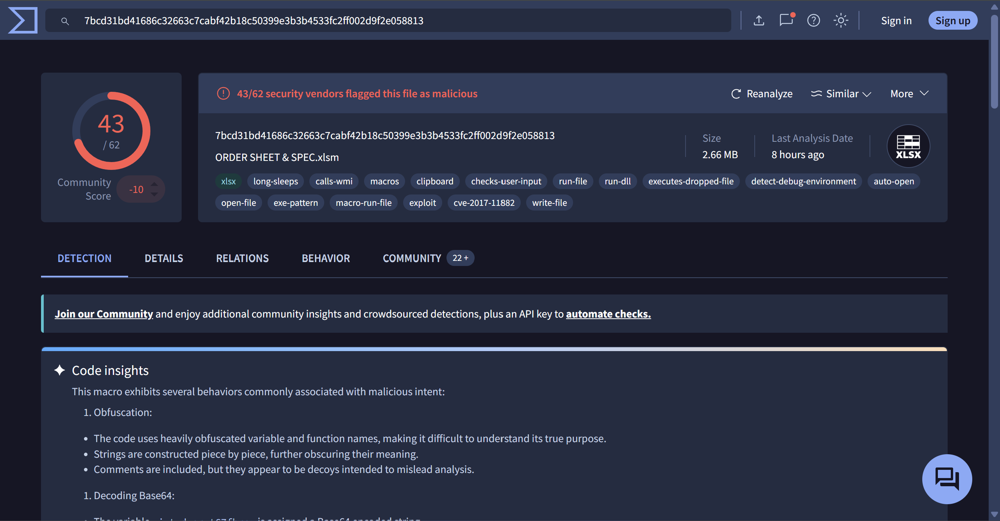
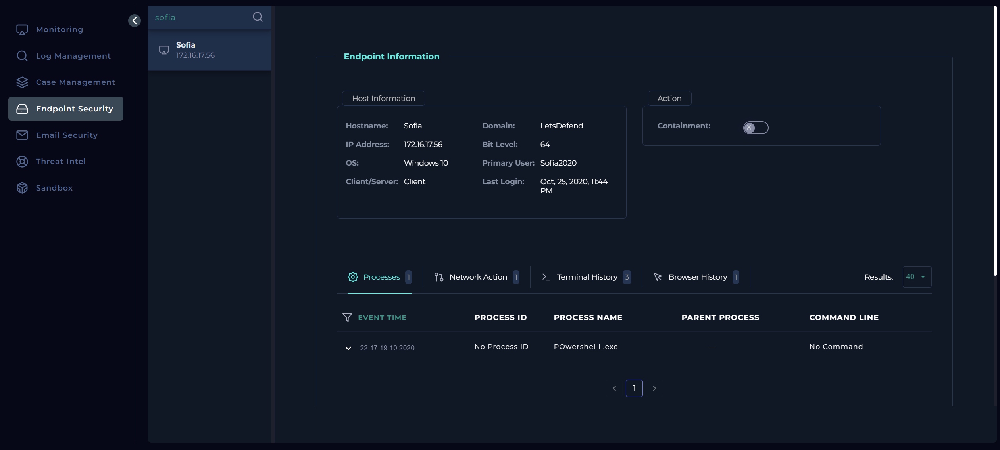
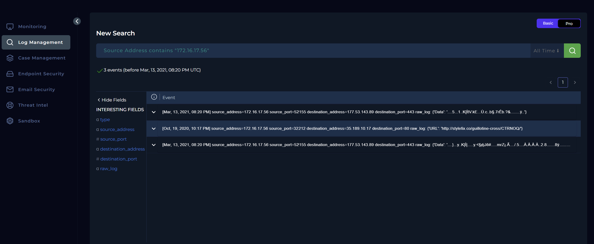
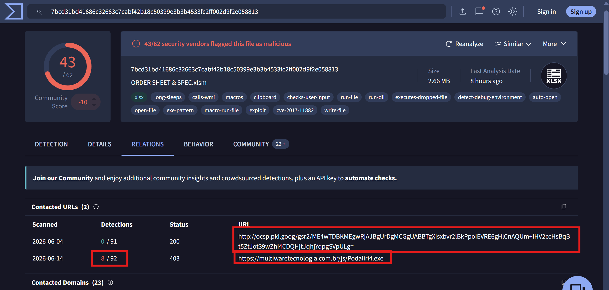
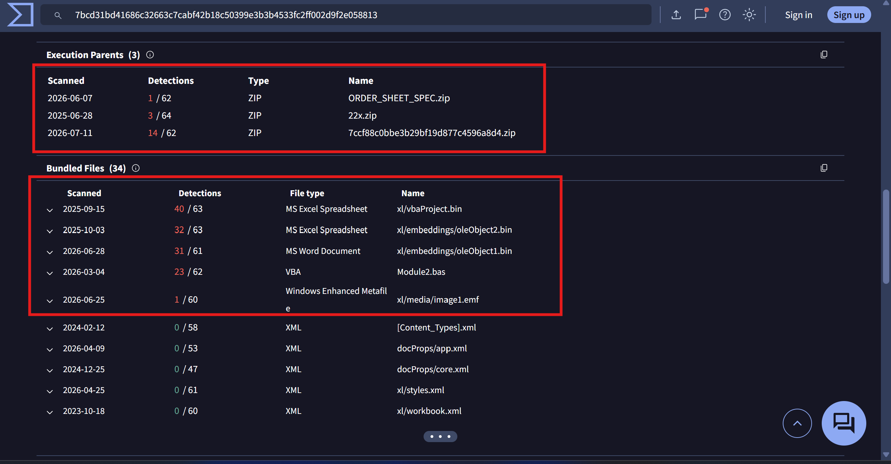
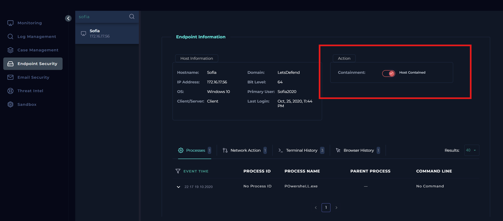
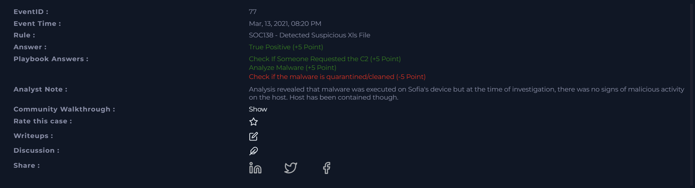

# SOC138 Analysis: Detected Suspicious XLS File

## Alert Overview

| Field | Value |
|-------|-------|
| **Alert Name** | SOC138 - Detected Suspicious Xls File |
| **Event ID** | 77 |
| **Event Time** | March 13, 2021, 08:20 PM |
| **Severity/Level** | Security Analyst |
| **Hostname** | Sofia |
| **Source IP** | 172.16.17.56 |
| **File Name** | `ORDER SHEET & SPEC.xlsm` |
| **File Hash (MD5)** | `7ccf88c0bbe3b29bf19d877c4596a8d4` |
| **File Size** | 2.66 MB |
| **Device Action** | Allowed |



---

# Investigation Summary

I started by reviewing the alert details to understand what had been detected before 
jumping into any investigation. The alert indicated that a suspicious Excel macro-enabled
document named: `ORDER SHEET & SPEC.xlsm` had been detected on **Sofia's workstation (172.16.17.56)**.

Since the alert already provided the file hash, my first instinct was to verify whether the file 
was actually malicious before spending time investigating the endpoint. If VirusTotal confirmed 
it was clean, I could query more intelligence websites and perform some dynamic analysis via Any.run then quickly rule out the alert if results came clean. 
If not, then I'd know I was dealing with an actual malware investigation.

---

# Malware Analysis

I submitted the file hash to VirusTotal where the results immediately answered my first question.

The file was detected by **43 out of 62** security vendors.


Looking through the analysis, several indicators stood out.

The document contained heavily obfuscated VBA macros along with suspicious function calls 
typically associated with malware. VirusTotal also reported behaviors consistent with
downloading and executing additional payloads, as well as self-replication.

At that point, I was confident that this wasn't a false positive but that the document was 
unquestionably malicious.

With that confirmed, my attention shifted to determining whether the malware had actually
executed on Sofia's machine.

---

# Endpoint Investigation

I moved into the **Endpoint Security** panel and filtered for Sofia's workstation.

My plan was straightforward. I wanted to review:

- Browser history
- Running processes
- Terminal history
- Network activity

while paying close attention to activity around the alert timestamp.



Surprisingly, I couldn't find any meaningful endpoint events from **2021**.

In fact, every event I found belonged to much later dates.

So I was like fr? At first, I thought this might mean the malware had already been quarantined 
or removed before I started my investigation.

Then another thought crossed my mind.. "Could the malware somehow have cleaned up after itself and 
removed evidence"?

That seemed unlikely, but without endpoint telemetry from the relevant timeframe, I couldn't 
confidently answer the playbook question about whether the malware had already been quarantined.

Rather than making assumptions, I decided to continue gathering evidence elsewhere.

---

# Log Analysis

Since the endpoint investigation wasn't giving me much to work with, I switched over 
to the **Log Management** platform.

I filtered events using Sofia's IP address which returned **three events** dating back to 
**October 19, 2020**, and **March 13, 2021**, including activity occurring at the exact time 
the alert was generated.



Expanding the March 13 event revealed communication between Sofia's workstation and the 
external IP address `177.53.143.89`


The payload itself appeared unreadable.

```text
....}...y..K|Í|.....y.<§¢jJê#.....
```

Looking at the above, my first thought was that the traffic was either encrypted or encoded.

Although I couldn't determine the exact contents, one thing became clear.

A suspicious Excel document had been detected, and around the same time the host established 
communication with an external IP address.

That strongly suggested the malware may have attempted to contact its Command-and-Control 
(C2) infrastructure after execution.

Still, I wanted stronger evidence before reaching that conclusion.

---

# Threat Intelligence Investigation

I went back to VirusTotal, this time focusing on the **Relations** tab instead of the 
detection summary.

I wanted to understand what infrastructure this malware family communicated with.

One contacted URL was `https://multiwaretecnologia[.]com[.]br/js/Podaliri4.exe`

VirusTotal also listed several contacted IP addresses.

One of them was `177.53.143.89`

The exact same IP address I had observed in the firewall logs.



Seeing the same IP appear independently in both the endpoint logs and VirusTotal 
significantly increased my confidence in the findings.

VirusTotal further identified the address as being located in Brazil.



This correlation strongly suggested that the outbound connection observed in the logs was 
malware-related rather than legitimate user activity.

---

Having confirmed the suspected C2 infrastructure, I wanted to determine whether any other 
systems inside the organization had communicated with it.

I searched the log management platform again, this time filtering on the destination IP `177.53.143.89`

The search returned only the same three events involving Sofia's workstation.

No additional internal hosts had contacted the C2 server.

That indicated the activity appeared to be isolated to a single endpoint.

---

# Containment

Although I couldn't determine with certainty whether the malware had already been quarantined, 
I had enough evidence to conclude that Sofia's workstation had communicated with known malicious 
infrastructure.

Rather than taking any chances, I navigated back to the Endpoint Security panel and contained 
the device to prevent any further communication with external systems.



---

# Reflection

After completing the investigation, I reviewed the playbook answers and noticed that I had 
answered one question incorrectly.



The playbook asked whether the malware had already been quarantined or cleaned.

Initially, I selected **Quarantined** because I couldn't find any malicious endpoint activity 
during my investigation.

Looking back, I don't think that was the right conclusion.

The absence of endpoint telemetry doesn't necessarily mean the malware was quarantined. In fact, 
the firewall logs showed communication with a confirmed C2 server, which strongly suggests the 
malware had already executed successfully.

If another analyst had investigated the incident before me, there may also have been response 
actions that weren't visible from the data available in the lab.

This was a good reminder that **absence of evidence isn't evidence of absence**. When endpoint 
telemetry is incomplete, it's important to rely on the other available sources of evidence 
instead of assuming the threat has already been remediated.

---

# Conclusion

The investigation confirmed that the alert was a **True Positive** involving a malicious 
macro-enabled Excel document.

VirusTotal classified the file as malicious, with detections from **43 security vendors**, 
and identified behavior consistent with malware capable of downloading additional payloads 
and communicating with external infrastructure.

Although the endpoint investigation did not provide historical telemetry from the time of the 
incident, firewall logs showed outbound communication from Sofia's workstation 
to **177.53.143.89**. Cross-referencing this IP address with VirusTotal revealed it to be one of 
the malware's contacted IPs, providing strong evidence that the malware had successfully 
communicated with its Command-and-Control infrastructure.

A search across the environment found no evidence that other endpoints had contacted the same 
C2 server, suggesting the activity was isolated to Sofia's workstation. As a precautionary 
measure, the affected host was contained to prevent any further malicious communication while 
remediation could take place.

One lesson I took away from this investigation was not to equate missing endpoint telemetry 
with successful remediation. In this case, correlating firewall logs with threat intelligence 
provided the evidence needed to confirm malicious activity, even when endpoint artifacts were 
limited.