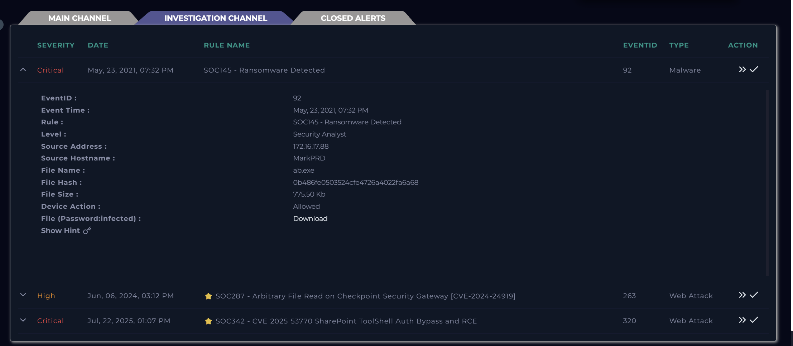
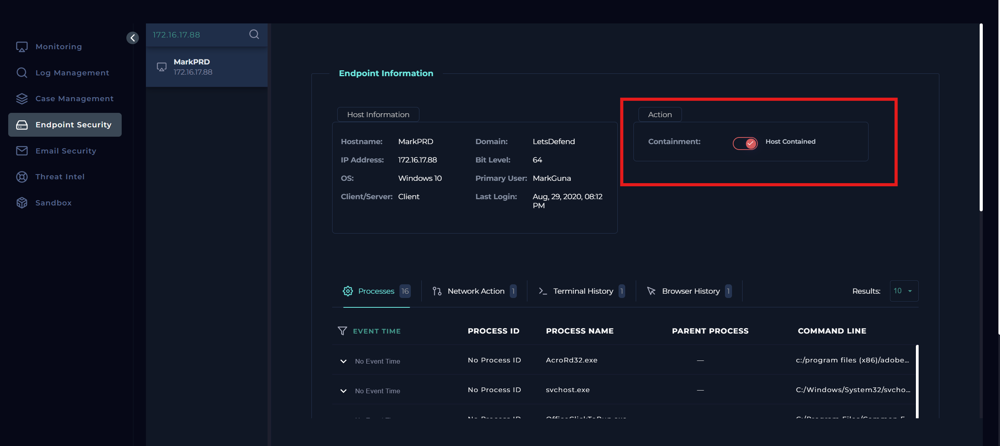
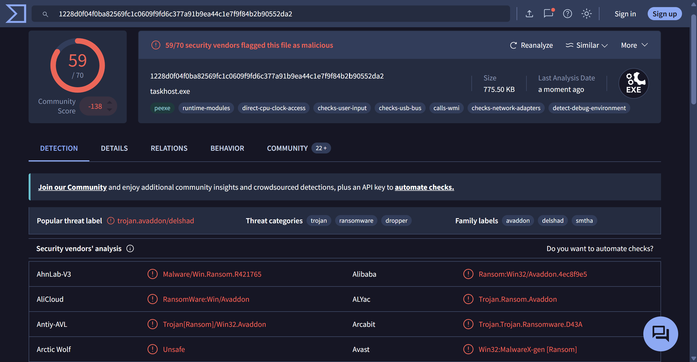
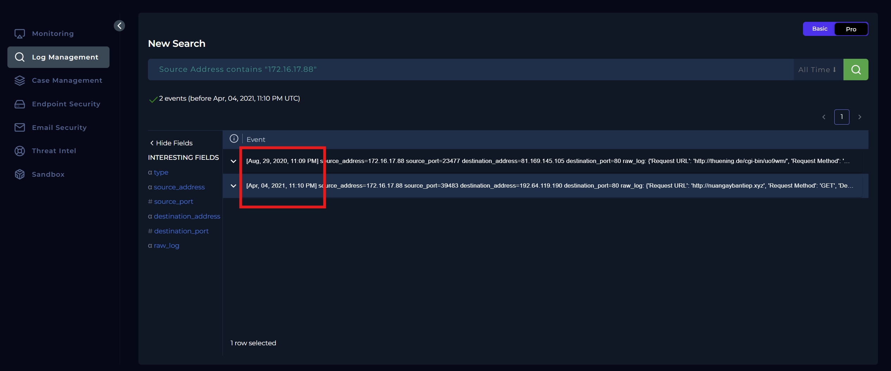
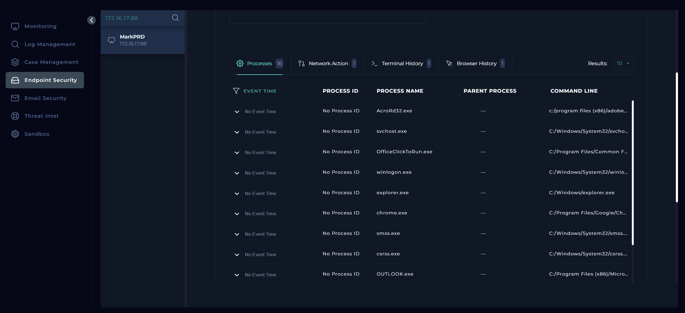
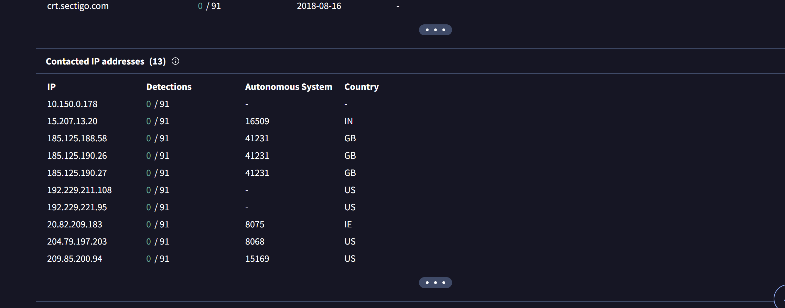
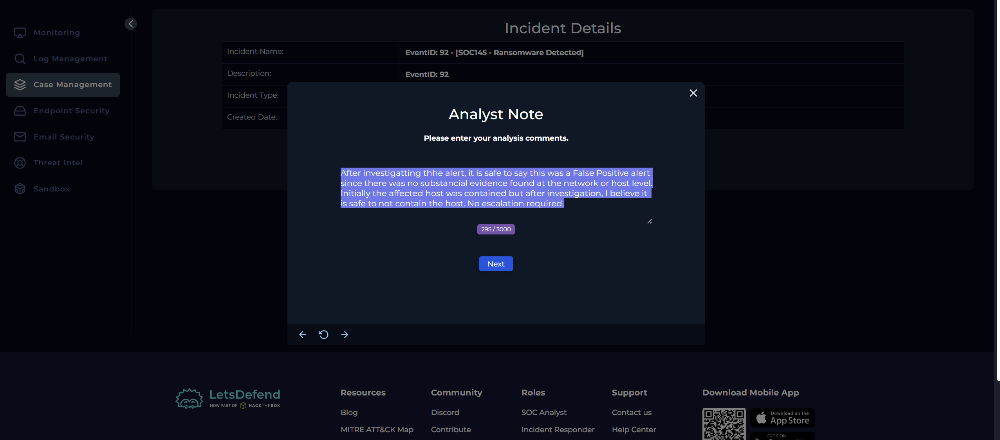
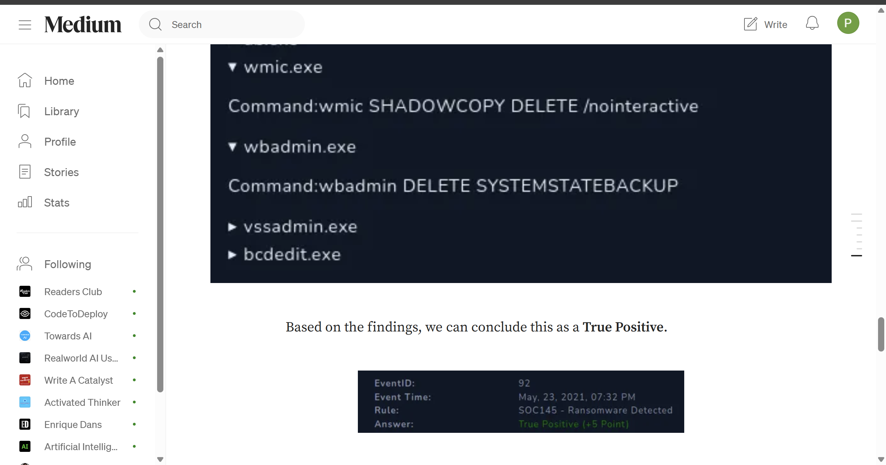

# SOC145 Analysis: Ransomware Detected

## Alert Overview

| Field | Value |
|-------|-------|
| **Alert Name** | SOC145 - Ransomware Detected |
| **Event ID** | 92 |
| **Event Time** | May 23, 2021, 07:32 PM |
| **Severity/Level** | Security Analyst |
| **Hostname** | MarkPRD |
| **Source IP** | 172.16.17.88 |
| **File Name** | `ab.exe` |
| **File Hash (MD5)** | `0b486fe0503524cfe4726a4022fa6a68` |
| **File Size** | 775.50 KB |
| **Device Action** | Allowed |



---

# Investigation Summary

I assigned the alert to myself and created a case before starting the investigation.


Reading through the alert details, it suggested a possible ransomware infection on 
**MarkPRD (172.16.17.88)**. Since ransomware has the potential to spread rapidly across an 
environment and cause significant business impact, I didn't want to spend time validating 
the alert before taking action.

Instead, I contained the host immediately.

My thinking was simple: if this really was ransomware, every minute counts. I'd rather 
isolate a machine first and continue investigating afterwards than risk allowing the 
malware to spread while I gathered evidence.



With the host isolated, I moved on to determining whether the detected file was actually malicious.

---

# Malware Analysis

Using the MD5 hash provided in the alert, I searched VirusTotal.

The sample was detected by **52 out of 70** security vendors and classified as ransomware.



VirusTotal also provided a behavioral sandbox report showing ransomware-like activity.

Although the detection count already gave me confidence that the file itself was malicious, 
I still wanted to determine whether there was evidence that it had actually executed 
inside the environment.

One thing worth noting from the alert was the **Device Action**.

```text
Allowed
```

Unlike previous investigation where the firewwall reported **Cleaned**, 
this alert indicated that the file had been allowed onto the endpoint.

That meant I couldn't assume the ransomware had been stopped before execution.

---

# Log Analysis

Next, I switched over to the **Log Management** dashboard and filtered for the affected host:

```text
172.16.17.88
```

Only two events were returned. One belonged to **August 2020**, while the other was 
from **April 2021**.

The April event showed an HTTP GET request to:

```text
http://nuangaybantiep.xyz
```



I checked the domain on VirusTotal and it had only a small number of detections, so while it 
wasn't enough on its own to prove malicious activity, I noted it as an interesting artifact.

What puzzled me more was that there were **no logs at all from May 2021**, which was when the 
ransomware alert had actually been generated.

That meant I couldn't correlate any network activity with the alert itself.

---

# Endpoint Investigation

Since the logs weren't giving me much to work with, I moved over to the Endpoint Security panel.

My plan was to review:

- Terminal history
- Network activity
- Browser history
- Running processes

Unfortunately, almost every endpoint artifact returned the same message:

```text
No agent installed
```

The only information available was a list of running processes.



One process that stood out initially was **taskhost.exe**, mainly because I had also seen 
it referenced in VirusTotal's execution parents.

I spent a few minutes looking into it before realizing it was simply the legitimate 
Microsoft-signed Windows process and hence, that lead went nowhere.

Without terminal history, browser history, or network telemetry, I couldn't find any 
endpoint evidence showing that ransomware had actually executed.

---

# Threat Intelligence Investigation

Since both the logs and endpoint telemetry were limited, I went back to VirusTotal and 
examined the malware's infrastructure.

The Relations tab listed numerous contacted IP addresses.

Normally, my next step would be to identify the malicious C2 addresses and search 
for them inside the organization's logs.

However, after reviewing the list, I noticed none of the contacted IP addresses themselves 
carried malicious detections on VirusTotal.





Because of that, I couldn't confidently identify a C2 address to hunt for internally.

Combined with the lack of endpoint evidence and the absence of May network logs, I concluded 
that there was no evidence showing any internal host had communicated with ransomware 
infrastructure.

---

# Reflection

After completing the playbook and closing the alert, I discovered that I had answered one 
question incorrectly.

I had classified the alert as a **False Positive**.

I mean.. from the evidence available during my investigation, here's what I had:

- A malicious ransomware sample on VirusTotal.
- No endpoint telemetry.
- No terminal history.
- No browser history.
- No relevant network logs around the alert time.
- No confirmed C2 communication.

For me, that simply wasn't enough evidence to confidently say the ransomware had actually 
executed on MarkPRD.

So I went looking for an explanation.

LetsDefend provides community walkthroughs for their labs, so I opened the published 
investigation to see what evidence I had missed.

Scrolling through the walkthrough, I found something I never had access to during my investigation.

Their endpoint telemetry showed commands such as:

- `wmic SHADOWCOPY DELETE /nointeractive`
- `wbadmin DELETE SYSTEMSTATEBACKUP`



Those commands immediately make sense in the context of ransomware.

Deleting Shadow Copies prevents users from restoring previous versions of their files, while 
deleting Windows backup catalogs makes recovery significantly more difficult. These are well-known 
techniques used by ransomware families before encrypting data.

Had I seen those commands during my investigation, I would have classified the alert as a 
**True Positive** without hesitation.

The issue was that my endpoint investigation showed only:

```text
No agent installed
```

There simply wasn't any terminal history available for me to review.

Because of that, I honestly think this discrepancy comes down to the lab environment rather 
than my investigation process.

Either the lab has been updated since the walkthrough was published, or the endpoint telemetry 
wasn't available when I completed it.

Given only the evidence I had access to, I still think my reasoning was justified, 
even if it didn't match the expected answer.

---

# Findings

| Investigation Item | Result |
|--------------------|--------|
| Malware Reputation | Malicious (52/70 detections) |
| Malware Quarantined | No |
| Endpoint Evidence | Unavailable (No agent installed) |
| Relevant Network Logs | None for alert timeframe |
| Confirmed C2 Communication | No evidence observed |
| Host Contained | Yes |

---

# Conclusion

The investigation began with a critical ransomware alert affecting **MarkPRD**, prompting 
immediate containment of the host to minimize the risk of lateral movement or further impact 
on the environment.

VirusTotal confirmed that the detected file was a known ransomware sample, with detections 
from **52 security vendors**. However, despite the strong malware reputation, the available 
telemetry did not provide sufficient evidence to verify execution on the endpoint. Network logs 
from the alert timeframe were unavailable, endpoint artifacts returned "No agent installed," 
and no confirmed communication with ransomware infrastructure could be established.

After reviewing the official LetsDefend community walkthrough, I discovered that the expected 
solution relied on terminal history showing ransomware-specific commands that delete Shadow 
Copies and Windows backups. Those artifacts were not present during my investigation, 
which explains why I reached a different conclusion.

Although my final playbook answer differed from the platform's expected result, the 
investigation reinforced an important lesson: conclusions are only as strong as the evidence 
available. If critical telemetry is missing, it's better to document the limitations of the 
investigation than to make assumptions that cannot be supported.

## Final Thoughts

If this is your first time reading one of my walkthroughs, welcome!

I write these investigations exactly as I work through them capturing my thought process, the 
mistakes I make, the dead ends I explore, and the lessons I learn along the way. My goal isn't to 
present a flawless investigation, but to document a realistic one. I believe that understanding 
*why* something works (or doesn't) is far more valuable than simply showing the correct answer.

If you enjoy this style of learning and would like to follow along as I publish more cybersecurity 
walkthroughs, investigations, and hands-on labs, feel free to follow me on Medium and subscribe 
to receive notifications whenever I publish a new article.

Thanks for reading, and I hope you learned something new today## Final Thoughts

If this is your first time reading one of my walkthroughs, welcome!

I write these investigations exactly as I work through them capturing my thought process, 
the mistakes I make, the dead ends I explore, and the lessons I learn along the way. My goal 
isn't to present a flawless investigation, but to document a realistic one. I believe that 
understanding *why* something works (or doesn't) is far more valuable than simply showing the 
correct answer.

If you enjoy this style of learning and would like to follow along as I publish more cybersecurity 
walkthroughs, investigations, and hands-on labs, feel free to follow me on Medium and subscribe 
to receive notifications whenever I publish a new article.

Thanks for reading, and I hope you learned something new today.